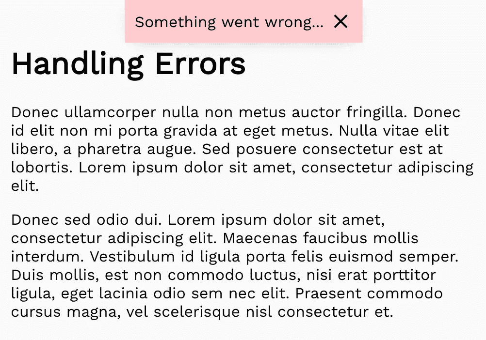

# JavaScript 中的错误处理:权威指南

> 原文：<https://levelup.gitconnected.com/the-definite-guide-to-handling-errors-gracefully-in-javascript-58424d9c60e6>


照片由 [rawpixel](https://unsplash.com/photos/BvFFyByZt7U?utm_source=unsplash&utm_medium=referral&utm_content=creditCopyText) 在 [Unsplash](https://unsplash.com/search/photos/safety?utm_source=unsplash&utm_medium=referral&utm_content=creditCopyText) 上拍摄

继我的上一篇文章之后，我想谈谈错误。错误是好的——我肯定你以前听过这句话。乍一看，我们害怕错误，因为它们通常包括在公共场合受到伤害或感到羞辱。通过犯错误，我们实际上学会了如何做某事，以及下次如何做得更好。

这显然是关于从现实生活中的错误中学习。编程中的错误有点不同。它们为我们提供了很好的特性来改进我们的代码，并告诉用户什么时候有问题(也许还会告诉他们如何修复)。

这篇文章将分为三个部分，首先我们将看看一般的错误。之后，我们将重点关注后端(Node.js + Express.js ),最后我们将看到如何处理 React.js 中的错误。我选择了这些框架，因为它们是目前最受欢迎的，但是您应该能够轻松地将新发现的知识应用到其他框架中！

完整的示例项目可在 [github](https://github.com/gisderdube/graceful-error-handling) 上获得。

# I. JavaScript 错误和一般处理

`throw new Error('something went wrong')` —将在 JavaScript 中创建一个错误实例，并且**停止脚本的执行**，除非您对该错误进行处理。当你作为一名 JavaScript 开发人员开始你的职业生涯时，你很可能不会自己去做，而是从其他库(或运行时)那里看到它在做，例如“reference error:fs not defined”或类似的。

## 错误对象

错误对象有两个内置的属性供我们使用。第一个是消息，它是作为参数传递给错误构造函数的，例如`new Error('This is the message')`。您可以通过`message`属性访问该消息:

```
const myError = new Error(‘please improve your code’)console.log(myError.message) // please improve your code
```

第二个也是非常重要的一个是错误堆栈跟踪。您可以通过“stack”属性访问它。错误堆栈会给你一个历史记录(调用堆栈),告诉你是什么文件导致了这个错误。堆栈还在顶部包含消息，然后是实际的堆栈，从最近/孤立的错误点开始，向下到最外部的“负责”文件:

```
Error: please improve your code
 at Object.<anonymous> (/Users/gisderdube/Documents/_projects/hacking.nosync/error-handling/src/general.js:1:79)
 at Module._compile (internal/modules/cjs/loader.js:689:30)
 at Object.Module._extensions..js (internal/modules/cjs/loader.js:700:10)
 at Module.load (internal/modules/cjs/loader.js:599:32)
 at tryModuleLoad (internal/modules/cjs/loader.js:538:12)
 at Function.Module._load (internal/modules/cjs/loader.js:530:3)
 at Function.Module.runMain (internal/modules/cjs/loader.js:742:12)
 at startup (internal/bootstrap/node.js:266:19)
 at bootstrapNodeJSCore (internal/bootstrap/node.js:596:3)
```

## 投掷和处理错误

现在，错误实例本身不会引起任何问题。例如`new Error('...')`什么都不做。当误差达到`throw` n 时，就变得更有趣了。然后，如前所述，您的脚本将停止执行，除非您在流程中以某种方式处理它。请记住，如果您手动`throw` 一个错误，这并不重要，它是由库抛出的，甚至是运行时本身(节点或浏览器)。让我们来看看如何在不同的场景中处理这些错误。


约翰·托尔卡西奥在 [Unsplash](https://unsplash.com/search/photos/catch?utm_source=unsplash&utm_medium=referral&utm_content=creditCopyText) 上拍摄的照片

## `try .... catch`

这是最简单的，但经常被遗忘的处理错误的方法——多亏了 async / await，它现在又被更多地使用了，见下文。这可用于捕捉任何类型的**同步**错误。示例:

如果我们不在 try … catch 块中包装`console.log(b)`,脚本执行将会停止。

## …终于

有时无论是否有错误，都有必要执行代码。为此，您可以使用第三个可选模块`finally`。通常，这与在 try … catch 语句后有一行代码是一样的，但有时它会很有用。

## 进入异步状态—回调

异步，这是使用 JavaScript 时必须考虑的一个话题。当你有一个异步函数，并且该函数内部发生错误时，你的脚本已经继续执行了，所以不会立即出现任何错误。当处理带有回调的异步函数时(顺便说一下，不推荐)，您通常会在回调函数中收到两个参数，看起来像这样:

如果有错误，`err`参数将等于该错误。否则，参数将为“未定义”或“空”。重要的是要么在`if(err)`块中返回一些东西，要么将你的其他指令包装在`else`块中，否则你可能会得到另一个错误，例如`result`可能是未定义的，而你试图访问`result.data`或类似的。

## 异步—承诺

处理异步的一个更好的方法是使用承诺。这里，除了有更多可读的代码，我们还改进了错误处理。只要我们有一个`catch`块，我们就不再需要如此关心准确的错误捕捉。当链接承诺时，一个`catch`块捕获自执行承诺或上一个 catch 块以来的所有错误。注意，没有`catch` -block 的承诺不会终止脚本，但是会给你一个可读性较差的消息，比如

```
*(node:7741) UnhandledPromiseRejectionWarning: Unhandled promise rejection (rejection id: 1): Error: something went wrong
(node:7741) DeprecationWarning: Unhandled promise rejections are deprecated. In the future, promise rejections that are not handled will terminate the Node.js process with a non-zero exit code. */*
```

因此，总是在你的承诺中加上一个 catch block。让我们来看看:

## 再试一次……接住

随着 JavaScript 中 async / await 的引入，我们又回到了最初处理错误的方式，try … catch … finally 使处理错误变得轻而易举:

因为这也是我们用来处理“正常”同步错误的相同方法，所以如果需要的话，可以更容易地使用更宽范围的 catch 语句。

# 二。在服务器中生成和处理错误

现在我们有了处理错误的工具，让我们看看在真实的情况下我们能做些什么。生成错误并在后端正确处理它们是应用程序的关键部分。关于如何处理错误，有不同的方法。我将向您展示一种带有自定义错误构造函数和错误代码的方法，我们可以轻松地将它们传递给您的前端或任何 API 消费者。你如何详细地构建你的后端并不重要，想法是一样的。

我们将使用 Express.js 作为路由框架。让我们考虑一下我们想要最有效的错误处理的结构。我们想要:

1.  一般的错误处理，某种回退，基本上只是说:“出错了，请再试一次或联系我们”。这不是特别聪明，但至少通知用户有问题——而不是无限加载或类似的。
2.  特定的错误处理，以便向用户提供有关错误的详细信息以及如何修复错误，例如，缺少一些信息、数据库中已经存在条目等。

## 构建自定义错误构造函数

我们将使用现有的错误构造函数并扩展它。JavaScript 中的继承是一件有风险的事情，但在这种情况下，我体验到它非常有用。我们为什么需要它？我们仍然希望堆栈跟踪为我们提供良好的调试体验。扩展原生 JavaScript 错误构造函数给了我们免费的堆栈跟踪。我们唯一要添加的是一个`code`，稍后我们可以通过`err.code`访问它，以及一个状态(http 状态代码)传递给前端。


乔恩·摩尔在 [Unsplash](https://unsplash.com/search/photos/red-fence?utm_source=unsplash&utm_medium=referral&utm_content=creditCopyText) 上的照片

## 如何处理路由

随着我们的自定义错误准备就绪，我们需要设置路由结构。正如我所指出的，我们希望错误处理具有单点真实性，这意味着对于每条路由，我们都希望具有相同的错误处理行为。默认情况下，express 并不真正支持这一点，因为路由都是封装的。

为了解决这个问题，我们可以实现一个路由处理器，并将我们的实际路由逻辑定义为普通函数。这样，如果 route 函数(或其中的任何函数)抛出一个错误，它将被返回给 route 处理器，然后路由处理器可以将它传递给前端。每当后端出现错误时，我们都希望将响应传递给前端——假设是 JSON API——格式如下:

```
{
    error: 'SOME_ERROR_CODE',
    description: 'Something bad happened. Please try again or     contact support.'
}
```

做好被淹没的准备。当我说:

> 如果你第一眼看不明白所有的事情，那也没关系。只要使用它，过一会儿你就会发现它为什么有意义。

顺便说一下，这也叫做自上而下的学习，我非常喜欢这种学习方式。

这是路由处理程序本身的样子:

我希望你能阅读代码中的注释，我认为这比在这里解释更有意义。现在让我们看看实际的路由文件是什么样子的:

在这些例子中，我没有对实际的请求做任何事情，我只是假装不同的错误场景。例如，`GET /city`会出现在第 3 行，`POST /city`会出现在第 8 行，依此类推。这也适用于查询参数，例如`GET /city?startsWith=R`。本质上，您要么会有一个未处理的错误，前端将收到

```
{
    error: 'GENERIC',
    description: 'Something went wrong. Please try again or contact support.'
}
```

或者你会手动抛出一个“CustomError ”,例如

```
throw new CustomError('MY_CODE', 400, 'Error description')
```

这变成了

```
{
    error: 'MY_CODE',
    description: 'Error description'
}
```

现在我们有了这个漂亮的后端设置，我们不再有错误日志泄露到前端，并且将总是返回关于哪里出错的有用信息。

确保你在 [github](https://github.com/gisderdube/graceful-error-handling) 上看过完整的回购。请随意将它用于您的任何项目，并根据您的需要进行修改！

# 三。向用户显示错误

下一步也是最后一步是管理前端的错误。这里，您希望使用第一部分中描述的工具来处理前端逻辑本身产生的错误。然而，也必须显示来自后端的错误。让我们首先看看如何显示错误。如前所述，我们将在演练中使用 React。


由[安德森·詹森](https://unsplash.com/photos/wi-vfhwCDAg?utm_source=unsplash&utm_medium=referral&utm_content=creditCopyText)在 [Unsplash](https://unsplash.com/search/photos/stop-sign?utm_source=unsplash&utm_medium=referral&utm_content=creditCopyText) 上拍摄的照片

## 在反应状态下保存错误

正如其他数据、错误和错误消息可能会改变一样，因此您希望将它们放在组件的状态中。默认情况下，在安装时，您希望重置错误，以便当用户第一次看到页面时，看不到任何错误。

接下来我们要澄清的是匹配视觉表征的不同类型的错误。就像在后端一样，有 3 种类型:

1.  全局错误，例如，我们的一个一般性错误从后端返回，或者用户没有登录，等等。
2.  来自后端的特定错误，例如，用户将其登录凭据发送到后端。后端回答密码不匹配。这不能被前端验证，所以它必须来自后端。
3.  前端本身导致的特定错误，例如电子邮件输入验证失败。

2.第三。非常相似，可以在相同的状态下处理(如果需要)，但是具有不同的来源。我们将在代码中看到这是如何发生的。

我将使用 React 的原生状态实现，但是您也可以使用像 MobX 或 Redux 这样的状态管理系统。

## 全局错误

通常，我将这些错误保存在最外面的有状态组件中，并呈现一个静态 UI 元素，这可以是屏幕顶部的红色横幅、模态或其他任何东西，设计实现取决于你。



全局错误的 UI 元素示例

让我们看一下代码:

如您所见，我们在`Application.js`的状态中有错误。我们也有重置和改变错误值的方法。我们将值和重置方法传递给“global error ”-组件，该组件会在单击“x”时显示并重置它。让我们看看`GlobalError`-组件是什么样子的:

正如你在第 5 行看到的，如果没有错误，我们不渲染任何东西。这可以防止我们的页面上一直有一个空的红框。当然，您可以更改该组件的外观和行为。例如，您可以用一个几秒钟后重置错误状态的`Timeout`来代替“x”。

现在，您已经准备好在任何您想要的地方使用这个全局错误状态，只需从`Application.js`传递`_setError`，您就可以设置全局错误，例如，当来自后端的请求返回字段`error: 'GENERIC'`时。示例:

如果你懒的话，可以到此为止。即使您有特定的错误，您也可以只更改全局错误状态，并在页面顶部显示错误框。但是，我将向您展示如何处理和显示特定的错误。为什么？首先，这是关于处理错误的明确指南，所以我不能就此打住。第二，如果你只显示所有的错误，UX 人可能会抓狂。

## 处理特定的请求错误


与全局错误类似，我们也可以在其他组件中使用**本地错误状态**。程序是相同的:

需要记住的一点是，清除错误通常有不同的触发器。用“x”来删除错误是没有意义的。在这里，在发出新请求时清除错误会更有意义。您也可以在用户进行更改时清除错误，例如，当输入值更改时。

## 前端原点误差


如前所述，这些错误可以用与来自后端的特定错误相同的方式(状态)来处理。这次让我们使用带有输入字段的示例，只允许用户删除一个城市，而他实际上提供了输入:

## 使用错误代码的错误国际化

也许你一直想知道为什么我们会有这些错误代码，例如`GENERIC`，我们只是显示从后端传来的错误描述。现在，一旦你的应用程序增长，你将有希望征服新的市场，并在某个时候面临必须支持多种语言的问题。如果您处于这种情况，您可以使用提到的错误代码以用户语言显示正确的标题。

我希望你对如何处理错误有所了解。快速输入和快速忘记`console.error(err)`现在应该是过去的事情了。使用它进行调试是必要的，但是它不应该在您的产品构建中结束。为了防止这种情况，我建议你使用日志库，我过去一直在使用[日志级别](https://www.npmjs.com/package/loglevel)，我对它非常满意。

*关于作者:Lukas Gisder-Dubé作为 CTO 共同创立并领导了一家初创公司 1 年半，建立了技术团队和架构。离开创业公司后，他在*[*iron hack*](https://medium.com/u/1ff093a3da32?source=post_page-----58424d9c60e6--------------------------------)*担任首席讲师教授编码，现在正在柏林建立一家创业机构&咨询公司。查看*[*Dube . io*](https://dube.io)*了解更多。*

[](https://levelup.gitconnected.com/)[](https://gitconnected.com/learn/javascript) [## 学习 JavaScript -最佳 JavaScript 教程(2019) | gitconnected

### 排名前 64 的 JavaScript 教程。课程由开发者提交并投票，使您能够找到最好的…

gitconnected.com](https://gitconnected.com/learn/javascript)