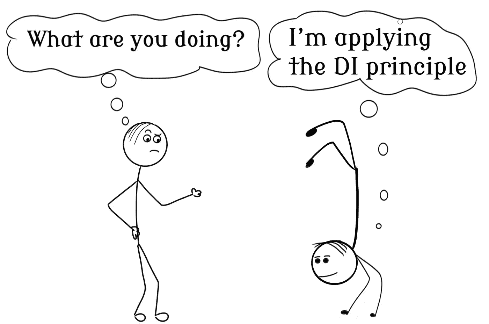
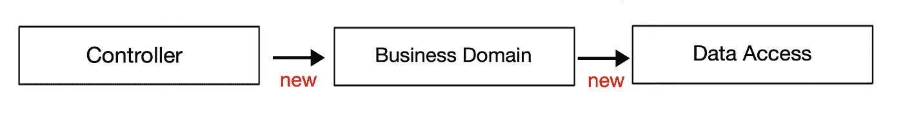

# 依赖性反转原理变得简单

> 原文：<https://levelup.gitconnected.com/the-dependency-inversion-principle-made-simple-70108b88dc76>

## 或者检查是否应用了其他可靠的原则。

米海三都

不，这并不意味着依赖关系应该倒置。原则声明，在你的低级和高级模块之间不应该有直接的联系。实际上，这个原则是五个原则中最简单的

想想一辆车。如果方向盘直接连接到车轮上会怎么样？每次更换车轮时，都需要对方向盘进行一些调整。

现在，我们知道这是一个糟糕的设计。因此，我们在它们之间有一个“接口”,负责通信，这样它们就没有直接的链接。

罗伯特·马丁将该原则定义为:

1.  高层模块不应该依赖低层模块。两者都应该依赖于抽象。
2.  抽象不应该依赖于细节。细节应该依赖于抽象。

在这个例子中，方向盘就像一个处理复杂逻辑的高级模块。轮子是提供实用功能的低级模块。

这个原理听起来可能比实际更复杂。我们来看一个例子。

# 新是违反原则的最大标志

想象以下应用程序:

*   我们有一个带有文本表单和添加按钮的用户界面。每当用户单击按钮时，就会触发一个事件，并执行对控制器类的调用。
*   控制器将实例化一个业务域类并验证输入。
*   然后它将实例化一个保存文本的数据访问类。

这种设计的问题是它会导致紧耦合。假设业务域类构造函数被更改为接受另一个参数。这会影响控制器的代码。

**提示**:使用“new”关键字通常是紧密耦合的标志。尽可能避免。

# 使用控制反转(IoC)

我相信现在你也同意没有依赖听起来很棒。为了实现这个目标，我们需要使用控制引擎的反转。你可以找到每一种面向对象语言的 IoC 库。没必要自己开发一个。

在谷歌搜索什么是最适合**插入你的编程语言** 的 IoC 容器之前，请花点时间理解容器是如何工作的。我发现理解它们的最好方法是建立一个你自己的。网上有很多培训，像这个[一个](https://www.codeproject.com/Articles/347651/Define-Your-Own-IoC-Container)。

尽管您永远不会在生产代码中使用 IoC，但这是一个有趣的练习，可以教会您内部的工作原理。这反过来可能有助于您将来的调试。

# DI 原则是一种确认

对于本文，我没有提供任何代码示例。每当我应用其他四个和 IoC 容器时，我发现自己总是遵循这个原则。所以，长话短说，就是这样。

# 外卖食品

*   该原理在高级和低级模块之间引入了一个层:接口。
*   直接实例化(或使用“new”关键字)是可能违反原则的迹象
*   依赖倒置原则与开-闭和利斯科夫替换原则密切相关。你需要确保你遵循这些原则。这是对可靠代码的确认

**坚实的原理制作简单的系列:**

*   [单一责任原则](/the-single-responsibility-principle-made-simple-4e1597a44d7d) (SRP)
*   [开合原理](/the-open-closed-principle-made-simple-cc3d0ed70553) (OCP)
*   [利斯科夫替代原理](/the-liskov-substitution-principle-made-simple-5e69165e7ab5) (LSP)
*   [接口隔离原理](/interface-segregation-principle-made-simple-990da495441c) (ISP)
*   依赖性倒置原则

# 进一步阅读

 [## 坚实的设计原则解释:依赖倒置原则与代码示例

### 坚实的设计原则是由罗伯特·c·马丁提出的，也是当今最著名的设计原则之一

stackify.com](https://stackify.com/dependency-inversion-principle/)  [## 从属倒置原则

### 在前一章中，我们学习了使用工厂模式实现 IoC 原则，并实现了

www.tutorialsteacher.com](https://www.tutorialsteacher.com/ioc/dependency-inversion-principle)