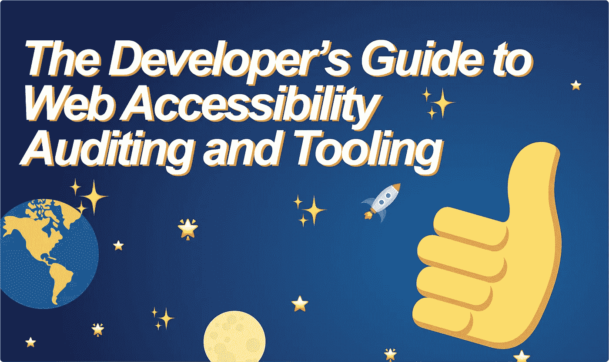
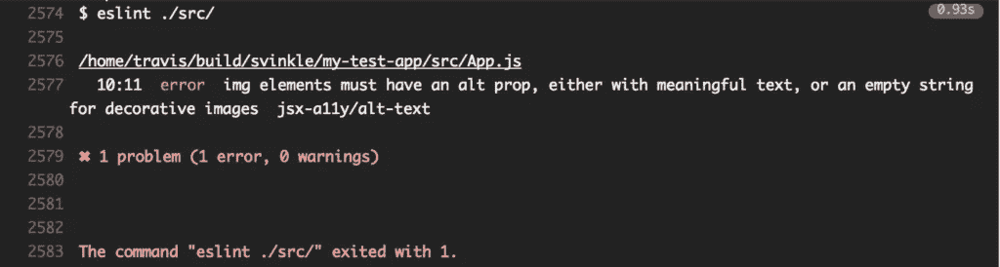
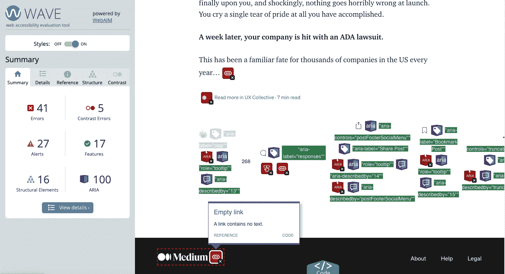
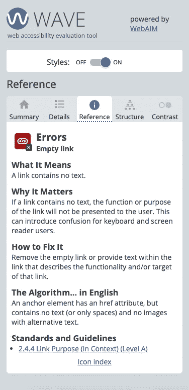
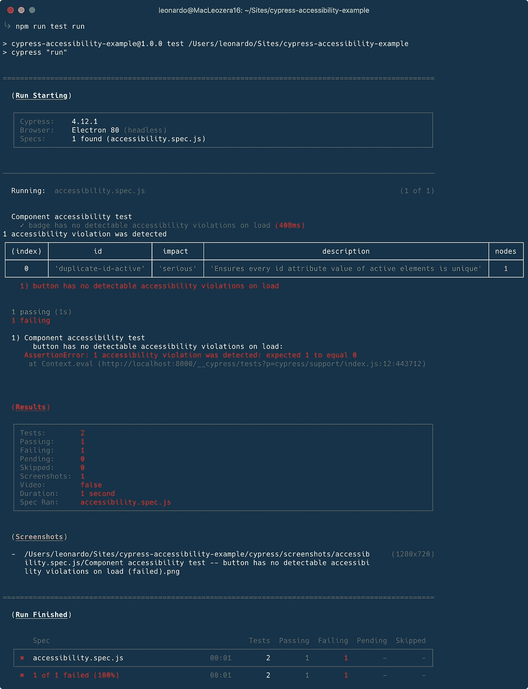

# Web 可访问性审计和工具开发指南

> 原文：<https://levelup.gitconnected.com/the-developers-guide-to-web-accessibility-auditing-and-tooling-90e70fd95349>

## 一个工具的高级视图，可用于审计我们产品的可访问性问题，并为您提供建议

当我们在技术层面上谈论网页可访问性时，我们通常谈论遵守 W3C [WCAG 指南](https://www.w3.org/TR/WCAG21/)。如果我们从零开始，理解必须做什么才能达到法规遵从性水平可能看起来像是一个模糊的，甚至可能是不可能的任务。

理想情况下，我们从产品诞生之日起就知道这些指导方针，并且在开发过程中一直牢记在心。在更常见的情况下，我们还没有改进我们自己的产品，我们应该采取的第一步是做一个**可访问性审计**，以更好地了解我们的不足之处。

 [## 停下来。你是#a11y 新人吗？

### 如果是这样，请查看第一篇“新手的网页可访问性”文章。它充满了关于如何思考和实现网页可访问性的介绍性信息和建议。

levelup.gitconnected.com](/web-accessibility-for-newbies-1098fa15f9f0) 

审核我们现在所处的位置将允许我们看到我们当前所处的位置，以及我们需要做多少工作才能到达我们想要的位置。有两种类型的审计，**自动的**和**手动的。**

# **自动审计**

自动化审计工具是一种软件，你可以运行它，在你没有太多先验知识的情况下，立即给你反馈。这是一个很好的起点，可以抓到挂得最低的水果。

自动化可访问性测试的黄金标准是[可访问性引擎](https://www.deque.com/axe/)，俗称 aXe。Deque 创建并维护了`[axe-core](https://github.com/dequelabs/axe-core)`，这是一个开源的 JavaScript 引擎，可以自动发现代码中的 WCAG 违规。如果你看到一个插件或框架中有“axe”这个词，你可以确信它很可能利用了`axe-core`。

## **无障碍棉绒**

如果你已经在一个团队中使用 JavaScript 框架进行编写，你可能已经建立了林挺规则来确保你的代码库保持整洁和适当。现在，有 eslint 插件来查找可访问性问题，并直接在我们的编辑器或 CLI 中给我们反馈。

如果你使用 React，`[eslint-plugin-jsx-a11y](https://www.24a11y.com/2017/reacts-accessibility-code-linter/)` lint 插件非常有用(位于[这里](https://www.npmjs.com/package/eslint-plugin-jsx-a11y))。用 Vue？别担心，还有一个[插件也适合你](https://github.com/vue-a11y/eslint-plugin-vuejs-accessibility)。是的，[连棱角都有一个](https://www.npmjs.com/package/eslint-plugin-angular)。如果你使用一个不同的框架，有可能已经为它建立了一个 a11y linter，你可以通过在 npm 注册表中查找`eslint-plugin-[your framework name]`找到它。

易访问性提示非常有助于指出你可能忽略的小问题，比如忘记图片上的 alt 标签。就个人而言，我喜欢在我们的代码库的 git 挂钩或持续集成解决方案中设置可访问性 linters，并让它们在每次提交、推送或 PR 时运行，以确保更新的代码总是友好的。

就我个人而言，当我尝试提交或推送时，我喜欢在我的控制台上看到这些消息

如果你正在做一个初始审计，在你的整个代码库上运行这个并看到所有的错误会让人不知所措。从好的方面来看，它提供的细节水平给了你可操作的洞察力，可以很容易地转化为你的团队的待办事项。

## **浏览器插件**

另一种流行的自动化 a11y 工具是浏览器插件。浏览器插件可以通过在有问题的 DOM 元素上直观地覆盖方框并提供注释，直观地指出 web 产品上的问题。 [Digital A11y](https://www.digitala11y.com/accessibility-plug-ins-ie-chrome-firefox-browsers/) 列出了 44 个浏览器插件，帮助你测试可访问性错误。

我见过别人用的最流行的是 WebAIM 的 [WAVE 浏览器扩展](https://wave.webaim.org/extension/)。它有一个干净和易于查找的用户界面和伟大的颜色编码。它还提供了总体问题的高级摘要，从颜色对比度问题到 ARIA 标签到图像描述等。当您看到一个问题时，只需单击它即可查看详细信息和导致该问题的代码的链接，以及如何修复该问题的参考资料的链接。

在我的媒体博客上运行 WAVE 显示了许多错误。右边的示例显示了单击弹出窗口中的参考链接时参考的外观。

事实上，浏览器插件如此受欢迎，以至于美国政府认可了一个名为 [ANDI](https://www.ssa.gov/accessibility/andi/help/install.html) 的插件，甚至[也提供了如何使用它的培训材料](https://www.section508.gov/test/web-software)。[美国康复法案第 508 条](https://www.epa.gov/accessibility/what-section-508)宣布所有联邦网站都需要完全无障碍，因此他们向其他政府机构推荐这一特殊工具。即使作为一个私人组织，你也可以使用它！

我建议尝试几个，看看哪一个最适合你的个人工作流程！

## 组件插件

随着[设计系统风靡一时](https://medium.com/intuit-design/the-influence-of-design-systems-and-javascript-frameworks-in-large-scale-companies-b0709d6c16a7)，出现了大量沙箱化和文档化组件库的工具。Airbnb 的[故事书](https://storybook.js.org/)是 React 和 [Vue](https://storybook.js.org/docs/vue/get-started/introduction) 组件的热门选择，它拥有一个[辅助功能插件](https://storybook.js.org/addons/@storybook/addon-a11y)，为我们提供了一个类似浏览器插件的注释故事的体验，以及一个[屏幕阅读器插件](https://storybook.js.org/addons/addon-screen-reader)，为我们提供了一个简化的屏幕阅读器，用于字幕和朗读文本。这些都是很棒的功能，让任何人，无论操作系统或职位如何，都可以开始寻找所有问题。

就我个人而言，我没有为我用过的其他沙盒工具找到其他辅助功能插件(afaik [Docz](https://www.docz.site/) 、 [Styleguidist](https://react-styleguidist.js.org/docs/cookbook/#how-to-use-react-axe-to-test-accessibility-of-components) 、 [React Cosmos](https://reactcosmos.org/) 等没有内置辅助功能)。如果你正在为你的设计系统选择一个框架，考虑一下✅.故事书的这一点

## **端到端测试**

许多端到端测试框架也有自己的可访问性插件。还记得我们是如何开始讨论 aXe 的吗？大多数端到端框架的 a11y 插件都利用了`axe-core`。在我上一份工作中，我们使用了 [Cypress](https://www.cypress.io/how-it-works/) ，它有自己的[辅助功能插件，名为 cypress-axe](https://www.npmjs.com/package/cypress-axe) 。 [Selenium](https://github.com/dequelabs/axe-core-maven-html) 、 [Nightwatch](https://www.npmjs.com/package/nightwatch-axe) 以及其他许多端到端测试框架也都有自己的 aXe 插件。

我们可以使用这些 aXe 插件对我们的代码运行可访问性测试，以任何其他测试可能失败的方式失败它们。看看这个来自 Cypress 的例子，展示了两个`<button>`如何拥有相同的`id`:

具有相同`id`的两个按钮违反了可访问性。用棉绒很难找到这个…甚至可能是手工的！(来源: [FreeCodeCamp](https://www.freecodecamp.org/news/automating-accessibility-tests-with-cypress/) )

## **其他自动化审计工具**

如果你有兴趣尝试其他审计工具，我建议你看看 DigitalA11y 的[开源网站可访问性评估工具](https://www.digitala11y.com/open-source-accessibility-tools/)列表。

# 人工审计

您现在可能会想“等等，有这么多令人惊奇的自动化工具，为什么我还需要做任何手工审计呢？”虽然自动化审计是一个惊人的资源，但大多数工具[只能捕获所有可访问性问题的 20-25%](https://www.essentialaccessibility.com/blog/automated-accessibility-testing-tools-how-much-do-scans-catch)，而`axe-core`只能捕获[的 57%](https://github.com/dequelabs/axe-core#the-accessibility-rules) 。自动化测试可以发现您是否满足非常具体的需求，这些需求在单一的 HTML 文件中很容易发现，但它目前无法发现更高级别的产品问题，如用户无法导航到他们需要的页面，或者他们是否可以仅使用键盘操作复杂的组件。捕捉这些类型的问题需要一个真正的人使用你的产品，并确保所有功能都是 P.O.U.R

当进一步测试你的产品的可访问性问题时，我建议在你的 QA 过程中增加一些额外的需求。我们可以从以下几点开始:

*   *每个 UI 组件都只能通过键盘操作吗？*
    我在看你的 modals 和 carousels！这包括视觉焦点状态、对 Enter 和空格键的响应以及合理的元素排序。即使一个表单可以用键盘操作，也不意味着 tab 键顺序有意义！
*   *产品中最关键的流程是否可以只用键盘就能找到并完成(如果你有多余的时间，可以用屏幕阅读器)？没有什么比金钱功能更能引起 ADA 诉讼的了，比如改变支付方式、取消订阅或支出的选项是不可能找到的。确保你的电子邮件底部包含必要的链接，并且无论使用什么输入设备，都可以发现那些重要页面的 UX 流。*
*   *我的网站在 200%浏览器缩放下是否可以理解和操作？在大桌面和 iPhone 宽度之间的任何断点处呢？你会惊讶有多少网站在 120%的浏览器缩放下完全崩溃。我们庞大的老年人口经常使用浏览器缩放来更好地阅读字体，不要遗漏它们！*
*   *如果我们改变了某样东西的颜色，它们会通过颜色对比检查吗？暗模式和亮模式的对比度相同吗？我们需要一个色盲版本吗？*
*   我的视觉或文本层次结构有意义吗？如果我用 tab 键浏览页面，可聚焦元素的顺序是否正确？额外收获:屏幕阅读器能正确阅读我的页面吗？

作为开发人员，我们没有责任去解决每一个可访问性问题，坦率地说，我们通常对这些更高层次的问题没有多少发言权。然而，随着我们掌握的知识越来越多，我们应该接听电话，并努力让友好的邻里设计师和领导注意到这些问题。

# 推荐的 a11y 工具组

根据我们刚刚了解到的情况，如果可访问性是您的优先考虑事项之一，这是我推荐的工具堆栈(应该是这样的！):

1.  将可访问性问题视为 bug，并在它们出现时为它们制作标签
2.  在预提交挂钩中使用 a11y linter 来捕获新问题
    尝试在 npm 注册表中查找`eslint-plugin-[your framework name]`
3.  开发时使用 [WAVE](https://wave.webaim.org/extension/) 或 [ANDI](https://www.ssa.gov/accessibility/andi/help/install.html) 浏览器插件
4.  使用[故事书](https://storybook.js.org/)进行组件构建
5.  使用[柏树](https://www.cypress.io/how-it-works/)进行端到端测试
6.  继续手动审核并获得设计/产品的承诺

如果你是一个无障碍的新手，我希望这份快速入门的参考资料能帮助你掌握你所拥有的所有工具，并使 WCAG 合规之旅不那么令人生畏！

## 其他工具

许多人对他们最喜欢的 a11y 工具发表了评论，所以我在这里列出了一些，这样您可以进一步完善自己最喜欢的工具:

*   像其他浏览器插件一样，除了它建议修复违规的方法
*   [灯塔](https://developers.google.com/web/tools/lighthouse)
*   一个在你的 WordPress 站点上测试 a11y 的插件
*   一个爬虫程序，它扫描一个网站，并根据你想要达到的合规性给出一个报告卡

 [## 喜欢这篇文章？考虑给我买杯茶吧！

### 我过去常常把我的文章放在中等收费的墙后面，但当谈到教育时，我完全关注可访问性，所以现在它们都是免费的。如果你觉得你从这篇文章中得到了一些东西，并且有一些闲钱，请考虑给我买杯茶来表示你的支持！🫖

www.buymeacoffee.com](https://www.buymeacoffee.com/karomancer)