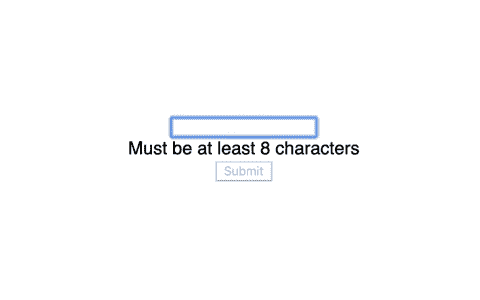

# React 中受控组件和非受控组件的区别

> 原文：<https://levelup.gitconnected.com/the-difference-between-controlled-and-uncontrolled-components-in-react-b76ac333db4d>

## 为什么 React 文档推荐使用受控组件来实现表单？


照片由 [Florian Gagnepain](https://unsplash.com/@florian_gagnepain?utm_source=medium&utm_medium=referral) 在 [Unsplash](https://unsplash.com?utm_source=medium&utm_medium=referral) 上拍摄

在 React 中处理表单数据时，可以使用受控组件，也可以使用非受控组件。根据 React [文档](https://reactjs.org/docs/uncontrolled-components.html)，受控组件是大多数情况下的推荐方式。

> “在大多数情况下，我们建议使用[受控组件](https://reactjs.org/docs/forms.html#controlled-components)来实现表单。在受控组件中，表单数据由 React 组件处理。另一种选择是不受控制的组件，表单数据由 DOM 本身处理。

如果你正在读这篇文章，但不知道什么是受控或不受控组件，不要担心！

在本文中，我们将了解 React 中的受控和非受控组件。到本文结束时，您应该已经理解了这两者之间的区别，以及为什么 React 文档建议在大多数情况下使用受控组件。

# 非受控组件

首先，让我们看看[不受控制的组件](https://reactjs.org/docs/uncontrolled-components.html)是什么样子的。

不受控制的组件类似于传统的 HTML 表单输入元素。您可以通过访问对输入的引用来获取输入的值。

在这个例子中，我有一个带有一个`<input>`和一个`<button>`的表单。在 React 中，如果我们想要引用一个 DOM 元素，我们可以使用`useRef`钩子。`useRef`钩子将创建一个具有保存该值的`current`属性的对象。我们可以将这个引用设置为一个元素来访问这个值。

换句话说，我将使用`useRef`钩子创建一个引用。

```
const inputRef = useRef(null);
```

然后，我将把这个引用传递给`<input>`元素。

```
<input type="text" **ref={inputRef}** />
```

当我提交表单时，我可以通过使用`inputRef.current.value`获得输入的值。

这被认为是不受控制的组件，因为输入的值不受 React 的控制。输入的值存储在元素的内部。我们直接从`<input>`元素获取值。

# 受控组件

另一方面，我们有一个[受控组件](https://reactjs.org/docs/forms.html#controlled-components)。我们可以在 React 状态下存储值，而不是通过元素的引用来访问输入的值。

同样在这个例子中，我们有一个`<input>`和一个`<button>`。

这一次，我们使用 React 中的`useState`钩子来创建一个状态。

```
const [inputText, setInputText] = useState(""):
```

然后我们使用状态值`inputText`，并将其添加为`<input>`元素的值属性。我们可以通过更新`inputText`状态来控制`<input>`的值。

为了改变`inputText`值，我们将像其他`useState`钩子一样更新它。我们可以在每次击键时运行的`<input>`元素中添加一个`onChange`监听器。因此，只要用户键入一个字符，React 状态就会更新，显示给用户的值也会更新。

```
<input
  type="text"
  **value={inputText}
  onChange={(e) => setInputText(e.target.value)}**
/>
```

这被认为是一个受控组件，因为我们控制着`<input>`的值，并且可以在 React 状态下访问它。这使得反应状态成为“真理的唯一来源”。

# 使用受控部件的好处

与非受控组件相比，使用受控组件的一个主要优势在于:

即时验证检查。

使用不受控制的组件时，您只能在提交表单时访问输入的值。然而，当使用受控组件时，我们总是可以访问该值。因此，很容易在每次击键时实现验证检查。

例如，我可以添加一个验证检查，要求输入值必须至少有 8 个字符长。我可以根据`inputText`值的长度有条件地呈现文本。

```
{inputText.length >= 8 ? (
  <div>OK</div>
) : (
  <div>Must be at least 8 characters</div>
)}
```

我也可以禁用按钮，直到输入值至少有 8 个字符长。

```
<button onClick={handleSubmit} **disabled={inputText.length < 8}**>
  Submit
</button>
```

这是添加验证的基本版本，但是您可以看到它是如何使用受控组件实现的。



# 结论

感谢阅读！我希望这篇文章有助于您理解 React 中受控组件和非受控组件之间的区别。

最终，您可以使用受控或不受控的组件来处理 React 中的表单数据。但是，请记住，React 文档建议在大多数情况下使用受控组件。

如果您正在寻找一种更好的方法来处理表单数据和验证，请查看下面的文章，开始使用 React Hook Form。

[](https://blog.devgenius.io/the-easiest-way-to-deal-with-forms-in-react-ad6bc1250829) [## React 中处理表单的最简单方法

### 使用 React 钩子形式来提高应用程序的性能

blog.devgenius.io](https://blog.devgenius.io/the-easiest-way-to-deal-with-forms-in-react-ad6bc1250829)