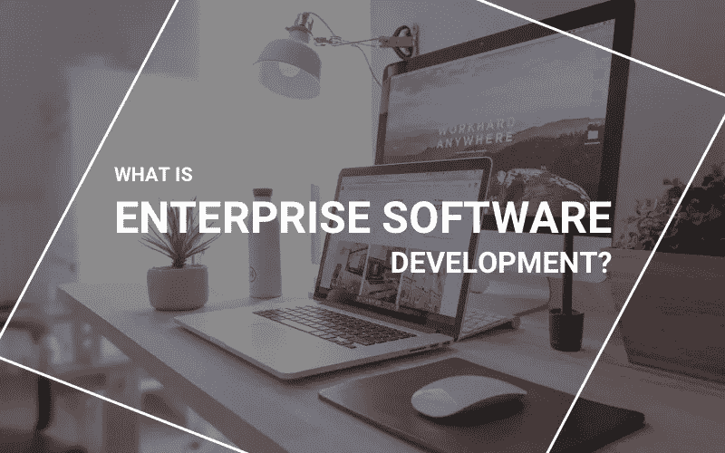
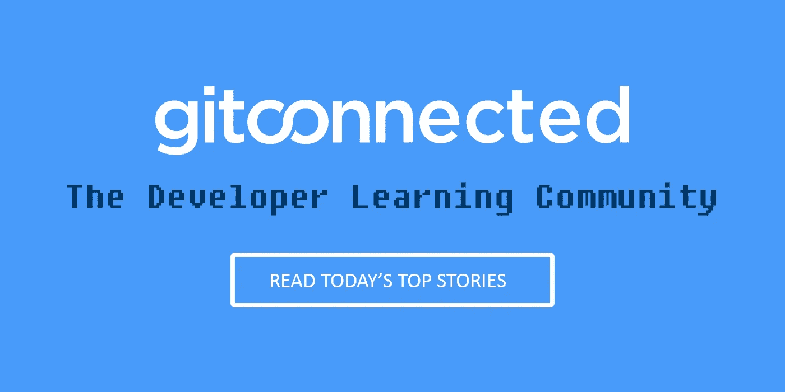

# 企业软件开发和标准软件开发的区别

> 原文：<https://levelup.gitconnected.com/the-difference-between-enterprise-software-development-and-standard-software-development-1325bbcad4a3>

你可能听说过企业软件这个术语在某些圈子里流传。但是什么是企业软件，它的开发与普通的软件开发有什么不同呢？

一个简短的定义:企业软件是为了满足组织的需求，而不是个人用户的需求。

一个关键是，企业软件必须在使用它的环境中构建。它们是为特定的业务目标而设计的。企业软件架构的每一部分都增加了项目的总体目标，也决定了它们是否成功。因此，在开发企业软件时，设计师需要记住架构的每个方面。

对于设计师来说，不要忽视这个事实是很重要的，尤其是在使用他们所掌握的所有工具的时候。他们需要确保在功能与创新和生产新事物的愿望之间取得平衡。

**企业软件开发意味着什么？**

有一些方面使新的软件企业变得友好:

**互联互通:**

几乎所有的企业软件都需要与大多数企业已经使用的其他工具和软件进行交互。如果不这样做，就会导致工作流程和业务实践的中断，从而产生严重的后果。

有了以上所有的规则，T4 企业软件开发的某些方面已经被证明是非常有效和受欢迎的。我们将在下面仔细看看这些。

**成本:**

这通常包括初始支出和持续维护，大多数企业都希望尽快获得投资回报。因此，设计师在创建企业软件时需要记住这一点

**性能:**

软件必须在要求它工作的所有领域都工作良好。这包括业务的多个方面以及跨所有平台，包括移动设备。

**可扩展性:**

这是企业软件开发和普通软件的另一个关键区别。主要的开发架构应该允许突然的增长，并且不会伴随着性能的下降。如果这种情况真的发生，这可能会让一个正在成长的企业止步不前。

**安全性:**

任何类型的安全漏洞或违规都可能给企业带来灾难性的影响。个人信息丢失、黑客攻击或网络受损是一件大事。企业软件开发必须在其整个范围内关注安全特性，并结合其他外部安全特性。

**云存储:**

因为这是昂贵的物理数据存储的低成本替代方案，许多开发人员允许您跳过购买、设置和维护服务器的冗长过程。云存储具有明显的价格优势，因为这意味着客户可以预先只购买所需的元素。

与上述另一点相一致，云存储具有高度的可扩展性，而现场服务器则不具备。根据需要添加和删除资源，并使用云存储的高度复杂的安全性优势，满足上述另一个要点。

云存储还允许轻松协作，团队可以远程工作或在不同的物理空间工作，但都可以访问相同的信息库。

**平台即服务**

被称为 PaaS，它能够执行许多在软件开发中使用的小而重复的任务。供应商托管硬件，允许用户从任何有互联网连接的地方访问这些工具。PaaS 开发人员可以在规模和范围上有所不同，但是拥有托管和维护所有应用程序的工具。

许多 PaaS 服务在较低层具有非常低的成本甚至免费的服务，允许企业扩展其使用以获得更全面的服务。这也使得 PaaS 具有高度的可扩展性。它还能够使用最新的软件，由供应商负责升级硬件和软件。

**JavaScript 框架**

这是最适合企业软件的语言之一，因此被业内一些大公司所使用。其中包括网飞、贝宝和谷歌。之所以会这样，是因为它速度非常快，性能也很好。它还创造了良好的用户体验，这是企业软件的另一个关键方面。

当与框架一起使用时，这就创建了可重用的商业代码。开发人员可以构建易于使用和维护的大型可重用 JavaScript 库。这些可以导致更好的软件，因为它们依赖于已经被其他人测试和使用的代码，有助于指导质量。

**微服务**

这些功能被分割成彼此独立运作的小区域。这使得软件面向灵活性和性能。微服务需要非常熟练的开发人员在不使架构过于复杂的情况下使其工作。并且分布式服务运行良好，不会给单个区域带来太大压力。

**这都是关于上下文的**

任何企业软件开发的主要目的都是在上下文中设计。开发人员需要能够超越软件功能，着眼于客户或最终用户的长期目标。这意味着他们需要了解随着业务的增长，软件将如何使用、升级和维护。

企业软件架构背后的开发人员正在创建具有更长生命周期和更高生产力的业务工具。

企业软件让企业削减成本，标准化你的工作方式，确保每个人都朝着同一个目标努力。它让您以一种可用的方式存储重要数据，即使是在用于复杂的订单系统或客户查询时。这就是为什么它通常被用于许多关键业务领域，包括订单处理、调度、信息管理、能源管理、会计和许多其他领域。这也是为什么它的发展涉及到一系列不同的优先事项和对用户最终目标的关注，而不是为了创新而创新。

[感知系统](https://www.perceptionsystem.com/contactus.html)可以成为您企业软件开发的战略合作伙伴，在利用现代技术优势创建软件方面提供最佳结果。我们可以为各种规模的企业提供端到端的解决方案，融合最新的技术和软件来产生卓越的实践。如果您正在寻找可靠的 IT 和相关软件合作伙伴来帮助您在日益数字化的市场中获利，请联系我们的团队。

 [## 查找最佳编码教程和课程-学习编码| gitconnected

### 使用我们完整的编码资源列表学习任何编程语言或框架。我们分享、汇总和排名…

gitconnected.com](https://gitconnected.com/learn)