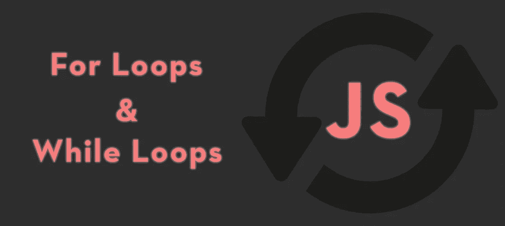
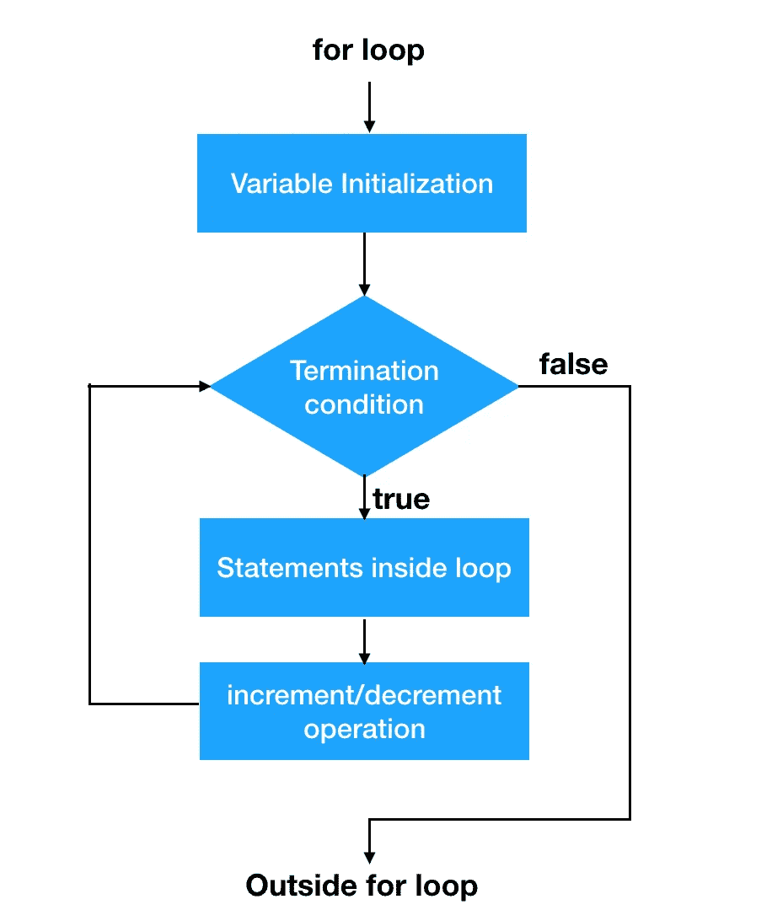
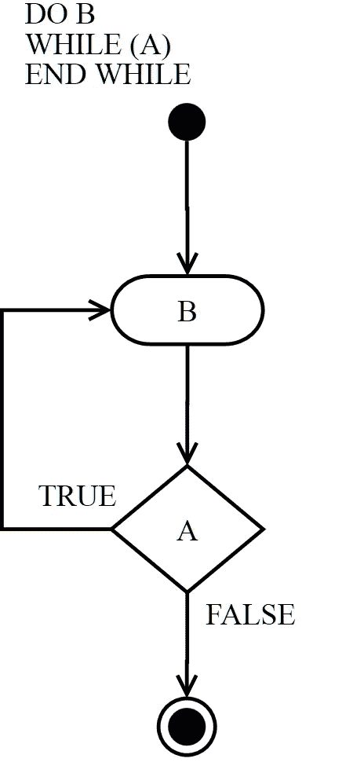

# JavaScript 中 For 循环和 While 循环的区别

> 原文：<https://levelup.gitconnected.com/the-difference-between-for-loops-and-while-loops-in-javascript-6029f45faeba>

在开发领域非常有用的东西是`for`循环和`while`循环。循环就像它们听起来的那样，它们允许我们一遍又一遍地运行相同的代码，直到满足停止条件。这对于编码中的所有事情都非常有用，并且是 web 开发的基本构件之一。循环也是一个很好的方式来 [***重构你的代码***](https://medium.com/javascript-in-plain-english/refactoring-your-code-in-javascript-a2b23cc0a1c6) 并使它变得更小！今天我们将看看 JavaScript 中三种最基本的循环方式，以及何时使用哪一种。

# 对于循环

大概是最常见的循环类型，`for`循环，非常适合当你 ***已经知道*** 你想循环多少次的时候。当使用一个`for`循环时，我们通常使用一个计数器，它会递增或递减，直到满足一个条件。一旦满足条件，循环将停止。下图应该能让你对 for 循环的工作原理有一个基本的了解。

[来源](https://www.journaldev.com/16450/java-for-loop)

通过以下语法建立一个`for`循环:

循环从您的初始表达式开始，我们通常通过键入`let i = /* a number */`来指示它。然后，我们设置一个条件，例如`i < 7`，在这种情况下，它相当于 I 小于 7。然后，我们设置增量表达式或减量表达式，通常用`i++`或`i--`来表示。然而，如果你愿意，你可以增加或减少多于或少于 1。为了更好地理解我所说的，这里有一个 for 循环的基本例子:

如果你预测 Hello World 会被打印到控制台 7 次，那么你是正确的！但是这个循环是如何工作的呢？在这个例子中，我们从初始语句(`let i=0`)开始，然后循环查看条件(`i < 7`)和增量表达式(`i++`)，循环相应地运行。只要`i`小于 7，`i`就会递增 1，直到不再小于 7。

每次循环运行时，都会执行`console.log(‘Hello World’);`。由于循环必须增加 7 次，直到满足停止条件，“Hello World”被打印到控制台 7 次。我们还可以使起始条件大于 0，并让循环递减，直到满足条件。

# While 循环

一个`while`循环与一个`for`循环略有不同，因为当我们 ***不知道*** 我们想要预先循环通过一个问题多少次时，使用它是很好的。这是使用`for`弧线或`while`弧线的关键区别。要了解 while 循环的基本工作原理，请看下图。

这是一个 do…while 语句的例子，但是，它的工作方式几乎与 while 循环完全相同。[来源](https://commons.wikimedia.org/wiki/File:Do-while-loop-diagram.png)

`while`循环比`for`循环更容易解释，因为`while`循环只是一遍又一遍地运行相同的代码，直到条件变为假。让我们来看一个 while 循环的简单例子！

如您所见，建立一个`while`循环非常简单。我们首先声明`while`循环，设置一个条件，然后是我们想要执行的代码。在上面的例子中，只要`x`小于 4，`while`循环就会继续执行。正在执行的代码随着每次迭代增加`x`的值，并将`x`的值加到`y`上。如果你还没想明白，这个 while 循环会把 y 的值设置为 10。y 从 0 开始，然后是 1，3，6，10，因为 x 的值在每次迭代中都会加到 y 上。

# do…while 语句

设置`while`回路的类似方法是使用`do…while`。一个`do…while`语句类似于一个`while`循环，它将继续运行，直到条件变为假。唯一的区别是循环运行的顺序。下面是一个简单的 do…while 语句示例:

如您所见，`i`从 0 开始，每经过一次迭代就增加 1。然后`i`的新值也被记录到控制台。在本例中，控制台将打印 1 2 3 4 5。

# 无限循环

在处理循环时，你需要小心的是创建一个永远不会满足停止条件的循环。这个循环将永远(无限)运行，并可能对您的计算机产生负面影响，如使其冻结并变得无响应。让我们来看看一个简单的无限 while 循环，这样你就知道如何避免碰到它们。

这个循环将永远运行，因为条件`i < 5`将永远为真，并且`console.log`语句将无限次执行。

如果您想了解更多关于循环的信息，您可以在此处阅读:

 [## 循环和迭代

### 循环提供了一种快速简单的方法来重复做某事。JavaScript 指南的这一章介绍了…

developer.mozilla.org](https://developer.mozilla.org/en-US/docs/Web/JavaScript/Guide/Loops_and_iteration) 

*来源:*

【https://www.journaldev.com/16450/java-for-loop 

[https://commons . wikimedia . org/wiki/File:Do-while-loop-diagram . png](https://commons.wikimedia.org/wiki/File:Do-while-loop-diagram.png)

[https://developer . Mozilla . org/en-US/docs/Web/JavaScript/Guide/Loops _ and _ iteration](https://developer.mozilla.org/en-US/docs/Web/JavaScript/Guide/Loops_and_iteration)