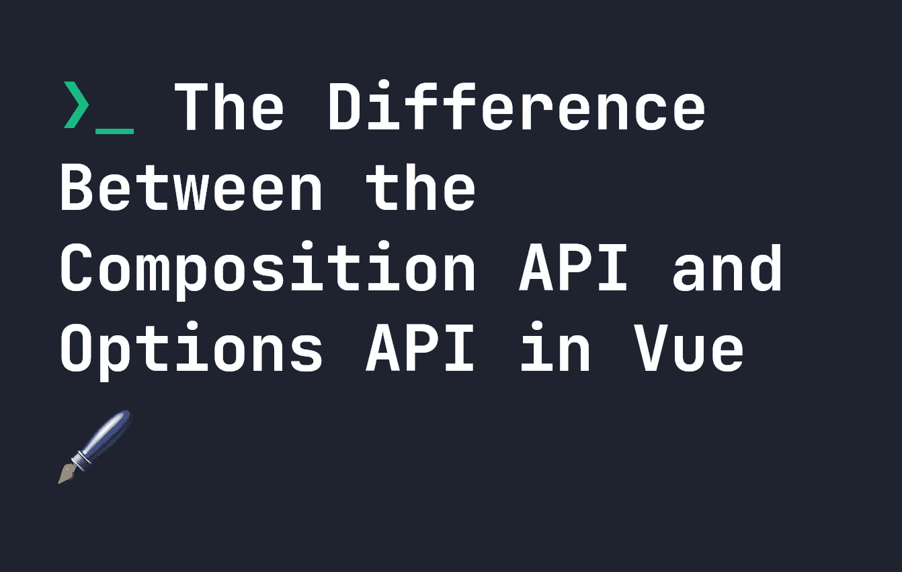
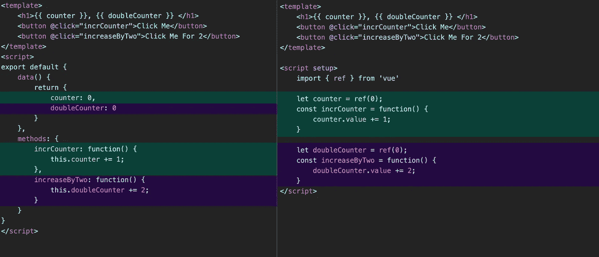

# Vue 中组合 API 和选项 API 的区别

> 原文：<https://levelup.gitconnected.com/the-difference-between-the-composition-api-and-options-api-in-vue-c5f70f6a86ad>



在 Vue 2 之前，只有一种方法可以在 Vue 中创建组件。在 Vue 3 中，引入了一种叫做**组合 API** 的新方法。现在，如果我们想在 Vue 中制作一个组件，我们有两种方法。您可能想知道到底有什么不同，所以让我们来看看新的 Composition API 与 Vue 2 方法有什么不同，Vue 2 方法现在被称为 **Options API**

# Vue 中的 Composition 和 Options API 有什么区别？

简而言之就是**语法**。Composition API 允许我们创建组件，而不需要像 Options API 中那样的大的单个可导出对象。例如，如果我们想用选项 API 制作一个简单的计数器组件，它看起来像下面的代码。

# 选项 API

```
<template>
    <h1>{{ counter }}</h1>
    <button @click="incrCounter">Click Me</button>
</template>
<script>
export default {
    data() {
        return {
            counter: 0
        }
    },
    methods: {
        incrCounter: function() {
            this.counter += 1;
        }
    }
}
</script>
```

相反，如果我们想用**组合 API** 编写相同的代码，它看起来会像这样。

# 组合 API

```
<template>
    <h1>{{ counter }}</h1>
    <button @click="incrCounter">Click Me</button>
</template>
<script setup>
    import { ref } from 'vue' let counter = ref(0); const incrCounter = function() {
        counter.value += 1;
    }
</script>
```

您会注意到一些不同之处:

*   我们导入了一个叫做`ref`的东西——这让我们可以创建反应变量
*   当我们增加计数器时，我们实际上增加了`counter.value`，因为`ref`返回一个对象。
*   我们避免了使用整个原型，取而代之的是一个简单的函数

# 组合 API 中的反应性

除了`ref`，我们还可以用`reactive`来表示物体。这两者都赋予变量反应能力，意味着我们不会失去任何功能。

# 组合 API 的好处

正如您所看到的，组合 API 比选项 API 更加精简，并且需要的代码更少。它还有另外一个好处就是**划分**代码。让我们考虑一个有两个计数器的愚蠢例子——一个按钮将输出增加 1，另一个增加 2。在**选项 API** 中，我们可以这样写:

```
<template>
    <h1>{{ counter }}, {{ doubleCounter }} </h1>
    <button @click="incrCounter">Click Me</button>
    <button @click="increaseByTwo">Click Me For 2</button>
</template>
<script>
export default {
    data() {
        return {
            counter: 0,
            doubleCounter: 0 
        }
    },
    methods: {
        incrCounter: function() {
            this.counter += 1;
        },
        increaseByTwo: function() {
            this.doubleCounter += 2;
        }
    }
}
</script>
```

另一方面，在**组件 API** 中，它可能看起来像这样:

```
<template>
    <h1>{{ counter }}, {{ doubleCounter }} </h1>
    <button @click="incrCounter">Click Me</button>
    <button @click="increaseByTwo">Click Me For 2</button>
</template><script setup>
    import { ref } from 'vue' let counter = ref(0);
    const incrCounter = function() {
        counter.value += 1;
    } let doubleCounter = ref(0);
    const increaseByTwo = function() {
        doubleCounter.value += 2;
    }
</script>
```

差别很小，但是您可能会注意到一些有趣的事情——在**组合 API** 上，所有相关的代码都保持在一起，所以您不必抱太大希望。在下图中，您可以看到，具有相似功能的代码以相同的颜色突出显示。



在右边,**组合 API** 把它的代码都放在同一个地方。在小项目中，这并没有很大的区别——但是在大项目中，可维护性增加了。

# 组合 API 的其他好处

*   **取代 mixins** ，以及随之而来的名称冲突等所有问题。
*   **更好的类型支持**，因为它使用的大多是普通的函数和变量，在 TypeScript 中不需要复杂的类型。
*   **更小的文件** —如前所述，组合 API 需要更少的代码。

# 我现在需要使用组合 API 吗？

**不！如果 Options API 对您来说仍然很好，那么没有理由将您的代码切换到 Composition API。Options API 没有任何用处，相反，Composition API 提供了一种创建 Vue 组件的替代方法。**

在某些情况下，Options API 可能仍然是更好的选择。

# 复合 API 比选项 API 好吗？

这个问题没有简单的答案。这两种方法各有千秋，在某些情况下可能会有用。无论您决定使用什么都完全没问题，但是组合 API 确实解决了 Options API 带来的一些问题。