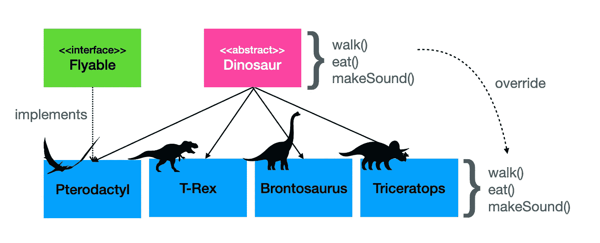

# 恐龙问题:让技术面试更吸引人，信息更丰富

> 原文：<https://levelup.gitconnected.com/the-dinosaur-question-making-technical-interviews-more-engaging-and-informative-d961e0579e7e>

[恐龙在路上](https://flic.kr/p/2bd7aav)司机摄影师

技术面试很难。在一个小时内，你必须想办法了解候选人的个性、文化契合度和技能。更糟糕的是，你必须弄清楚他们的思考能力和学习新事物的能力。“教科书式”的技术问题、对候选人经历的深入探究以及白板练习会有所帮助，但仍会让你感到不确定。

恐龙问题最初改编自 Eric Freeman、Bert Bates、Kathy Sierra 和 Elisabeth Robson 在 *Head First Design Patterns* 中的一个练习(除了他们用了鸭子——我认为恐龙更酷)。这是一种让你的面试对你和候选人都更有吸引力的方式，并且让你更好地衡量他们的技能水平、个性、学习和适应能力等等。

## 在开始之前

恐龙问题是一个练习，要求考生设计一个类库来表示恐龙。它从简单开始，然后变得更加复杂，测试候选人对 OOP 和设计模式的理解。

虽然恐龙问题已被证明在揭示候选人的很多信息方面非常有效，但它也有一些局限性:

*   这是一种面向对象的练习，对于函数式或其他形式的编程可能不那么有效。
*   它最适合初级到中级水平的候选人。
*   拥有一个白板是最好的，尽管它可以通过谈论事情来实现。
*   这需要时间。你真的需要 30 多分钟来有效地完成它。
*   最好是去适应它，而不是一头扎进去。进入面试的流程，然后进入练习。
*   没有“正确”的答案，尽管有些解决方案比其他方案更有效。

## 这个问题

开始练习时，要求考生设计一个类库来代表模拟器应用程序的一组恐龙。先说三种恐龙。我使用

*   一只霸王龙(最受欢迎)，
*   一只雷龙，还有
*   一只三角龙(最酷)。

你可能需要解释这些恐龙长什么样。参考*侏罗纪公园*和*之前的土地*特许经营权有所帮助。事实是，你用哪种恐龙并不重要，只要它们都是陆地上行走的恐龙。

解释这些恐龙都有三个共同的行为:

*   他们走路，
*   他们吃东西，然后
*   它们每个都发出不同的声音(为了好玩，你可以试着发出不同的恐龙声音，这可能感觉有点傻，但这真的可以放松紧张)。

请注意，虽然所有恐龙都有上述行为，但它们也各不相同。例如:

*   三角龙和雷龙用四条腿行走，而霸王龙是双足的。
*   同样，三角龙和雷龙是食草动物，而霸王龙是食肉动物。

现在，有了所有这些信息，让他们画出(或解释)他们如何将这三只恐龙建模为类。

候选人的第一种典型方法是使用继承。

大多数候选者从一个基本的继承模型开始，包括一个父恐龙类，每个恐龙类型有三个子类。在极少数情况下，你会有不同的变化。我不止一次地让考生们试图用大量的 if…then 语句将所有的逻辑塞进一个单独的类中。

一旦他们概述了他们的初始设计，就要深入探究，看看他们对设计的好处和限制了解多少。例如，你可能会问

*   父类是具体的还是抽象的？—这是一个谈论差异和利弊的好机会。
*   父类中可能存在什么属性？实例类怎么样？
*   方法去哪里了？
*   他们是如何处理上述差异的？—如果他们使用继承，这个问题是关键。

诸如此类。

如果他们真的想出了一个单一级别的解决方案，一切都没有失去！看看你是否能让他们想到使用继承或其他 OOP 原则可能会带来的好处。

## 把事情复杂化

一旦你对候选人的初始设计有了很好的理解，添加一种新的恐龙来使它复杂化:翼龙。翼龙的行为与前面三种恐龙完全相同(它们走路有点摇摇摆摆)，但它们也能飞。

这里的目标是看看候选人如何处理不断变化的需求，以及当那些行为是特定类型所特有的时，他们如何将新的行为合并到他们的模型中。

候选人有几种方法可以满足这一要求。最好的方法之一是将非共享行为抽象成接口。例如，他们可能用一个方法`fly()`添加一个`Flyable`接口，并在翼龙类中实现它。

更多的初级候选人可能不知道或不太了解接口。如果他们试图找出一种方法将飞行行为塞进`walk()`方法(许多人试图将其重新命名为`move()`)，抓住机会探索接口的想法，看看他们是否能理解。

问题的这一部分也为讨论 HAS-A 和 IS-A 对象之间的区别以及讨论抽象、封装和多态提供了可能性，这取决于对话的进展。

## 更加复杂

一旦候选人通过翼龙挑战，你可以通过向她扔一两只恐龙来测试她是否真正理解这些概念。我喜欢用沧龙和塑料恐龙。沧龙是一种会游泳的恐龙(它是《T4》侏罗纪世界中吃掉保姆的大恐龙)。它不会走也不会飞，但它会游泳。

一个潜在的解决方案是将所有的行为从实现类抽象到接口中。另一个可能的解决方案是使用装饰模式(图中没有)。

塑料恐龙只有一种行为:会吱吱叫。候选人的对象设计是否足够灵活，可以容纳这样一种被剥离下来的恐龙类型？

如果我觉得厚脸皮并且有时间，我可能也会要求他们添加一个尼安德特人，看看他们会怎么做。

## 包裹

记住，这个练习没有唯一正确的答案。任何可行的设计在技术上都是可以接受的。目标是探索候选人技术理解的极限，找出他们适应变化的能力，如果你幸运的话，他们吸收和使用新信息的能力。沿着这条路，你会看到他们的个性，他们的思维方式，甚至他们处理压力的能力。

我在几十次采访中使用过这个练习，它总是很有启发性。一些通过了标准技术问题的候选人甚至努力做出最基本的对象模型。当面对这一挑战时，一些与教科书上的答案斗争的人变得活跃起来。

不少应聘者告诉我，这是他们经历过的最吸引人的面试之一。一些人甚至在几天后跟进更新的解决方案，要求额外的反馈，不管他们是否得到了这份工作。虽然纯粹是轶事，但这似乎表明，恐龙问题正是工程师们喜欢的那种挑战，它让他们在面试结束后很长时间都在思考和学习。

最终，我相信这会让面试变得更好，揭示更多关于候选人的信息，让你更深刻地了解这些人是否适合你的团队。我希望它对你和对我一样有效。