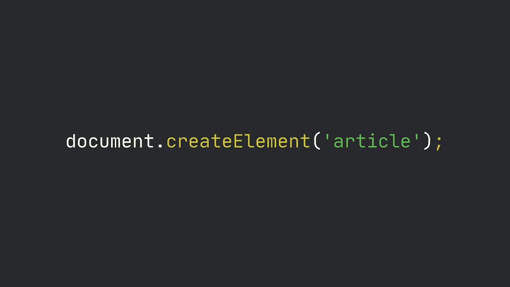

# JavaScript 中的 DOM 和 DOM 操作

> 原文：<https://levelup.gitconnected.com/the-dom-and-dom-manipulation-in-javascript-44a2f2aae316>



JavaScript 的主要目的之一是与 HTML 元素交互。这就是为什么知道如何随心所欲地访问和操作这些元素是很重要的。

JavaScript 是一种基于对象的语言，绝大多数内置特性都是对象，HTML 元素也不例外。**文档对象模型**或 DOM 是页面上当前可用的 HTML 元素的对象表示。

在前端开发中，语言本身的所有东西都是全局对象`window`的属性，所以你可以通过`window.document`或者简单的`document`来访问 DOM 对象。

# 那这个`document,`是什么？

`document`是`Node`类的实例，或者更准确地说是`Document`类的实例:你可以把 DOM 想象成一棵树，每个元素是一个节点，而`document`是根。

`Node`类提供 HTML 元素的属性和方法。您将能够访问元素的内容，并在它们的父元素和子元素之间移动。

注意`Node`类是很多其他类的超类，其中有`Document`和`Element`。这些允许您访问——在某些情况下修改 HTML 元素的属性，比如类、id 和属性。此外，每个 HTML 标签都有自己的专门类，继承自`Element`，具有特定的方法和属性。

一个简单的例子:不是所有的元素都有一个`href`属性，这是锚标记的典型属性。锚点是`HTMLAnchorElement`的实例，包括`href`属性，而 div 是`HTMLDivElement`的实例，不包括`href`属性。因此，您将能够访问一个`a`元素的`href`属性，但是不能访问一个`div`元素的属性。

最后，`NodeList`是一个类似数组的结构，表示一列`Node`元素。尽管它**不是一个真正的数组** *，*它与它们有一些相似之处。事实上，用`for`循环或者使用`forEach`方法来迭代`NodeList`是可能的——只是要注意[浏览器兼容性问题](https://developer.mozilla.org/en-US/docs/Web/API/NodeList#Browser_compatibility)。

# jQuery 和普通 JS

使用原生特性操作 DOM 有时仍然不常见的原因是，不久前它们还很难使用，简单的算法可能需要许多行代码。

这就是 jQuery 迅速传播并被确认为最流行的 DOM 操纵 JavaScript 库的原因。

如今，JavaScript 对开发人员更加友好，并且弥补了过去的不足。虽然了解 jQuery 基础知识可能在工作环境中仍然有用，但软件公司正在迅速切换回普通的 JS。这在性能方面也是一个优势，众所周知 jQuery 比原生 JavaScript 慢。

让我们做一个快速简单的测试。假设我们有一个带有两个锚标记的 HTML 页面，我们想用和不用 jQuery 来检索它们。

```
function getAnchorsWithJQuery() {
  return $('a');
}function getAnchorsWithoutJQuery() {
  return document.querySelectorAll('a');
}console.time('jQuery');
getAnchorsWithJQuery();
console.timeEnd('jQuery');console.time('Native');
getAnchorsWithoutJQuery();
console.timeEnd('Native');
```

我使用了`console.time`和`console.timeEnd`方法来实现一个简单的秒表，看看这两个函数执行起来需要多少时间。我做了几次测试，结果如下:

尽管如此少的执行不足以进行真正的分析，但是您可以看到本机代码通常执行得更好。在这个特定的例子中，它比 jQuery 快 16 倍。

# JavaScript 的复仇

使用原生 JavaScript 特性，您需要做的一切都是可能的，如果它们不会给您的编码体验或最终结果带来实际好处，您就不需要任何库。

如果你是一个新手前端，这些是你绝对需要知道的几个`document`和`Element`方法。

## 如何获取节点子元素

`querySelector`和`querySelectorAll`用于检索与给定的*选择器*匹配的节点的所有子元素。这非常方便，因为选择器就是 CSS 选择器:可以通过标签名、类、ID 和属性来匹配元素，就像在级联样式表中一样。就这么简单！

```
// Retrieving the element by its ID
const main = document.querySelector('#main');// Retrieveng all paragraphs with the 'hidden' class inside the #main element
const hiddenParagraphs = main.querySelectorAll('p.hidden');
```

请注意:

*   `querySelector`总是返回子节点中第一个匹配的`Element`，或者`null`没有找到
*   `querySelectorAll`总是返回一个`NodeList`，如果没有找到匹配的元素，它的长度为`0`
*   在这个例子中，`main`的值是`Element`类的一个实例，因此可以使用`querySelector`和`querySelectorAll`来检索它的子节点

## 如何通过标签名、类或 ID 获取节点

您还可以通过元素的标记名、类或 ID 来检索元素。

```
const main = document.getElementById('main');
const hiddenParagraphs = main.getElementsByClassName('hidden');
const paragraphs = main.getElementsByTagName('p');
```

*   `getElementById`只能在`document`上使用，因为 HTML 页面中的 ID 必须是唯一的——它总是返回与给定 ID 匹配的`Element`,如果没有找到，则返回`null`
*   `getElementsByClassName`总是返回一个`HTMLCollection`，一个类似数组的结构，包含所有匹配给定类的节点——注意`HTMLCollection`类似于`NodeList`，但是当 DOM 发生变化时，它的行为会有所不同(更多信息请阅读 [MDN 文档](https://developer.mozilla.org/docs/Web/API/HTMLCollection)
*   `getElementsByTagName`总是返回一个包含所有匹配给定标签名的节点的`HTMLCollection`

## 如何创建元素并将其插入页面

最后，`document.createElement`方法允许您以编程方式创建元素。注意，用`createElement`创建的元素不会自动插入到 DOM 中:在您处理好它们的位置之前，它们不能通过前面的方法访问。看一看:

```
const shoppingList = document.createElement('ul');
const milkItem = document.createElement('li');
const cerealsItem = document.createElement('li');milkItem.innerText = 'Milk';
cerealsItem.innerText = 'Cereals';document.body.appendChild(shoppingList);
shoppingList.appendChild(cerealsItem);
shoppingList.insertBefore(milkItem, cerealsItem);
```

在这个代码片段中，我创建了两个商品的购物清单:牛奶和谷物。我使用`createElement`初始化所有需要的 HTML 标签，然后在列表项中写一些有意义的文本，最后将它们放入页面:

*   通过`Node.appendChild`方法在页面`body`中添加`ul`标签
*   第一项小时候的`ul`
*   第二个项目作为`ul`的子项目，但是在前一个项目之前，通过`Node.insertBefore`方法

当然，你也可以删除元素。`Node.removeChild`方法用于从父节点中移除一个节点，如下所示:

```
shoppingList.removeChild(milkItem);
```

使用纯 JavaScript 操作 DOM 变得比以前更加简单和容易。开发者社区意识到了这一点，现在他们正改变方向回到根本。

不过，jQuery 仍然被广泛使用，所以知道如何使用它仍然很重要。我个人的观点是，我们都应该尽可能使用 JavaScript 原生特性。您的项目将会执行得更好，并且您将会对这种美妙的编程语言有更好的了解。

树是一种特殊的数据结构，你可以把它想象成一棵真正的树:第一个元素或*节点*是*根*，其他元素相互连接形成*分支*和*叶—* [在维基百科上阅读更多信息](https://en.wikipedia.org/wiki/Tree_(data_structure))

在树形数据结构中，每个元素被称为一个节点，第一个元素，所有其他节点的祖先，被称为根节点

超类是其他类继承属性和方法的类，在 JavaScript 中，`extend`关键字用于定义类之间的继承