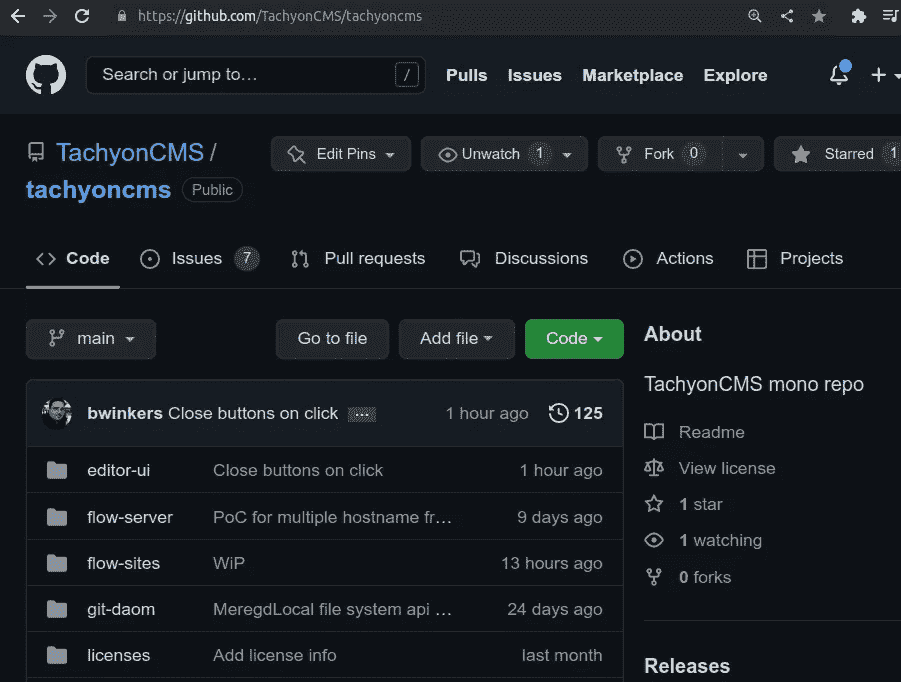

# Monorepos 的缺点

> 原文：<https://levelup.gitconnected.com/the-downside-of-monorepos-c30ecfa86ba9>

在我的[上一篇文章](/using-a-monorepo-to-increase-sharing-8dc68e3d838a)中，我讨论了迁移到 monorepo 如何使得在不同部分之间共享代码变得更加容易。在本文中，我将讨论使用 monorepo 效果不佳的地方。

## TLDR

在以下情况下，单一回购可能不合适:

1.  这是一个开源项目。
2.  使用合并触发的部署。
3.  同时处理多个零件中的不同特征。
4.  用户访问需求不同。
5.  许多最终用户只需要一小部分代码。

我们搬走了不合适的东西，剩下的留在核心回购中。

## 开源项目

强迫开发人员下载不必要的代码似乎很麻烦。它使用额外的带宽和本地存储，这对人们很重要。

## 合并触发的部署

许多服务支持的一个常见范例是基于分支的部署，将代码合并到一个分支中，就像**生产**触发部署一样。 [Netlify](https://www.netlify.com/) 和其他人使用这个范例使部署静态站点变得非常容易。

当使用默认的部署过程时，问题就来了，monorepo 中的每个项目在每次合并到产品中时都会被重新构建，即使没有任何更改。这浪费了宝贵的构建时间，并增加了错误破坏甚至没有改变的服务的机会。

## 同时处理多个零件中的特征

我发现自己在没有准备好生产的部分做了改变，只是为了支持另一部分的当前开发。这些更改可能会丢失，或者更糟，被提交。选择何时提交对每个部分的更改更有效率。

## 不同的用户访问权限

许多 git 进程不支持子目录上的细粒度权限。多个回购使定义每个人应该能够访问什么代码变得更加容易。

## 最终用户只需要一小部分代码

大多数 TachyonCMS 的用户不需要访问编辑器代码，只需要用他们的浏览器访问 TachyonCMS.org。许多人想要发布他们使用[流站点服务器](https://github.com/TachyonCMS/tachyoncms/tree/main/flow-sites)创建的内容，以提供半静态内容。这只是代码中很小的一部分。