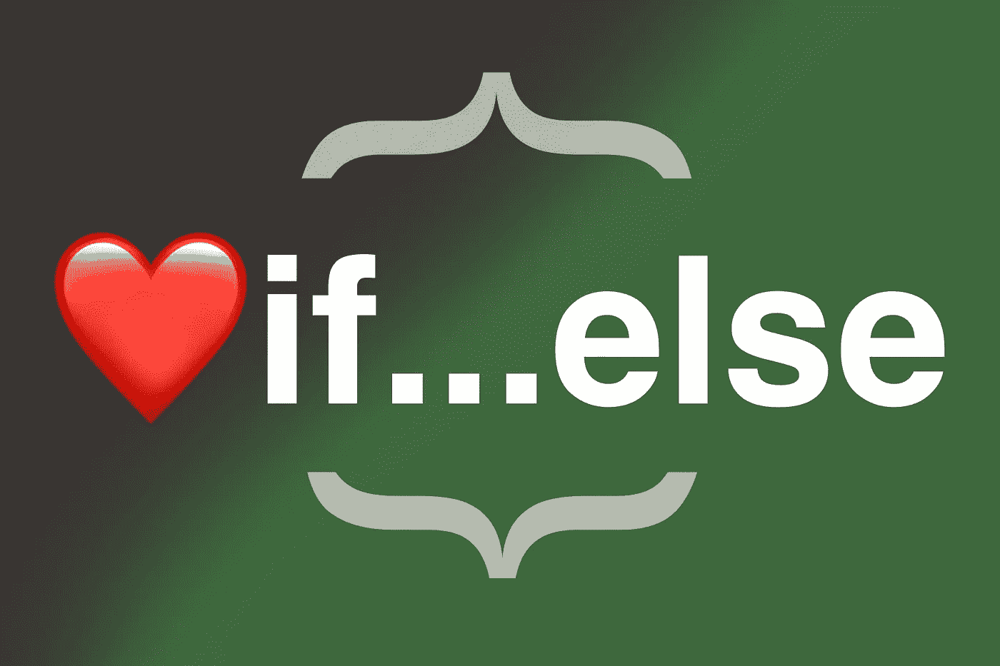

# 我所知道的每一种语言中“可怕的”If…Else 语句

> 原文：<https://levelup.gitconnected.com/the-dreaded-if-else-statement-in-every-language-i-know-7136dffa4e96>

## 当每个人都讨厌“如果……否则”这句话时，我要用我所知道的每一种语言来表达我对它的喜爱！



作者照片

这是我对 if…else 语句的公开情书。在这一点上，我不得不增加一些手脚来计算 Medium 和 LinkedIn 帖子的数量，这些帖子击败了条件编程的其他可靠老手。我记得我第一次看到它是在 C. This。**这就是我从事编程的原因。if…else 语句点亮了灯泡。**那时我才明白计算机是如何做人类所做的事情的，它们只是笨得多。它们快得要命，但除非我们告诉它们该做什么，否则它们是愚蠢的，这些条件句正是这样做的——帮助计算机在程序中做出决策。

因此，为了庆祝这一点，也为了让**重拾对“如果……否则”这句话的热爱和热情，**我决定尽我所能——用我会说的所有语言写一些例子。然后…你用你知道的语言在评论里写一些。最终结果？一大堆 if…else 语句，希望超过我所熟悉的 10 种语言。

## Java Script 语言

我们这些 JavaScript 爱好者会声称这种语言无处不在，虽然这并不完全正确，但任何至少在 web 开发领域工作过几年的人都会知道，**这是一种不容忽视的语言**，也是浏览器本机支持的唯一一种编程语言，所以这是我列表中的第一种语言绝非巧合。

```
if (condition) {
  console.log("block of code to be executed if the condition is true")
} else { 
  console.log("block of code to be executed if the condition is false")
}
```

## 服务器端编程语言（Professional Hypertext Preprocessor 的缩写）

这是我当年接触的第三种语言。部分原因是我碰巧发现了它，但也是因为哈佛的 CS50(远在它很酷并出现在 EdX 上之前)将它作为课程的一部分。许多人声称它是一种死亡的语言，但事实上超过 70%的网络仍在愉快地运行它，并且从我第一次使用的 PHP 5 版本发展而来。我唯一的问题是$符号。

```
if (condition) {
    print("Code to be executed if condition is true")
} else {
    print("Code to be executed if condition is false")
}
```

## 斯卡拉

这是我最近一次认真工作。老实说，**这不是一门容易推销的语言**，但是[在语言能力和语法方面，它给我的印象是比 Java](https://medium.com/gitconnected/learn-scala-basics-in-10-minutes-7a16d6597a51) 更有价值。

```
if (Boolean_expression) {
   println("Executes when the Boolean expression is true")
} else {
   println("Executes when the Boolean expression is false")
}
```

## Java 语言(一种计算机语言，尤用于创建网站)

谈到 Java，只有两个阵营。**信以为真的软件工程师，还有拿它开玩笑的。其他人都是因为这是他们大学课程的一部分才学会的。**

```
if (condition) {
  System.out.println("block of code to be executed if the condition is true")
} else {
  System.out.println("block of code to be executed if the condition is false")
}
```

## 镖

我毫不费力就学会了这门语言。它感觉如此接近 TypeScript 和 JavaScript，以至于我只是键入了一个完整的 Flutter 应用程序，甚至没有考虑太多我正在编写 Dart 的事实。

```
if (boolean_expression) { 
   print("statement if the expression evaluates to true")
} else { 
   print("statement if the expression evaluates to false")
}
```

## 卡盘

我已经好几年没接触过这种语言了，但它是一种有趣的语言。你可以用它来创作音乐！没有多少语言能这么说！如果你对音乐感兴趣的话，我强烈建议你去学学它！[这是他们的官方文件](https://chuck.cs.princeton.edu)。

```
if (condition) {
    prints "condition evaluates to true"
} else {
    prints "condition evaluates to false"
}
```

## C

这是我正式学习的第一门编程语言。为什么是正式的？因为从技术上来说，在此之前我曾尝试过 JavaScript 的片段，但实际上，**这种教会我编程基础的语言是很好的 ol' C** 。如果你以前从未用 C 语言编程，一旦你开始编码，这里有两个词你将永远不会忘记:内存管理。😈

```
if(boolean_expression) {
   printf("statement(s) will execute if the boolean expression is true")
} else {
   printf("statement(s) will execute if the boolean expression is false")
}
```

## 迅速发生的

如果你不想用 Flutter、Ionic 或 React Native 编写苹果应用，那么你别无选择，只能选择 Swift。我还没有正式接触过这种语言，但在业余时间，我喜欢做一些原生应用开发，测试增强现实的东西。**它也是** [**你可以在 iPad 上原生编码和运行的语言。**有点……](/can-you-really-develop-apps-on-the-m1-ipad-air-66f1ef0677f3)

```
if (condition) {
  print("block of code if condition is true")
}
else {
  print("block of code if condition is false")
}
```

## 计算机编程语言

我对 Python 一直是又爱又恨。在语法中使用空白的整个概念并不像实际的字符被用来定义代码块那样被我的大脑所理解。对我来说，空白是关于格式的，我很难把它看作是一个有规划意义的东西。也就是说，这是一门可以用于无数事物的伟大语言，包括我最喜欢的——乐高 EV3 机器人！

```
if condition:
  print("condition evaluates to true")
else:
  print("condition evaluates to false")
```

## 红宝石

还记得 Ruby-on-Rails 流行的时候吗？没持续多久吧？我在学习 Python 的同时学习了它，所以从那以后，我觉得这是一个相当自然的过程。但我不能说我真的爱上了它。

```
if condition
  puts "condition evaluates to true"
else
  puts "condition evaluates to false"
end
```

## 你注意到什么了吗…？😉

确实如此。这些语言中有 8/10 对 if…else 语句使用完全相同的语法。那是因为它们是 C 系列编程语言的一部分。这也是为什么许多高级程序员倾向于在几年后不再关心语言本身，而更专注于解决问题的原因之一。你会发现许多公司会雇佣一名经验丰富的程序员，不管他们过去接触过什么语言。例如，当我几年前学习 Dart 时，我经常忘记我正在写 Dart，因为它感觉太像 JavaScript 或 TypeScript 了。

> if…else 语句是编程中的常用语句。这是最容易说明的概念之一，即使对于完全不熟悉编程的人来说也是如此。

如果某事是真的，就做这个，如果不是，就做那个。它完美地模拟了人脑的工作方式，以及人们如何做决定。所以，下次有人在拉式请求审查中向你提出使用 if-else 语句时，告诉他们放下架子，欣赏它的简单性。🙂

你知道哪些语言不在列表中？在评论里放个例子吧！💬 😉 🙏

[](https://attilavago.medium.com/membership) [## 通过我的推荐链接加入 Medium-Attila vágó

### 作为一个媒体会员，你的会员费的一部分会给你阅读的作家，你可以完全接触到每一个故事…

attilavago.medium.com](https://attilavago.medium.com/membership) [](/learn-scala-basics-in-10-minutes-7a16d6597a51) [## 10 分钟学会 Scala 基础知识

### 你还不会成为 Scala 大师，但是你会一路走好的。

levelup.gitconnected.com](/learn-scala-basics-in-10-minutes-7a16d6597a51) [](/can-you-really-develop-apps-on-the-m1-ipad-air-66f1ef0677f3) [## 你真的能在 M1 iPad Air 上开发应用吗？

### 裁决出来了。我尝试建立一个 iOS 和一个 web 应用程序…

levelup.gitconnected.com](/can-you-really-develop-apps-on-the-m1-ipad-air-66f1ef0677f3) [](/the-coolest-code-editor-feature-ever-6c05ea96b2a8) [## 史上最酷的代码编辑器功能！

### 我发现它只是因为我懒…

levelup.gitconnected.com](/the-coolest-code-editor-feature-ever-6c05ea96b2a8) 

*阿提拉·瓦戈——软件工程师，一次一行代码地改善世界。永远的酷呆子，代码和博客的作者。网络无障碍倡导者，乐高迷，黑胶唱片收藏家。喜欢精酿啤酒！*