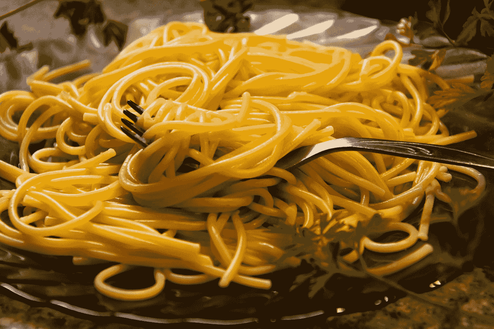

# 用 SCSS mixin 编写媒体查询的简单方法

> 原文：<https://levelup.gitconnected.com/the-easier-way-to-write-media-queries-with-scss-mixin-c7c956150551>

## 使用自定义 mixin 创建没有意大利面条代码的媒体查询

许多媒体询问的代码，照片由[克里斯汀·桑杜](https://unsplash.com/@lenscapewithme?utm_source=medium&utm_medium=referral)在 [Unsplash](https://unsplash.com?utm_source=medium&utm_medium=referral) 上拍摄

如果我必须指出创建响应式 web 应用程序最讨厌的部分，媒体查询将是我的首选。幸运的是，我们有很多技术可以不用它们来制作响应页面(flexbox 就是其中之一)，但是媒体查询仍然是我们 CSS 代码库的重要组成部分。

当你使用 SCSS 或任何其他预处理器时，有许多方法来管理媒体查询。您应该对其中的一些进行试验，并选择符合您要求的。在本文中，我将向您展示一种可能的方法，使您的响应式 CSS 代码更加整洁。

# 媒体的质疑是疯狂的

为什么我这么讨厌写媒体查询？因为他们太罗嗦了！拜托，为了改变 3 个不同断点的按钮颜色，你要写多少代码？

如此多的线条来实现背景和边框变化这样简单的事情。这太疯狂了。当涉及到更高级的用例时，它很容易变成意大利面条式的代码。难以理解，难以维护。试着快速找出背景颜色会随着屏幕尺寸的变化而变化。或者尝试确定是否所有断点的填充都相同。要做到这一点，你必须分析一大堆代码。

你不认为如果所有关于不同背景颜色的信息都在一行会更好吗？就这样:

# 我的方法

你在上面看到的是我处理媒体询问的方式。为什么我觉得好多了？首先，我不用滚动几十行就可以看到所有的属性值，这使得代码更容易理解。写起来也更简单，尤其是当你有很多断点需要处理的时候。如果我想添加另一个断点来改变背景颜色，这是小菜一碟。

为了以这种方式使用媒体查询，我创建了名为`rwd`的 mixin。万一你不熟悉 mixins，你可以把它们想象成函数。Mixins 可以接收参数(像普通方法一样)，但是它们没有一个 *return* 语句。相反，mixin 的整个主体将被放置在您使用它们的任何地方。换句话说，您可以关闭 mixin 中的一些样式，并在整个项目中轻松重用它们。下面你可以找到 mixin 的基本用法。

如果你想了解更多关于 mixins 的信息，请参考[官方文档](https://sass-lang.com/documentation/at-rules/mixin)。

我的 mixin 接收三个参数:*属性名*、*默认值*、*断点列表及对应值*。接下来，它遍历断点列表，并为每个断点创建 CSS 规则。对于小于第一个断点的屏幕，将使用默认值。下面你可以找到源代码，你可以在你的项目中使用，如果你想的话。

# 明智地使用它

这个世界上没有完美的事情，我的方法也不完美。结果，它将产生比常规方法多得多的 CSS 代码。每次使用`rwd` mixin 都会为所有断点生成单独的媒体查询。这是你为了更易读的代码而必须付出的代价。如果你正在做一个优先考虑 CSS 性能的项目，我不推荐你使用我上面展示的 mixin。

我希望您发现这种方法很有用，但是如果它不符合您的要求，就值得花一些时间来构建您自己的解决方案。如果你正在寻找一个更复杂的解决方案，你也可以看看 [include-media](https://eduardoboucas.github.io/include-media/) 。