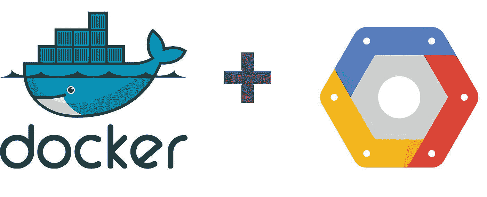

# 计算引擎上最简单的 Docker & Docker-compose 设置

> 原文：<https://levelup.gitconnected.com/the-easiest-docker-docker-compose-setup-on-compute-engine-ec171c09a29a>

## 2020 年如何在计算引擎上轻松安装 Docker & docker-compose

# 作者说明

问候读者，

本文是“ ***我与创业公司一起成长”***系列的一部分，该系列由各种软件开发的*技术教程、新闻和技巧*组成。以下是该系列中排名前五的帖子，你可以在这里阅读更多:

1.  [WebRTC——支持 Google Meet、Facebook Messenger 的技术](https://medium.com/swlh/webrtc-the-technology-that-powers-google-meet-hangout-facebook-messenger-and-discord-cb926973d786)
2.  [我在一个小时内构建了一个 M.E.R.N .代码库](https://medium.com/swlh/i-built-a-m-e-r-n-codebase-in-an-hour-742acd71ed7e)(第 2 部分)
3.  [通过将我们的客户端托管到云存储，我们节省了 45%的总成本](https://blog.usejournal.com/we-cut-down-45-of-our-budget-by-switching-to-google-cloud-storage-7e5a6a10542?source=your_stories_page---------------------------)
4.  [向新的 Github CLIs 问好](https://medium.com/@calvinqc/say-hello-to-the-new-github-clis-7e2612fb3918)
5.  [认证的完美结构&用 Node.js 授权你的 API](https://medium.com/swlh/perfect-structure-to-authenticate-authorize-api-with-node-js-and-passport-jwt-d529b1a618ba)

感谢访问这个系列，并享受阅读！



# 灵感

每当我创建一个新的计算引擎并不得不再次设置 Docker 时，我通常会去*多个网页*找到正确的命令来安装 Docker 和 Docker-compose。

我通常要花 5 分钟以上的时间来找到命令行并进行设置。有时一些网站可能没有你想要的。所以我创建了这个博客来帮助我，也许你也可以在不到一分钟的时间内设置 Docker 和 Docker-compose。

# 要求

1.  在本教程中，我假设你已经有了一个新的运行 Debian 的**计算引擎(因为这是默认的)，并准备好用 Docker 运行你的应用程序。**
2.  你有关于 **Docker** 的知识，最好你的服务器有`**Dockerfile**`和/或`**docker-compose.yml**`

# 入门指南

1.  通过命令行或云控制台 ssh 到您的虚拟机。
2.  **以管理员身份登录:** `**$ sudo -s**`

> 注意:如果你不先做`sudo -s`，你需要在每个命令中都有`sudo`

# 1 行命令

如果你已经知道你在做什么，但是还没有什么进展，这里有一行命令可以让你为计算引擎设置 Docker & Docker-compose。

我还在下面做了命令，让你看看是怎么回事。

# 码头工人

如果您喜欢分别执行，请执行以下命令

```
$ apt update
$ apt install --yes apt-transport-https ca-certificates curl gnupg2 software-properties-common
$ curl -fsSL https://download.docker.com/linux/debian/gpg **|** sudo apt-key add -
$ add-apt-repository "deb [arch=amd64] https://download.docker.com/linux/debian **$(**lsb_release -cs**)** stable"
$ apt update
$ apt install --yes docker-ce
```

**测试**

```
$ docker
$ docker info
```

**在没有**T0 的情况下执行 Docker 命令

*   无论何时运行 docker，你要么必须添加`sudo`要么必须运行`sudo -s`，这有时让我很恼火。
*   运行下面的命令:`$ sudo usermod -aG docker $USER`
*   然后再次登录，你将能够运行 docker 没有 sudo

# docker-撰写

## 为什么我们需要 docker-compose

当你运行`docker run ...`时，你的应用会一直运行，直到你关闭浏览器。这是低效的，因为你不想让你的标签永远开着。所以我们将使用[**docker-compose**](https://docs.docker.com/compose/)**，**，它将在后台运行你的应用

## *安装*

1.  *`curl -L "https://github.com/docker/compose/releases/download/1.26.2/docker-compose-$(uname -s)-$(uname -m)" -o /usr/local/bin/docker-compose`*
2.  *`chmod +x /usr/local/bin/docker-compose`*

## *测试*

*   *`docker-compose --version`*

## *使用*

1.  *确保您的目录中有一个`docker-compose.yml`*
2.  *运行`docker-compose up --build`*
3.  *成功启动应用程序后，运行`docker-compose up -d`*
4.  *否则，检查错误并修复 bug*

# *恭喜*

*现在，您可以在后台运行您的应用程序，并通过公共 IPv4 使用它！*