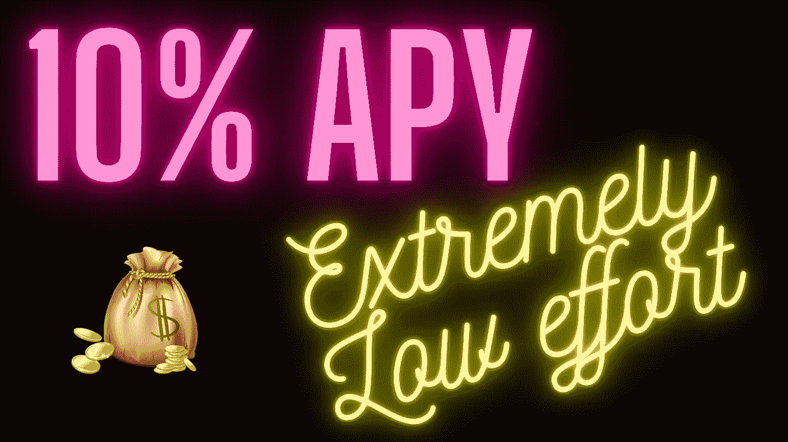
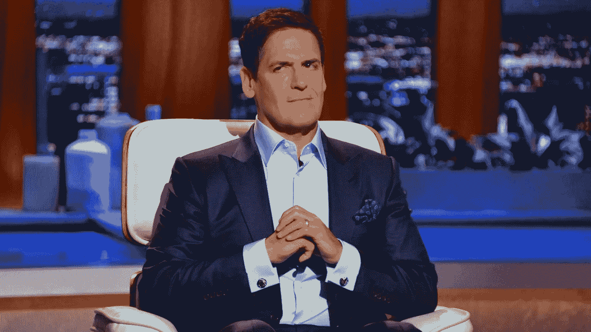
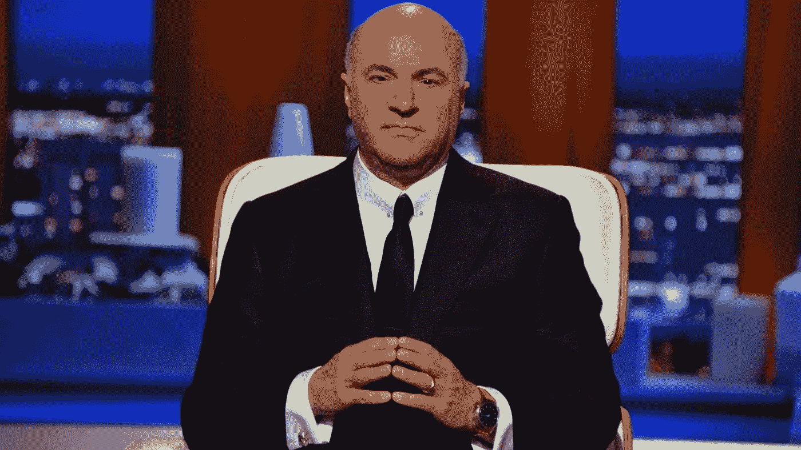
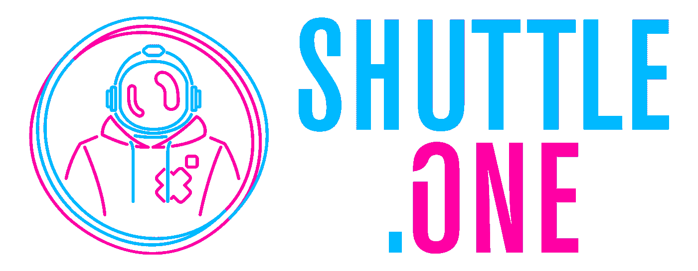

# 最简单稳定的被动收入来源

> 原文：<https://levelup.gitconnected.com/the-easiest-stable-passive-income-source-e39d6c8c78d5>

## 如何在加密熊市中赚钱

如果你是一个守旧派，财务保守的类型，你已经知道股票和债券作为资产类别的区别。股票本质上是公司的小所有权。它们不稳定，但当你投资于一个好的指数基金时，会给你带来较高的年收益率(APY ),通常为 8-12%。

债券本质上是贷款。因此，它们的风险较低，因为大公司和政府肯定会把钱还给你。他们也很好，因为你确切地知道你每年会赚多少钱。他们的 APY 是在你购买债券之前商定的，但通常不会像股市那样高，除非股市崩盘。

如果我告诉你，你可以通过简单的贷款获得 10%的投资回报，你会怎么样？在这里，你将获得债券市场的稳定性，同时获得与股票市场一致的收益率。听起来好得难以置信？

对大多数人来说是的，但让我们说你是一个加密投资者，这些 APY 甚至不会让你眨一下眼睛。如果你已经在 crypto 工作了一段时间，那么在过去的 12 个月里，你一定取得了一些相当不错的收获。但一两个月前，当比特币的价格几乎是现在的两倍时，你可能会飞得更高。一些人勇敢地称之为熊市。不知道是不是这样。

据我们所知，这可能只是暂时的停顿，我们可能会继续上升。然而，我想指出的是，如果不是今天，那么明天，熊市是不可避免的。如果你在 2017 年来过这里，你会记得比特币从 700 美元涨到 2 万美元的时候。当时感觉船已经起航了。这是 crypto 大多数人的感受:“世界终于意识到了比特币的潜力！现在永远不会停止了！还会继续涨！卖掉你所有的财产！抵押你的房子！全押比特币！”。见鬼，甚至在 2-3 个月前，我无数的朋友给我发信息，因为他们又有了同样的感觉。但如果你在 2017 年 12 月后跟踪比特币，你会记得被退伍军人称为“加密冬天”的两年熊市，当时比特币跌至 3000 美元的低点，然后再次出现在 COVID 闪电崩盘中。

我的意图不是要吓唬你，而是要告诉你，所有上升的东西都必须下降。比特币现在可能处于熊市，也可能不处于熊市，但那些日子肯定会到来。这不是我所希望的，只是一个事实，我们都必须接受，我们是一个非常动荡的市场的参与者。但如果我能给你一个几乎完全无风险的解决方案，并确保你获得 10%年利息的被动收入流，那会怎么样？

我知道你们中的一些人很想通过屏幕对我大喊，“产量农业怎么样？!"让我给你一些原因，为什么产量农业不是你的正确选择，如果你正在寻找稳定，低努力和接近零风险。

但首先是一个 tldr 对于我那些不耐烦的读者(别担心我也是你们中的一员)，我将要谈论的产品是 **ShuttleOne** ，在这里你可以从你稳定的硬币或法币中获得 10%的 APY。现在让我回头来解释为什么高产农业可能不适合大多数人:

## 消失的队伍

由于以太坊虚拟机的存在，在以太坊主网或币安智能链上发布令牌变得异常容易。它就是为此用例而构建的。这很好，但这也意味着你也有很多黑幕团队在启动黑幕项目。你可以在几分钟内启动一个项目，然后在 Uniswap 或 PancakeSwap 等分散式交易所(DEX)提供流动性，你的项目现在就可以供大众购买了。

这很棒，但人们是如何滥用它的:一个匿名团队创建了一个令牌，并在 DEX 上启动它。然后，他们通过承诺天文数字的 APY 吸引了大量的零售流动性提供者。随着越来越多的人锁定他们的资金，他们的代币获得流动性。这让匿名团队有机会出售自己的头寸，让持有项目令牌的零售流动性提供商的团队消失。通常情况下，这些项目会逐渐消失，它们的标记会变为零。

照片由[安德烈·木桐](https://unsplash.com/@andremouton?utm_source=medium&utm_medium=referral)在 [Unsplash](https://unsplash.com?utm_source=medium&utm_medium=referral) 上拍摄

## 合同黑客

加密货币不稳定。我们都知道。我希望我们都知道，我们应该将大部分财富投资于声誉良好的大型项目，如比特币、以太坊和波尔卡多特。但是，为了在他们的产量农业计划中获得高产量，用户被新团队推向更小更新的项目，这些新团队承诺比用户简单地通过向 Uniswap 上的以太坊/USDT 配对提供流动性获得更高的产量。

如果你不把自己暴露给黑客的话，这一切都很好。读完我之前的观点，如果你认为你在高产农业中是安全的，仅仅因为团队不是匿名的，不会消失，那你就错了。撰写巧妙的合同是一项新技能，没有多少人知道。因此，加密货币世界遭受黑客攻击。就在今年，我们已经看到了像 Alpha Homora、渴望金融、付费网络、Spartan DeFi 这样的密码项目遭到黑客攻击，我相信还有更多我不知道的项目。

## 非永久性损失

当用户在 Uniswap 或 PancakeSwap 等 DEX 上提供流动性时，他们无法确保他们在 DEX 上的资产价格与比特币基地等大型集中交易所(CEX)的价格一致。由于这个原因，他们可能会暂时失去一些资产价值，如果用户在没有检查价格的情况下将他们的资产从流动性池中移出，这将成为永久性的。产量农业的一个问题是，由于 YouTube 上所有的 DeFi 热潮和 FOMO，用户被鼓励寻找越来越高的产量。因此，越来越多的用户在没有彻底检查价格的情况下进出几个游泳池。

## 时间和压力

亿万富翁马克·库班

你认识上图中的那个人吗？他是亿万富翁马克·库班。下图那个人怎么样？—千万富翁凯文·奥利里。

千万富翁神奇先生

这两者有什么相似之处？他们都是高产农民。他们有团队帮助他们找到最好的收益。凯文·奥利里还投资了 2000 万美元在一个 DeFi 项目上，这将帮助他确保他的农业利润。听起来很刺激？是的，对他们来说。如果你想与那些拥有比你多得多的金钱和人力资本的巨鲸竞争，准备好投入更多的时间吧。更不用说电报组的 DeFi degens(我认识几个)，他们 24/7 都在做这个。高产农业可以给你带来很好的利润，但是你将不得不通过出租你的大脑空间和睡眠来支付更多的费用。

## 费用

这一点并不适用于所有的连锁店，但至少对以太坊主网来说是正确的。就在几个月前，以太坊区块链上的智能合约互动至少要花费 50 美元。他们现在下跌到 10 美元，但谁能说如果炒作再次上升，这不会回升。此外，几天内每天几十笔交易中的 10 美元交易也确实会增加。除非你投入大量资金并从中获得丰厚回报，否则这将损害你的元掩模钱包。

# 更安全的解决方案

加密货币市场波动大，风险高。比我或任何其他理智的参与者所希望的要多得多。你真的也想让你的被动收入来源同样不稳定和有风险吗？

如果没有，最简单的选择是穿梭一号。他们是这样做的:

当你把你的钱以 stablecoins 的形式放入 Shuttle One 的借贷平台，而不是用这些 stablecoins 进行流动性或收益耕种时，Shuttle One 就以此作为企业借钱的资本，以高于 10%的固定年利率资助他们的物流运营。Shuttle One 从这笔贷款中分得一部分利润，将剩余部分返还给用户。但是你可能会问，企业拖欠贷款怎么办？

这就是 Shuttle One 领先的区块链解决方案的神奇之处。通过区块链业务，Shuttle One 能够将一家借款公司购买的资产标记为 NFT 的资产。这些资产不是直接交付给借款人，而是交付给 Shuttle One，并根据借款公司是否支付分别释放或清算。航天飞机一号目前在整个东南亚运营，因此与物流领域的大公司建立了信任和关系。他们在 80 个国家都有菲亚特汽车公司，收入也在快速增长。

使用 Shuttle One，你可以在你的 **stablecoins、**上获得 10%的收益，而不是在一个可能消失或其加密货币崩溃的新团队的一些新资产上。你也可以两全其美，每年获得 10%的稳定回报，与股市指数回报相当，同时拥有与债券相当的稳定性。了解更多并参与[这里](https://shuttleone.network/2020/)！

*本文仅供参考，仅代表我个人观点，不应视为财务或法律建议。在做任何重大财务决定之前，先咨询财务专家。*