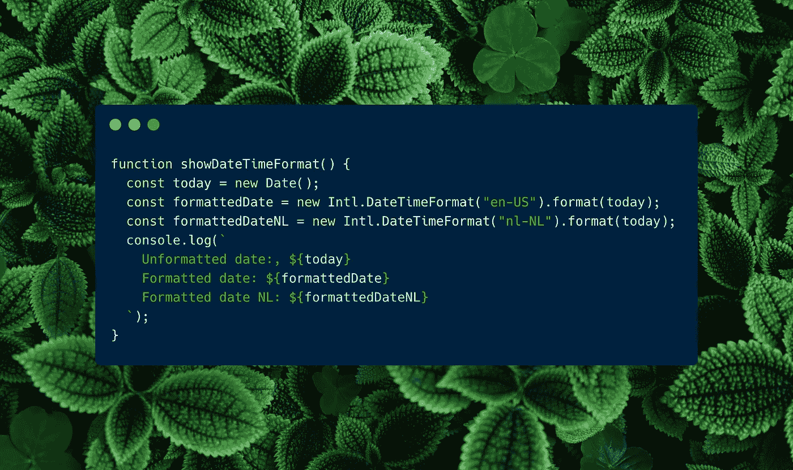

# 用 JavaScript 格式化日期的最简单方法

> 原文：<https://levelup.gitconnected.com/the-easiest-way-to-format-dates-in-javascript-723ba42a94c4>

## 这比你想象的要简单



多年来，开发人员抱怨用 JavaScript 格式化他们的日期和时间。进行计算或适当的格式化需要像 MomentJS 这样的库。

但是感谢 ECMAScript 国际化 API，那些日子已经过去了！我们需要依赖外部因素来进行日期格式化、日期和时间计算等等的日子已经一去不复返了。

在这篇文章中，我想向您展示用国际化 JavaScript API 格式化日期是多么容易。

```
1\. JavaScript Libraries VS Internationalization API
2\. How To Format Dates in JavaScript
3\. Intl.DateTimeFormat
4\. Intl.RelativeTimeFormat
```

# 1.JavaScript 库与国际化 API

我不知道你怎么想，但是格式化日期、数字和货币一直是 JavaScript 最讨厌的事情。开箱即用，你必须用普通的 JavaScript 做很多事情才能完成。

对于日期 [Moment.js](https://momentjs.com/) 是一个强大的球员。它们使得格式化、计算和其他所有与日期相关的事情变得更加容易。只有使用 JavaScript 库才能格式化日期。但这是一个庞大的图书馆。

但是由于库使事情变得更容易，它们也向您的 JavaScript 包添加了更多的数据。在大多数情况下，这不是一个问题，但如果你专注于性能，这可能是一个交易破坏者。

这就是为什么我对[国际化 API](https://developer.mozilla.org/en-US/docs/Web/JavaScript/Reference/Global_Objects/Intl) 如此满意。他们让你格式化你的日期、数字、时间和货币。这个 API 的美妙之处在于，在所有主流浏览器中，对浏览器的支持几乎是 100%。

检查[CanIUse.com 的浏览器支持数据](https://caniuse.com/internationalization)

我建议我们进入兔子洞，深入国际化 API 的世界。享受旅程！🎢

# 如何用 JavaScript 格式化日期

先说影响最大的。格式化日期很糟糕，但是有了`Intl.DateTimeFormat()`和`Intl.RelativeTimeFormat()`就变得容易多了。因为他们把它分成了两种方法。

# 什么可以 Intl。DateTimeFormat()做什么？

I [ntl。DateTimeFormat()](https://developer.mozilla.org/en-US/docs/Web/JavaScript/Reference/Global_Objects/Intl/DateTimeFormat/DateTimeFormat) 帮助格式化日期和时间。它通过执行这些格式来考虑位置和语言。

像下面这样的格式示例将很容易执行。

*   12/01/2021
*   2021/12/09
*   2021 年 8 月 5 日
*   欧洲中部时间 2020 年 12 月 20 日星期日 04:23
*   即使是荷兰语:“宗达，2020 年 12 月 20 日上午 16 时 23 分”

# 如何使用 Intl？DateTimeFormat()？

DateTimeFormat 非常容易使用。首先，我们必须配置`Intl.DateTimeFormat`构造函数。有几种可能性。

```
new Intl.DateTimeFormat([])
new Intl.DateTimeFormat(locales)
new Intl.DateTimeFormat(locales, options)
```

您可以像上面的示例一样轻松地使用构造函数。如果您想使用浏览器的区域设置，您必须在构造函数中传递一个空的`Array`。如果你要自己设置语言环境，你必须以字符串`en-US`或`nl-NL`的形式传递它。

第二个参数提供了一些其他的选项，可以对格式进行更多的控制。这些选项包括:

*   `dateStyle`:“满”、“长”、“中”、“短”
*   `timeStyle`:“满”、“长”、“中”、“短”
*   `dayPeriod`:“窄”、“短”、“长”
*   [同时检查其他选项](https://developer.mozilla.org/en-US/docs/Web/JavaScript/Reference/Global_Objects/Intl/DateTimeFormat/DateTimeFormat#parameters)。

如您所见，您有许多选项来控制日期和时间的格式。

在下面的例子中，你可以看到我们在传递`Date`的构造函数后面需要`format`方法。

```
function showDateTimeFormat() {
  const today = new Date();
  const formattedDate = new Intl.DateTimeFormat("en-US").format(today);
  const formattedDateNL = new Intl.DateTimeFormat("nl-NL").format(today);
  console.log(`
    Unformatted date:, ${today}
    Formatted date: ${formattedDate}
    Formatted date NL: ${formattedDateNL}
  `);
}
showDateTimeFormat();
```

该代码的结果将是:

```
Unformatted date:, Fri Aug 13 2021 11:09:09 GMT+0200 (Central European Summer Time)
Formatted date: 8/13/2021
Formatted date NL: 13-8-2021
```

这使得用每种语言、每种日历类型格式化您的日期变得轻而易举。我强烈建议查看 [MDN Web 文档，了解更多详细信息](https://developer.mozilla.org/en-US/docs/Web/JavaScript/Reference/Global_Objects/Intl/DateTimeFormat/DateTimeFormat)。

# 什么可以 Intl。RelativeTimeFormat()做什么？

国际机场。RelativeTimeFormat() 有助于以人类可读的方式格式化日期和时间。

像下面这样的格式示例将很容易创建！更好的是，它根据位置和语言对它们进行格式化。

*   一年前
*   三分钟后
*   10 秒钟前
*   明天
*   昨天

# 如何使用 Intl？RelativeTimeFormat()？

RelativeTimeFormat 类似于`Intl.DateTimeFormat`。首先，我们必须配置`Intl.RelativeTimeFormat`构造函数。有几种可能性。

```
new Intl.RelativeTimeFormat()
new Intl.RelativeTimeFormat(locales)
new Intl.RelativeTimeFormat(locales, options)
```

与 DateTimeFormat 一样，RelativeTimeFormat 也以同样的方式使用区域设置。传递一个空的`Array`，它将选择浏览器默认的区域设置。但是如果你添加了`en`或`nl`，它将使用该语言进行格式化。

在构造函数的第二个参数中，您可以添加一些选项。(更多详情，请查看 [MDN 网络文档](https://developer.mozilla.org/en-US/docs/Web/JavaScript/Reference/Global_Objects/Intl/RelativeTimeFormat/RelativeTimeFormat#parameters))

*   `localMatcher`:“查找”或“最佳匹配”(默认为最后一个)
*   `numeric`:“始终”或“自动”(使用自动，您可以期待类似“昨天”而不是“一天前”的值
*   `style`:“长”、“短”还是“窄”

这使得格式化每种语言和每种日历类型的相对时间变得轻而易举。我强烈建议查看 [MDN Web 文档，了解更多详细信息](https://developer.mozilla.org/en-US/docs/Web/JavaScript/Reference/Global_Objects/Intl/DateTimeFormat/DateTimeFormat)。

要使用`Intl.RelativeTimeFormat`，您需要计算日期。您可以自己做，但是我发现 [date-fns](https://date-fns.org/) 是处理日期的最好的模块化 JavaScript 库之一。所以在这个例子中，我将使用这个库。

通过运行`npm install date-fns`安装日期-fns。

```
import { differenceInHours } from 'date-fns';const diff = differenceInHours(
  new Date(2021, 6, 2, 19, 0),
  new Date(2021, 6, 2, 6, 50)
)const rtf = new Intl.RelativeTimeFormat("en");
const rtf2 = new Intl.RelativeTimeFormat("nl");console.log(rtf.format(diff, 'hour')) // Result: "1,300 hours ago"
console.log(rtf2.format(diff2, 'hour')) // Result: "1.300 uur geleden"
```

如您所见，结果非常方便。您不必手动翻译输出。但是你可以很容易地改变语言，用户得到一个可读的字符串。

将节点版本更改为最低版本 16，否则无法工作😅

使用这个构造函数，您以前需要库来完成这项工作。是的，有了日期-fns，你也可以这样做。但是，如果浏览器可以毫不费力地做到这一点，为什么要使用库呢？

date-fns 的伟大之处在于它是模块化的。你不用的东西不会包含在你的代码里。方便保持你的代码库小。

[**通过电子邮件获取我的文章点击这里**](https://blog.byrayray.dev/subscribe) **|** [**购买 5 美元中等会员**](https://blog.byrayray.dev/membership)

# 结论

我非常感谢那些花时间开发这些开发人员友好的浏览器 API 的聪明人。因此，让我们使用它们，并尽可能缩小我们的代码库。