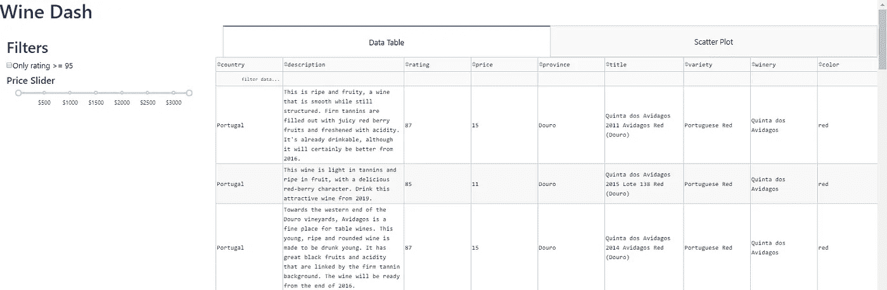
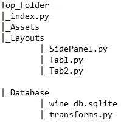
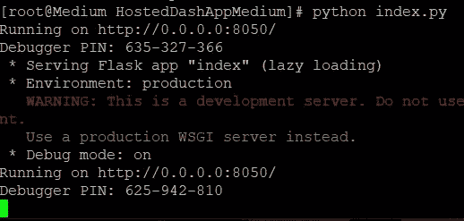
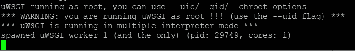
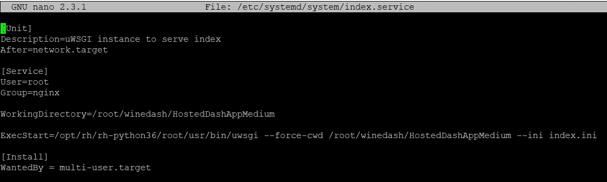
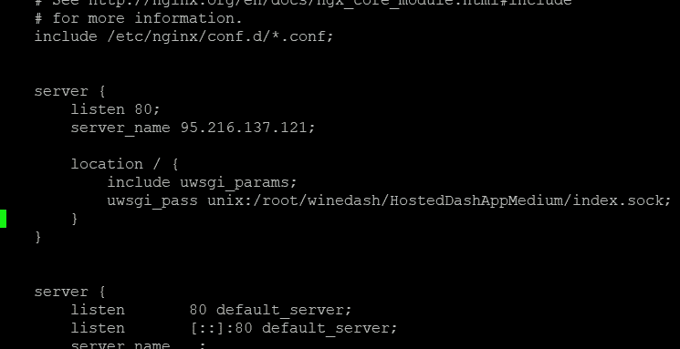
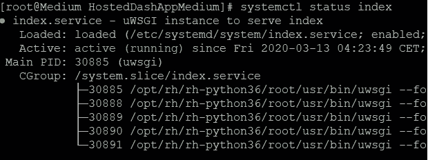
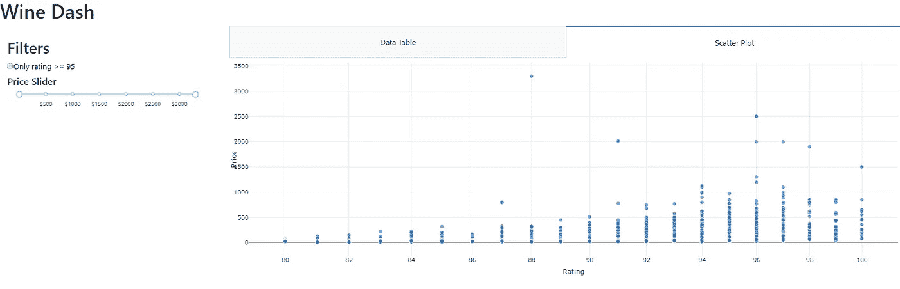

# 对于初学者来说，使用 Python、Dash 和 Linux 托管多页仪表板的最简单方法

> 原文：<https://levelup.gitconnected.com/the-easiest-way-to-host-a-multi-page-dashboard-using-python-dash-and-linux-for-beginners-78a78e821ba>

## 使用 uWSGI 和 Nginx 在 CentOS 上托管 Dash 应用程序


[https://www.piqsels.com/en/public-domain-photo-jfwvh](https://www.piqsels.com/en/public-domain-photo-jfwvh)

# 为什么要托管仪表板？

我最喜欢数据分析的一个方面是分享我从数据中发现的见解。如果你懂一点 Python，使用 Dash 创建一个仪表板来分享见解是很容易的，但是托管一个应用程序可能会有点棘手。我发誓，我第一次使用 Linux 服务器时，我花在解决错误上的时间可能比编写应用程序的时间还多！如果你试图进入数据行业，了解如何托管应用程序和仪表板可以让你轻松地与潜在雇主或客户分享项目组合。

我将介绍在 Linux 服务器上托管 Dash 应用程序的最简单方法！ [Dash 是一个基于 Flask、Plotly.js 和 React.js 编写的 Python](https://dash.plot.ly/) 开源框架。有多种方法可以托管 Dash 应用程序，我将介绍一种使用 CentOS 7 操作系统、Nginx(发音为 engine x)和 uWSGI 向外部用户提供仪表板的方法。

# 哪里可以找到 CentOS 7

[CentOS 是红帽企业版 Linux 的一个版本，可以免费下载](https://www.centos.org/)！如果你从未尝试过 Linux，我推荐你使用甲骨文的免费 VirtualBox 软件在你自己的电脑上建立一个虚拟机。此外，云服务提供有竞争力的价格，如果你想探索这条路线，通常会提供积分来试用他们的服务。

# 仪表板应用程序

由于本文的重点是托管，所以我不会覆盖所有在 Wine dashboard 中使用的代码。如果您想使用自己的仪表板，我的步骤将适用于任何仪表板！



葡萄酒仪表板

我的 GitHub 上提供了[葡萄酒仪表盘，创建多页*葡萄酒仪表盘*的分步说明可以在我的 ***仪表盘*** 介绍文章中找到。](https://github.com/bendgame/DashApp)

[](https://medium.com/swlh/dashboards-in-python-for-beginners-and-everyone-else-using-dash-f0a045a86644) [## Python 中的仪表盘，适用于初学者和使用 Dash 的其他人

### 使用 Python 中的 Dash 初学者教程构建一个基本的和高级的仪表板

medium.com](https://medium.com/swlh/dashboards-in-python-for-beginners-and-everyone-else-using-dash-f0a045a86644) 

# 文件结构

Dash 应用程序由多个页面构成，可以轻松添加功能，而不会影响其他布局或增加单个文件。我推荐以下文件结构:



## 顶层文件夹

包含 dash 应用程序 python 文件以及资产、布局和数据库文件夹的文件夹。

## 索引. py

这个文件包含 dash 应用程序运行的代码，并且包含所有的回调逻辑。回调使仪表板具有交互性。

## 资产文件夹

如果您想要包含像徽标这样的静态图像，Dash 要求您将它们放在文件结构的 Assets 文件夹中！

## 布局文件夹

Dash 应用程序的布局文件文件夹。Dash 中的仪表板由一个称为布局的组件树组成。这是一个多页应用程序，因为有多个布局文件。

## 数据库文件夹

包含 sqlite 数据库文件和用于任何预处理或数据转换的文件的文件夹。葡萄酒仪表盘中使用的数据可以在 Kaggle 上找到。为了方便起见，我已经将它清理干净并保存到一个 sqlite 文件中。

# 托管应用程序

在 Linux 上托管 dashboard 很容易，因为 Dash 是基于 Python 的 web 框架 [Flask](https://flask.palletsprojects.com/en/1.1.x/) 构建的。虽然我不知道所有的 Linux 技巧和诀窍，但我已经使用它托管了几个网页、数据库和数据科学管道。[比如，看看我用 Ubuntu 托管的葡萄酒推荐引擎](http://robotsdodream.com/)！

## uWSGI 和 Nginx 是什么？

向外部用户提供仪表板需要某种 web 服务器后端。 **Nginx** 是一个快如闪电的开源 web 服务器，易于使用，非常适合这个用例。除了 Nginx，我还使用 **uWSGI** 来设置仪表板，使其在 CentOS 操作系统启动时作为一项服务在后台运行。您需要了解三个不同的 WSGI 术语:

**uWSGI** :用于开发和部署 web 应用和服务的应用服务器容器。利用这一点，我们可以将应用程序作为服务运行，而无需手动启动。

**WSGI** :一个 [Python 规范](https://www.python.org/dev/peps/pep-0333/)，定义了一个应用程序或框架与应用程序/web 服务器之间通信的标准接口。

**wsgi**:uw SGI 服务器实现的快速二进制协议，用于与 web 服务器通信。这将用于处理查看应用程序的 web 请求。

# 安装 CentOS 软件包

从头开始安装 CentOS，必须安装所有的东西，包括 Python、Pip 和其他必要的库以及操作系统的更新。下面是安装所有东西的控制台命令。出现所有提示时，按“y ”:

```
yum install epel-release
yum install centos-release-scl
yum install python-pip python-devel gcc nginx
yum install rh-python36
yum groupinstall 'Development Tools'
yum install nano
```

## epel-释放

为 CentOS 安装包含我们需要完成未来安装的软件包。

## Centos-release-scl

python 以上版本需要安装

## python-pip python-devel gcc nginx RH-python 36

安装 python 3.6、pip、Git、Nginx 和其他 python 相关的包，以便将来安装。

## Groupinstall '开发工具'

[安装 centOS 开发工具。](https://support.eapps.com/index.php?/Knowledgebase/Article/View/438/55/user-guide---installing-the-centos-development-tools-gcc-flex-etc)

## 毫微；纤（10 的负九次方）

为文本编辑器 Nano 安装。


【https://www.centos.org/ 号

# 安装 Python 包

CentOS 会默认用 Python 2.x，我想用 Python 3.6。因为我知道所有的代码都在那个版本中工作，我对它很满意。使用此命令在 CentOS 命令行中激活 Python 3.6:

```
scl enable rh-python36 bash
```

使用**pip 3T7*代替标准 *pip* 安装以下软件包:***

```
#upgrade pip
pip3 install --upgrade pip#install python libraries
pip3 install dash pandas dash-bootstrap-components uwsgi
```

注意，我安装了 python 包 uwsgi。[是用于全栈托管服务的 Python WSGI 库](https://uwsgi-docs.readthedocs.io/en/latest/)。我还安装了加载 Dash 应用程序所需的其他 Python 库。

> 恭喜你！软件包已经安装好了！


[烟花](https://pxhere.com/en/photo/1550883)

# 将代码加载到服务器上

现在所有的包都已经安装好了，创建一个新的目录并将 dash 文件移动到其中。[我建议将您的代码发布到 GitHub 之类的 Git 存储库中，并将该存储库克隆到 Linux 服务器中](https://towardsdatascience.com/a-simple-git-workflow-for-github-beginners-and-everyone-else-87e39b50ee08)。否则启动文本编辑器 ***nano*** 并手动创建文件。

**提示** : *点击 tab 将自动完成控制台中的字符串。*

使用**mkdir<dir name>创建一个新目录。** 使用 ***cd 进入新目录<dir name>/<dir name>/etc…*** *您可以使用* ***cd 返回 1 个目录..***

下面将创建一个新目录，加载代码，然后移动到该目录:

```
mkdir winedash
cd winedash
git clone [https://github.com/bendgame/DashApp.git](https://github.com/bendgame/DashApp.git)
cd DashApp/wineDash
```

控制台应该显示您位于正确的目录中:

```
**[root@Medium DashApp]#**
```

如果一切安装正确，尝试运行 index.py 文件。

```
# python index.py
```

如果它出错，库可能会被遗漏。如果成功，命令行中应该是这样的:



请注意警告，该应用程序正在一个 ***开发服务器上运行。*** 它说使用一个生产 WSGI 服务器来代替。这正是我们正在设置的！

# 创建 wsgi.py

服务器需要与应用程序交互的指令。这就是 wsgi.py 文件的作用！在与索引相同的目录下创建 wsgi.py 文件， **DashApp/wineDash。**激活纳米编辑器:

```
nano wsgi.py
```

将这段代码粘贴到文件中。为了正常工作，它必须使用 **application.run()** :

```
from index import server as application
if __name__ == '__main__':
    application.run()
```

保存文件并使用此命令测试应用程序是否可以通过 uwsgi 协议提供服务:

```
uwsgi --socket 0.0.0.0:8050 --protocol=http -w wsgi
```

如果您使用的是虚拟服务器，请在端口为 8050 的浏览器中输入 IP 地址，然后您就可以访问仪表板了。**成功在控制台上看起来是这样的**:



使用 ***ctrl + c*** 退出。只需要再配置几个文件和设置！

# 创建 index.ini

这是 uWSGI 配置文件，描述了如何从 web 传递请求。Nginx 可以原生使用 uwsgi 协议，而且比使用 HTTP 更快更安全。

使用 nano 编辑器在 **DashApp/wineDash** 目录中创建文件:

```
nano index.ini
```

将此粘贴到文件中:

```
[uwsgi]
module = wsgi
master = true
processes = 4
socket = index.sock
chmod-socket = 660
vacuum = true
die-on-term = true
```

`**[uwsgi]**`头告诉 uWSGI 应用文件中的设置。
参照`wsgi.py`文件指定**模块**。
这是带有 4 个工作进程的**主进程**来处理请求。
**真空=真**选项有助于在过程停止时清理插座。
**die-on-term = true**选项确保系统的组件相互之间配合良好。

# 创建 Index.service 系统单元文件

当服务器启动时，CentOS 的 init 系统需要此文件来自动启动 uWSGI 并运行仪表板。例如，windows 等同于运行 msconfig 并查看服务。

使用以下路径打开一个名为 **index.service** 的新文件。

```
nano /etc/systemd/system/index.service
```

粘贴以下描述服务运行方式的代码。该文件指向目录和虚拟环境(如果正在使用的话)。

```
[Unit]
Description=uWSGI instance to serve index
After=network.target[Service]
User=root
Group=nginx
WorkingDirectory=/root/DashApp/wineDash
ExecStart=/opt/rh/rh-python36/root/usr/bin/uwsgi --force-cwd /root/DashApp/wineDash --ini index.ini[Install]
WantedBy = multi-user.target
```

**单元**部分描述了元数据和依赖性。
**服务**部分描述了流程运行的用户和组。Nginx 集团拥有它，因此它可以与 uWSGI 通信。
**安装**部分告诉 Systemd 在多用户系统启动时引导文件。



index.service 文件

记住，这个文件告诉服务在 nginx 组下作为根用户运行。它指向使用 python 3.6 运行应用程序的目录。

# 配置 Nginx

既然服务已经配置好，并且将在 CentOS 启动时运行，那么必须设置**Nginx****通过 **uwsgi** 协议将来自 web 的请求传递给套接字。**

**在 nano 中打开 nginx.conf:**

```
nano /etc/nginx/nginx.conf
```

**请注意，文件中已经有一个服务器{}块。在原始服务器块上创建一个新的服务器块。使用虚拟机的 IP，其中显示 ***<输入 IP >*** :**

```
server {
    listen 80;
    server_name <Enter IP>;
location / {
        include uwsgi_params;
        uwsgi_pass unix:/root/DashApp/wineDash/index.sock;
    }
}
```

**它看起来会像这样。请注意，我们将新的服务器块放在原始服务器块之前:**

****

**原始服务器块上方的新服务器块**

**现在 Nginx 已经配置好了，启动一切并确保它正常工作:**

```
#Start the service
systemctl daemon-reload
systemctl start index.service
systemctl enable index
systemctl start nginx
systemctl enable nginx
```

**检查索引服务的状态应该会返回活动(正在运行)状态:**

****

**这是完整的设置。转到您的虚拟服务器的 IP 地址来加载仪表板！**

****

# **最后的想法和完整的代码**

**虽然在这个过程中有一些乏味的时刻，但是在 Linux 上运行 Dash 应用程序是非常简单的。使用 [uWSGI 和 Nginx](https://uwsgi-docs.readthedocs.io/en/latest/Nginx.html) ，可以使用快速安全的协议向全世界广播仪表板！学习托管应用程序很重要，因为它能让你分享见解或作品组合！**

**如果你喜欢这个教程，看看我的其他关于编程和数据科学的教程！谢谢大家！**

*   ***如果你喜欢这个，* [*在 Medium 上关注我*](https://medium.com/@erickleppen) *了解更多***
*   **[*通过订阅*](https://erickleppen.medium.com/membership) 获得对我的内容的完全访问和帮助支持**
*   ***我们连线上*[*LinkedIn*](https://www.linkedin.com/in/erickleppen01/)**
*   ***用 Python 分析数据？查看我的* [*网站*](https://pythondashboards.com/)**

**[**—埃里克·克莱本**](http://pythondashboards.com/)**

**[](https://towardsdatascience.com/analyzing-wine-descriptions-using-the-natural-language-toolkit-in-python-497ac1e228d5) [## 使用 Python 中的自然语言工具包分析葡萄酒描述

### 用什么词来形容酒？

towardsdatascience.com](https://towardsdatascience.com/analyzing-wine-descriptions-using-the-natural-language-toolkit-in-python-497ac1e228d5) [](https://medium.com/datadriveninvestor/python-pandas-library-for-beginners-a-simplified-guide-for-getting-started-and-ditching-20992b7cd4da) [## Python 熊猫初学者库:入门和开沟简化指南…

### 学习熊猫的基础知识，使用 Python 来探索数据。数据透视表、分组、排序、添加新列和…

medium.com](https://medium.com/datadriveninvestor/python-pandas-library-for-beginners-a-simplified-guide-for-getting-started-and-ditching-20992b7cd4da)**