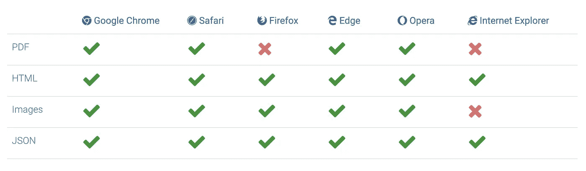

# 用 Javascript 打印文档的最简单方法——Print . js

> 原文：<https://levelup.gitconnected.com/the-easiest-way-to-print-documents-with-javascript-print-js-cd512594a98c>

一个极小的 javascript 库使得从网络上打印变得非常简单。


弗洛里安·克劳尔在 [Unsplash](https://unsplash.com?utm_source=medium&utm_medium=referral) 上拍摄的照片

Print.js 主要是为了帮助我们直接在应用程序中打印 PDF 文件而编写的，不需要离开界面，也不需要使用嵌入。对于用户不需要打开或下载 PDF 文件，而只需要打印它们的特殊情况。例如，当用户请求打印服务器端生成的报告时，这是非常有用的。这些报告以 PDF 文件的形式发回。在打印之前，不需要打开这些文件。Print.js 提供了一种在我们的应用程序中打印这些文件的快捷方式。

# 1)下载并安装

你可以从 GitHub 版本下载 Print.js 的[最新版本](https://github.com/crabbly/Print.js/releases/tag/v1.2.0) ( [v1.2.0](https://github.com/crabbly/Print.js/releases/tag/v1.2.0) )或者使用下面给出的两个步骤之一，这取决于你的包管理器。

*   要使用 npm 进行安装:

```
*npm install print-js --save*
```

*   使用纱线安装:

```
*yarn add print-js*
```

通过 npm 或 yarn 安装之后，在开始使用它之前，您应该将这个库导入到您的项目中，如下所示。

```
*import print from 'print-js'*
```

# 2)开始使用

*   首先，我们需要在页面上包含 Print.js 库:

```
*<script src="print.js"></script>*
```

*   如果您将使用模式功能，还需要在页面上包含 Print.css:

```
*<link rel="stylesheet" type="text/css" href="print.css">*
```

就是这样。现在可以在页面中使用 Print.js 了。

> 在编写您的 javascript 代码时，请记住库占用了一个全局变量 **printJS** *。*

# 3)使用 Print.js

现在，我们已经正确安装并导入了库，让我们开始使用它。

使用 Print.js 可以打印 4 种类型的文档:

i) PDF *(默认)*

它的基本用法是调用 **printJS()** 并只传入一个 PDF 文档 URL:

```
*printJS('docs/PrintJS.pdf')*
```

ii) HTML

要打印 HTML 元素，以类似的方式，传入元素 id 并键入:

```
*printJS('myElementId', 'html')*
```

iii)图像

对于图像文件，想法是相同的，但是您需要传递第二个参数:

```
*printJS('images/PrintJS.jpg', 'image')*
```

四)JSON

打印 JSON 数据时，传入想要打印的数据、类型和数据属性:

```
*printJS(
         {
           printable: myData, 
           type: 'json', 
           properties: ['prop1', 'prop2', 'prop3']
         }
)**;*
```

# 4)示例

理论讲够了，现在让我们看看一些有用的插图，看看我们如何使用这个库在我们的网页上完成一些好的打印工作:

**1。打印一个 HTML 表单**

Print.js 接受带参数的对象。现在让我们打印一个带有自定义标题的 HTML 表单:

使用 Print.js 打印带标题的 HTML 表单

**2。打印图像**

为了一起打印多个图像，我们可以传递一个图像数组。我们还可以传递要应用于每个图像的样式:

使用 Print.js 一起打印多个样式的图像

**3。打印 JSON 数据**

使用 Print.js 将 JSON 数据打印成表格

**4。打印样式化的 JSON 数据**

现在，我们可以向数据表添加自定义样式，并通过发送对象数组来自定义表头文本:

以表格形式打印样式化的 JSON 数据

**5。打印 PDF 时处理错误**

您还可以使用 print.js 提供的 onError()方法处理错误，并使用警报将它们显示给用户，如下例所示:

Print.js 错误处理

# 5)浏览器兼容性

由于 print.js 是一个相当新的库，因此，目前并不是所有的库特性都能在浏览器之间工作。然而，大多数主流浏览器都支持这个神奇的库允许我们打印的所有文档类型。以下是使用这些主要浏览器的最新版本进行的测试结果:



演职员表:[https://printjs.crabbly.com/](https://printjs.crabbly.com/)

这些测试是使用由 [BrowserStack](https://www.browserstack.com/) 提供的跨浏览器测试工具完成的。

所以，这就是这个有用的 Javascript 库。我希望本文提供的信息能够为您提供价值，并帮助您简化和优化 web 应用程序的未来打印任务。

> 参考资料:
> 
> 在 https://printjs.crabbly.com/[阅读更多关于 Print.js 的信息](https://printjs.crabbly.com/)

最初发布于:

[](https://www.theimmigrantprogrammers.com/p/the-easiest-way-to-print-documents) [## 用 Javascript - Print.js 打印文档的最简单方法

### Print.js 主要是为了帮助我们直接在应用程序中打印 PDF 文件，而无需离开界面，并且…

www.theimmigrantprogrammers.com](https://www.theimmigrantprogrammers.com/p/the-easiest-way-to-print-documents)