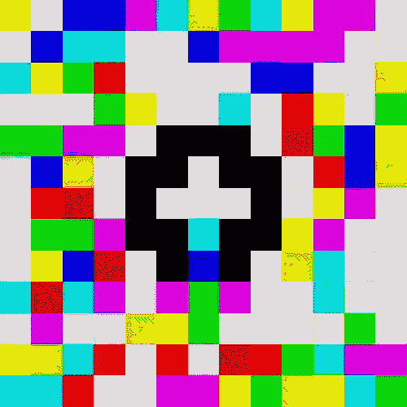
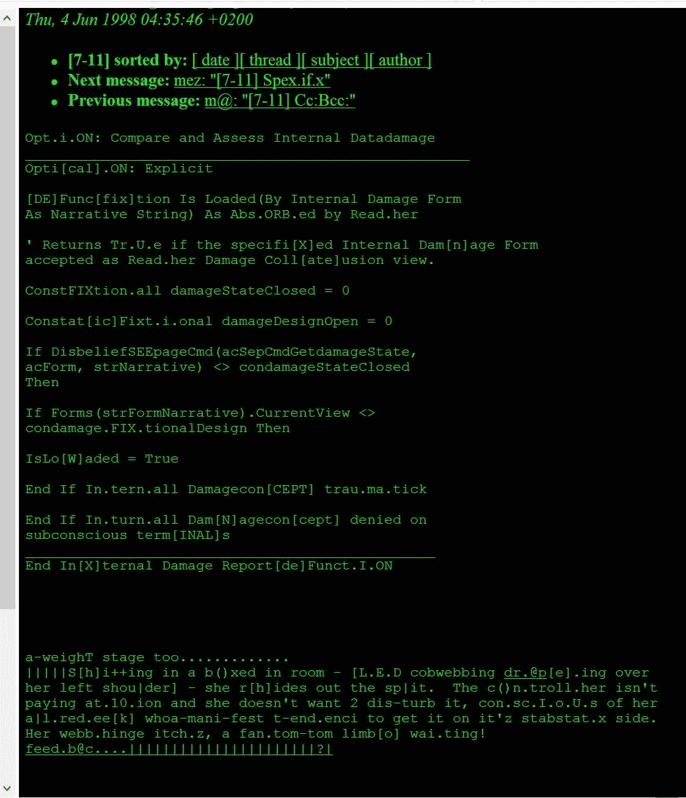

# 深奥的编程语言令人欣喜若狂的奇异世界

> 原文：<https://levelup.gitconnected.com/the-ecstatic-exotic-world-of-esoteric-programming-languages-b4d5c5b3cd6c>



“你好世界！”用深奥的编程语言 ***Piet***

回到学校，我学习文学和语言。在那段时间和之后的许多年里，我通过继续定期阅读、大量写作和教几年英语来培养自己对单词的欣赏能力——同时也学会了一些新的语言。

现在，作为一名初出茅庐的软件工程师，这个旅程还在继续。我学习语言的目的还是一样的，但是我只是碰巧和计算机硬件交流而不是和其他人交流。然而，编程语言被**设计成一组产生特定输出**的正式指令。虽然传统编程语言通常被设计成通过解决特定挑战来使与计算硬件的接口更容易，但是世界上存在一部分人出于完全不同的原因来设计编程语言。

输入 [**深奥的编程语言**](https://en.wikipedia.org/wiki/Esoteric_programming_language#CITEREFCox2013) **。**有时简称为 **esolangs，**深奥的语言是为了**测试计算机编程语言设计的边界，作为概念的证明，作为软件艺术，作为其他语言的黑客接口，作为笑话。尽管传统编程语言在功能上非常重要，但我总会被许多非传统的、创造性的方式所吸引，以巧妙的、实验性的、颠覆性的、甚至荒谬的方式使用常用工具。**

Esolangs 占据了一个艺术的表达空间，作为一种方式**“将注意力从命令和控制转向文化表达和拒绝”**[**【11】**](https://en.wikipedia.org/wiki/Esoteric_programming_language#CITEREFCox2013)**同样，Ebonics 在美国词典中的演变是一种隐含的行为，以转换和拥有一种压迫性权力的语言，或者像*《爱丽丝漫游奇境记》*这样的经典作品中的组合词 Lewis Carroll 是开玩笑的创造性行为。**

**对我来说，esolangs 的解构方面让人回想起从约翰·凯奇的作品到埃里克·安德烈的荒诞幽默，所以尽管我们肯定可以深入这个主题及其与艺术和交流的整体关系，让我们后退一步，欣赏一些有趣的深奥语言的例子！**

# **梅赞盖勒**

****

**1998 年 7-11 邮件列表上的一篇 Mezangelle 文章**

**比起真正的编程语言， [**mezangelle** 是一种诗意艺术语言，由澳大利亚的互联网艺术家 Mez Breeze(玛丽-安妮·布雷兹)在 20 世纪 90 年代开发。](https://en.wikipedia.org/wiki/Mezangelle)通过混合英语、ASCII 艺术、来自编程语言源代码的片段、标记语言、正则表达式和 IRC 速记、表情符号、语音拼写和俚语，它通过操纵音节和词素来重新混合英语和计算机代码的基本结构。通过这种方式，它将单词和字母从离散的数字单位转换成流动的准模拟信息。这种流动性和流动符合其在电子邮件张贴中的艺术用途。**

# **脑残**

```
++++++++++**[**>+++++++>++++++++++>+++<<<-**]**>++**.**>+**.**+++++++
**..**+++**.**>++**.**<<+++++++++++++++**.**>**.**+++**.**------**.**--------**.**>+**.**
```

**以其极端简约而闻名的, [Brainf**k](https://en.wikipedia.org/wiki/Brainfuck) 于 1993 年创建，仅包含八个不同的字符，每个字符都是直接在内存上操作的命令。例如，上面的程序输出“Hello World！”。**

# **插入**

```
**DO** ,1 <- #13
PLEASE **DO** ,1 **SUB** #1 <- #238
**DO** ,1 **SUB** #2 <- #108
**DO** ,1 **SUB** #3 <- #112
**DO** ,1 **SUB** #4 <- #0
**DO** ,1 **SUB** #5 <- #64
**DO** ,1 **SUB** #6 <- #194
**DO** ,1 **SUB** #7 <- #48
PLEASE **DO** ,1 **SUB** #8 <- #22
**DO** ,1 **SUB** #9 <- #248
**DO** ,1 **SUB** #10 <- #168
**DO** ,1 **SUB** #11 <- #24
**DO** ,1 **SUB** #12 <- #16
**DO** ,1 **SUB** #13 <- #162
PLEASE **READ** **OUT** ,1
PLEASE GIVE UP
```

**作为一种旨在讽刺当时编程语言的模仿语言，[没有发音缩写的**编译器——也称为**INTERCAL****](https://en.wikipedia.org/wiki/INTERCAL)——是深奥语言最著名的例子之一。设计成尽可能的迟钝和可笑(如在“Hello World！”该语言的一个特别有趣的方面是，如果没有使用足够/太多的 PLEASE 关键字，程序会弹出“不够礼貌”或“过度礼貌”的错误。**

# **LOLCODE**

```
HAI 1.2
CAN HAS STDIO?
VISIBLE "HAI WORLD!"
KTHXBYE
```

**作为互联网的产物，这款绝对是我的最爱之一。通过对在线猫模因语言进行重新语境化编程，诞生了 [**LOLCODE**](https://en.wikipedia.org/wiki/LOLCODE) 。令人惊讶的可读性，你需要做的就是快速浏览它的一些语句，了解它是如何操作的:**

**`HAI [VERSION]`在所有 LOLCODE 节目中，海(“嗨！)介绍程序并指定版本(尽管实际上还没有使用)。**

**`CAN HAS [LIBRARY]?`在许多编程语言中，第一个语句之一将是输入和输出等常见函数的库包含。**

**`VISIBLE [MESSAGE]`将信息打印到屏幕上。**

**`KTHXBYE`正如`HAI`介绍节目一样，`KTHXBYE`(是“K”、“THX”、“拜拜”三个字串在一起，意为“好的，谢谢，拜拜”)终止节目。**

# **莎士比亚编程语言**

```
The Infamous Hello World Program.

Romeo, a young man with a remarkable patience.
Juliet, a likewise young woman of remarkable grace.
Ophelia, a remarkable woman much in dispute with Hamlet.
Hamlet, the flatterer of Andersen Insulting A/S.

                    Act I: Hamlet's insults and flattery.

                    Scene I: The insulting of Romeo.

[Enter Hamlet and Romeo]

Hamlet:
 You lying stupid fatherless big smelly half-witted coward!
 You are as stupid as the difference between a handsome rich brave
 hero and thyself! Speak your mind!

 You are as brave as the sum of your fat little stuffed misused dusty
 old rotten codpiece and a beautiful fair warm peaceful sunny summer's
 day. You are as healthy as the difference between the sum of the
 sweetest reddest rose and my father and yourself! Speak your mind!

 You are as cowardly as the sum of yourself and the difference
 between a big mighty proud kingdom and a horse. Speak your mind.

 Speak your mind!

[Exit Romeo]

                    Scene II: The praising of Juliet.

[Enter Juliet]

Hamlet:
 Thou art as sweet as the sum of the sum of Romeo and his horse and his
 black cat! Speak thy mind!

[Exit Juliet]

                    Scene III: The praising of Ophelia.

[Enter Ophelia]

Hamlet:
 Thou art as lovely as the product of a large rural town and my amazing
 bottomless embroidered purse. Speak thy mind!

 Thou art as loving as the product of the bluest clearest sweetest sky
 and the sum of a squirrel and a white horse. Thou art as beautiful as
 the difference between Juliet and thyself. Speak thy mind!

[Exeunt Ophelia and Hamlet]

                    Act II: Behind Hamlet's back.

                    Scene I: Romeo and Juliet's conversation.

[Enter Romeo and Juliet]

Romeo:
 Speak your mind. You are as worried as the sum of yourself and the
 difference between my small smooth hamster and my nose. Speak your
 mind!

Juliet:
 Speak YOUR mind! You are as bad as Hamlet! You are as small as the
 difference between the square of the difference between my little pony
 and your big hairy hound and the cube of your sorry little
 codpiece. Speak your mind!

[Exit Romeo]

                    Scene II: Juliet and Ophelia's conversation.

[Enter Ophelia]

Juliet:
 Thou art as good as the quotient between Romeo and the sum of a small
 furry animal and a leech. Speak your mind!

Ophelia:
 Thou art as disgusting as the quotient between Romeo and twice the
 difference between a mistletoe and an oozing infected blister! Speak
 your mind!

[Exeunt]
```

**乔恩·奥斯伦德和卡尔·哈塞尔斯特伦创造的 [**莎士比亚编程语言(SPL)**](https://en.wikipedia.org/wiki/Shakespeare_Programming_Language) 旨在看起来像一部莎士比亚戏剧。这是我最大的两个兴趣的奇妙结合，这种语言充当了一种非常冗长的汇编语言:栈用字符列表声明，而它们之间的对话操纵它们的值，问题表现为条件。上面的程序演示了这种冗长，输出“Hello World！”。**