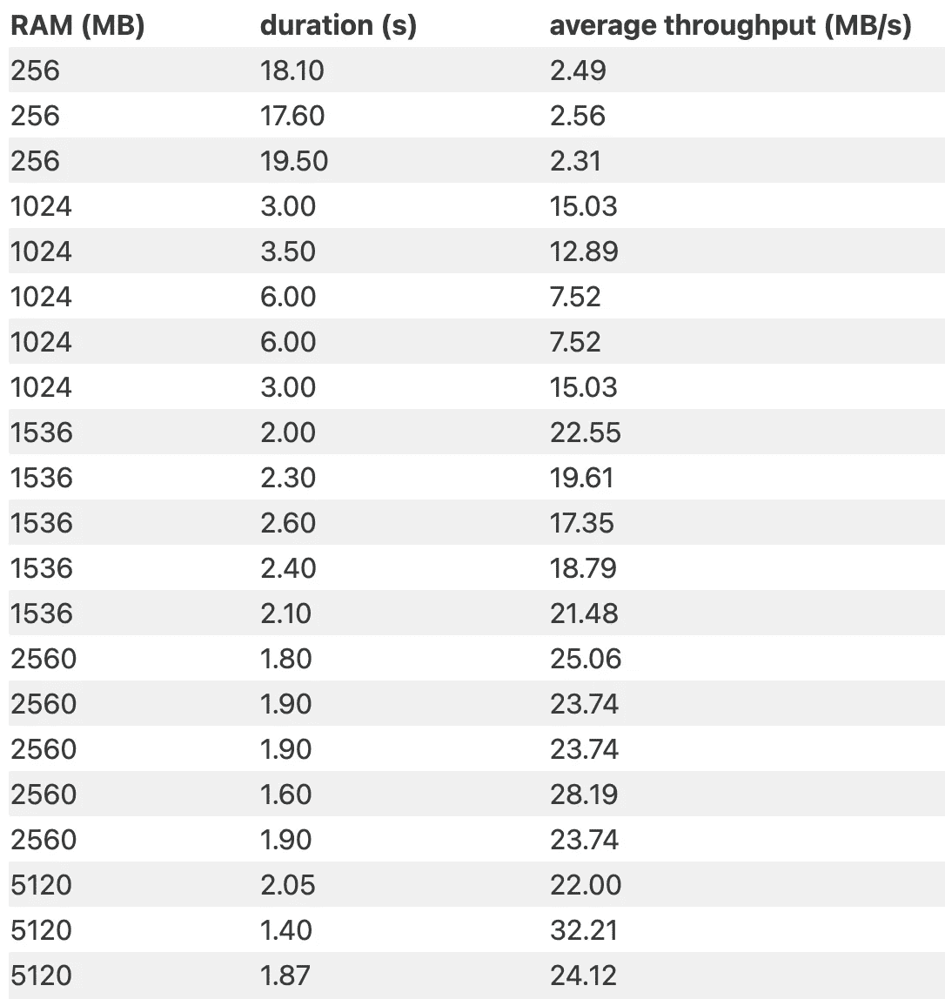
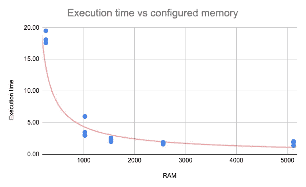

# 内存配置对 AWS Lambda 网络吞吐量的影响

> 原文：<https://levelup.gitconnected.com/the-effect-of-memory-configuration-on-aws-lambdas-network-throughput-410bde99127>

由后端/全栈开发者 Geert Van Wauwe 编写

**本帖将调查各种内存配置对 AWS Lambda 感知网络吞吐量的影响。简要介绍了 AWS Lambda，分析了固定大小图像上传过程中的吞吐量。最后，我会做一个成本分析，总结调查结果。**

# 什么是 AWS Lambda？

AWS Lambda 是 AWS 对无服务器功能的实现。可以执行自定义代码的短期容器。它允许您快速移动，而不必配置服务器以及随之而来的维护负担。哦，你只为你的代码实际执行的时间付费。有什么不爱？

# 问题:Lambda 的吞吐速度慢

AWS Lambda 可能是我最喜欢的 AWS 服务，三年多来我一直在广泛使用它。最近，我注意到一些奇怪的事情。一个将图像内容从 A 传输到 B 的 Lambda 函数通常需要 50 多秒才能完成。

这个 Lambda 函数的代码是用 Python 写的。Lambda 具有 VPC 配置，并配置有`256 MB`内存。

平均传输的图像大小约为`20 MB`，所以我预计大多数执行会很快结束。最多 2 到 3 秒。仔细检查这些指标，我注意到 50 秒的持续时间并不算异常。这里肯定有事发生。

遗憾的是，关于 Lambda 网络吞吐速度的文档非常有限。这篇[博文](https://aws.amazon.com/blogs/compute/operating-lambda-performance-optimization-part-2/)简要提到:

> *通常，当内存增加时，CPU 绑定的 Lambda 函数受益最大，而网络绑定的受益最小。*

然而，大多数文档都关注 Lambda 内存和 CPU 之间的关系。不是一个有希望的开始…但网络吞吐量似乎太低，增加内存值得一试。将内存从`256 MB`增加到`5120 MB`会立即导致 Lambda 持续时间的严重下降。

配置的内存会影响执行时间，但影响有多大呢？让我们做一个实验

# 实验

为了使测试具有可重复性，我在每次测试中都使用了相同的`45 MB`图像。我只改变了 lambda 函数的内存。我对每种内存配置运行了多次测试，以获得良好的平均持续时间。基于`45 MB`图像计算平均吞吐量。

# 结果呢

# 图示

# 结果的解释

一个人不需要成为数学天才就能明白这是怎么回事。增加 AWS Lambda 函数的内存可以显著提高吞吐量。这些实验结果表明，AWS Lambda 的网络吞吐量受到内存配置的影响，这里简单提到了。然而，正如在[文档](https://docs.aws.amazon.com/lambda/latest/dg/configuration-function-common.html#configuration-memory-console)中提到的，由于增加内存也会增加 CPU，CPU 仍然有可能是瓶颈。

# 成本分析

AWS Lambda 会为您使用的每一个 GB-s 向您收取费用 1。因此，增加内存(即 GB-s 的 GB 部分)会增加成本。但是，这可以通过减少 Lambda 执行时间(GB-s 的 s 部分)来抵消。通过将内存从`256 MB`增加到`1536 MB`，由于执行时间减少，成本下降。

# 利益

*   更快的执行时间
*   降低成本
*   下限 lambda 超时
*   可能更快重试

增加 Lambda 函数的内存会显著提高 CPU 能力和网络吞吐量。

*脚注*

*1:这并不完全正确，您不需要为 Lambda 函数的初始化付费。*

*原载于 2022 年 4 月 7 日 https://www.softwareconviction.com***。**