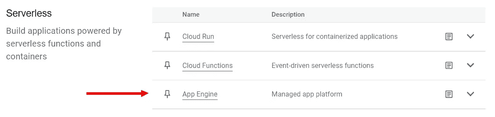
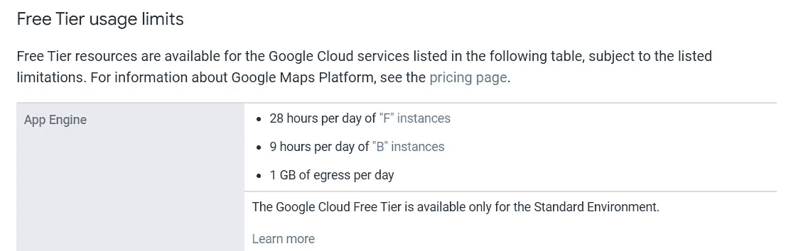
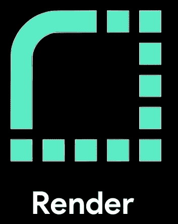
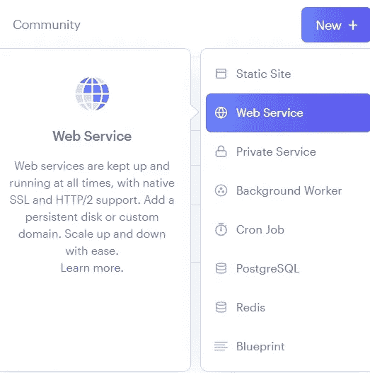
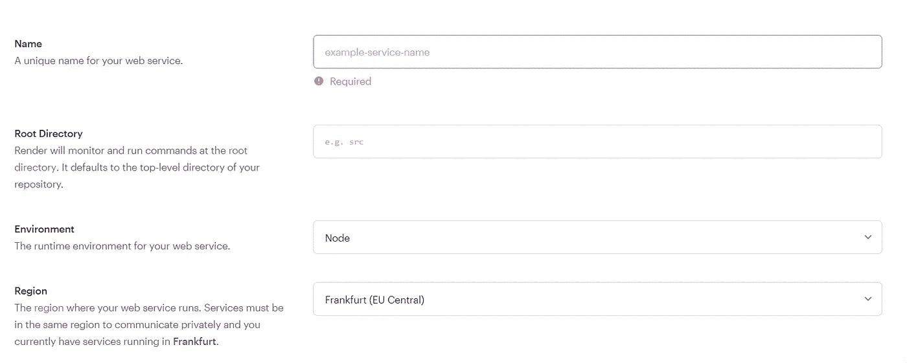
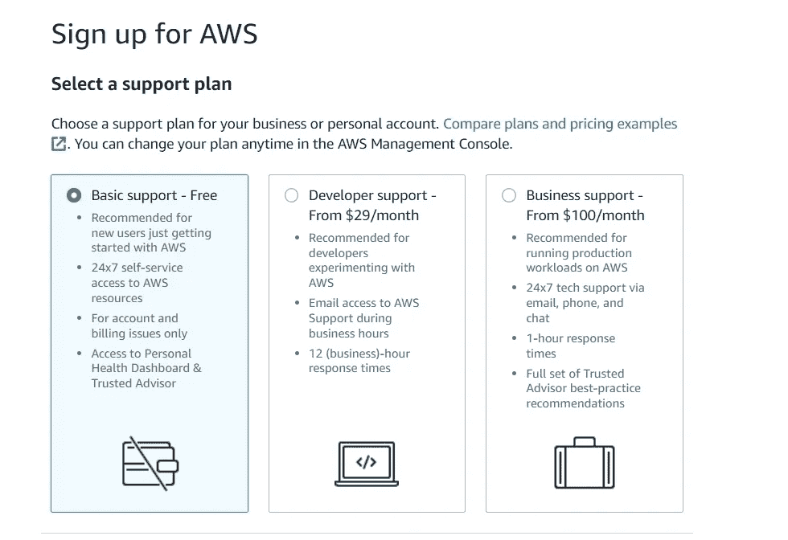
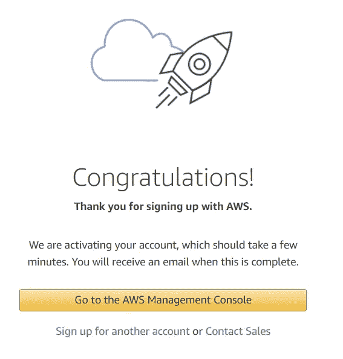
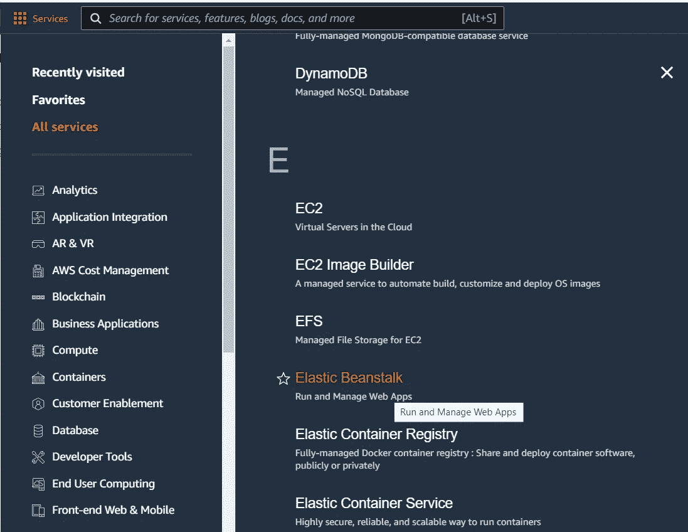

# Heroku 免费 Dynos 的终结

> 原文：<https://levelup.gitconnected.com/the-end-of-free-dynos-at-heroku-272fdf2d78c4>


由 [Unsplash](https://unsplash.com?utm_source=medium&utm_medium=referral) 上的[路博宣礼塔](https://unsplash.com/@bubo?utm_source=medium&utm_medium=referral)拍摄的照片

你在这里是因为你听到了这个消息。

如果你没有，请做好准备。

在 8 月 25 日的一份声明中，Herkou 在他们的博客上发表了一篇[帖子](https://blog.heroku.com/next-chapter)，声明:

> 从 2022 年 10 月 26 日开始，我们将开始删除不活动的帐户以及不活动超过一年的帐户的相关存储。从 2022 年 11 月 28 日开始，我们计划停止提供免费产品计划，并计划开始关闭免费的 dynos 和数据服务。我们将向受影响的用户发送一系列电子邮件。

是啊，糟透了。😢

如果你和我一样，在 Herkou 上分享了免费的 dynos，你需要开始考虑把它们迁移到其他地方。如果你想的话，你显然可以付钱保留你的 dynos。但是，我有一种感觉，你会去寻找另一个自由的 SaaS。

你很幸运，我也处于同样的困境，我没有等待 11 月的到来(太快了)，而是寻找了其他的选择。

这将是您选择将 dynos 迁移到哪里的一站式商店。

Heroku 并不是第一个将他们的解决方案推向市场的公司，随着时间的推移，越来越多的公司涌现出来，可以提供类似的工具集。我的大部分 Heroku 项目都是 Node.js 应用程序，所以我也将讨论支持它的选项。

> ✋:我假设你已经有一个需要迁移的项目，所以我们不会在这里讨论如何创建项目。

为了确保我们(尽可能地)进行同类比较，我将根据以下特征比较 Heroku 的每项服务:

*   设置(以及多长时间/多复杂)
*   自由层计划限制
*   部署

我喜欢 Heroku 的一点是，由于它的免费计划，你有 5 台 dynos(服务器),可以非常简单地将你的代码部署到其中任何一台服务器上。当然，dynos 在关闭之前保持活动 15 分钟(如果没有请求进来)，但是对于我的用例来说，这已经足够好了。

## 这么多选择

首先上来， ***谷歌云 App 引擎*** 。毫不奇怪，谷歌也在这个市场，他们提供的服务在性质和选项上与他们的许多其他服务相似。

与 Heroku 不同的是，在 Heroku 你可以选择一个免费的等级计划，然后开始设置，而在 Google，设置是预先设置好的。您必须首先设置您的帐单帐户。这不是一个漫长的过程，但它需要您将信用卡与您的帐户关联起来。

> ⚠️在你设置好付费账户之前，你将无法设置你的项目。因为本文的主要焦点是应用程序的设置，所以我们不会讨论如何设置。你可以在这里看到一个解释如何做到这一点的视频[。](https://www.youtube.com/watch?v=NeRYUoR4u0s)

一旦你有你的帐单帐户设置，我们实际上可以开始设置我们的项目。

1.  在 Google Cloud 中创建项目
2.  点击左侧窗口中的查看所有产品
3.  向下滚动到无服务器，并选择应用引擎



4.安装 SDK

5.安装 CLI

6.创建一个. yaml 文件

7.运行命令

```
gcloud app deploy
```

很简单，对吧？

我们必须谈谈自由层计划。本质上，这听起来可能与 Heroku 所提供的相似，但这与现实相去甚远。谷歌云的免费层提供了对许多谷歌云产品的有限访问，包括应用引擎。在此免费层中，有一些使用限制:



[https://cloud . Google . com/free/docs/free-cloud-features # free-tier-use-limits](https://cloud.google.com/free/docs/free-cloud-features#free-tier-usage-limits)

要加入自由层，您必须符合以下标准:

1.  您没有与 Google 协商的定价合同或自定义费率卡

2.您正处于[免费试用](https://cloud.google.com/free/docs/free-cloud-features#free-trial)期，或者您已将您的云付费帐户升级为付费帐户

3.您的云付费帐户有效且信誉良好

确保遵守所有这些规则。在为我的项目做了所有的准备工作后，由于使用非常非常有限，我已经收到了账单。虽然是以便士为单位，但你可以想象出趋势的走向。



二、 ***渲染*** 。

Render 是市场上相对较新的参与者，因为它是在 2019 年开始的。它通过[声明](https://render.com/render-vs-heroku-comparison)将自己定位为 Heroku 的直接竞争对手:

> “我们构建了 Render 来帮助开发人员和企业避免 Heroku 等传统平台即服务解决方案的成本和不灵活性陷阱。我们的客户经常告诉我们，Render 就是 Heroku *本可以成为的样子。”*

不足为奇的是，他们甚至有一份从 Heroku 文档中移植过来的文档。

考虑到这一点，有必要看看 Render 是否真的如其所言。

创建帐户后，托管 Node.js 应用程序非常简单。

1.  按下新➕按钮



1.  选择 Web 服务
2.  您可以连接您的 Github/GitLab 帐户或您的公共存储库
3.  为您的应用程序定义以下设置:

*   您的 web 服务的名称
*   web 服务运行的区域
*   启动命令
*   选择免费计划



4.单击创建 Web 服务

5.观察您的部署进展

很简单！

Render 有一个免费的计划，也有它的限制。渲染状态:

> 使用 Render 的免费计划，您可以免费运行 web 服务和 PostgreSQL 数据库。免费计划有使用限制，旨在帮助您探索新技术、构建个人项目以及预览 Render 开发人员体验。免费网络服务每月可以使用多达 400 小时的免费构建时间，与静态网站共享。

关于这些限制的完整解释可以在[这里](https://render.com/docs/free#free-web-services)找到，关于建造限制的解释可以在[这里](https://render.com/docs/build-limits)找到。

注意在自由计划中，构建时间将会更长更慢。


照片由[克里斯蒂安·威迪格](https://unsplash.com/@christianw?utm_source=medium&utm_medium=referral)在 [Unsplash](https://unsplash.com?utm_source=medium&utm_medium=referral) 上拍摄

三、 **AWS 弹性豆茎**。

关于 AWS 我觉得这里没什么好细说的。你可能知道他们提供的所有服务，选择托管 web 应用程序只是其中之一。这里的过程与你在谷歌所经历的非常相似，尽管少了些花哨。

在我们做任何事情之前，我们需要注册。这个过程不需要很长时间，但是需要你做以下事情:

1.  使用您选择的电子邮件和密码
2.  输入你的地址和电话号码
3.  为可能发生的各种账单输入信用卡
4.  通过发送验证码来验证您的电话号码
5.  选择支持计划



完成后，您将看到以下屏幕:



现在是时候创建我们的 Node.js 应用程序了。前往服务中心，搜索弹性豆茎。



点击**创建应用**按钮。从这里开始，您需要填写详细信息:

*   应用程序名称
*   站台
*   在应用程序代码下选择上传您的代码
*   选择源代码来源下的本地文件，并上传您的源代码
*   点击创建应用程序
*   观察您的部署进展

在这里，自由层也有限制，你最好去了解一下。

> [自由层限额](https://aws.amazon.com/free/?sc_channel=em&sc_campaign=wlcm&sc_publisher=aws&sc_medium=em_wlcm_3d&sc_detail=wlcm_3d&sc_content=other&sc_country=global&sc_geo=global&sc_category=mult&ref_=pe_3594660_521463690&all-free-tier.sort-by=item.additionalFields.SortRank&all-free-tier.sort-order=asc&awsf.Free%20Tier%20Types=*all&awsf.Free%20Tier%20Categories=*all)

由于亚马逊有太多的服务，在你创建账户后，它会提供长达一年的免费服务。很明显，在监视和管理 web 应用程序的方法上，这里有比看起来更多的东西。

我在这里只讨论了三种选择。其中两个是互联网生态系统的主要参与者。那里有更多的选择(或大或小)，我不希望你迷失在所有的选择中。选择权在你。每个服务提供商都有其优势和劣势，因此了解什么对您最重要至关重要。你喜欢更容易安装的东西吗？您的 web 应用程序需要使用其他组件吗？所有这些都会成为最适合你的选择。

对我来说，我选择了渲染，因为它给了我一切我需要的东西(暂时)，而且设置很容易。

你可以看看我在下面写的其他文章:

[](https://github.com/TomerPacific/MediumArticles) [## GitHub-tomer Pacific/medium articles:包含与各种…

### 一个包含与我所写的各种媒体文章相关的代码的存储库——GitHub…

github.com](https://github.com/TomerPacific/MediumArticles)