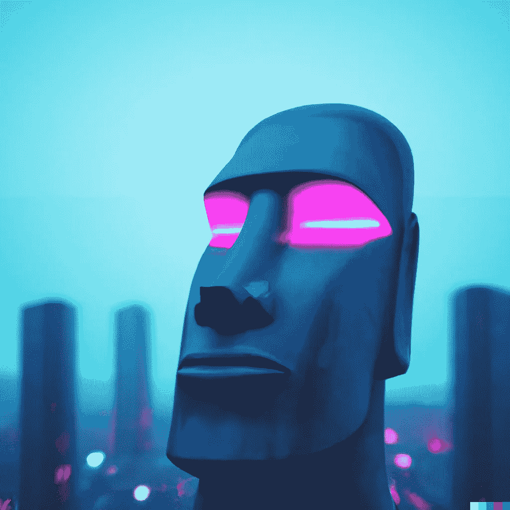
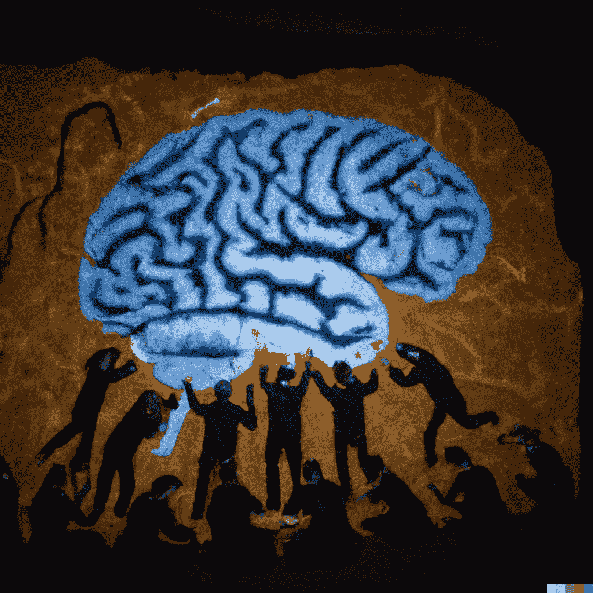

# 编程的终结

> 原文：<https://levelup.gitconnected.com/the-end-of-programming-6e3f7ff0d8b4>

经典计算机科学的末日即将到来，我们大多数人都是等待流星撞击的恐龙。

这篇文章中的所有艺术作品都是由 DALL-E 2 制作的。

我在 20 世纪 80 年代成年，在家里编写个人电脑程序，如 Commodore VIC-20 和 Apple。我在大学继续学习计算机科学，并最终在伯克利获得了博士学位，我的大部分专业训练都植根于我称之为“经典”的计算机科学:编程、算法、数据结构、系统、编程语言。在经典的计算机科学中，最终目标是将一个想法简化为一个由人类编写的程序 Java、C++或 Python 等语言的源代码。经典 CS 中的每一个想法——无论多么复杂或精密——从数据库连接算法到令人难以置信的迟钝的 Paxos 共识协议——都可以表达为人类可读、人类可理解的程序。

当我在 90 年代初上大学的时候，我们仍然处于人工智能的严冬，人工智能作为一个领域同样被经典算法所主宰。我在康乃尔的第一份研究工作是与计算机视觉领域的领军人物[丹·赫顿洛克尔](https://web.mit.edu/hutt/www/)(现任麻省理工学院计算学院院长)一起工作。大约在 1995 年，在丹的博士级计算机视觉课程中，我们从未讨论过类似深度学习或神经网络的任何东西——都是经典算法，如 Canny 边缘检测、光流和 Hausdorff 距离。深度学习处于起步阶段，尚未被认为是主流 AI，更不用说主流 CS 了。

当然，这是 30 年前的事了，从那以后发生了很多变化，但有一点没有真正改变，那就是计算机科学是作为一门以数据结构、算法和编程为核心的学科来教授的。如果 30 年后，甚至 10 年后，我们仍然以这种方式接近 CS，我会感到惊讶。事实上，我认为计算机科学作为一个领域正在经历一场我们很少有人真正准备好的巨变。

# 编程将会过时

我相信“编写程序”的传统观念正在走向消亡，事实上，除了非常专业的应用程序，大多数软件，正如我们所知，将被经过**训练的**而不是**编程的**人工智能系统所取代。在需要一个“简单”程序的情况下(毕竟，不是所有东西都需要一个运行在一群 GPU 上的数千亿参数的模型)，这些程序本身将由人工智能生成，而不是手工编码。

我不认为这个想法是疯狂的。毫无疑问，最早的计算机科学先驱，从(相对)原始的电子工程洞穴中走出来，坚定地认为所有未来的计算机科学家都需要对半导体、二进制算术和微处理器设计有深刻的理解才能理解软件。快进到今天，我敢打赌 99%的编写软件的人几乎不知道 CPU 实际上是如何工作的，更不用说晶体管设计背后的物理原理了。推而广之，我相信未来的计算机科学家将远离“软件”的经典定义，他们将很难逆转链表或实现快速排序。(见鬼，我不确定我自己是否记得如何实现 Quicksort。)

像 CoPilot 这样的人工智能编码助手只是触及了我所说的表面。对我来说，很明显*当然*未来所有的程序最终都将由人工智能编写，人类充其量只能扮演监督的角色。任何怀疑这一预测的人只需要看看人工智能内容生成的其他方面正在取得的快速进展，如图像生成。DALL-E v1 和 DALL-E v2(仅在 15 个月后发布)在质量和复杂性上的差异是惊人的。如果说我在过去几年的人工智能工作中学到了什么，那就是*很容易低估日益庞大的人工智能模型的力量。几个月前看起来像科幻小说的事情正在迅速成为现实。*

所以我说的不仅仅是[副驾驶取代程序员](https://blog.sigplan.org/2022/08/18/coping-with-copilot/)。我说的是**用训练模型**取代编写程序的整个概念。在未来，计算机专业的学生将不再需要学习诸如如何向二叉树添加节点或 C++代码这样的普通技能。那种教育将会过时，就像教工科学生如何使用计算尺一样。

未来的工程师们只需敲几下键盘，就能启动一个四万亿参数模型的实例，该模型已经编码了人类知识的全部范围(以及其中一些)，随时可以接受机器要求的任何任务。让机器做自己想做的事情的大部分智力工作将是提出正确的例子、正确的训练数据和评估训练过程的正确方法。能够通过少量学习进行归纳的适当强大的模型将只需要几个要执行的任务的好例子。在大多数情况下，人类管理的大规模数据集将不再是必要的，大多数人“训练”人工智能模型将不会在 PyTorch 或类似的程序中运行梯度下降循环。他们将通过实例进行教学，机器将完成剩下的工作。

在这门新的计算机科学中——如果我们称之为计算机科学的话——机器将是如此强大，并且已经知道如何做这么多事情，以至于这个领域看起来不像是一个工程领域，而更像是一个教育领域；也就是说，*如何最好地教育机器*，这与如何最好地教育在校儿童的科学没有什么不同。然而，与(人类)儿童不同，这些人工智能系统将驾驶我们的飞机，运行我们的电网，甚至可能管理整个国家。我认为，当我们的重点转向教授智能机器而不是直接给它们编程时，绝大多数经典计算机科学就变得无关紧要了。从传统意义上来说，编程实际上将会死亡。

# 所有这些如何改变我们对计算机科学领域的看法？

所有这些如何改变我们对计算机科学领域的看法？

新的计算原子单元不再是实现冯·诺依曼机器的处理器、内存和 I/O 系统，而是一个大规模、预训练、高度自适应的人工智能模型。这是我们对计算的思考方式的一次巨大转变——不再是一个可预测的、静态的过程，而是由指令集、类型系统和可判定性的概念来控制。基于人工智能的计算早已越过了服从静态分析和形式证明的卢比孔河。我们正迅速走向一个世界，在这个世界中，计算的基本构件是喜怒无常、神秘而又适应性强的代理。

没有人真正理解大型人工智能模型是如何工作的，这一事实强调了这种转变。人们正在[出版](https://arxiv.org/abs/2005.14165) [研究](https://arxiv.org/abs/2205.11916) [论文](https://arxiv.org/abs/2112.00114)实际上*发现现有大型模型的* *新行为*，尽管这些系统已经被人类“改造”过。大型人工智能模型能够做他们没有被明确训练过的事情，这应该会吓得 Nick Bostrom 和其他任何担心超级智能人工智能横行的人屁滚尿流。除了实证研究，我们目前没有办法确定当前人工智能系统的极限。至于更大更复杂的未来人工智能模型——祝你好运！

对于读过任何现代机器学习论文的人来说，焦点从程序到模型的转移应该是显而易见的。这些论文几乎没有提到他们创新背后的代码或系统；人工智能系统的构建模块是更高层次的抽象，如注意力层、标记器和数据集。即使是 20 年前的时间旅行者也很难理解这本长达 75 页的书中的三句话。)[描述为该模型构建的实际软件的 GPT 新协议论文](https://arxiv.org/abs/2005.14165):

> 我们使用与 GPT-2 [RWC+19]相同的模型和架构，包括其中描述的修改的初始化、预规范化和可逆标记化，除了我们在转换器的层中使用交替的密集和局部带状稀疏注意模式，类似于稀疏转换器[CGRS19]。为了研究 ML 性能对模型大小的依赖性，我们训练了 8 个不同大小的模型，从 1.25 亿个参数到 1750 亿个参数，范围超过三个数量级，最后一个是我们称为 GPT-3 的模型。先前的工作[KMH+20]表明，有了足够的训练数据，验证损失的缩放应该近似为作为大小函数的平滑幂律；许多不同规模的训练模型允许我们测试验证损失和下游语言任务的假设。

计算基础定义的这种转变带来了巨大的机遇，也带来了大量的巨大风险。然而，我认为是时候接受这是一个非常可能的未来，并相应地发展我们的思维，而不是坐在这里等待流星撞击。

## 侧边栏:我最近在忙什么？

我的长期读者会注意到我最近没怎么写博客。很抱歉。我有点忙。

大约三年前，我[离开谷歌](https://mdwdotla.medium.com/why-im-leaving-google-for-a-startup-88be418236d8)去了一家被苹果收购的[创业公司](https://mdwdotla.medium.com/startup-life-three-months-in-a6b9a494b00b)。随后，我离开苹果，在另一家初创公司领导工程部门工作了几年。在那段时间里，我学到了很多关于创业生活、构建人工智能系统和组建团队的知识。太棒了。

几个月前，我跳槽创办了自己的公司。我现在是人工智能领域一家秘密初创公司 [Fixie.ai](https://www.linkedin.com/company/fixie-ai/) 的联合创始人兼首席执行官，上面的博客文章可能代表也可能不代表这个新公司的一些想法。我们有一个非常棒的创始团队，我对我们将要取得的成就感到非常兴奋。在接下来的几个月里，我希望分享更多关于我们正在做的事情。在那之前，坚持住！