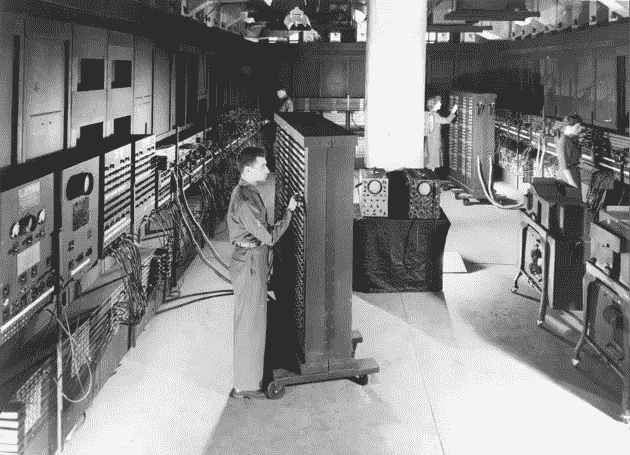

# ENIAC 程序员:为美国挽救了第二次世界大战的女性

> 原文：<https://levelup.gitconnected.com/the-eniac-programmers-women-who-saved-the-world-war-2-for-the-united-states-b93055cd119b>

## 就像电影故事一样。每个程序员都应该知道它们。

[由身份不明的美国军方摄影师拍摄——图片来自公共领域](https://commons.wikimedia.org/w/index.php?curid=978770)

Eniac 程序员，被遗忘者，正如他们所说，是一个在二战期间联合起来的程序员团体。在战争期间，大多数男人外出参战，并对身体所需的责任做出贡献。

因此，美国决定寻找有技能的女性人才。在整个过程中，妇女为多个部门做出了贡献，但最受认可的项目是电子数字积分器和计算机(ENIAC)。

美国物理学家**约翰·莫奇里**和**工程师 j·普雷斯珀·埃克特**发明了这台机器，而且是美国陆军资助的一个秘密项目。这台机器可以解决大型数值问题。但是操作 ENIAC 真的很难。

它有 18，000 个真空管，7，200 个晶体二极管，1，500 个继电器，70，000 个电阻器，10，000 个电容器，以及大约 5，000，000 个手工焊接接头。手动控制如此多的复杂性确实是一项艰巨的任务。士兵们需要 Eniac 来预测火炮和导弹的弹道，并使用结果来了解特定武器的目标。

# 程序员团队

由六名女性组成的团队负责 Eniac。在此之前，他们接受了为期六周的培训，在培训中，他们被告知要自己弄清楚机器是如何工作的，并教会他们策略和规划。

这台机器不像现代计算机。一切都是手工完成的。他们有大量的开关和电线要处理。六个女人在那个年龄能做到这一点简直是个奇迹。人们将永远记得它们是现代计算机的关键。

让我们看看 ENIAC 的六个程序员是干什么的。

## 让·詹宁斯

1924 年 12 月 27 日，Jean Jennings Bartik 是一名美国作家、经理、工程师和程序员。她是 Eniac 最初的程序员之一。她让 Eniac 计算她在宾夕法尼亚大学学习期间的弹道轨迹。

她是一名数学专业的学生，在 Eniac 团队的帮助下，她对许多编程基础知识的编纂做出了贡献。从 Eniac 毕业后，她继续为 BINAC 和 UNIVAC 的项目工作，并为许多公司工作。她在最后一天担任房地产经纪人，并于 2011 年因心力衰竭并发症去世。

## 玛琳·韦斯科夫·梅尔策

玛琳毕业于天普大学，是一名电脑程序员。她的专长包括天气计算、弹道轨迹、添加机器操作等。她于 1947 年结婚并从 ENIAC 辞职。

她做了许多志愿工作，包括在故事时间在图书馆服务，送餐，并且是一个她用来编织化疗帽的组织的财务主管。她在早期对 Eniac 的贡献没有得到太多的认可，但后来获得了几个奖项。她于 2008 年去世，享年 86 岁。

## 露丝·利奇特曼

李奇曼来自一个俄罗斯移民家庭。一名亨特学院的数学毕业生后来被宾夕法尼亚大学摩尔电气工程学院雇佣来计算弹道轨迹。

甚至在 ENIAC 项目出现之前，她就在那里和 80 名妇女一起工作。战后，当 ENIAC 被转移到阿伯丁试验场时，她和团队一起训练了下一代 ENIAC 程序员超过 2 年。后来，她被列入国际科技女性名人堂。

## **贝蒂·霍尔伯顿**

霍尔伯顿是一名计算机科学家，他发明了计算机编程中的断点和调试。在 40 年代，她开始学习新闻，因为她过去喜欢旅行。她是一个出色的问题解决者，被摩尔工程学院聘为计算机，并被选为 Eniac 的六名程序员之一。

后来，她在海军应用数学实验室担任高级编程主管，一直工作到 1966 年。她为 BIANC、COBOL 和 FORTRAN 编程语言开发了 C-10 指令集。她获得了计算机领域女性的最高荣誉——奥古斯塔·阿达·洛芙莱斯奖。她于 2001 年去世，享年 84 岁。

## **弗朗西丝·比拉斯**

弗朗西斯·比拉斯被认为是历史上最早的计算机程序员之一。她是一名数学家。从项目一开始，她就在 ENIAC 工作。

战后，她继续在 ENIAC 工作，直到她嫁给了 ENIAC 程序员 Homer W. Spence。然后她继续抚养三个孩子的家庭。她被列入国际科技女性名人堂。2010 年，纪录片《绝密蔷薇:二战的女性“计算机”》在六名 ENIAC 程序员中的三人身上拍摄，她就是其中之一。

## **凯莉·麦纽提**

凯瑟琳·丽塔·麦纽提是一名爱尔兰程序员和数学家。她是个数学天才。在学士学位期间，她选修了大学里提供的每一门数学课程。她的父亲是一名爱尔兰军官，后来成为一名石匠。

毕业几周后，她看到美国公务员正在招聘数学家。她马上申请了，结果是 ENIAC 项目。然后，她与另一名 ENIAC 程序员 Bilas 一起开发了一台差分分析仪。这也是一个革命性的计算器。那个时候最复杂的计算器是，在整个美国只有 3 或 4 个。

她后来在 1948 年嫁给了 ENIAC 的发明者 John Mauchly，并从 ENIAC 辞职。他们一共生了五个孩子。她的名字于 1997 年入选国际女性科技名人堂。即使在 ENIAC 之后，她仍然在文章中写关于他们的文章，并在节目中谈论他们。她于 2006 年死于癌症。

# **被遗忘者**

ENIAC 程序员没有得到他们应得的曝光率。ENIAC 计算机的发明者在技术公布后一夜成名，但使操作成为可能并为项目如此努力的人最初并没有得到认可。

当每个人都知道整个故事时，他们很晚才获得荣誉。他们为现代编程和计算奠定了基础。通过 ENIAC 项目，他们发明了许多后来被发现在关键程序和数学中有用的突破。

他们是真正走在时代前列的精英程序员和数学家。那时，妇女工作的机会有限。但是他们抓住了机会，将他们的知识应用到了像 ENIAC 这样的应用中。

ENIAC 团队是 2013 年获奖纪录片《计算机》的灵感来源。她们被命名为国际科技女性名人堂，其中一些人获得了女性编程的最高荣誉，阿达·洛芙莱斯奖。他们每个人都有能力，但他们总是作为一个整体被谈论，他们的工作仍然被认为是计算机科学史上最好的工作之一。