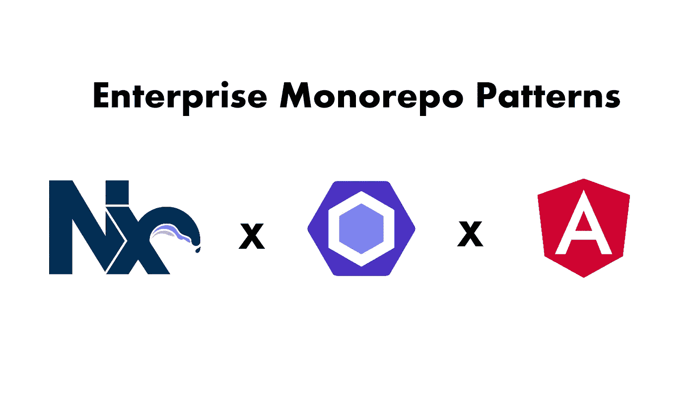
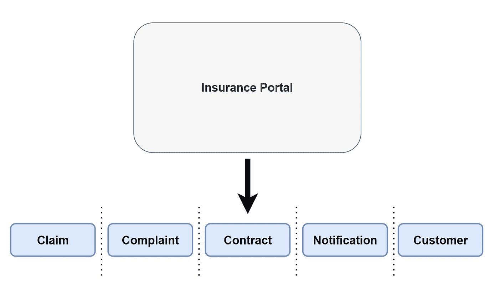
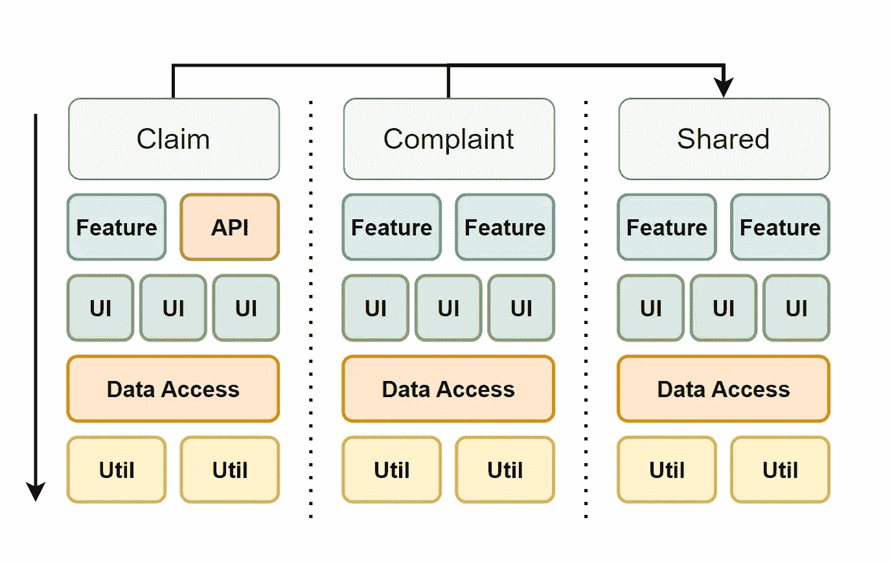

# 企业 Monorepo 角度模式

> 原文：<https://levelup.gitconnected.com/the-enterprise-monorepo-angular-patterns-407d4ad85fd0>

## 通过 Eslint 规则和企业单一回购模式充分利用 Nx 的潜力

[](https://ng-journal.com/blog/2022-12-19-the-enterprise-monorepo-angular-patterns/) [## 企业 Monorepo 角度模式

### Nx 是 monorepositories 的常用工具，也是 Angular 社区中构建……

ng-journal.com](https://ng-journal.com/blog/2022-12-19-the-enterprise-monorepo-angular-patterns/) 

**在**[**【ng-journal.com】**](http://ng-journal.com)免费阅读这篇 ng-journal 原文

Nx 是 monorepositories 的常用工具，并且是 Angular 社区中构建企业应用程序的佼佼者。Nx 有许多有助于扩展企业应用程序的出色特性，但其中最大的特性是 nx/enforce-module-boundaries 林挺规则(也经常被称为访问限制)。当设置正确时，它允许使用 linter 强制执行架构规则和自动验证。但是这些访问限制假设了一个非常特殊的结构，它遵循细粒度的水平和垂直切片。

# 水平切片

水平切片显然在每个企业应用程序中都非常重要，独立于企业 monorepo 模式。它只是将一个大的整体切割成子系统，通常被称为域或子域，特别是如果你遵循领域驱动设计的原则，例如战略设计，它提供了一些非常有用的工具来找到一个好的水平切割。在保险 CRM 的情况下，它管理索赔、合同、客户、投诉和通知，我们将把这个系统分成上述子域。



# 垂直切片

现在，考虑到之前确定的领域，我们可以在垂直级别上进一步划分应用程序。我们可以将每个域分成标记为特性、UI、数据访问、Util、API 的库。这意味着，每个域只是 Nx monorepo 中的一个目录，并且包含许多具有明确分离的库。一方面，这种垂直分隔很好，因为它给出了一个很好的结构，并准确地告诉你在哪里放什么。但这还不是它所能提供的全部，因为切片还允许设置访问限制，这样我们就可以控制依赖流。例如，UI 库不能依赖于功能或 API 库。



但是等一下。这些库类型实际上意味着什么？
- **功能**包含智能组件。
- **UI** 包含哑组件。
- **数据访问**包含实体、逻辑、服务、状态管理。
- **Util** 包含辅助函数。

在使用 Nx 时，将这些东西分成不同的库是很有意义的，因为每个库都可以在 project.json 中用自定义标签进行标记，并结合林挺规则，我们可以基于这些标签指定依赖规则。这样，就有可能制定一个规则，规定一个 UI 库不允许依赖于一个特性库。

另一个重要的库类型是 **API** ，它不包含任何东西，而是只充当一个代理，只公开一些东西。通常，不允许一个域访问另一个域的库，但是通过 API，我们可以打开一扇非常小的门，暴露出最少的内容，这样这些域就很少相互依赖。共享依赖的另一个解决方案是使用一个**共享内核**，它是自己的域，但是有一个特殊的规则，即每个域都被允许依赖于共享域。尽管共享域可以用来共享依赖项，但我建议使用 API，因为如果共享域变得越来越大，那么企业 monorepo 模式就失去了意义。

# Eslint 规则

设置好 project.json 中的标签后，我们现在必须在 eslintrc.json 中应用依赖约束。在@ nrwl/NX/enforce-module-boundaries 中，您只需为每个标签添加一个规则。因此，对于每个标记，您必须创建这样一个条目:

```
[...]
{
  "sourceTag": "type:ui",
  "onlyDependOnLibsWithTags": [
    "type:data-access",
    "type:util"
  ]
},
[...]
```

保险门户示例中组合的所有规则如下所示。此外，请仔细查看“domain:contract”的规则，因为它扩展了通用模式以及对某些 API 库的访问。

```
"@nrwl/nx/enforce-module-boundaries": [
  "error",
  {
    "enforceBuildableLibDependency": true,
    "allow": [],
    "depConstraints": [
      {
        "sourceTag": "type:app",
        "onlyDependOnLibsWithTags": [
          "type:api",
          "type:feature",
          "type:ui",
          "type:data-access",
          "type:util"
        ]
      },
      {
        "sourceTag": "type:api",
        "onlyDependOnLibsWithTags": [
          "type:ui",
          "type:data-access",
          "type:util"
        ]
      },
      {
        "sourceTag": "type:feature",
        "onlyDependOnLibsWithTags": [
          "type:ui",
          "type:data-access",
          "type:util",
          "type:api"
        ]
      },
      {
        "sourceTag": "type:ui",
        "onlyDependOnLibsWithTags": [
          "type:data-access",
          "type:util"
        ]
      },
      {
        "sourceTag": "type:data-access",
        "onlyDependOnLibsWithTags": [
          "type:util",
        ]
      },
      {
        "sourceTag": "domain:shared",
        "onlyDependOnLibsWithTags": ["domain:shared"]
      },
      {
        "sourceTag": "domain:claim",
        "onlyDependOnLibsWithTags": ["domain:claim", "domain:shared"]
      },
      {
        "sourceTag": "domain:contract",
        "onlyDependOnLibsWithTags": [
          "domain:contract",
          "domain:shared",
          "domain:claim/api-contract",
          "domain:complaint/api-contract"
        ]
      },
      {
        "sourceTag": "domain:notification",
        "onlyDependOnLibsWithTags": [
          "domain:notification",
          "domain:shared"
        ]
      },
      {
        "sourceTag": "domain:complaint",
        "onlyDependOnLibsWithTags": [
          "domain:complaint",
          "domain:shared"
        ]
      },
      {
        "sourceTag": "domain:customer",
        "onlyDependOnLibsWithTags": [
          "domain:customer",
          "domain:shared",
          "domain:notification/api-customer"
        ]
      }
    ]
  }
]
```

如果您现在违反了其中一个依赖约束，您将立即得到一个林挺错误。无论是从您的 IDE，还是通过自动化的 nx lint。


用户界面库中的林挺错误

# Nx 图

Nx 的另一个非常棒的工具是交互式 Nx Graph，它非常直观地向您显示所有的依赖关系。通过文件夹分组，我们可以很好地了解应用程序的当前架构，甚至可以关注特定的库。有了 Nx 15.3.0，我们现在甚至可以可视化**任务图**，如果你使用可构建库和远程 Nx 缓存，这可能会让你很感兴趣。阅读更多关于[增量构建](https://nx.dev/more-concepts/incremental-builds)的内容。


# 荣誉奖

# I. @angular-architects/ddd

这个 [@angular-architects/ddd](https://www.npmjs.com/package/@angular-architects/ddd) 包是一个非常流行的 nx 插件，它可以自动初始化 eslint 规则，并动态生成项目标签和林挺规则。它甚至通过应用 DDD 的最佳实践带来了更多的东西，例如将数据访问(或域逻辑)层分成更细粒度的层，实现 facade 模式。

# 二。企业 Monorepo 角度模式

最初，企业 Monorepo 角模式是由 Nitin Vericherla 和 Victor Savkin 在这本[书中介绍的。](https://go.nrwl.io/angular-enterprise-monorepo-patterns-new-book)

# 结论

总之，**企业 Monorepo 角度模式**已经得到很好的确立，并且是长期企业应用程序的最佳实践。这是因为它支持高度独立的子系统(或域),并强制执行林挺规则，避免架构冲突。总而言之，当设置正确时，它强制执行架构规则，并承诺一个很好的难以打破的分离。下一个合乎逻辑的步骤是建立一个远程 Nx 缓存，并使库可构建，这样构建性能会大大提高。请继续关注这个话题的后续阅读！

# 谢谢你🤗

感谢您阅读本文！我希望你喜欢它，并能学到一些新的和有趣的东西。
如果你还有任何问题，请不要犹豫，通过 [Twitter](https://twitter.com/StefanvHaas) 或 [LinkedIn](https://www.linkedin.com/in/stefan-haas-686a921b4/) 联系我进行讨论。
**还没订阅？**向下滚动，不再错过任何新文章。

# 开源代码库

点击以下链接查看 GitHub:

[](https://ng-journal.com/blog/2022-12-19-the-enterprise-monorepo-angular-patterns/) [## 企业 Monorepo 角度模式

### Nx 是 monorepositories 的常用工具，也是 Angular 社区中构建……

ng-journal.com](https://ng-journal.com/blog/2022-12-19-the-enterprise-monorepo-angular-patterns/)