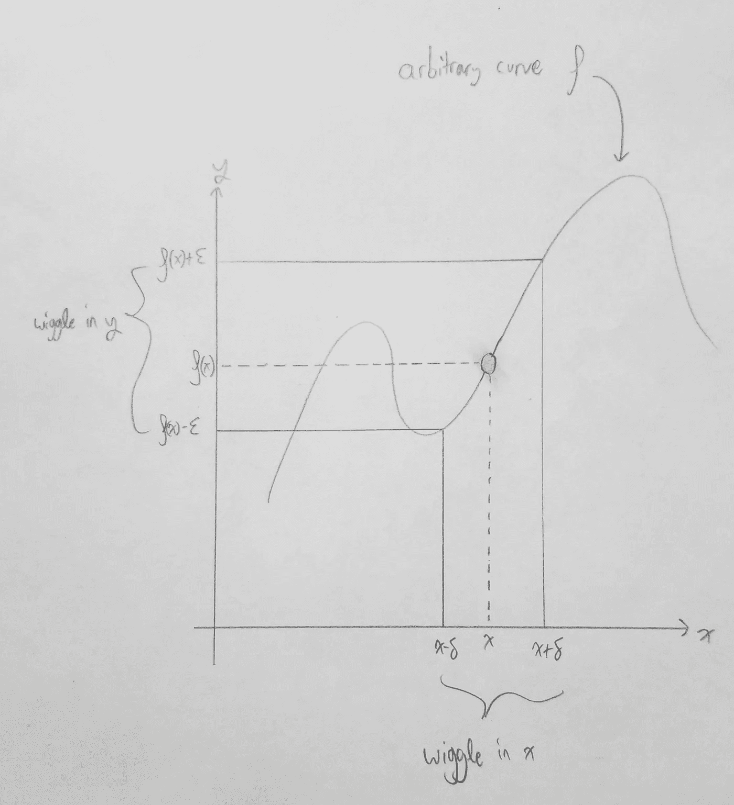

# Pythonista 的ε-δ证明和假设检验框架

> 原文：<https://levelup.gitconnected.com/the-epsilon-delta-proof-for-the-pythonista-264acf8b88f6>

*命题类型解释*声明*证明是程序*。这一点的意义主要适用于*函数式编程*，所以让我们首先用约束来限制 python 空间。

如果你只是来看看假设的实际情况，滚动一下吧！

1.  我们将处理*总函数*，意思是如果我说`def f(x: float) -> float:`，我的意思是你可以给`f` **任何**浮点。我可能使用的一个词汇是“签名”，在这种情况下，`f`的“签名”(或其“类型签名”或只是“类型”)是`float -> float`，意味着它的*输入*或*自变量*类型是`float`，它的*输出*或*返回*类型是`float`。
2.  我们将处理*纯函数*，这意味着如果我说`f`是一个函数，我的意思是**它的行为完全受其签名**的约束，我可以通过提供输入来测试它，不做任何其他事情。如果我需要通过模拟状态或运行无头浏览器来测试它，那么它就不是纯粹的*。*
3.  *总计*和*纯*的函数是**确定性的**，意味着任何人都可以在`2`、`f(2) == f(2)`调用`f`的每一个状态。如果`f(2) == 3`在您的控制台中是星期二，那么`f(2) == 3`在您的 CI 环境中是星期三。

你不太可能看到真实世界的软件完全遵守这些约束，但也不是不可能。然而，数学并不那么卑鄙。事实上，遵守这些约束让你的 python 更像数学:数学家所说的“函数”相当于函数式程序员所向往的约束。(再看一下决定论约束。现在回想一下前微积分中的“垂直线测试”。练习:两者有什么关系？)

## 极限的ε-δ概念

这不是一篇从头开始教授极限的博文。如果你只是想了解足够多的微积分来欣赏 python，那么在 KhanAcademy 上快速观看[这个视频。](https://youtu.be/-ejyeII0i5c)

简而言之，我们关心的是在`x`方向上*摆动*和在`y`方向上*摆动*之间的关系——一个对另一个施加约束吗？我们如何改进我们的摆动行为来更好地理解手边的功能？



这篇文章讨论了极限的ε-δ概念的语言逻辑结构，把几何学留给了其他资源。这个概念可以用符号*来表达*，事实上，如果你愿意，你可以独立于视觉来理解它。简而言之，将象征性地给出极限的定义，并从这个定义中提取一个证明策略。

采取一些距离函数`dist`——我们将使用以下定义的其余职位:

```
def dist(x: float, y: float) -> float: 
  return abs(x - y)
```

现在拿某个`f : D -> R`来说，它有一个定义域(可能是实数的区间子集)，它返回一个实数。(这有点像有一个 `*float*`的*返回类型)。您对`f`关于其定义域中某个数字`a`的行为感兴趣。*

```
the limit as x goes to a of f(x) == f(a) 
if and only if 
forall eps > 0, (there) exists delt > 0, (such that) forall x in D,       if dist(x, a) < delt then dist(f(x), f(a)) < eps
```

我们来复习一下*量词*。量词有两种——**全称量词**的意思是“代表每一个”或“代表所有”。我们说我们正在通过*量化一个集合/类型的所有*元素。另一类是**存在量词**，表示“存在”或“至少有一个”。量化可以被认为是一个*游戏*，你的对手出招，你也出招。你无法控制对手的走法(你无法控制*他们会选择哪个* `eps > 0`)，但你可以控制自己的走法(你可以*选择* a `delt > 0`)。

在极限的定义中，注意量词的*节奏。注意他们*交替* : `forall... exists... forall...`。这很关键。每个连续的量化变量*依赖于*之前的变量。所以当你看到`forall eps, exists delt, ...`的时候你就已经知道`delt`是“eps 的一个函数”，具体来说就是数字`delt`是输入`eps`的某个函数的输出。换句话说，当我的对手选择一个`eps`时，我可以在我的`delt`计算中*使用那个`eps`的*。最后，*命题* `if dist(x, a) < delt then dist(f(x), f(a)) < eps`是*依赖*于*之前的一切*。*

# 让我们开始将这个定义翻译成 Python。

你认为`forall eps`的 Python 含义是什么？练习:回顾到目前为止的帖子，思考 5 分钟(字面上的墙时间),试着预测我要做什么。

我会插入一段猴子喝果汁的视频，帮助你不要提前阅读。

回想一下我们的总体约束。根据总体约束，对于每个输入，在*上定义一个函数。所以如果你声明`def f(x: int) -> bool:`，你有义务确保它不会在-2895 或 42 或 57 上失败，因为那些都是`int`并且你声明你可以把*任何* `int`变成`bool`。我选择的斜体字泄露了吗？当你声明你可以将*任意* `A`转化为`B`时，你就是在声明你可以将*每* `A`转化为`B`，所以我们将`forall eps`类比为*函数声明*。*

```
# assume f, a are known and in scope 
def proof_scope_1(eps):
```

这是有道理的:当你写一个函数时，你不一定知道将要提供什么参数。如果你这样做，你会写常数而不是函数。正如一个函数在*编译时*不知道它的参数会是什么，你也不知道在*校对时*你的对手会怎么做。把调用函数的人*当成你的对手，而不是你。*

Python 的类型提示系统不够精炼，无法表达*正实数*，所以我完全省略了类型签名。如果我想，我可以写

```
def proof_scope_1(eps: float): 
  assert eps > 0
  ...
```

来表示`eps`是一个正实数，但它并不完全真实——那么函数就不会在其所有的输入类型上定义，因为它会在带有`AssertionError`的`eps = -1.0`上失败。

我们继续。

`forall eps > 0, exists delt > 0`:

```
# assume f, a are known and in scope
def proof_scope_1(eps): 
  # select some function `foo`
  delt = foo(eps)
```

当轮到你时，你可以选择一个数字，这个数字可能取决于`eps`。我们来观察一个例子。

假设`f = lambda x: m * x`为某常数`m`。稍后，我们将研究这个例子。现在，我只给那个*我们选择* `foo = lambda eps: eps / abs(m)`。既然`delt`可以是`eps`的任何函数，只要结果是严格正的，我们的任务就是选择*我们需要的`eps`的*函数。

让我们继续定义。`forall eps > 0, exists delt > 0, forall x in D`:

```
# assume f, a are known and in scope
def proof_scope_1(eps): 
  delt = foo(eps) # select an appropriate foo
  def proof_scope_2(x):
```

`forall`再次用`def`表示。

为了把它全部包含进来，我们将把核心命题表示为一个程序。程序将由量词限定范围，失败意味着你无法提供一个证明(你无法提供正确的`foo`)。

`if dist(x, a) < delt then dist(f(x), f(a)) < eps`:

```
if dist(x, a) < delt: 
  assert dist(f(x), f(a)) < eps
```

# 从程序中提取证明大纲

在本节中，我们将更仔细地检查`lambda x: m * x`示例。

我们将从底部开始，写下断言，看看我们是否能把它变成一个可行的表达式，并找到一个值`foo`。就是这样！

```
dist(f(x), f(a)) < eps # unfold dist, f 
abs(m*x - m*a) < eps # distributivity 
abs(m * (x - a)) < eps # a lemma about abs and multiplication 
abs(m) * abs(x - a) < eps # divide both sides by abs(m) 
abs(x - a) < eps / abs(m) # fold dist 
dist(x, a) < eps / abs(m) # our value of foo is lambda eps: eps / abs(m)
```

我们注意到`dist(x, a)`是条件句！换句话说，我们已经通过证明`if dist(x, a) < eps / abs(m): assert dist(f(x), f(a)) < eps`总是成功的代数向后工作。如果它使用了一个`bool`而不是`assert` ing，它将总是返回`True`

# 基于属性的假设测试

证明不是单元测试。但是在通过函数`defs`对进行了范围限定之后，我将这个命题表示为一个`assert`。我还想在一个比 python 的类型更有表现力的系统中展示一下*这段代码实际上是在运行*。

基于属性的测试是一种使单元测试尽可能像证据一样的自动化方法。今天，我们将使用测试框架[假设](https://hypothesis.readthedocs.io/en/latest/index.html)。从文件上看

```
Think of a normal unit test as being something like the following: 1\. Set up some data. 
2\. Perform some operations on the data. 
3\. Assert something about the result. 
Hypothesis lets you write tests which instead look like this: 
1\. For all data matching some specification. 
2\. Perform some operations on the data. 
3\. Assert something about the result. 
This is often called property-based testing, and was popularised by the Haskell library Quickcheck.
```

让我们来看看您的项目目录。我将假设你已经安装了 python 3，并且我不会涵盖虚拟环境(尽管你应该使用它们而不是随意地 T2)。

```
mkdir epsdelt && cd epsdelt 
pip install hypothesis 
vim line_is_continuous.py # text editor of your choice
```

在你喜欢的文本编辑器中，开始粘贴上面的函数和嵌套函数。然后，在顶部插入以下导入内容

```
from hypothesis import given
from hypothesis.strategies import floats
```

假设的工作原理是*用数据生成指令以简单明了的语法修饰你的函数。*

如果我们想测试严格的正浮点数`eps`，我们继续:

```
@given(eps=floats().filter(lambda x: x > 0))
def proof_scope_1(eps): 
  ...
```

让我们用一些紧凑的区间`D`，表示为一个左端点和右端点的元组。

```
 ...
  @given(x=floats().filter(lambda x: D[0] <= x <= D[1]))
  def proof_scope_2(x): 
    ...
```

现在称你为“测试”

```
if __name__=='__main__': 
  proof_scope_1()
```

您不需要提供任何参数，因为装饰者会为您处理它。

在您的 shell 中，您现在可以运行`python line_is_continuous.py`来查看我是否对您隐瞒了`foo`的值！

实际上，Hypothesis 希望我们更改一些设置，我将增加测试输出的详细程度。完整的文档如下所示。

上面，我提到类型提示不能表达我感兴趣的东西。在 python 中，我没有严格的正浮点数类型。另一方面，假设允许我用它的`.filter(lambda`语法来表达这一点。

您现在已经:

*   亲身经历了逻辑作用域和编程作用域之间的类比(主要是通过将`forall`与`def`联系起来)。
*   测试你的程序在真实的计算机上运行，并有真实的输入

重要的下一步是尝试打破它。

修改`foo`的值，使第 15 行为`delt = (eps + 1) / abs(m)`。通过预测将会发生什么来测试你对极限的ε-δ概念的理解。同样尝试:`(eps - 1) / abs(m)`、`1 / abs(m)`、`eps`并预测各自会发生什么。

我把这作为一个练习。

进一步练习—将`m`、`a`和`D`抽象成函数，并对其进行假设检验。记住- `a`必须位于`D`，否则测试用例将无效！

脚注:

1.  我们实际做的是使用*连续性*的极限定义。
2.  在*依赖类型理论*中有一个更强的概念叫做 *Pi 类型*，它将函数和条件归纳成高度相似的结构。今天我想不出用 python 来恶搞它的方法，所以现在我们必须坚持比较`forall`和`def`，把条件句当成它们自己的事情。
3.  将单元测试与证明相比较，甚至是基于属性的测试，实际上是非常误导人的。涉及`forall`的证明不是“我们测试了这么多案例，我确信我们错过一个重要案例的可能性微乎其微”，这是一个更强的想法。关键的重叠是我可以**破坏**测试，就像我提交错误的证明一样。

*原载于*[](https://gist.github.com/quinn-dougherty/b797df014636756dad234c14fa9f33e3)**。**