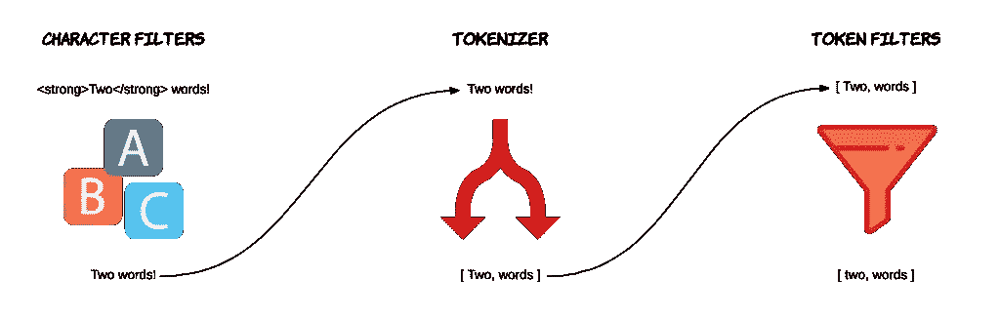
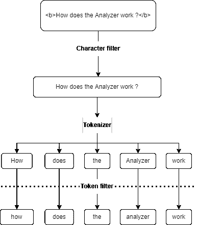

# 弹性研究中数据检索的要点

> 原文：<https://levelup.gitconnected.com/the-essentials-of-data-search-in-elasticsearch-ca2efee5509e>

欢迎回到更多弹性搜索知识😁！今天我们将谈论数据搜索🔍用 Elasticsearch。

现在我们对指数的概念有了一点了解，特别是感谢[以前的文章](https://medium.com/@mhdabdel151/handling-documents-and-indexes-on-elasticsearch-dd2690775d4f)，如果你还没有这样做，我建议你阅读，我们可以使用 Elasticsearch 来搜索我们的数据。

让我们通过在一个 ***用户*** 索引中创建例如 3 个*用户*来做准备，我们通过下面的命令创建这个索引:

```
PUT users 
{
  "settings": {
    "number_of_shards": 2,
    "number_of_replicas": 1
  },
  "mappings": {
    "properties": {
      "name": {
        "type": "text"
      },
      "age": {
        "type": "short"
      },
      "gender": {
        "type": "text"
      },
      "quote": {
        "type": "text"
      }
    }
  }
}
```

让我们索引我们的 3 个用户(你可以根据你的想象自由填写字段，这使教程更有趣🎊).

```
POST users/_doc/1
{
  "name": "Tyrion Lannister",
  "age": 39,
  "gender": "Male",
  "quote": "Never forget what you are, the rest of the world will not. Wear it like armor and it can never be used to hurt you."
}POST users/_doc/2
{
  "name": "Arya Stark",
  "age": 22,
  "gender": "Female",
  "quote": "When people ask you what happened here, tell them the North remembers. Tell them winter came for House Frey."
}POST users/_doc/3
{
  "name": "Syrio Forel",
  "age": 55,
  "gender": "Male",
  "quote": "What do we say to the God of Death ? Not today !"
}
```

现在数据已经加载完毕，让我们对用户索引进行研究。这是通过定义一个 ***查询*** 来完成的。根据 Elasticsearch 文档*“你可以把一个查询想成一个问题，用 Elasticsearch 理解的方式来写。”*

**搜索 API** 是提供给我们的，我们只需定义搜索的对象，例如*匹配*来搜索文本中的单词，或者*范围*来搜索一系列值。你可以在这里找到更多信息。例如，我们可以执行以下操作来返回年龄在 *20* 和 *40* 之间的用户:

```
GET users/_search
{
  "query": {
    "range": {
      "age": {
        "gte": 20,
        "lte": 40
      }
    }
  }
}
```

或者我们可以在*引号字段*中查找感兴趣的特定单词。为什么不是“*冬天”，*显然它要来了😉。

```
GET users/_search
{
  "query": {
    "match": {
      "quote": "winter"
    }
  }
}
```

结果会立即返回给我们。

```
{
  "took": 15,
  "timed_out": false,
  "_shards": {
    "total": 1,
    "successful": 1,
    "skipped": 0,
    "failed": 0
  },
  "hits": {
    "total": {
      "value": 1,
      "relation": "eq"
    },
    "max_score": 0.96645224,
    "hits": [
      {
        "_index": "users",
        "_id": "2",
        "_score": 0.96645224,
        "_source": {
          "name": "Arya Stark",
          "age": 22,
          "gender": "Female",
          "quote": "When people ask you what happened here, tell them the North remembers. Tell them winter came for House Frey."
        }
      }
    ]
  }
}
```

我们可以问自己的问题是*为什么在 Elasticsearch 中搜索这么快？*嗯，在插入时，Elasticsearch 将所有文本通过一个**分析器**，它可以建模如下:



进入分析器的文本将依次经过 3 个模块，即 ***字符过滤器*** 、 ***记号赋予器*** 和 ***记号过滤器*** 。从分析器出来的文本进入**倒排索引**，倒排索引是一种映射，它将每个单词与该单词所属文档的不同标识符相关联。基本上，对每个块执行的操作如下:

*   **字符过滤器**:它通过删除、添加和替换来改变文本的字符。Elasticsearch 包括三个内置的字符过滤器，映射字符过滤器，HTML 条形字符过滤器和模式替换字符过滤器。更多信息[这里](https://www.elastic.co/guide/en/elasticsearch/reference/current/analysis-charfilters.html)。
*   **标记器**:将文本拆分成 ***标记*** 。例如“*你好，我叫乔希*”将被剪切以创建这组令牌*{你好，我的名字，是，乔希}* 。点击了解更多关于主题[的信息。](https://www.elastic.co/guide/en/elasticsearch/reference/current/analysis-tokenizers.html)
*   **记号过滤器**:在这里，记号将根据我们选择的过滤器进行操作，例如删除大写字母、逗号或任何我们不想保留在倒排索引中的字符。你可以在这里找到更多信息。

*一个形象胜过千言万语*。下面是分析器中发生的情况的图示。



这是分析器链。您可以使用 ***分析*** 端点直接在 Elasticsearch 上测试。让我们定义一个文本并选择我们想要使用的分析器。这里，**标准分析仪**。

```
GET _analyze
{
  "text": "What do we say to the God of Death ? Not today !",
  "analyzer": "standard"
}
```

我们可以看到，我们的字符串被拆分成了记号，大写字母没有幸存下来，所有的标点符号都被忽略了。

```
{
  "tokens": [
    {
      "token": "what",
      "start_offset": 0,
      "end_offset": 4,
      "type": "<ALPHANUM>",
      "position": 0
    },
    {
      "token": "do",
      "start_offset": 5,
      "end_offset": 7,
      "type": "<ALPHANUM>",
      "position": 1
    },
    {
      "token": "we",
      "start_offset": 8,
      "end_offset": 10,
      "type": "<ALPHANUM>",
      "position": 2
    },
    {
      "token": "say",
      "start_offset": 11,
      "end_offset": 14,
      "type": "<ALPHANUM>",
      "position": 3
    },
    {
      "token": "to",
      "start_offset": 15,
      "end_offset": 17,
      "type": "<ALPHANUM>",
      "position": 4
    },
    {
      "token": "the",
      "start_offset": 18,
      "end_offset": 21,
      "type": "<ALPHANUM>",
      "position": 5
    },
    {
      "token": "god",
      "start_offset": 22,
      "end_offset": 25,
      "type": "<ALPHANUM>",
      "position": 6
    },
    {
      "token": "of",
      "start_offset": 26,
      "end_offset": 28,
      "type": "<ALPHANUM>",
      "position": 7
    },
    {
      "token": "death",
      "start_offset": 29,
      "end_offset": 34,
      "type": "<ALPHANUM>",
      "position": 8
    },
    {
      "token": "not",
      "start_offset": 37,
      "end_offset": 40,
      "type": "<ALPHANUM>",
      "position": 9
    },
    {
      "token": "today",
      "start_offset": 41,
      "end_offset": 46,
      "type": "<ALPHANUM>",
      "position": 10
    }
  ]
}
```

Elasticsearch 还为我们提供了定义 ***自定义分析器*** 的可能性。点击了解如何创建自定义分析器[。我们可能已经在这里讨论了用于执行分析的**聚合**的概念，但是不要担心，这个主题可能会在未来的文章《🫡.》中涉及](https://www.elastic.co/guide/en/elasticsearch/reference/current/analysis-custom-analyzer.html)

今天就到这里，请随时查看[官方文档](https://www.elastic.co/guide/index.html)了解更多详情。感谢您的阅读，如果您对本文有任何问题或评论，请在下面留下您的评论。

我们下次再见，看更多的帖子。

阿卜杜尔-巴吉