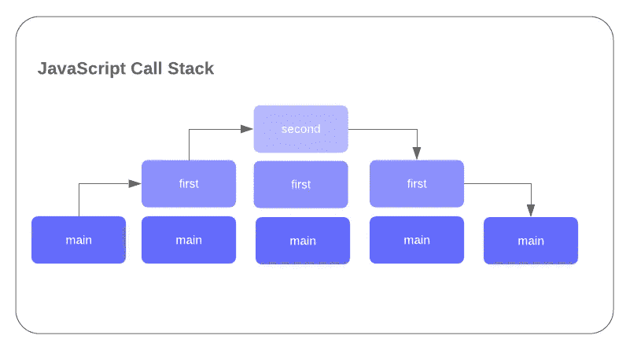
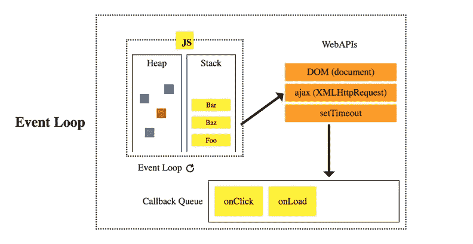

# JavaScript 中的事件循环和调用堆栈

> 原文：<https://levelup.gitconnected.com/the-event-loop-and-call-stack-in-javascript-b946181b9fbe>

在我的上一篇文章介绍了 Node.js 中的包、缓冲区和流之后，我想研究另一个幕后概念。在这篇文章中，我们将介绍 JavaScript 函数执行的一些方面，包括事件循环和调用堆栈。

首先，重要的是要记住 JS 是单线程的，只有一个调用栈。但是什么是线呢？嗯，一个进程——或者一个被指定了运行的内存和资源的程序——包含线程。线程是组成进程的更小的任务或指令。这些进程可以是单线程的，也可以是多线程的。

多线程是指多个线程共享允许并发执行的单个进程的资源。而对于单线程，一次处理一个命令。这两种系统各有利弊，但在这种情况下，我们可以只关注 JS 利用单线程的事实。

现在我们已经对线程和进程有了一个大致的了解，让我们更深入地了解后函数执行的实质内容！

# 堆和调用堆栈

在我们进入调用堆栈之前，让我们简单地看一下堆。简而言之，堆是动态存储的内存分配。堆的内存分配并不真正遵循任何特定的顺序，内存可以在任何时候被释放。

另一方面，调用堆栈遵循特定的顺序。它由堆栈框架组成，每个框架代表一个挂起的子例程调用。堆栈帧是后进先出(LIFO)的。所以当函数被调用时，最近加入堆栈的函数首先被执行，然后从堆栈中移除。

在下面的例子中，你可以看到即使`main`已经在堆栈中，最后添加到堆栈中的`second`函数在`first`函数之前执行，最后是`main`。

堆栈溢出是当一个程序(或一系列程序)试图使用比调用堆栈分配的空间更多的空间时导致的错误。这通常是由递归函数引起的，你会看到错误`Maximum call stack size exceeded`。

# 浏览器提供的 Web APIs 和队列

正在执行的一些方法可能属于 Web API——由浏览器提供给我们。这样的例子有`setTimeout()`、用户发起的事件、DOM 事件以及 ajax/fetch 请求之类的东西。

通过 Web API 执行的代码不会被推送到堆栈上，而是被添加到任务/回调队列中。与调用堆栈的 LIFO 顺序不同，队列是先进先出的。添加到队列中的第一个项目也是第一个被删除的项目。

这给了我们并发的感觉，并有助于防止阻塞——即使是单线程。

显然，我们可以更深入地研究堆、调用堆栈和队列，但这应该是掌握事件循环的足够的介绍性材料。我们基本上已经有了所有的球员，现在我们只需要看看他们是如何一起工作的！

# 事件循环

TL；dr 是事件循环通过检查调用堆栈并以 LIFO 顺序执行堆栈帧直到调用堆栈为空来处理实现。但是正如我们之前提到的，还有 Web API 将事情推到任务队列中。这些函数被推迟到队列中，直到堆栈清空，然后队列中的动作被推入堆栈并执行。

调用堆栈被赋予优先级，并且堆栈中的每个帧在队列中的内容被添加到堆栈之前被处理完成。尽管我们不必等待队列中的任务在被推送到堆栈时运行。这些类型的事件由浏览器处理，并在完成后添加到队列中。

综上所述，JavaScript 事件循环的任务是维护堆栈和处理代码的执行。事件循环检查调用堆栈，如果调用堆栈为空，则查看队列。如果队列中有任何任务，事件循环将获取第一个任务，并将其推送到堆栈中运行。

我试图保持不同领域的简洁，但如果有一个特定的部分是感兴趣的，我强烈建议更深入地查看它。更好地了解代码运行时后台到底发生了什么不会有什么坏处！

我还想插入几个月前我第一次研究事件循环时使用的第一批资源之一，那就是菲利普·罗伯茨"[究竟什么是事件循环？](https://www.youtube.com/watch?v=8aGhZQkoFbQ)“JSConf EU talk。它包括许多有用的图表和很好的解释。它甚至不到 30 分钟长，所以我强烈建议检查一下！