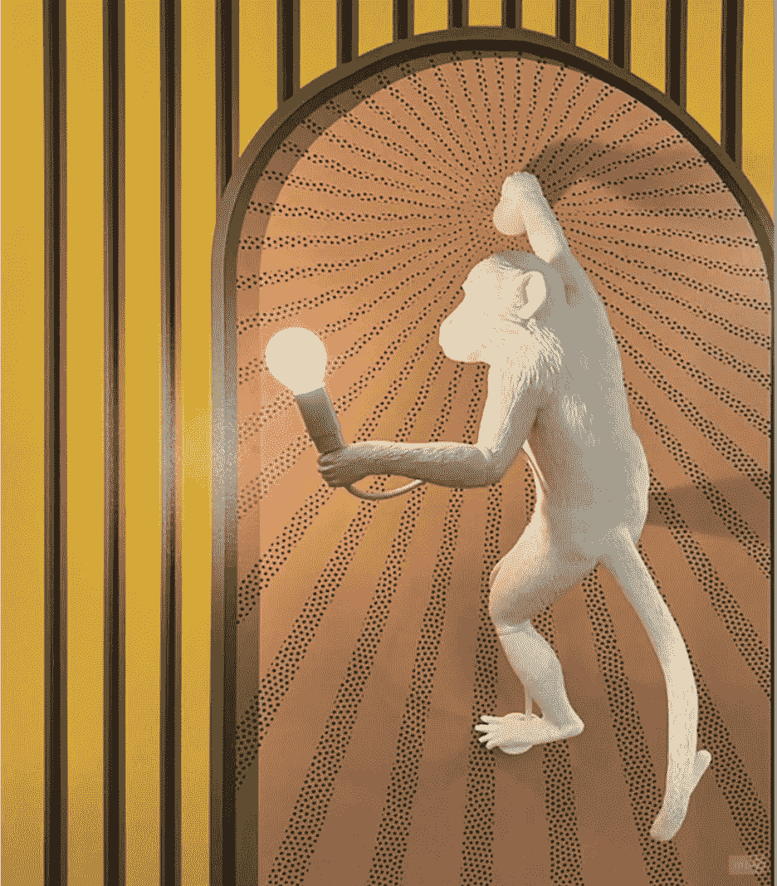

# 创新的进化:从洞穴到数字时代

> 原文：<https://levelup.gitconnected.com/the-evolution-of-innovation-from-cave-to-digital-era-b1f03b850557>

詹妮弗·格里芬在 unsplash.com

我通常写技术和相关主题，但今天我想讨论一个稍微不同的主题:从不同的角度看创新及其演变。我有一些问题，在接下来的段落中，我想表达我对这些问题的想法。

*请注意它不是基于任何科学事实或假设。但是如果你对它们感兴趣，请查看参考资料的链接。*

几乎每天我们都会看到新产品、技术工具以及它们的不断变化。请想一想过去 20 年中的变化和创新。这真是太神奇了。社交媒体、移动应用、消息应用和数以千计的其他应用已经出现。

有些产品由于自身的需求，创造了其他产品。例如，社交媒体创造了处理海量数据的大数据方法。成千上万的服务需求导致了微服务架构的发展。对全天候可达性的需求推动了云技术的发展。关系数据库在某些情况下已经变得低效(尽管它们仍然非常重要和有用)，导致了 NoSQL 数据库的创建。为了支持更快的开发，旧的编程语言已经发展到可以满足最近的新需求。所有这些都在以令人难以置信的速度转变。但是所有这些发展背后的基本思想是什么呢？

让我们看看它的历史转变吧。

## 洞穴中的人类

如果人类的历史不是建立在进步的基础上，我们的情况会是什么样？我经常想知道这个问题的答案。我们很可能仍然住在洞穴里，把大部分时间花在寻找食物上。我们已经建立了正常的生活方式，只需要寻找食物。然后发生了一些事情，驱使我们前进，离开我们的洞穴。那会是什么呢？是什么激励我们去寻找一个更好的地方生活、狩猎或做任何我们需要做的事情？这是一种创新吗？这个想法今天仍然有效吗？这个想法会随着时间的推移而演变吗？

我脑子里有很多问题。今天我想讨论一下历史上创新理念的演变。为了理解创新思想的演变，让我们看看历史的变化。

## 不成熟的创新理念:如何生存

在我看来，很明显，我们的祖先没有创新的想法来让世界变得更好。他们只是试图找到一种更好的生存方式。最有可能的原因是缺乏食物或恶劣的生活条件。然而，它也可能是由于灾难性事件。因此，他们开始发现新的或更好的地方狩猎和生活。我认为这是第一个创新的想法，即使他们没有意识到这一点，这是基于生存。这种情况可能持续了几个世纪。

## 早期创新理念:理解生命的意义

**古希腊哲学家:世界塑造者**

几个世纪后，创新的理念发生了演变。这不仅仅是为了活下去。它是关于理解生活和它的意义，以及我们如何为自己建立一个更好的生活。古希腊哲学家点燃了这个火炬。苏格拉底、柏拉图、亚里士多德和其他人探讨了人生的目的、道德和伦理。

> **苏格拉底**宣称*“未经审视的人生不值得过”。*

亚里士多德关心的是事物的目的以及我们如何才能过上美好的生活。他认为，当我们认识到我们的积极特征时，我们应该利用它们来追求美德和实现我们的潜力。

> 根据亚里士多德的说法，这会给我们带来幸福，并构成一种“好”的生活。

柏拉图认为，理想形式和我们不完美的复制品之间的这种对比也适用于诸如善和正义等概念。

我们可以很容易地说，他们塑造了世界，并仍然影响着我们今天对世界的理解。顺便说一下，关于创新本身的第一次长时间讨论是由希腊哲学家和历史学家色诺芬提出的。

*创新本身的理念继续从生存发展到理解生活的意义，以及如何在道德和伦理规则的基础上构建生活。*

## 现代创新理念的第一步:文艺复兴

**艺术、科学发明的开端:将古老的思想带到未来**

“文艺复兴是欧洲历史上标志着从中世纪向现代过渡的一个时期……

它的影响体现在艺术、建筑、哲学、文学、音乐、科学、技术、政治、宗教和知识探索的其他方面…

一些人认为这是一场“科学革命”，预示着现代时代的开始，另一些人则认为这是一个从古代世界延伸到今天的连续过程的加速。在此期间，**伽利略·伽利雷**、**第谷·布拉尼**和**约翰尼斯·开普勒**取得了重大的科学进展。哥白尼在《天体运行论》中提出地球绕着太阳转。Andreas Vesalius 的《人体工作原理》给解剖、观察和解剖学的机械论观点带来了新的信心。”[维基](https://en.wikipedia.org/wiki/Renaissance)说。

其中最著名的是伟大的艺术家和科学家达芬奇和他的伟大作品。

文艺复兴时期的哲学家和艺术家受到古希腊祖先的影响，他们试图将思想带到更远的地方。

从如何理解生命的意义，到如何用人文主义、科学和艺术来美化我们的生活。当然，对生活的理解和质疑并没有结束。

## 现代创新理念:工业革命

**经济时代:生产更多**

随着工业革命，创新的理念本身继续发展，它涉及技术、社会经济和文化，其基础是生产更好、更快、更多的产品(大规模生产)。

*创新的理念从如何美化我们的生活演变到如何多、好、快地生产。*

## 后现代创新理念:技术和数字革命

**科技时代:让生活更简单；多消费，活得快，活得长**

20 世纪 90 年代以后，尤其是二战或 20 世纪 40 年代以后，技术有了重大进步。它开始进化消耗更多。此外，它在一千年后取得了重大进展。

正如我在文章开头提到的，在过去的 20 年里，我们每天都面临着新的技术和创新。所有这些变化都是创新。创新理念的演变转变为快速生活，让生活变得简单。

*从如何更多更好更快的生产，发展到如何随着技术进步让生活更轻松，如何随着医学进步提高生活水平。*

## **结论**

虽然洞穴中的人类在试图寻找更好的生活或狩猎场所时可能没有创新的概念，但他们的努力仍然是进步的和创新的。即使只是为了生存和一点必要。

纵观历史，人们生活条件和标准的变化也促进了创新思想的演变。它始于生存，并继续改善我们对生活的理解，导致更多的生产和使生活更容易的方法的发展。

现在，我们大多数人都熟悉创新的概念及其进展。在这篇文章中，我想从历史的角度来审视创新理念的演变，理解是什么推动了它的快速演变，并思考它的下一步演变可能是什么。

你怎么想呢?

我很高兴听到你的评论。

希望它值得你花费时间和精力。

感谢阅读…

*敬请期待。*

**参考文献:**

 [## 人类进化|历史、阶段、时间线、树、图表和事实

### 人类进化，人类在地球上由现已灭绝的灵长类动物发展而来的过程。从动物学角度来看…

www.britannica.com](https://www.britannica.com/science/human-evolution)  [## 什么推动创新？经济史的证据

### 开发创新历史驱动力的分析框架。*大多数瑞典创新都是在…

www.sciencedirect.com](https://www.sciencedirect.com/science/article/pii/S004873331730104X)  [## 9 位塑造了世界的希腊哲学家

### 由伟大的思想家如苏格拉底、柏拉图和亚里士多德奠定的基础思想仍然影响着我们…

www.thecollector.com](https://www.thecollector.com/ancient-greek-philosophers/)  [## 文艺复兴-维基百科

### 文艺复兴(ren-ə-sahnss rin-ay-sənss)是欧洲历史上标志着从中世纪向现代过渡的一个时期

en.wikipedia.org](https://en.wikipedia.org/wiki/Renaissance)  [## 工业革命|定义、历史、日期、总结和事实

### 工业革命，在现代历史上，是从农业和手工业经济转变为…

www.britannica.com](https://www.britannica.com/event/Industrial-Revolution)  [## 技术革命-维基百科

### 技术革命是指一种或多种技术被另一种新技术取代的时期

en.wikipedia.org](https://en.wikipedia.org/wiki/Technological_revolution)