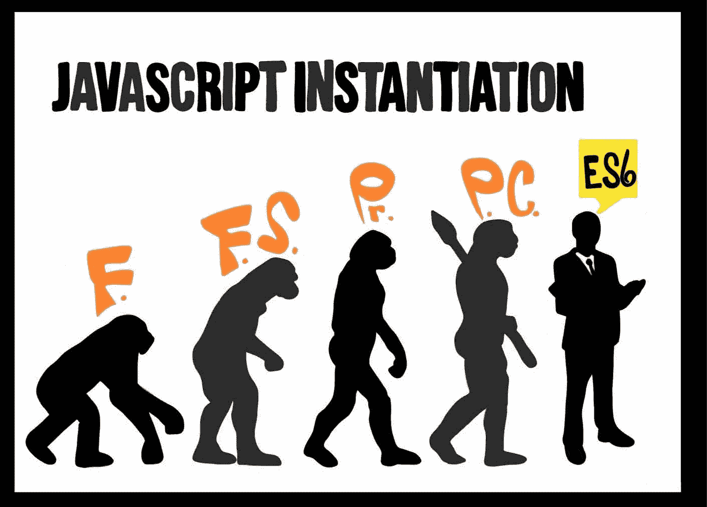
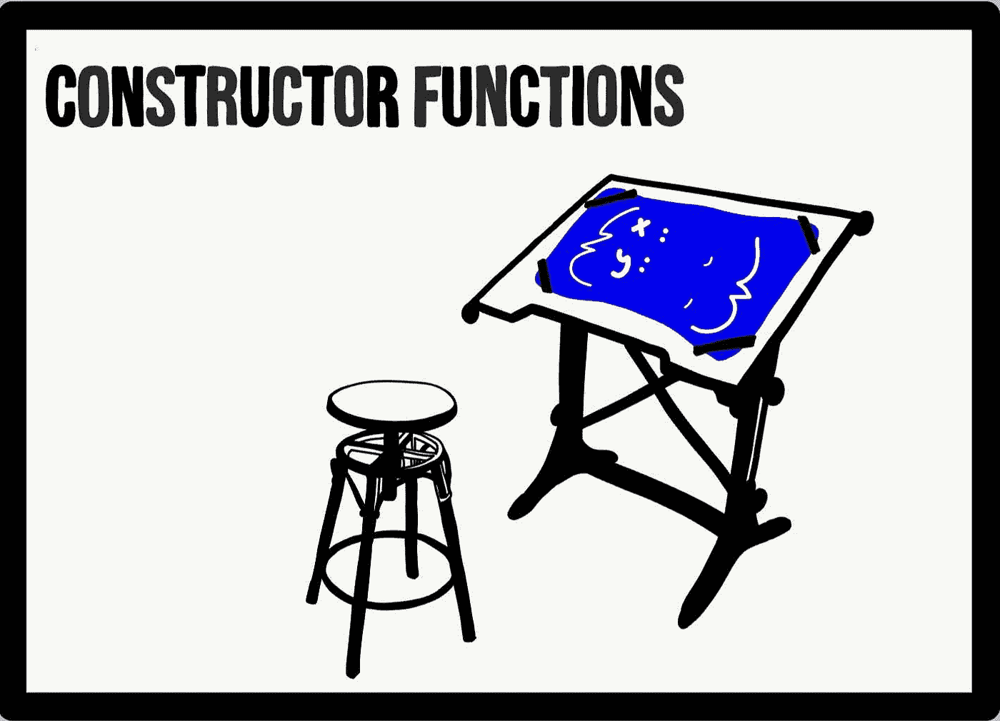
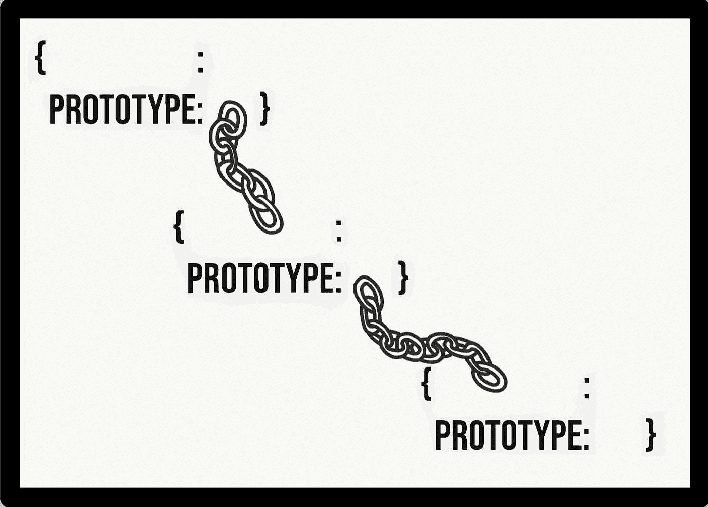
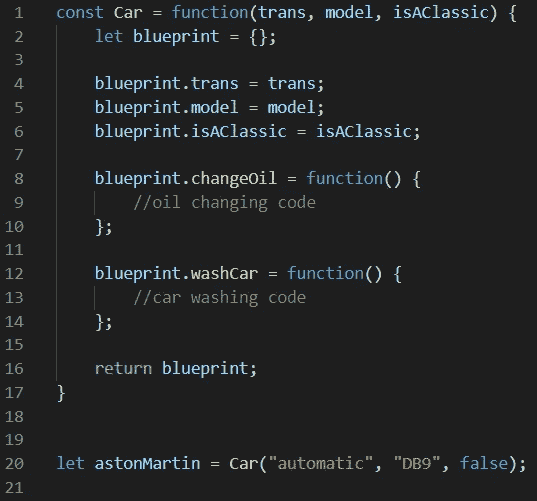
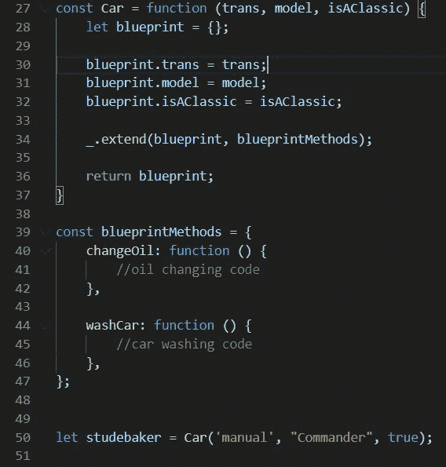
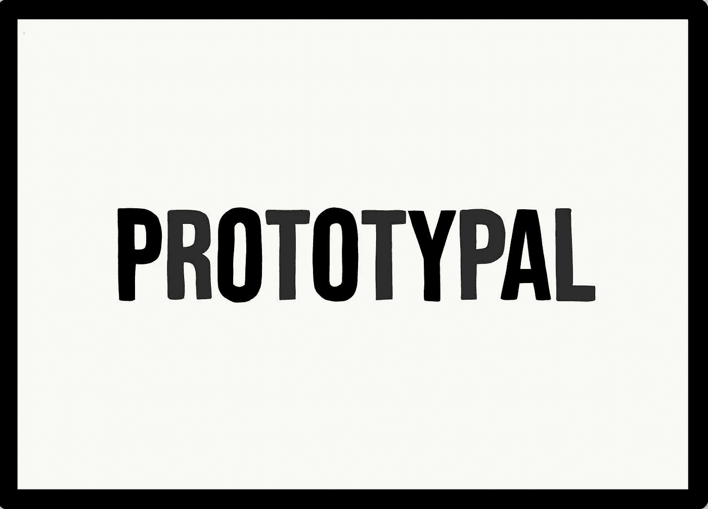
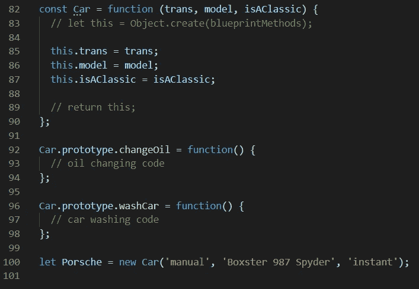
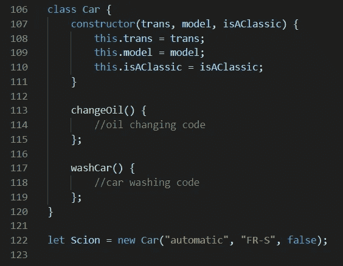

# JavaScript 实例化模式的演变

> 原文：<https://levelup.gitconnected.com/the-evolution-of-javascript-instantiation-patterns-ee9374fd5d71>

虽然 JavaScript 支持面向对象、命令式和函数式编程风格，但它并不像 C++和 Java 这样的面向对象语言那样有一个类系统。因此，它使用构造函数和原型来模拟类似的功能。在我们深入研究这篇文章的内容之前，我们必须完全理解前面的句子到底是什么意思。

构造函数，或者说构造函数，是一个简单的函数，它充当你已经构建的对象的“蓝图”，你可能想要多次重新创建它。在 OOP 语言中，用该构造函数创建的任何对象都是该对象的“实例”。还要注意，构造函数的名字大写是一种常见的做法。虽然您将在本文中看到的示例构造函数是定制的，但是 JavaScript 确实配备了几个自己的构造函数，用于创建本机对象的新实例(Array()、Object()、Date()等)。).

知道了我们现在在做什么，JavaScript 不是传统意义上的基于类的编程语言，让我们来谈谈它的具体结构。JavaScript 是少数几种基于原型的编程语言之一，其中属性和功能从原始对象“传递”给从它创建的任何新实例。意思是，用最简单的方式来解释，对象从对象继承。现在，如果这还没有完全的概念意义，不要担心。浏览每一个不同的实例化模式，看到属性在实际代码中传递，将会更加清晰地突出这些思想。现在，请注意，与上面的构造函数的情况类似，JavaScript 确实有一个默认的原型，基本上所有对象最终都会回到这个原型。Object()是内置的构造函数，几乎所有对象都是它的实例，Object 上有一个 prototype 属性，其中存储了所有可应用于对象数据类型的方法。因此，当您试图引用实例对象上的方法时，如果该对象本身不包含该特定方法，那么搜索将“退回”到该实例对象的原型。这种搜索将继续下去，如此等等，直到该方法要么在前面的对象中找到，要么最终找到大的 Object.prototype 并在那里寻找该方法。这种在创建对象时将它们链接在一起，并在创建过程中继承前一个对象的属性的方式称为原型链。

对语言的基础有了非常基本的理解后，我们可以开始研究 JavaScript 中对象的实例化模式。有四种截然不同的模式，以相当不同的方式工作，第五种模式只是一层新油漆中的第四种模式。虽然目前有可能使用这五种模式中的任何一种，但由于所需语言的组件都没有被删除或从根本上改变，这些模式确实存在于时间轴上的前进过程中。每种模式都是为了改进前一种模式的缺点而添加的，因此很容易认为，唯一真正的争论将是使用更“经典的 Javascript”第四种模式还是使用 ECMAScript 2015 ES6 发布的新样式。

通过观察**所有相关的属性和方法都是在构造函数内部定义的，您可以识别出五种模式中的第一种，functional。**

在函数实例化中，您必须在构造函数内部亲自创建一个空的对象文本，然后将您希望对象包含的所有属性和方法添加到该对象内部。当然，这意味着每次创建这些对象中的另一个对象时，所有的属性和函数都会被再次创建。这里有一些明显的缺点，最糟糕的是这些重复的结果增加得相当快，使得运行程序需要更长的时间，并且占用了比必要的更大的内存空间。另一方面，如果你知道你不会为你的对象创建很多实例，那么这个设计缺陷的破坏性就变小了。有趣的是，很多人发现这种模式是自己最容易实现的，也是在阅读别人的作品时最容易遵循的(主要是因为对象的所有部分都在代码中的一个地方)。总的来说，功能性远不是最好的选择。这种模式的组成意味着，如果您以后想要添加方法或属性，您将无法更新任何以前的实例或原始对象，并且重新创建的方法所占用的空间是低效的。

对函数实例化缺点的修复始于函数共享实例化的形式。虽然您仍然可以在构造函数中创建您的对象及其所需的属性，但是这里有一个主要的结构性差异:**该构造函数对象的任何方法现在都将被添加到一个单独的外部对象中，然后 _。extend()合并在一起，返回合并后的对象。**

_。左边代码示例中使用的扩展函数是下划线库中的一个版本，因为它不是 JavaScript 的原生函数。它在第 34 行的目的是将 blueprintMethods 对象中的每个属性添加到它上面的 blueprint 对象中。每当创建 Car 的新实例时，每个实例对象都将有一个对相同方法的引用，而没有功能实例化中存在的不断重复。下面是扩展函数的一个示例实现。

您可能认为模式列表应该以前面解释的功能共享结束。考虑到我们已经解决了普通的旧函数实例化的问题，以及不必要的方法复制和由此带来的过多的内存使用，这一定是我们的终点了，对吗？好吧，我已经破坏了一些神秘感，我告诉你我们将讨论的不是两个而是五个模式(更不用说挂在我们头顶上的有点泄密的图像，它给出了我们还没有解释的函数共享实例化一定有一些问题的暗示)。我们没有讨论的是，如果你发现自己正好处于这种情况，意识到你忘记了给你已经创建的东西添加一个重要的元素，会发生什么……简单地说，如果你使用模式#2 来进行创建，你会倒霉的。这里的主要问题是，对共享方法的引用是在对象被实例化时创建的。如果您想要更改上述方法，然后创建新对象，那么原始对象和新对象将引用不同的方法。这个问题需要通过原型实例化来解决(模式 3)。

您会注意到，在左边的代码示例中，我们使用了 **Object.create()** ，而不是首先创建一个空的对象文字(就像前两个模式一样)。对于那些以前可能没有接触过它的人来说， **Object.create** 是 ECMAScript 2015 版本中添加的，用于创建具有指定原型的新对象。这里，它使 blueprint 变量的值成为一个对象，其原型指向构造函数下面的 blueprintMethods 对象(第 66 行)。与函数共享实例化不同，如果您需要在创建构造函数后更改方法，您只需更改存储在原型上的方法。在原型上更改它们保证了 Car 的所有实例之间的一致性(并且仍然不需要在内存中复制方法)。

好吧，下一个。回想几秒钟前，当你学习了什么是 **Object.create** 并开始理解与继承相关的原型的使用时。现在想象一下，运行本质上相同的代码，但只需要自己写出其中的一部分。欢迎来到伪经典实例化，或模式#4。

第 83 行和第 89 行注释掉的代码由 JavaScript 引擎在“幕后”免费执行。这些行看起来应该与原型实例化的例子非常相似，除了用 **this** 关键字替换对象的变量名。为了充分理解正在发生的事情以及为什么它能够发生，我们实际上需要从第 100 行开始解释，引入**新的**关键字。当它在这里被使用时，在 Car 构造函数调用之前，它要做一些重要的事情，以一个非常特殊的顺序:

*   创建新对象
*   将**这个**关键字绑定到那个新对象
*   将新对象的 __proto__ 或内部原型属性设置为构造函数的原型
*   在函数结束时，如果没有指定其他返回，则返回 **this** (新对象)

因此，实际上是因为有了**新的**关键字，我们才不再需要写出这两行代码。然后，您将使用 **this** 向新对象添加任何属性，使用上面提到的 **this** 、引用实例。转到在我们的构造函数下面定义的方法，我们可以看到，在我们的例子中，它们第一次没有存储在代码中的某种形式的对象中。我们不需要将方法保存在任何对象中或构造函数本身中的原因是，我们将它们直接附加到对象的原型属性上。在创建的 Car 实例上对方法的任何不成功的搜索最终都会退回到 Car.prototype，除非您要显式地更改该原型所指向的对象。伪古典。

我们到了，在这条线的尽头。我们列表中的“第五”，但更多的是我称之为*的伪*模式。明白了吗？你会的。

ES6 伪经典提供与上面的伪经典实例化相同的功能，包装在不同的包装中。如果您来自基于类的语言(如 Java 或 c++ ), ES6 语法版本的 pseudoclassical 应该看起来更像 home。**类**、**超级**、**和**扩展**关键字的引入几乎足以让你质疑 JavaScript 是否仍然是动态的和基于原型的。好吧，不要让一些句法糖欺骗你，它是。正如您在示例中的第 106 行看到的，我们现在有了 class 关键字，后跟一个标识符(Car)，这是我们的**基类**声明。如果您看到一个使用 **extends** 关键字的类声明，这是一个**子类**(或**派生的**)声明，但不幸的是，我们不会在本文中讨论子类化。Car 标识符后面的代码块被称为**类主体**，这是构建构造函数的区域。类体意味着保存方法定义，但不能保存任何数据属性，它们必须被添加到构造函数中。Javascript 允许你省去**构造函数**关键字和后续函数，并会为你“插入”一个空的。同样，super 和 extends 关键字严格地与 ES6 的子类化相关，因为这只是一个介绍性的尝试，所以我鼓励你深入研究它们。乍一看，与其他代码相比，本节中的代码示例似乎完全陌生，但事实是，它就像经典的伪经典实例化模式一样工作，使用原型链进行继承，使用 new 关键字创建实例。**

# 结论:

这涵盖了 JavaScript 中的每一种实例化模式，并有望揭示这种语言的继承过程的内部工作原理。有了这些信息以及对每种模式优缺点的更好理解，您就可以为您的代码做出最佳选择。

**感谢您的阅读！**