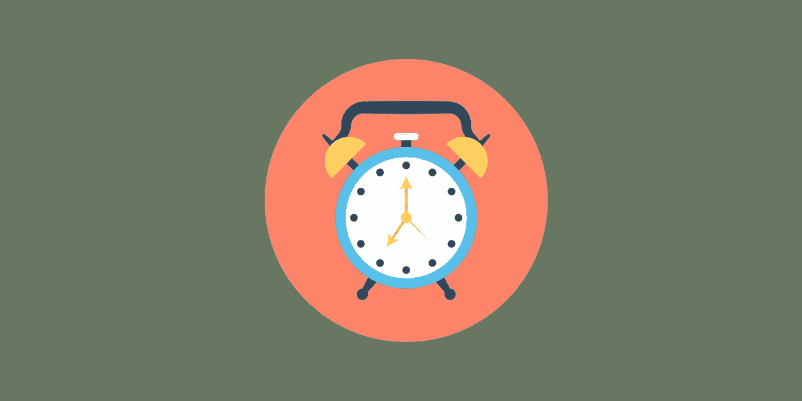

# 作为一名自由职业者，我的生产力的演变

> 原文：<https://levelup.gitconnected.com/the-evolution-of-my-productivity-as-a-freelancer-c344b95c9c1e>

## 在 9 年的自由职业生涯中，我对习惯、时间表和爱好的实验

一直关注我工作的人都知道，我从事自由职业已经 9 年了。在那段时间里，我的工作效率有了显著的提高。怎么会？

通过反复试验，以及阅读许多关于这个主题的书籍，我已经形成了一系列我每天都坚持的规则和原则。我在这里分享它们，希望你能比我更快地经历这个过程。这样做会帮助你实现看似矛盾的事情:完成更多的工作*和*有更多的空闲时间。

# **2012 年**

2011 年 11 月，我开始作为一名软件开发人员从事自由职业。我大学毕业了，对我研究了 5 年的学科完全不感兴趣。因此，有了逻辑和计算机的诀窍，我转向了编码。

然而，我的生活方式并不完美，这影响了我的工作效率。

## **兴趣爱好**

我每隔一个晚上玩电子游戏。当我不玩电子游戏的时候，我会出去。我也有积极的爱好:阅读和偶尔的篮球比赛。有爱好不是问题；其实我强烈推荐。但并不是所有的爱好都是平等的:有些是有益的、健康的、放松的；其他人破坏了时间和健康，而作为回报，只提供了暂时的多巴胺修复。

## **睡眠**

在电子游戏和聚会之间，我几乎没有一个晚上能在凌晨 2 点前睡着。我的闹钟会在早上 9 点响起，即使这样也常常是雄心勃勃的——我会懒散地工作到 10 点，甚至 10:30。

## **食物**

糖太多了。太多酒精了。因此，不可避免的情绪波动和不可预测的焦点。

## **生产率得分:2/10**

我初露头角的自由职业生涯不知何故战胜了我的习惯所带来的障碍。我很努力，但是我不稳定。上午 11 点开始工作意味着我要么工作到很晚，要么把工作留到周末。

让客户满意几乎是我唯一的职业重心，代价是收入减少。

# **2013 年**

睡眠、食物和习惯都没有改变。然而，开始我的第一个激情项目让我更有动力。我经常在周末和晚上工作。

## **生产率得分:3/10**

我做了同样多的自由工作，但是我更有效率。有了经验，就有能力挑选更好的项目，与客户更好地沟通。

# **2014 年**

这个充满激情的项目很快变成了一项业务，我被迫约束自己，以保持它的增长。

## **兴趣爱好**

我严格地减少了电子游戏。其实我跟自己做了一个交易:白天完成一定的任务，我才会奖励自己玩一个小时。这是我第一次将某种类型的游戏化融入到我的生活中，它非常有效。

## **睡眠**

这不是我心甘情愿改变的。然而，通过电子游戏减少对大脑的过度刺激让我更早入睡，睡得更好。闹钟仍然设置在上午 9 点，但现在我实际上更多的时候是在上午 9 点起床。

## **生产率得分:4/10**

做自由职业者和同时管理我的生意意味着我工作很多，但是我如何度过剩余时间开始转变。这种变化带来了更多的阅读和更好的健康。随之而来的是更多的知识、更清晰的头脑和更多的优化机会。慢慢地，我开始意识到所有这些都是有联系的。

# **2015 年**

我遇见我妻子的那一年。也是在那一年，我开始定期去健身房。这两者之间可能有某种关联。

## **兴趣爱好**

在健身房开始了一个力量训练计划，很快带来了一些相当沉重的负担。尽管如此，我还是在周末喝酒和睡懒觉，破坏了一些进展。

## **睡眠**

硬拉和深蹲之后很难睡不好觉。开始睡得更早，8-9 点起床，工作日 10 点开始工作。我的周末仍然忙碌而疲惫。

## **食物**

人生第一次开始计算卡路里和宏。

## **生产率得分:5/10**

这和生产力有什么关系？一切！与前一年相比，我的收入翻了一倍，并且做了几个兼职项目，其中一个是多人纸牌游戏，在脸书上一度有大约 10k 用户。

# **2016**

这一年有两个重要的里程碑:我卖掉了自己几年前建立的公司,并开始将收入投入股市。

## **生产率得分:5/10**

我的工作方式没有大的改变。

# **2017**

我在健身房投入的时间和精力越来越多，这不仅没有促进我的健康和生产力，反而消耗了我太多的时间和精力，让我很难赶上我想做的一切。

我决定休息一段时间，从事一些要求不高的活动。

## **兴趣爱好**

用室外跑步和打台球代替了举重。虽然跑步让我保持身材，但撞球将被证明是一种非凡的爱好，一种刺激大脑和运动技能而不会大量消耗能量的爱好。

## **睡眠**

早上 8 点开始醒来。是的，我花了 6 年时间才找到一个合理的闹铃时间。我认为问题不在于懒惰。我从来没有懒惰过。问题在于固执。我坚持认为，只要你能完成工作，你什么时候起床并不重要。在接下来的几年里，我会证明自己是错的。

## **美食**

我停止了计算卡路里，但保留了我在去健身房的日子里养成的大部分好习惯。这就是关于好习惯的事情——你可以用一两年的时间来培养它们，然后在这段时间里释放一些你给自己的压力。你可能会失去 10%的纪律，但这可以让你腾出很多精力去培养新的好习惯和新的活动。

## **生产率得分:6/10**

早起让我更加坚持，从我的自由客户那里收取更多的时间，并尝试更多的兼职项目。

# **2018**

加强财务纪律:减少支出，增加投资。

## **生产率得分:6/10**

生产率和工作结构没有变化。

# **2019**

没有大的变化，但是对我的时间表做了一系列小的调整，在不增加我的工作时间的情况下，我的产量增加了 20-30%。

## **兴趣爱好**

用我自己设计的家庭锻炼代替了户外跑步，结合了有氧运动和体重力量训练。这比跑步花费的时间少得多，因为我可以在我的客厅里做，而且可以在激烈的 20 分钟后完成。

在大多数日子里停止长时间的休息。把我的一天安排成一系列大约 1 小时的工作时间，中间穿插 10 分钟做家务、伸展运动和家庭时间。

## **生产率得分:7/10**

设法将一份全职自由职业者的工作与一些不错的兼职结合起来，投入更多，投入更多时间阅读。

# **2020 年**

到目前为止，复仇之年是我最好的一年。

## **睡眠**

早上 7 点开始醒来。

## **兴趣爱好**

有史以来第一次，我定义了一个严格的早晨惯例。

## **生产率得分:9/10**

我花了一整年的时间做我一生中最棒的自由职业项目。除此之外，我开始写文章，每周一两篇。开了一个 Twitter 账户来宣传我的工作，到目前为止已经有大约 1000 名粉丝了。录了一个关于自由职业成功的[课程](https://jovancicmil.gumroad.com/l/NoNonsense)发表在 Udemy 上。T2 比以往有更多的时间用于家庭和爱好。

> “在我看来，如果你回顾一年前的自己，并不为自己的愚蠢感到震惊，你就没有学到多少东西。”—雷伊·达里奥

# **缩短流程**

你能比我做得更好吗？你当然可以！如果你够聪明，运用这些重要的原则，我花了 9 年时间做的事，你可能会花 2 到 3 年:

1)早醒。

2)通过创造内容、创造产品或创造服务，使你的收入多样化。

3)把阅读加入到你的日常计划中。

注意你的健康。

5)经常小休，并有效地利用它们。

习惯的养成需要时间，所以一周甚至一个月都不会有任何改变。但是遵守这些被证实的原则一年，你将会看到你的生产力飞速提高。