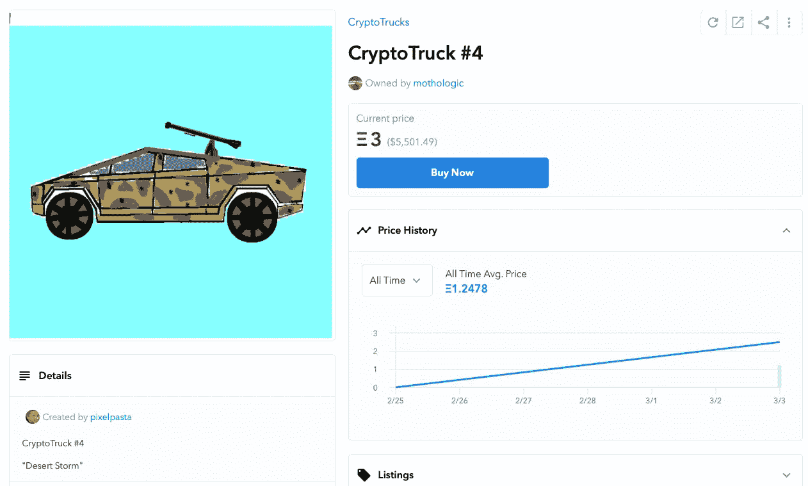
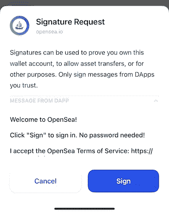
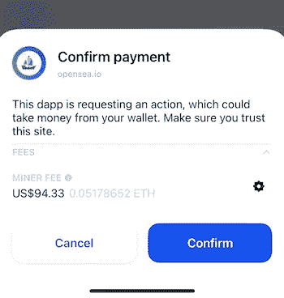
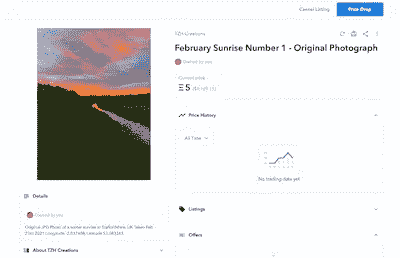

# 我在以太坊区块链上创作和出售自己的 NFT 艺术品的确切过程

> 原文：<https://levelup.gitconnected.com/the-exact-process-i-used-to-create-and-sell-my-own-nft-art-on-the-ethereum-blockchain-698d9c59a2fe>

## 操作指南(不是“你应该做的”指南)

但这是艺术吗？Timon Klauser 在 Unsplash 上拍摄的照片

R 最近我给[写了一篇文章](/what-makes-a-digital-image-file-worth-69-million-4d49a9eabcb7)，意在揭开 NFT 的神秘世界——不可替代的代币。我想了解它们是什么以及它们是如何工作的。

我的兴趣是由艺术家毕普(又名迈克·温克尔曼)在克里斯蒂拍卖行以超过 6900 万美元的价格出售了一幅 NFT 作品的新闻引发的，这实际上是他的一幅作品所有权的数字象征。这大约发生在杰克·多西以超过 400 万美元的价格拍卖代表他第一条推文的令牌的同时。

在那篇文章之后，一位读者(感谢[日夫科维奇](https://medium.com/u/3ee57b082bb?source=post_page-----698d9c59a2fe--------------------------------)！)伸出手，分享了他对 NFT 和艺术的印象。他给我指了一幅目前正在 OpenSea 上出售的 NFT——看起来像是一幅涂有沙漠迷彩的特斯拉加密卡车的儿童画。这是它所有的荣耀——你可以花 5501 美元用以太币抢购它:

来源: [OpenSea](https://opensea.io/assets/0x495f947276749ce646f68ac8c248420045cb7b5e/48231684934820436706610853391605455975241305830218049498647150493154347581441)

虽然我后来稍微研究了一下皮普尔的作品，但不得不承认，它实际上很酷(所有艺术都是主观的，对吧)——我的第一反应是，5000 美元拥有上述作品可能有点夸张？

我的第二个反应是好奇(和贪婪)。我怎样才能自己卖掉 NFT？

就像今年 1 月初我决定探索如何购买比特币一样，最好的学习方式似乎是自己尝试去做——创建一个 NFT，将其挂牌出售，并了解完成一笔交易需要做些什么。

这个故事分享了我是如何做到的(尽管它还没有卖出去——还没有！)

# 到底卖不卖 NFTs？

我觉得有必要稍微谈一谈关于非功能性测试的优点和伦理(因为缺乏更恰当的术语)的争论。

创造者的创造者——赛斯·戈丁非常坦率地分享了[他的观点](https://seths.blog/2021/03/nfts-are-a-dangerous-trap/)，我并不倾向于(完全)不同意他的评价。

他的观点似乎是，作为创作者和艺术家，我们应该专注于创作艺术，而 NFT 改变了对艺术所有权真正含义的看法。NFT 作为一种“东西”的出现有可能分散那些应该把他们的创造力倾注到*他们制造的*东西上的人的注意力，转而专注于*如何把它们作为 NFT 出售*以将他们的创作货币化。

Seth 还提出了许多关于区块链技术[能源使用的声音，这种技术用于制造和交换一旦存在的 NFTs 代币和智能合同，一旦出售就无可辩驳地记录其所有权。](/is-bitcoin-an-environmental-disaster-waiting-to-happen-d770e4bea5e9)

那些对整个区块链技术持批评和怀疑态度的人经常提到环境问题。我已经在另一篇文章[中解决了这些问题，希望能帮助你得出自己的结论(或者至少感觉消息灵通一点)。](/is-bitcoin-an-environmental-disaster-waiting-to-happen-d770e4bea5e9)

从我目前收集的信息来看，作为 NFT 的新卖家，我与区块链的互动现在已经基本完成，证明了自己是生态系统的新参与者。我意识到——这类似于说我的灯泡只是地球上几十亿个灯泡中的一个，因此没什么关系——如果我不是解决方案的一部分，那么从某种定义上来说，我就是问题的一部分。

有些人可能会说，非功能性艺术完全没有必要——在某种程度上，不是所有的艺术都潜在地没有必要吗？所有的音乐呢？我们不需要任何一个来生活？

这肯定是一个兔子洞。就我写这篇文章的动机而言:

*   NFT 是存在的，人们正在出售它们，而且在某些情况下非常成功；
*   我热衷于探索其中涉及的内容以及它是如何工作的，这样我就可以在这个问题上做出明智的决定；
*   你是否选择做同样的事情取决于你自己。

继续阅读“如何做”指南。

# 卖什么

NFT 可以在几乎任何可以数字化的艺术形式的基础上铸造——一幅图像、一段文本、一段视频或音频剪辑或者一段代码。我带着图像去的。

我并不(完全)唯利是图——我有一点创造性的正直，我想感觉我提供了物有所值的东西。从加密卡车的例子来看，NFT 似乎有市场，因为它们是什么，购买它们是为了寻求地位。NFT 也许正被视为一种投机性投资，而不是因为买家特别热衷于将它们视为艺术品？

也就是说，我想提供一些与生俱来的视觉吸引力(根据我自己的主观判断)。我热衷于摄影，最近在工作中赢得了一个竞赛(嗯，第三名)，是一张我早上散步时拍摄的日出照片——因此我可以合理地把自己描述为一个获奖的摄影师！

本着尊重我在出售独一无二的东西的精神，我决定将我的一张照片挂牌出售——一张没有在其他地方分享过的照片。

# 去哪里卖

在第一次发现 OpenSea 上出售的 NFT 后，考虑到克里斯蒂不太可能(至少现在)接受我的照片出售，我决定选择 [OpenSea](https://opensea.io) 。它自称为:

> “第一个(也是最大的)对等加密商品市场。就像加密资产的易贝。”

如果你在网上做一个快速搜索，你会发现几个地方可以卖 NFT。我倾向于选择声誉好、规模大的组织，以此来限制被敲竹杠的机会，并最大限度地扩大影响范围——对我来说，做大是有意义的。

杰克·多西、埃隆·马斯克和其他人一直在另一个平台 [Cent](https://v.cent.co/setup) 上销售基于著名推文的 NFT。我还没有彻底研究过，但是想象一下在 Cent 上设置的过程与在 OpenSea 上设置的过程类似。

# 销售的过程

出售 NFT 有几个简单的步骤。除了描述主要步骤之外，我不会详细介绍这些步骤。

把它想象成第一次来到易贝，列出要卖的东西——你需要注册一个账户，列出商品，并建立接收付款(和支付卖家费用)的机制。

除了发生在区块链，而不是传统的银行账户和贝宝系统之外，它在 OpenSea 上基本上是一样的。

## 设置一个帐户(提示-你需要一个在线加密钱包)

开始使用 OpenSea 既快又容易——主要是因为这个过程需要与加密钱包(在线钱包，而不是像流行的特勒索 one 模型那样的离线硬件钱包)集成。

OpenSea 将您的钱包地址视为您在 NFT 销售的“终端”,并将您视为其基础设施的用户。一旦销售完成，最终将创建的智能合同是在买方和卖方之间，但数字资产，收藏品将在各自加密钱包的唯一加密地址之间移动。资金和代币在这两者之间移动，合同记录在区块链中。

我在一个硬件钱包上冷藏了一些以太坊令牌，并将其中一些转移到我智能手机上的比特币基地钱包应用程序中。

一旦我将我的 CoinBase 钱包链接到我的 OpenSea 账户(通过使用我的智能手机扫描屏幕上的二维码，提示我接受它和 OpenSea 之间的连接)，OpenSea 就会定期提示我数字签名并接受我在他们网站上所做的更改——验证它们是由我发起的每一步。下面是它的样子(取自我的智能手机):

来源:作者照片

帐户设置活动包括:

*   添加我的通知电子邮件地址
*   更新我作为卖家的帐户信息(更新描述、添加个人资料图片、添加我的加密钱包地址等等)。

## 添加您的项目(以铸造 NFT)

设置并配置好你的帐户，并将其连接到你的钱包后，你现在需要列出一件待售物品。这就是你的 NFT——代表你的艺术的独特符号——被铸造(创造)的过程。

我正在出售一张照片，除了上传一张高分辨率的图片之外，我还需要添加描述性信息并给它命名。选择了一张日出照片后，我摆弄着编造一个自命不凡的名字或一个简单的数字(向马克·罗斯科致敬)。最后，我选择了一件有点花和数字的东西——这是我的艺术，对吗？

在这个过程的许多阶段，我不得不再次通过我的手机来验证和‘签署’活动。这并不意味着我每次点击“签名”都会产生费用，而是我在确认我的身份并同意每一步的更新。想象一下，当你更新在线账户的个人信息时，点击电子邮件中的验证链接——只不过这一切都是通过加密钱包和其中的多层身份验证和安全性安全完成的。

NFT 已经铸造出来了。它作为收藏品保存在我的加密钱包里，并作为我和最终买家(如果找到的话)之间的智能合同的一部分，为它在区块链上的表现奠定了基础。

是时候卖掉它了！

## 列出它(以找到买家)

OpenSea 提供了许多出售 NFT 的选择。这两种方式都列在他们的市场上，但你可以选择多种销售方式:

*   以固定价格无限期出售(这是我的选择)。这样，NFT 就可以无限期上市销售，并且可以在任何阶段手动调整价格。
*   以逐渐降低的价格出售。你以一个特定的价格(如 1 Eth)开始交易，并设定挂牌期限(如 1 周)和结束价格(如 0.25 Eth)。在上市期间，价格会逐渐降低。报价可以全程提交。
*   **出价拍卖(有保留价格)。**这可以是[荷兰拍卖](https://www.investopedia.com/terms/d/dutchauction.asp)或[英国拍卖](https://en.wikipedia.org/wiki/English_auction)。无论哪种方式，拍卖期间都会收到投标。

和易贝一样，在列出一件商品时，最关键的因素是定价。卖家担心的是列出某样东西的价格，然后马上被抢购一空，这表明它的价格太低了。然而，如果价格太高，可能会从一开始就让买家却步。

## 定价

为了计算出我的 NFT 的价格，我决定以市场情报和所有艺术都是主观的这一事实为基础——我不明白为什么有人会花数百万买一幅木块彩画，但罗斯科的艺术品能卖到数百万美元——我能说什么呢！

比普尔的《最初的 5000 天》的价格低了，这是一幅由 5000 幅独立图像拼接而成的拼贴画，由于我只卖出了一张照片，所以我决定从他获得的 6900 万美元开始回溯:

6900 万美元/ 5000 张=每张图片 13800 美元

13800 美元/1775 美元(撰写本文时以太坊的价格)= 7.77 Eth

考虑到我不是一个著名的艺术家(之前我也没有听说过 Beeple ),而且我不贪婪，也不想低估自己，我想我应该先把它列出来。

我很乐意以这个价格出售它(相当于现在的 9000 美元)。

我很现实，虽然我可能需要降低价格(一点点)——我会看看会发生什么！

## 费用

OpenSea 抽取最终售价的 2.5%。你也可以指定 NFT 作品的创作者从销售价格中获得提成，这似乎意味着你可以将其他人的作品作为 NFT 作品出售(假设得到同意)。我只卖我的，但在我的“收藏”设置中，我也从最终售价中给了自己 4%的佣金。

另一个要提到的费用适用于你的第一个列表，是以太坊的“气体”费用——本质上是添加你的第一个项目的网络费用，以及作为认证卖家在区块链上建立与你的创作相关的智能合约的费用。

这是在上市过程中发送到您的加密钱包的最终批准和提示，它详细列出了您的第一个 NFT 上市时要在以太坊支付的费用。

这笔费用相当可观(比如说，与易贝的最终估值费或上市费相比)。同样值得注意的是，它取决于网络需求，并随一天中的不同时间而变化，*显著变化*。

我在英国，并试图提交一个列表，在晚间时间报出相当于 140 美元的价格(但在瑞士联邦理工学院)。第二天早上 6 点同样的列表价格相当于 94.33 美元。这是我的加密钱包中的确认请求截图:

来源:作者照片

我已经列出了第二辆 NFT 作为测试，而**也不再需要预付**了。我相信未来在 OpenSea 上的所有列表都将免于以太坊的“汽油”费用，只需支付卖家费用。

## 陶醉于成功(然后宣传你的上市)

我的 NFT 现在上市出售。这是:

 [## 二月日出 1 号-原始照片- TZH 创作|开放海

### 英国斯塔福德郡冬季日出的原始 JPG 照片，拍摄于 2021 年 2 月 23 日，经度-2.037608，纬度 53.083343

opensea.io](https://opensea.io/assets/0x495f947276749ce646f68ac8c248420045cb7b5e/7617488058710117402786806328745209336955427580034910121800737432753127030785) 

如果当你到达那里时，它已经不再出售，那么很抱歉，你错过了！下面是清单上线后不久在 OpenSea 中的截图:

来源:作者照片

当交易在我的加密钱包中得到确认时，我感到了短暂的喜悦和宽慰。NFT 现已上线，可在 OpenSea 上搜索，随时等待有意愿的买家发现。

花点时间庆祝自己解决了另一个技术难题当然是好的，但接下来的事情是希望找到买家来推销这个东西，而不是被动地等待有人来找到它。

我对如何做到这一点有一些想法，主要是试图利用 Beeple 出售后仍然新鲜的社交媒体热潮。

## 完成销售(创建智能合同)

我不能报告这是如何工作的，因为我的 NFT 还没有卖出去！

据我所知，在我接受报价或有人同意支付要价时，OpenSea 会将必要的资金(Eth)从他们的加密钱包转移到我的钱包，扣除费用。没有付款托管。

NFT 的转让将被自动处理，与销售相关的智能合同将被创建并永远锁定在区块链中。它会自动从我加密钱包里的收藏品转移到买家那里。

如果真的发生了，我会很开心的！买家想必也会很高兴拥有我的第一辆 NFT！

# 总结

由每个创作者自己决定他们对 NFT 的感觉和他们所代表的东西。一切都是新鲜的，似乎更广阔的世界也在决定它的感受。

媒体上充斥着谴责 [NFTs 是下一个加密泡沫](https://analyticsindiamag.com/nfts-industry-shaker-or-speculative-bubble/)的文章，其炒作类似于 2017 年围绕首次硬币发行的一系列活动，导致了 [Dogecoin](/deconstructing-dogecoin-not-all-cryptocurrencies-are-equal-ee347b29700f) (以及其他)的诞生。

其他人似乎更看好他们的评估——也许这是艺术的未来，或者是面对不断变化的世界，创意者可以将他们的艺术货币化的未来手段？

在我看来，我们都可以选择要么参与，要么忽略它。或者，我们可以在一旁观察，然后再决定。

我自己无疑是加密的后来者——我在 2021 年 1 月的第一笔比特币投资以大多数标准来看都是迟到的，我后悔没有更早采取行动。我对 NFTs 的尝试(大部分)是开玩笑的实验。但这也是努力学习和教育自己的一部分，如果我在这个过程中赚了一些钱，我不会抱怨。

我写作是为了创造、娱乐和提供信息——*斯蒂芬·金也是。*
我拍照是为了捕捉他人可以欣赏的美——*安妮·利博维茨也是如此。* 我创造了 NFT 并在网上销售*——比尔也是。*

我不像他们一样有权尝试将我的作品货币化吗？对我来说，这是问题的本质。艺术存在于旁观者的眼中，非物质艺术是艺术货币化的一种方式。这是一个我正在专注观察的空间。

如果你喜欢阅读这样的故事，并且愿意支持 Medium 上的作者，考虑注册成为 Medium 会员。一个月 5 美元，给你无限的故事。如果你注册使用我的链接，我会赚一小笔佣金。

 [## 阅读托比·黑兹伍德(以及媒体上成千上万的其他作家)的每一个故事

### 作为一个媒体会员，你的会员费的一部分会给你阅读的作家，你可以完全接触到每一个故事…

tobyhazlewood.medium.com](https://tobyhazlewood.medium.com/membership) 

注意:*本文仅供参考。不应将其视为财务或法律建议。在做任何重大财务决定之前，先咨询财务专家。*

## 如果你喜欢这篇文章，请随时加入我的邮件列表。