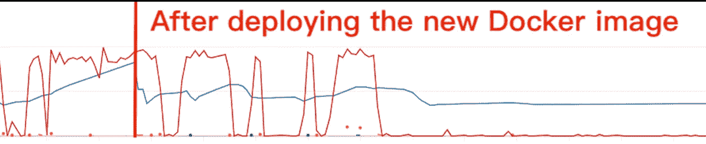

# 如何解决 Django 内存泄漏

> 原文：<https://levelup.gitconnected.com/the-experience-of-solving-memory-leak-of-django-uwsgi-nginx-aws-cdb998244cfb>

django 2+uws gi+Nginx+AWS(ECR+ECS+EC2+ALB+VPC+CloudFront)


图片来源:谷歌

最近，在 AWS 上部署了一个小的 Django 应用程序后，我们遇到了内存泄漏问题。幸运的是，我们最终通过修改 uswgi.ini 解决了这个问题。

在得到这个问题之前，我们用 [uWSGI](https://uwsgi-docs.readthedocs.io/en/latest/) 和 [Nginx](https://www.nginx.com/) 对应用进行了 dockerized，构建了一个镜像，用 CI/CD 推送到 [AWS ECR](https://aws.amazon.com/ecr/) 。之后我们用 [VPC](https://aws.amazon.com/vpc/) 、 [ALB](https://docs.aws.amazon.com/elasticloadbalancing/latest/application/introduction.html) 、 [ECS](https://aws.amazon.com/ecs/) 、 [EC2](https://aws.amazon.com/ec2/) 、 [CloudFront](https://aws.amazon.com/cloudfront/?sc_channel=PS&sc_campaign=acquisition_TW&sc_publisher=google&sc_medium=cloudfront_b&sc_content=cloudfront_e&sc_detail=aws%20cloud%20front&sc_category=cloudfront&sc_segment=165240657802&sc_matchtype=e&sc_country=TW&s_kwcid=AL!4422!3!165240657802!e!!g!!aws%20cloud%20front&ef_id=EAIaIQobChMIvoae68rs6QIVQ6WWCh2ltQvrEAAYASAAEgJc2vD_BwE:G:s&s_kwcid=AL!4422!3!165240657802!e!!g!!aws%20cloud%20front) 进行了部署。

# 问题

起初，它像预期的那样工作。然而，在运行了几个小时后，我们得到了大约 500 个错误。在做了一些研究后，我们发现应用程序的内存使用率几乎是 100%。所以我们增加了内存，设置了软限制。然而，我们发现，当请求数量增加时，内存使用量会增加，而不会减少。也就是说，我们遇到了内存泄漏问题。


图片来源:[https://makeameme.org/meme/memory-leaks-memory-8f1cc7495e](https://makeameme.org/meme/memory-leaks-memory-8f1cc7495e)

我们可以使用一些工具来找到原因并解决它，例如 [tracemalloc](https://docs.python.org/3/library/tracemalloc.html#module-tracemalloc) 、 [objgraph](https://mg.pov.lt/objgraph/) ，或者我们可以将 [DEBUG](https://docs.djangoproject.com/en/dev/ref/settings/#std:setting-DEBUG) 设置为 False。然而，我们没有足够的时间使用工具来找到 bug，即使我们将 DEBUG 设置为 False，问题仍然存在。

# 说明

幸运的是，我们从这篇文章中找到了一个解释— [django 内存泄漏，第一部分](https://blog.gingerlime.com/2011/django-memory-leaks-part-i/)。

> Django 会泄漏内存吗？事实上，不是这样的。因此，该标题具有误导性。我知道。然而，如果你不小心，你的内存使用或配置很容易导致耗尽所有内存和崩溃 django。因此，虽然 django 本身不会泄漏内存，但最终结果是非常相似的。

这是什么意思？简而言之，文章说 Django 进程有一个初始空间，用于在请求到来时将对象加载到内存中。一旦进程处理完一个请求，它将从内存中清除所有对象，并返回到“空”状态。但是，如果要求太大，进程就会增加，永远不会收缩。因此，如果多个大的请求几乎同时出现，Django process 将不仅仅扩展一个流程，而是扩展其中的几个。因此，这些 Django 进程会竞争服务器上的空间。


图片来源:[https://makeameme.org/meme/i-eat-to-5b7c9e](https://makeameme.org/meme/i-eat-to-5b7c9e)

# 解决办法

好，要解决这个问题，我们需要在某些条件下重新启动工人。因此，我们按照[为生产部署配置 uw SGI](https://www.techatbloomberg.com/blog/configuring-uwsgi-production-deployment/)通过添加以下代码来修改 *uswgi.ini* :

```
# Worker Management
max-requests = 1000                  ; Restart workers after this many requests
max-worker-lifetime = 3600           ; Restart workers after this many seconds
reload-on-rss = 512                  ; Restart workers after this much resident memory
worker-reload-mercy = 60             ; How long to wait before forcefully killing workers
```

# 结果

如您所见，在部署新的 Docker 映像之前，内存使用量(蓝线)随着请求数量(红线)的增加而增加，从未减少。之后，在消耗请求之后，内存使用量下降。



内存使用和请求计数

希望这篇文章能帮助你解决你的问题:)。

[](https://blog.gingerlime.com/2011/django-memory-leaks-part-i/) [## django 内存泄漏，第一部分

### 不久前，我在为一些 django 实例优化内存使用。在这个过程中，我设法更好地…

blog.gingerlime.com](https://blog.gingerlime.com/2011/django-memory-leaks-part-i/) [](https://blog.csdn.net/ll641058431/article/details/78268303) [## python-Django 内存泄露问题 _soman 的博客-CSDN 博客

### 一、python 有自动垃圾回收机制（当对象的引用计数为零时解释器会自动释放内存），出现内存泄露的场景一般是扩展库内存泄露或者循环引用（还有一种是全局容器里的对象没有删除）…

blog.csdn.net](https://blog.csdn.net/ll641058431/article/details/78268303) 

[https://www . techatbloomberg . com/blog/configuring-uws gi-production-deployment/](https://www.techatbloomberg.com/blog/configuring-uwsgi-production-deployment/)