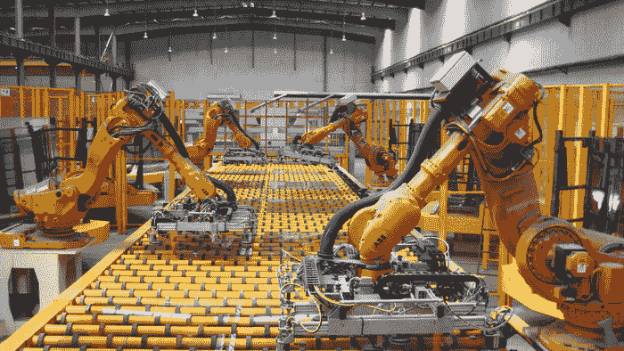
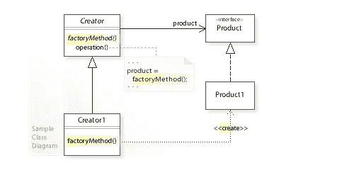

# 围棋中的工厂模式

> 原文：<https://levelup.gitconnected.com/the-factory-pattern-in-go-a584a9467ffd>

惊讶吧——你已经知道如何实现一个简单的工厂了！



工厂设计模式是贯穿软件工程的一种灵活且常用的技术。以制造汽车为例。汽车的基本定义是，它需要车架、车轮、发动机等。汽车可以有很大的不同，从苏丹到卡车，到电动发动机和汽油发动机。工厂模式给一个对象的*通用*行为一个契约，然后这个对象可以有各种具体的实现。

在本文中，我们将研究真实世界用例中的工厂模式、它的 UML 图以及它在 Go 中的实现。

我们开始吧！

# 真实世界的例子

可以应用工厂模式的例子数不胜数。虽然其他模式(如 Decorator 或 Strategy)向现有对象添加了额外的行为或属性，但工厂模式定义了对象本身的创建。

以下是一些使用案例示例:

*   **数据库** —假设您的应用程序当前使用一个数据库，比如 SQL，但是您需要换一个不同类型的数据库。如果已经有了工厂模式，那么为保持程序正常运行而需要修改的代码量将会大大减少。
*   银行业务 —不同的银行账户，如支票账户、储蓄账户或商业账户，不仅可以有不同的属性，还可以有不同的行为。因为它们仍然是某种形式的银行帐户，所以工厂模式可以用来轻松地为用户分配不同的帐户类型。
*   **电脑** —你可以定义电脑的基本类型，如 Windows 或 Mac，它们使用的处理器类型，屏幕宽度等等。

一般来说，当您需要一些依赖于其他对象的对象时，您应该考虑使用工厂模式。本地化复杂对象的逻辑是工厂模式的另一个理想情况，但是重要的是要确保你不要过度抽象你的程序，我们将在后面看到这一点。

# UML 图

工厂模式出奇的简单，因为它能给你的程序带来很大的灵活性。我们的主要目标是以这样一种方式编排抽象，即我们可以轻松地创建对象，而不必知道具体细节是如何实现的。



来自[维基百科](https://en.wikipedia.org/wiki/Factory_method_pattern)

从左上角开始，Creator 对象的目标是为工厂模式定义最高级别的契约。本质上，它需要一些具体的 Creator 对象来实现`factoryMethod()`以便创建产品，同时还需要产品接口由最终创建的对象 `Product1`来实现*。*

这样，我们创建了一个从`Creator`接口开始的依赖循环。因为 Go 本身没有类，所以我们在这里关心的主要问题是，我们需要一个对象接口来创建其他对象，还需要一个接口来创建对象。这就是为什么工厂模式在某种程度上是复杂对象和类型的创建和使用之间的桥梁。

# Go 中的实现

实际上有三种通用类型的工厂实现。简单工厂、工厂方法以及抽象工厂是抽象出对象创建细节的各种方式。在本文中，我们将关注简单工厂，因为它实际上经常在 Go 和工厂方法模式中使用。也许我们会定义一个工厂模式的工厂？

严肃地说，简单工厂就是我们给定一些参数实例化新对象的能力。我们在 Go 中一直这样做，因为没有类，因此没有构造函数方法。例如:

看似琐碎，但`newDog()`方法是一个简单的工厂！

关于 Go 中工厂模式的例子，让我们看看创建不同类型的鸟的例子。让我们首先创建我们的项目文件:

```
$ mkdir factory-pattern-go
$ cd factory-pattern-go
$ touch main.go bird.go birdFactory.go osprey.go ostrich.go
```

`bird.go`文件将包括一个通用 bird 的接口和实现，如下所示。

## 小鸟，去吧

很简单。接下来，我们需要特定类型的鸟类来推迟它们的行为。我们将创造两种我最喜欢的鸟，鸵鸟和鱼鹰！

## 鸵鸟。去吧

## 鱼鹰，走

正如我们所看到的,`osprey`和`ostrich`都扩展了`bird`结构，并具有不同类型的行为。现在我们只需要一个工厂来制造鸟的物体！

## birdFactory .走

现在我们有了工厂模式设置，我们可以简单地通过我们的主 go 文件调用我们的对象。

## main.go

如果我们使用`go run *.go`运行程序，我们将得到

```
What kind of bird is that?
The Common Ostrich cannot fly.
The Western Osprey is flying!
```

你有它！构建工厂模式主要是为了抽象出创建对象背后的细节。这就是为什么它与其他模式(如 Decorator 或 Strategy)配合得很好，这样我们就可以扩展我们创建的对象。我鼓励您扩展这个例子，进行自己的探索。感谢阅读！