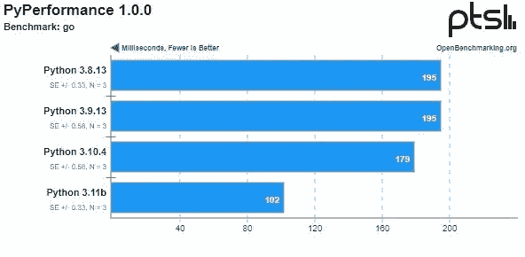

# 迄今最快的 Python:高达 60%的 Faster⚡

> 原文：<https://levelup.gitconnected.com/the-fastest-python-yet-up-to-60-faster-2eeb3d9a99d0>

## 你不会相信它能有多快！

Python 是一种非常受欢迎的编程语言，尤其是由于它在数据科学或人工智能等领域的领先地位。但是，由于易于编码是它的创建目标之一，速度在它的整个开发过程中被忽略了。

事实上，低级语言，比如历史悠久的 C 语言，根据手头的任务，可以产生运行速度比 T2 快 100 倍的代码。当然，线程数量越多，性能差距就越明显。正因为如此，微软自己去年决定资助一个项目，在未来版本中将 Python 的速度提高一倍。

# 新的测试版刚刚投入使用，你可以看出它是新鲜的，随时可以运行

Python 的第一个测试版，也就是最终的[版本 **3.11** 于本月早些时候在互联网上向公众发布。](https://docs.python.org/3.11/whatsnew/3.11.html) [**Python 软件基金会**](https://www.python.org/psf/) 提供的关于这个新版本的性能数据是最受关注的。除了一些变化和特性，这是最吸引人的地方。

这些测试已经在用 Python 编写的 *Ubuntu Linux* 软件上运行，并用 **GCC 编译器**编译，结果显示，在某些情况下，速度**比 Python 3.10 高 60%** (平均*25%*)，而无需对代码进行任何更改。

> 稳定版要到明年 10 月才能上市

在[结果是令人信服的:](https://www.phoronix.com/scan.php?page=article&item=python-311-benchmarks)

## 平均总数

Python 基准(来源: [**Phorotix**](https://www.phoronix.com/scan.php?page=article&item=python311-pyston-pypy&num=1) )

## 基准:去

Python 基准(来源: [**Phorotix**](https://www.phoronix.com/scan.php?page=article&item=python311-pyston-pypy&num=1) )

## 基准:2to3

Python 基准(来源: [**Phorotix**](https://www.phoronix.com/scan.php?page=article&item=python311-pyston-pypy&num=1) )

## 基准:混乱

Python 基准(来源: [**Phorotix**](https://www.phoronix.com/scan.php?page=article&item=python311-pyston-pypy&num=1) )

# 有什么变化？

除了其他原因之外，这一成就之所以成为可能，是因为不需要改变 Python 3.11 的内存消耗，到目前为止，内存消耗保持不变。事实上，Python 的创造者在他们的[文档](https://docs.python.org/3.11/whatsnew/3.11.html#faster-cpython)中澄清了这些变化源于两个主要方面:

*   **快速启动:**“Python 正常启动所需的基本模块，从 **Python 3.11** 开始已经*冻结*。这表明解释器是负责静态分配代码对象的人。”
*   **运行时加速:**“Python 每次调用自己的一个函数，都会生成一个**新帧**。框架的内部结构得到了改进，因此它只存储最重要的信息。过去，它们配备有与内存管理和调试相关的补充信息。”
*   当 CPython 检测到一个 Python 函数调用另一个 Python 函数时，它会建立一个新的框架，并“*跳转到*其中包含的新代码。这允许它**避免调用负责提供 C 解释的函数**。这一变化与前一个变化相关，并影响 Python 操作的一个基本方面。以前，每次调用 Python 函数都会调用一个解释它的 C 函数。

> ***信息来源:***
> 
> [https://www.phoronix.com/scan.php?page=article&item = python-311-benchmarks](https://www.phoronix.com/scan.php?page=article&item=python-311-benchmarks)
> 
> [https://docs.python.org/3.11/whatsnew/3.11.html](https://docs.python.org/3.11/whatsnew/3.11.html)
> 
> [https://www.python.org/psf/](https://www.python.org/psf/)