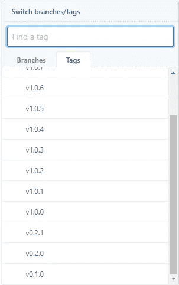

# 西方最快的语义版！

> 原文：<https://levelup.gitconnected.com/the-fastest-semantic-version-in-the-west-1dda2d1f39b1>


语义版本化，通常简称为'**SEM ver【T1]'，是一种以用户友好的方式对发布版本进行版本化的方法。当正确应用时，它有助于确保依赖关系不会“失去同步”,并有助于减轻向后兼容性问题带来的复杂性。**

我们都曾在某个时候看到过 3 个数字表示一个应用程序的版本，而这个应用程序很可能正在实现语义版本化。版本系统由 3 个数字组成，表示应用于应用程序的不同级别的更改。

# 这意味着什么呢？

首先，我们应该花点时间首先理解版本化系统的不同组件的含义，以及它们之间的关系和它们所版本化的代码。

**重大**——*突破性的改动已经发布，应用不再向后兼容*。这通常发生在应用程序的下一个迭代即将发布时，或者有必要将向后不兼容的更改引入现有应用程序时。

**次要** —这些变化是典型的*新特性，并以向后兼容的方式引入*。它们不会减损或修改现有的功能。对于所有的意图和目的，最终用户可能甚至不需要知道这个变化已经实现，除非他们特别要求使用新实现的特性。

**补丁** —这通常被认为是专门针对*漏洞修复*。纠正一些不完整的代码，并确保它按照最初的意图工作。这是用于添加功能的*而不是*。这也不应该修改任何现有的功能，应该是向后兼容的。

于是我们有了**大调**、**小调**、和**补丁**的版本，这些被表示为我们经常看到的 3 个数字。

```
// Major . Minor . Patch
version 1.4.11
```

在上面的示例版本中，我们看到假设的应用程序目前在主版本 1 上，这也被认为是它的第一个“发布”。

次要版本是 4，这意味着 4 个新功能或功能集已经以向后兼容的方式实现，以确保现有用户在使用该应用程序时不会出现问题。

我们还看到代码中发现了 11 个错误，这些错误已经用一些新代码进行了修补，并以确保向后兼容性的方式发布。

重要的是要注意，每当我们增加任何版本时，前面的版本号都应该被重置为零。这意味着如果我们向应用程序引入一些新的和向后兼容的变更(微小的变更)，我们将不得不增加`minor`版本并将`patch`版本重置为零。

也就是说→ `1.4.6`有一个小“凸起”会变成`1.5.0`和*而不是* `1.5.6`，因为新的次要版本还没有发布任何错误修复。


那么我们如何在代码中实现它呢？典型地，一个项目将从版本`0.1.0`开始它的生命，并且将保持“未发布”状态，直到应用程序稳定，并且处于满足所有最低要求的状态，并且能够交付给客户或任何人。

我们应该记住，虽然在数字前面加上前缀“v”可能会向用户表明该数字表示版本——根据 **semver** 指南，官方版本应该只是相关的数字。即`1.2.3`而不是`v1.2.3`

因此，虽然我们可以在一些版本控制系统(VCS)中使用“v”来标记提交，但真正的版本应该保持为没有修改的数字。

例如，对于 GitHub 中的 TypeScript 项目，我们的最新版本可能会被标记为`v1.0.3`，但是在我们的`package.json`中，我们不应该在`version`前面加上“v”。



版本前缀为“v”的 GitHub 标签示例


package.json 中的语义版本示例

# 那么这对我们有什么帮助呢？

嗯，我马上想到的是…

1.  我们可以确保每次都为我们的应用程序安装相同版本的依赖库。从而减轻由于不匹配的依赖关系或未知的改变被发布到库而引起的问题。
2.  我们可以根据增加的版本来确定更新到依赖项的最新版本是否安全。

尽管语义版本化在指明一个库或应用程序的变更包括什么方面走了很长的路，但理想情况下，我们也应该为我们的代码保持一个最新的、干净的变更日志。这显然可以用来与语义版本化协作，来确定依赖关系的最新版本是否适合我们的应用程序。

这一点怎么强调都不为过，一致的版本控制和记录更改的内容非常重要。不仅仅是公共库、项目或应用程序，私有或个人库也是如此。它*最终会*得到回报。


# 我们到了吗？

是啊！我们在那里！我们已经完成了，并准备开始对我们的应用程序和库实现语义版本控制！总会有额外的阅读点来澄清任何问题或困惑，我决定在下面列出其中的几个。

[语义版本 2.0.0](https://semver.org/)
[关于语义版本](https://docs.npmjs.com/about-semantic-versioning)

感谢你阅读这篇文章，我希望你学到了一些新的东西。如果你有任何意见，请随意写在下面的评论区！

再见了。