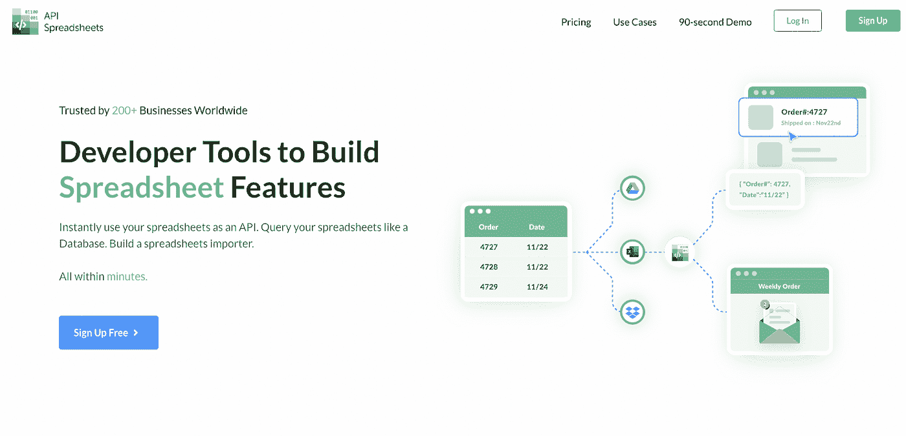
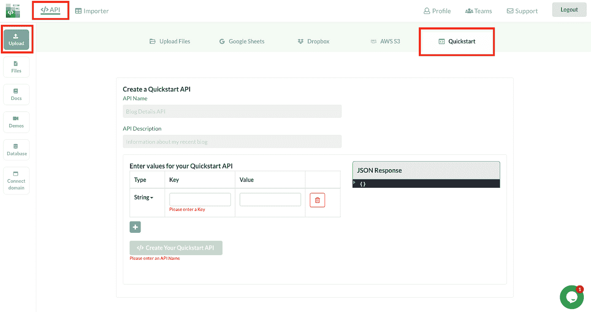
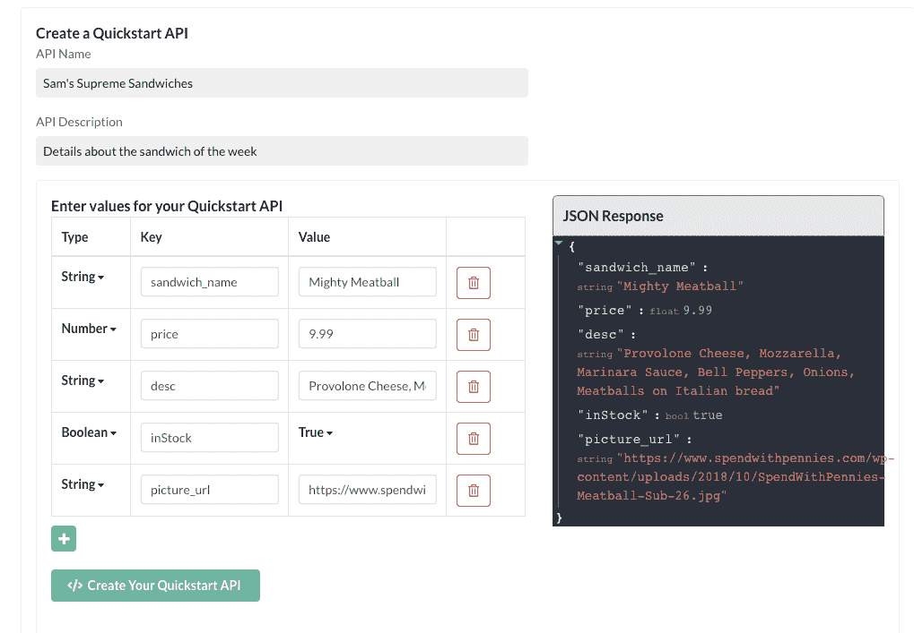
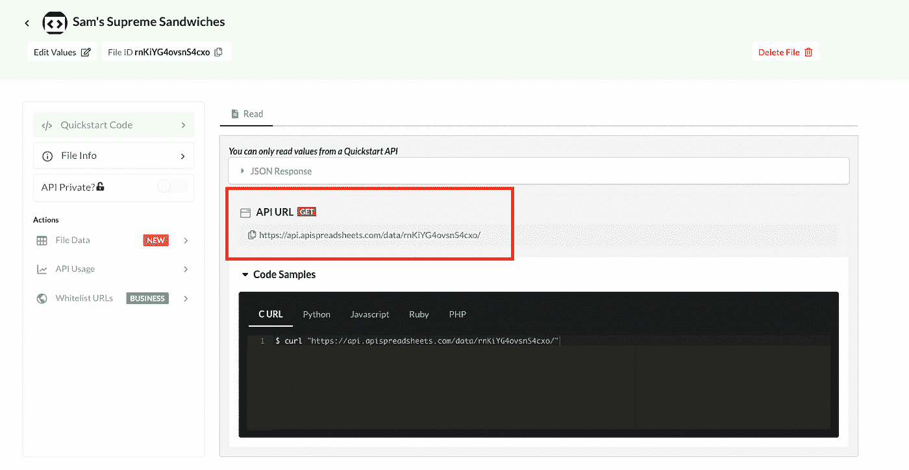
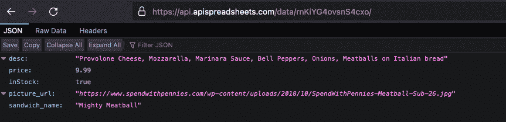
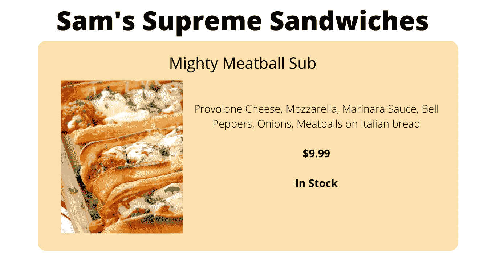
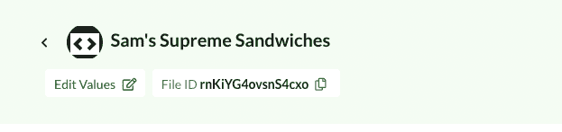
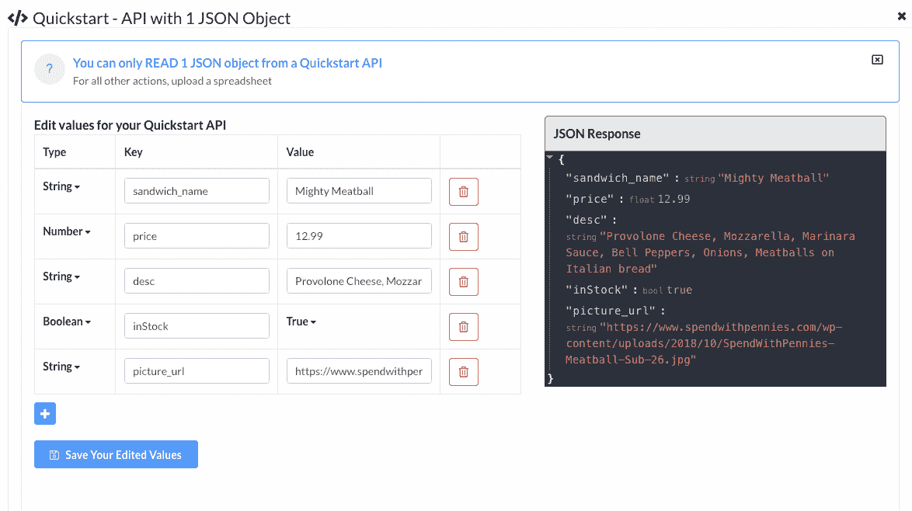
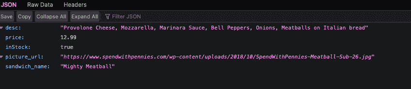
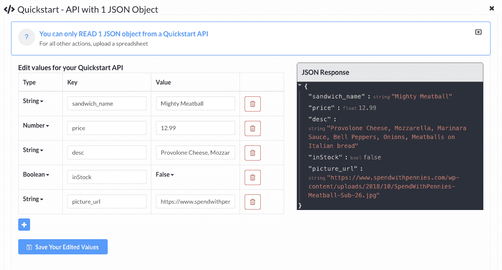

# 获得 JSON API 的最快方法

> 原文：<https://levelup.gitconnected.com/the-fastest-way-to-get-a-json-api-8c88361a6a3>

你是一名网络开发人员，最近有了一个新客户，一家名为山姆至尊三明治的当地三明治店。

他们要求你为他们做一个网站，在那里他们可以显示菜单，特别是本周的三明治。

每周都会有新的一周三明治打折，还得更新。您可以从 JSON API 获取数据，而不是将数据存储在数据库中，每次都必须手动更新。

## 好吧……但是我该怎么做呢？

您可以使用一个名为 API Spreadsheets 的服务来超级快速地获得一个 JSON API！

在 [API 电子表格上登录或创建账户。](http://www.apispreadsheets.com)

在 API 选项卡下，单击上传，然后单击快速启动选项卡。

在这里，我们将输入 API 名称、描述，并输入键的值及其值。

我们已经输入了三明治的详细信息，希望在网站上显示为本周三明治。

按下“创建快速入门 API”后，您将进入文件页面。在这里，您可以获得 API URL 并查看 JSON 对象中的数据。

我们可以看到带有数据的 JSON 对象，这些数据将显示在 Sam 的网站上。太好了！

一周过去了，这个三明治需要变回原来的价格，因为它不再是本周的三明治了。

通常，您必须在数据库中更改它，但现在您可以返回到文件页面并单击“编辑值”

我们已将价格改为 12.99 英镑，并点击保存您编辑过的值。

如果我们回到 API URL 并刷新，新的价格将反映在 JSON 对象中，并立即显示在网站上。

又过了几天，这种三明治仍然很受欢迎。山姆需要你证明今天的菜已经卖完了，因为他们没有配料了。

类似地，您将转到编辑值，并将 inStock 更改为 false。

## **结束语**

使用 API 电子表格的快速启动，你将节省大量的时间和精力来更新网站前端的小变化。

现在就来看看[吧](http://www.apispreadsheets.com)！