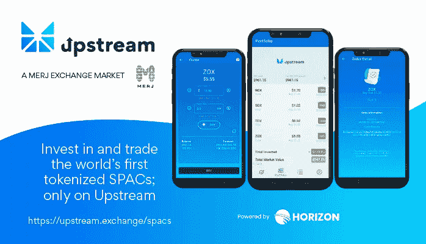
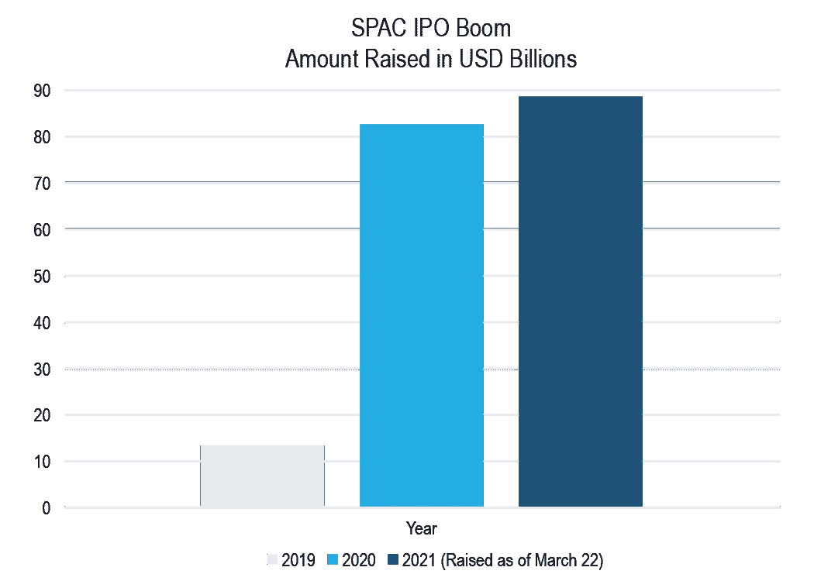

# 令牌化 SPACs 的第一个监管交易所

> 原文：<https://levelup.gitconnected.com/the-first-regulated-exchange-for-tokenized-spacs-58ef62dee1e3>

## Horizon 和 MERJ 在其数字证券交易所“上游”宣布了令牌化 SPACs

凡妮莎·马龙

本周，我们宣布 Horizon 和 MERJ Exchange 将推出符号化的特殊目的收购公司“SPACs”，这些公司将在我们的合资公司“ [Upstream](https://upstream.exchange/spacs) 上市，这是一款革命性的证券交易所和数字证券交易应用。

这是世界上第一个以区块链为基地的特殊目的收购公司 IPO 市场，旨在让所有层次的投资者都能在受监管的证券交易所使用 stablecoins 或 fiat 直接投资于特殊目的收购公司上市的 IPO。Upstream 的首批令牌化 SPAC 预计将于 2021 年 Q2 中期向全球投资者开放，预计特殊目的收购公司 IPO 规模将在 2500 万美元至 1 亿美元之间。

我们正在吸引区块链和金融科技领域具有广泛投资记录的高质量特殊目的收购公司赞助商，以领导首批令牌化 SPAC。也就是说，希望获得这些未来列表的感兴趣的参与者被鼓励现在就加入 https://upstream.exchange/spacs[的等待名单，因为机会将按照先到先得的原则分配。](https://upstream.exchange/spacs)

## 公告的意义是什么？

我们正在为使用区块链技术的普通投资者开启特殊目的收购公司 IPO 热潮。

迄今为止，SPACs 几乎只提供给关系良好的机构投资者。

资料来源:[特殊目的收购公司 IPO 交易统计——由西班牙人](https://spacinsider.com/stats/) | [美国消费者新闻与商业频道](https://www.cnbc.com/2021/02/12/spac-frenzy-blank-check-firms-eye-deals-in-europes-tech-sector.html)

截至 2021 年 3 月 22 日，276 家 SPACs 的 IPO 总收益超过 890 亿美元。2020 年是 SPACs 创纪录的一年，248 家公司筹集了超过 830 亿美元。欧洲最近也加入了特殊目的收购公司竞赛，在 2020 年净赚 4.95 亿美元，预计其他司法管辖区也会效仿。Upstream 的令牌化 SPACs 将首次提供给所有级别的投资者，并在 Upstream 上进行交易，Upstream 是一个受监管的股票交易应用程序，将在 App Store 和 Google Play 上提供。

在上游，用户将体验到一个透明的投资者驱动的市场，没有掠夺性的做市商，[没有卖空](https://horizonfintex.medium.com/gamestop-stock-frenzy-re-ignites-call-for-the-democratization-of-finance-6d44d7175d15)，没有清洗交易或其他市场操纵。

## 标记化 SPACs 如何在上游工作

特殊目的收购公司本质上是一家由行业专家设立的空壳公司，其唯一目的是通过首次公开募股筹集资金，最终将这笔资金用于收购一家正在寻求上市的运营公司。

Upstream 的符号化特殊目的收购公司方法建立在加密投资者在整个“ [DeFi](https://horizonfintex.medium.com/how-upstream-fits-into-the-world-of-decentralized-finance-a07d0fd6405f) 空间使用的相同区块链标准之上。令牌化的 SPACs 将为所有级别的投资者提供区块链以太坊强制实施的透明保本投资。投资者将能够使用 USDC 稳定币或传统法币参与尖端的特殊目的收购公司首次公开募股。交易员将直接在智能手机上控制象征性股票和权证，并在 IPO 后立即开始交易。

一旦特殊目的收购公司管理团队确定了收购，股东将有权在应用程序中投票批准或拒绝收购。所有特殊目的收购公司的 IPO 资金将存放在安全、受监管、独立的托管账户中，如果投资者拒绝收购，他们的投资将得到 100%的回报。

## 管理层语录:

> Horizon 总裁马克·埃伦维茨(Mark Elenowitz)表示:“SPACs 的上升空间几乎只提供给了人脉广泛的机构投资者、华尔街以及私募股权和对冲基金。”。“Upstream 将通过一个具有区块链安全性的用户友好型应用程序，为来自世界各地的日常投资者提供透明、公平的 SPACs 访问权限。
> 
> “提供有关 Upstream 下一代的 SPAC，digital marketplace 将让投资者公平进入蓬勃发展的特殊目的收购公司 IPO 市场。Horizon 首席执行官 Brian Collins 表示:“上游交易商将体验到在区块链上透明显示和执行的交易，没有掠夺性做市商、卖空、清洗交易或其他市场操纵。
> 
> MERJ 首席执行官 Ed Tuohy 表示:“市场最近显示出对上市、保荐人主导的交易的兴趣。上游将为希望进入这一趋势的发行者和投资者提供直接的解决方案。我们正在通过技术的使用，大规模地使资本市场民主化。”

请务必在 https://upstream.exchange/spacs加入 Upstream 的投资者等候名单。如果你来自一个对在 Upstream 推出特殊目的收购公司感兴趣的成功交易团队，请通过 **hello@upstream.exchange** 联系我们。

## **关于上游:**

MERJ 交易所市场 Upstream 是一个完全受监管的全球数字证券交易所。该交易所由 Horizon 专有的匹配引擎技术提供支持，将使投资者能够直接从应用程序中交易 SPACs、高增长初创公司和其他独特资产类别的股票:[https://upstream . exchange](https://upstream.exchange/)。有兴趣的发行人可以通过 [hello@upstream.exchange](mailto:hello@upstream.exchange) 联系团队。

## **关于 MERJ:**

MERJ Exchange 作为一个完全受监管和获得许可的综合证券交易所、清算系统以及数字和非数字证券的存管机构在上游运营。它是世界交易所联盟的附属机构，被英国税务海关总署认可，是国家编号机构协会的正式成员，也是美国场外交易市场的合格外汇交易所。MERJ 也是可持续证券交易所倡议的成员。

## **关于地平线:**

Horizon 是一家金融科技公司，通过一套用于证券合规发行、管理和二级交易的集成软件来构建和推动全球证券交易所。我们的内部解决方案结合了华尔街和硅谷，为美国和全球的下一代证券发行和交易提供动力:[https://www.horizonfintex.com/](https://www.horizonfintex.com/)。

## **免责声明:**

上游是 MERJ 交易所市场。MERJ 交易所是一家持牌证券交易所，是世界交易所联盟的附属机构，也是 ANNA 的正式成员。MERJ 在从发行到交易、清算、结算和注册的整个资产生命周期中支持传统和数字证券的全球发行者。它经营一个公平和透明的市场，符合国际最佳做法和金融市场运作原则。Upstream 不认可或推荐在其应用程序上买卖的任何公共或私人证券。Upstream 不提供任何形式的投资建议或推荐。Upstream 提供的所有服务都是为自主的客户设计的，这些客户在没有 Upstream 的帮助或协助的情况下做出自己的投资决定。客户必须遵守其司法管辖区的适用法律。通过访问网站或应用程序，您同意受其使用条款和隐私政策的约束。上游的公司和证券上市只适合熟悉并愿意接受投机性投资高风险的投资者，通常是处于早期和发展阶段的公司。不能保证任何特定公司证券的估价是准确的，或者与市场或行业的比较估价一致。投资者必须能够承受市场波动和投资损失。在上游上市的公司必须履行重要的持续公司义务，包括但不限于披露、备案和通知要求，以及遵守适用的定量和定性上市标准。

> 本博客不构成出售证券的要约，也不构成在任何不允许此类要约或邀约的司法管辖区购买证券的邀约。
> 
> 1 [特殊目的收购公司 IPO 交易统计—由 SPACInsider](https://spacinsider.com/stats/)
> 
> 2 [美国消费者新闻与商业频道](https://www.cnbc.com/2021/02/12/spac-frenzy-blank-check-firms-eye-deals-in-europes-tech-sector.html)