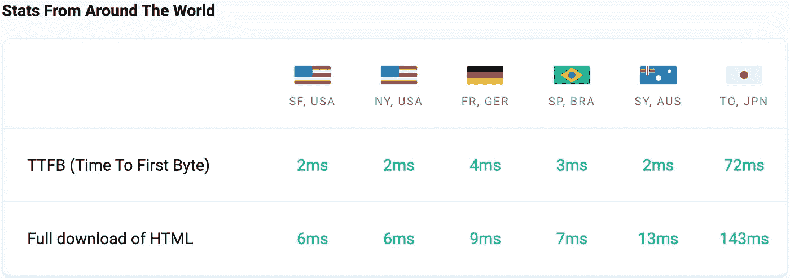

# 五分钟免费网站托管指南！

> 原文：<https://levelup.gitconnected.com/the-five-minutes-guide-on-hosting-a-website-for-free-1b711106b415>

在本指南中，我想向你展示如何在部署下一个应用或网站时节省精力和成本。非常简单，整个过程不到五分钟！我们将设置持续集成(CI)来将您的 vue.js 应用程序部署到 Netlify。这个过程对于任何其他框架都是一样的。我将通过主界面，注册并建立一个自定义域，并与 HTTPS 安全的一切。我真的认为你可以按照这个指南为自己节省一些时间！


在 [Unsplash](https://unsplash.com?utm_source=medium&utm_medium=referral) 上由[Christina @ wocintechchat.com](https://unsplash.com/@wocintechchat?utm_source=medium&utm_medium=referral)拍摄的照片

在这篇文章中，我将向您介绍我在向 Netlify 部署项目时采取的步骤。

Netlify 类似于 AWS 的另一个云服务，他们提供了一个巨大的免费计划，流量高达 100 GB/月。此外，与 AWS 和微软 Azure 相比，我喜欢它们出色的用户体验。下面，我将描述让你的应用启动并运行的所有步骤。

# 为什么是 Netlify

Netlify 是我信任多年的虚拟主机平台。如上所述，他们有一个庞大的免费计划，平台有一个惊人的 UX。

他们还提供了一个内置的 CDN，这极大地影响了你的网站的性能。

只要看看我博客的速度指标就能说服自己了。


由[https://testmysite.io/](https://testmysite.io/6395bf8aadd2567963f5beba/www.the-koi.com)提供的指标



# 开始之前

首先使用你的 GitHub 帐户或其他方法登录，然后你会来到你的主页，我稍后会描述它们的元素。

## 设置 GitHub 配置项


从主页菜单点击创建一个新站点，选择 GitHub，授权 Netlify 到你的 GitHub 账户，然后选择所有的库或者只选择一个，就像我在左边安装 Netlify 一样。

在下一步中，选择要用来构建站点的存储库。

在步骤 3 中，您需要指定您的构建设置，这很大程度上取决于您的应用程序。我将描述 gridsome 和 Nuxt.js 的过程。基本上它对任何其他节点项目都是一样的。只需在节点模块中执行您的构建命令。

您可以在脚本下的 package.json 中找到这一点。

```
 "scripts": {
    "build": "nuxt build",
    "dev": "nuxt dev",
    "generate": "nuxt generate",
    "preview": "nuxt preview",
    "https": "nuxt dev --https"
  },
```

当你想让**部署一个** **nuxt 应用到 Netlify** 时，应该是 **nuxt generate** 如 package.json 所示，目录保持不变，而对于 **plain vue** 它保持 **npm run build。为每一个其他框架寻找这些命令也不是什么难事，通常会在框架文档中描述。**

当你想要**部署一个** **Gridsome app 到 Netlify，**你的构建命令是 **gridsome Build** ，发布目录是 dist。


就是这样！点击**部署站点**，Netlify 将为您完成剩下的工作！只需等待几分钟，您的网站就可以启动并运行了。很棒吧？

# 如何注册域名

上传完成后，您可以继续为您的项目注册域。

说到域名注册，你有多种选择。有这么多的平台，你可以购买和注册域名。有的便宜，有的不便宜。我可以推荐 **namecheap** ，[用我的链接你可以注册一个. com 域名，起价 6.98 美元！*](https://shareasale.com/r.cfm?b=1781996&u=3479519&m=46483&urllink=&afftrack=) 听起来很划算！

[现在，Namecheap 也有高达 92%的圣诞节优惠！*](https://shareasale.com/r.cfm?b=2231457&u=3479519&m=46483&urllink=&afftrack=)

另一种选择是使用 Netlify 服务，只需在那里注册即可，他们会为您处理所有的 DNS 问题，但这并不像上面那样便宜。


我已经直接在 Netlify 中注册了我的域名，只需提交我的支付信息并确认我的购买即可。几秒钟后，[https://www.the-koi.com/](https://www.the-koi.com/)开始运行了！

对于您的 SSL 证书，您只需点击验证 DNS，然后一切都应该是好的，你有一个很好的可信的在线网站！

几分钟后重新加载，您的域管理选项卡应该如下所示:


就是这样！你的网页是在线的，现在你可以专注于你的搜索引擎优化和如何获得流量。

# 结论

将您的代码部署到 Netlify 上真的不需要时间，并且您最终会拥有一个快速而安全的服务器来为您的内容提供服务。

与 WordPress 相比，你也是按预算运行的，你唯一的花费就是域名租金，仅此而已！

快乐编码，

亚历克斯。

最初发表于 the-koi.com

# 参考

[网络生活](https://www.netlify.com/partners/technology/)

[网站速度测试](https://testmysite.io/6395bf8aadd2567963f5beba/www.the-koi.com)

标有*的链接是附属链接。