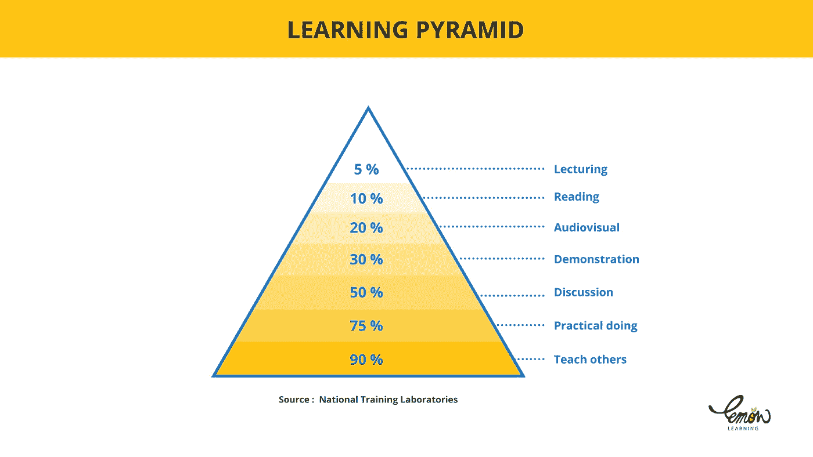
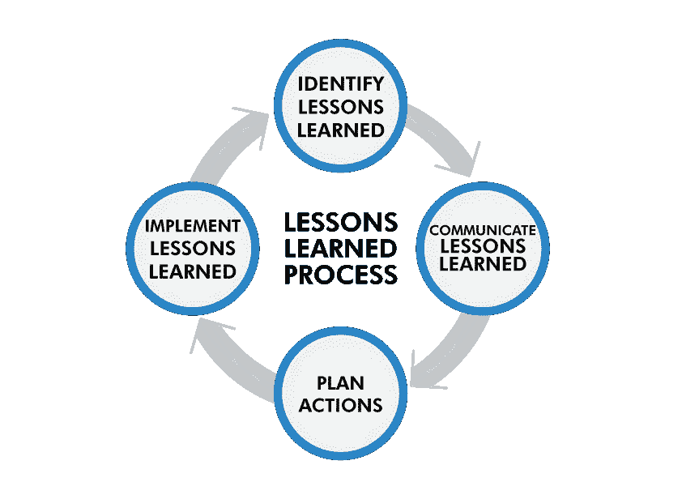

# 这个月我从小创始人身上学到的最有趣的五件事

> 原文：<https://levelup.gitconnected.com/the-five-most-interesting-things-i-learned-from-tiny-founders-this-month-5d9c379f51c2>

## 当你没有很多资源时，你可以用另一种方式做事。

作者: [Pixabay](https://www.pexels.com/sk-sk/photo/zviera-pes-domace-zviera-roztomily-39317/)

如果一个企业价值 5000 万美元，它就不再酷了。

一场小型创业者的新运动正在悄然兴起。我称他们为“小创始人”。

小创业者是正在改变世界的创业小兄弟。我最喜欢的是:

*   [levelsio](https://twitter.com/levelsio)
*   [永福](https://twitter.com/yongfook)

我从 2018 年开始跟踪他们。他们不是普通的创业公司。他们做的事情与众不同。

以下是我从他们身上学到的经验，你可以应用到你的业务中。

# 微小的创始人不能做所有的事情

我过去认为我必须自己做每件事。还能怎么出人头地？

当你小的时候，没有犯错的空间。这是件好事。

学会什么都不做。学会授权。建立一个团队。学会外包。

如果你什么都做，当你变得越来越大，不得不扩展时，你会很挣扎。

如此多的小创业者告诉我“我没有时间做 X 或 y，我能外包给谁呢？”这个问题问得好。

现在他们已经学会找人外包他们没有时间做的任务。

他们知道他们自己做不到。当你意识到这一点，一切都会改变。

# 你不需要成为技术专家

如果你缺乏技术技能，那就去找开发人员。

如果你没钱请开发人员，那就动手学习技术。如果你不想学技术？不使用代码或低代码工具。

和我交谈过的一个创始人给我讲了一个他如何没有编码经验的故事。他全靠自学学会的。

最好的学习方法是将这些技能应用到实际项目中。

*   运用技能比自学更快
*   运用这些技能有助于你看到新技能的用处
*   运用技能将技能变成一种超能力(因为你得到了一些结果)

[原始来源](https://www.lemonlearning.com/storage/Articles/Learning%20pyramid.png)

# 你的产品不需要比竞争对手更好

大多数人被教导在人生的每个阶段都要竞争。竞争是一种被用来压制进步和创新的工具。

当你钱少人少时，你就没有希望与亚马逊或谷歌这样的公司竞争。然而，许多企业家仍然试图这样做。

把更大的竞争想象成在你面前晃来晃去的胡萝卜。如果你一开始打不过他们，那就不要打。

利用竞争来吸引你的第一个付费客户。一旦你有了一些钱，你就可以做一些不同的事情，看看人们是否喜欢它。

# 这不是钱的问题

当你没有很多钱的时候，这不是钱的问题。

是体验的问题。是目的的问题。而是一路上遇到的人。你被迫建立一个社区。你被迫学习如何营销。你被迫学习如何获取客户。

这些技能是你可以在其他投资中使用的技能。

小创业者不会把他们的创业视为失败。他们将自己的创业视为一次经验，从中获得了宝贵的教训。

[原始来源](https://www.prismenergy.co.uk/wp-content/uploads/2021/05/Unknown-2.png)

# 你可以拥有自己版本的不公平优势

美国天使投资人 Naval Ravikant 以拥有最佳不公平优势而闻名。

如果你问他，他会告诉你那是因为他无耻。

他的意思是为了达到目标他会不择手段。他不会回避任何事情。当他想学习一项技能时，他就会去做。

他说，尽量不要想太多。去做吧。

我的不公平优势是我很自律。

10 年来，我每天至少花一个小时写代码。我连续三年练习在线写作。我通过给人们发电子邮件来学习营销。

我并不羞于承认我的纪律给了我不公平的优势。

我有我的不公平优势，你找到你的。

# 最后的话

向小创始人学习是令人惊讶的。

我要继续听他们的故事。我希望你也是。

倾听他们，然后想出如何做一些小事，然后慢慢地把它做大。

[***现在就订阅***](https://bernardbad.medium.com/subscribe) ***所以你不要错过我接下来的故事。***