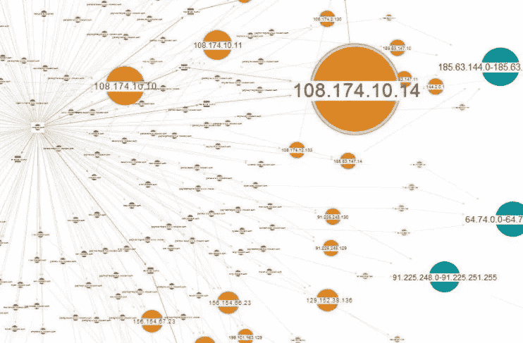
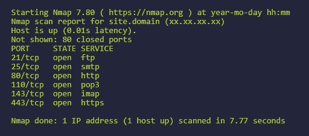
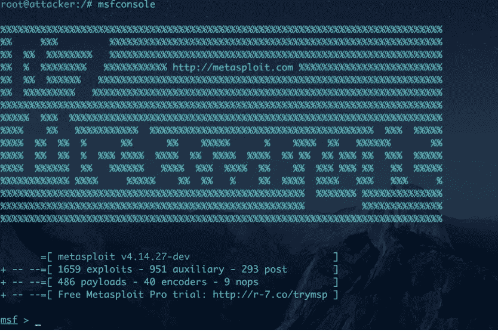

# 渗透测试的五个阶段

> 原文：<https://levelup.gitconnected.com/the-five-stages-of-a-penetration-test-2384b011ee8a>

渗透测试是一种滥用组织网络的方法，目的是找出如何更好地保护它。

# 什么是网络安全？

渗透测试是我们可以称之为道德黑客的工作。他们认为自己是心怀不轨的黑客，攻击自己的系统。这有助于他们了解客户网站的优势和劣势，并保护他们的组织资产。

由于大量公司远离网络，网络安全是最好的领域之一。网络威胁不断增加，网络罪犯正在寻找新的方法来利用他们的系统。

做渗透测试不是一个简单的过程，需要很多时间。它会经历多个阶段，直到找到漏洞。成功利用网络需要正确的工具、强大的技能，最重要的是耐心。

# 研究公司

为了成功地执行笔测试工作，这是您需要做的第一步。研究该公司有助于您找到他们使用的技术以及常见的安全缺陷。你收集到的关于目标的信息迟早会派上用场。

钢笔测试者为此使用的工具包括谷歌和互联网上的许多其他免费工具。一旦你收集了足够的信息，你就可以列出你对这家公司的了解，这样你就更容易理解了。

重要的是，在第一步中，你不要做任何实际的测试。你只需要从一个局外人的角度收集关于这个主题的情报，而不需要使用特殊的工具。

# 检查

现在你真的开始扰乱公司现有的系统了。您应该开始发送数据包，以确定开放的端口、IP 地址、操作系统信息等等。试图通过发送数据包和拒绝服务来中断目标系统。

用于扫描网络的最佳工具之一是 Nmap。它将有助于绘制网络图，并提供有关系统的大量信息。

Nmap 还提供了许多 CLI 选项，包括扫描导出，您可以将其导入到利用工具中。

# 渗透系统

这个阶段包括尝试用以前收集的信息渗透系统。您将尝试获得并维护对现有系统架构中不同点的访问。

要认为这是成功的，您至少应该获得用户级别的访问权限，因为从那里您可以尝试升级到更多的权限。

执行漏洞利用的最佳工具之一是 Metasploit，它被大多数 pen 测试人员广泛使用。该工具经常更新，一般来说使用简单，但效果很好。您可以将您的扫描结果与发布在**常见漏洞和暴露**数据库上的可用漏洞进行匹配，并使用 Metasploit 中的漏洞攻击目标。

# 能够持续访问系统

在经历了所有的艰苦工作后，你需要一种方法来一直维护它。这就是后门或键盘记录器发挥作用的地方。一旦你对系统有了更高的访问权限，你就可以安装任何你想要的东西。

米卡·鲍梅斯特在 [Unsplash](https://unsplash.com?utm_source=medium&utm_medium=referral) 上的照片

您可以安装特洛伊木马、rootkits 和其他后门程序来帮助您持续访问。Rootkits 非常危险，在网上随处可见。你可以通过从不可信的来源下载一个文件来获得一个 rootkit，可怕的是你不知道它是什么时候被安装的。

特洛伊木马也非常可怕，它们的行为就像普通软件一样，但其中安装了恶意代码。通常，这些是在 torrents 的盗版文件中找到的。可以用各种理由，总是居心不良。

# 做报告

这是渗透测试的最后阶段，非常重要。如果你不这样做，你会被认为是一个攻击者。

照片由[威廉·艾文](https://unsplash.com/@firmbee?utm_source=medium&utm_medium=referral)在 [Unsplash](https://unsplash.com?utm_source=medium&utm_medium=referral) 上拍摄

您需要记录您发现漏洞和弱点的过程，并以专业的方式向公司展示。通过这种方式，公司可以准确地知道弱点在哪里，并做出相应的反应。

# 结束语

渗透测试和网络安全是很好的职业选择，如果你很熟练，你可以赚很多。每天都有新的网站和设备上线，因此利用系统的机会总是存在。因此，帮助这些新公司在互联网上感到安全是笔测试员的工作。