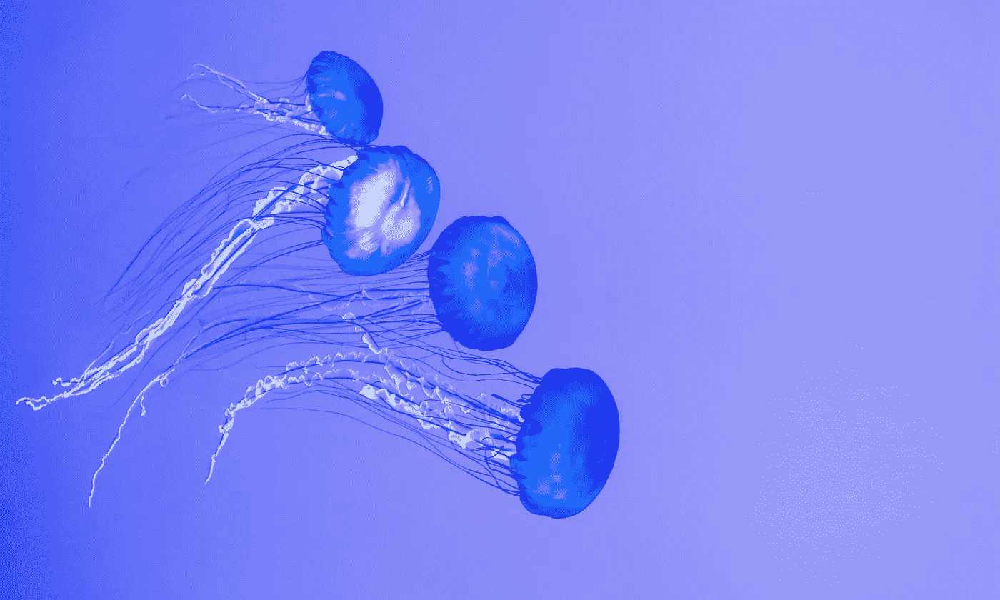
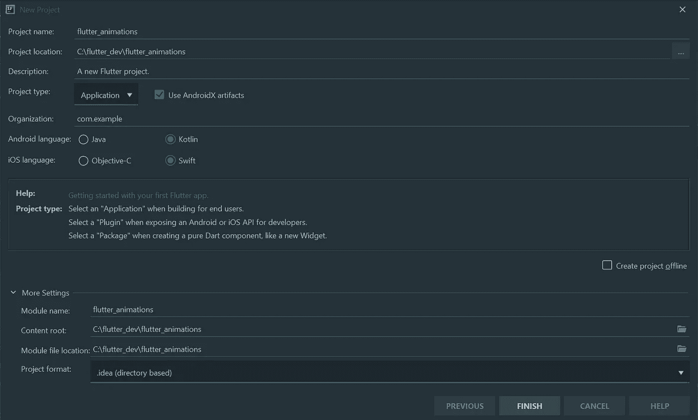
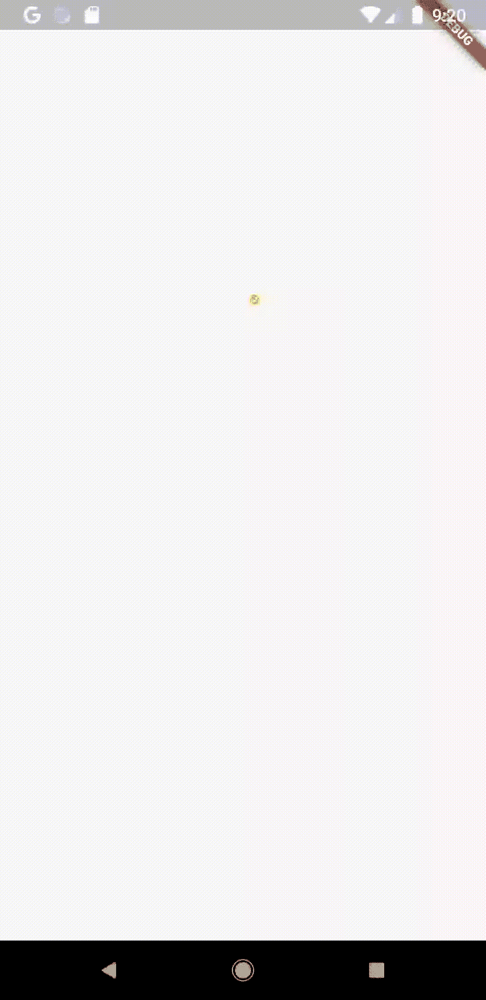
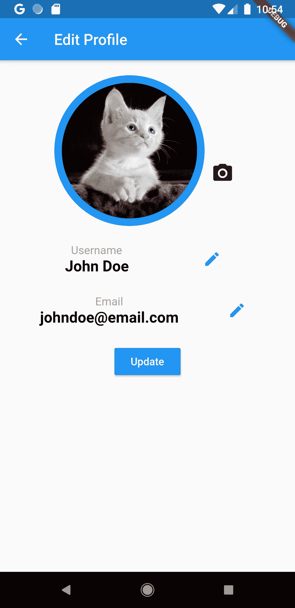
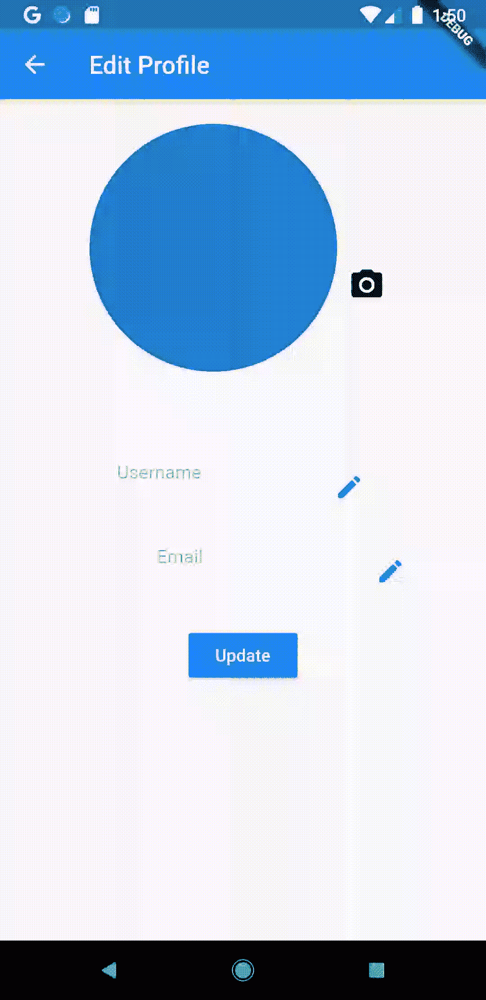
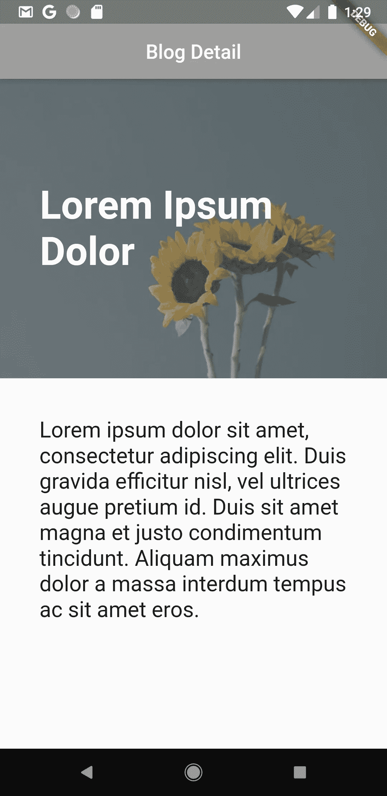
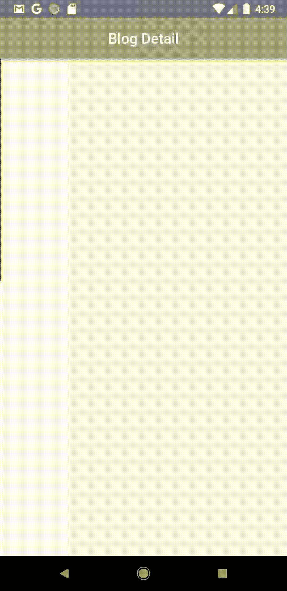

# 动画和用例的 Flutter 初学者指南

> 原文：<https://levelup.gitconnected.com/the-flutter-beginners-guide-to-animations-and-use-cases-14407d44efc5>



照片由来自[佩克斯](https://www.pexels.com/photo/blue-jellyfish-illustration-2166927/?utm_content=attributionCopyText&utm_medium=referral&utm_source=pexels)的[斯科特·韦伯](https://www.pexels.com/@scottwebb?utm_content=attributionCopyText&utm_medium=referral&utm_source=pexels)拍摄

学习如何制作动画对于 flutter 初学者来说似乎总是令人望而生畏。在 flutter 中，这是一个非常广泛的话题，但是一旦你理解了基础和一点高级的部分，你就可以在这个基础上继续发展，并且变得非常擅长。在本教程中，你将学习如何制作不同类型的动画，你也将看到你最有可能使用它们的实例。

在 github [上找到这个教程的代码报告](https://github.com/kehindeegunjobi93/flutter-animation-tutorial)

# 入门指南

让我们从创建一个新的颤振项目开始。如果你像我一样使用 IntelliJ IDE，那就简单了。点击**文件>新建>项目**。选择 **Flutter** ，给项目起个名字。我把我的命名为 **flutter_animations** ，然后点击 next。



创建新项目

一旦有了样板代码，就在 lib 文件夹中创建一个新的 dart 文件，并将其命名为 **basics_screen** ，并使其成为一个名为 BasicsScreen **的有状态小部件。**通过将 **main.dart** 中的 MyHomePage(标题:“Flutter Demo Home Page”)更改为 BasicsScreen()，使您的应用程序在加载后立即指向它。

# 基础知识(非常重要)

在 flutter 中开始创建动画有很多方法，但是无论你选择哪种方法，你都必须知道 **Animation** 类和 **AnimationController** 类，它们用于控制动画类。在你的类中声明它们。然后放一个 *initState* 在你将要使用它们的地方。

*   我们声明了**动画**类和用于控制动画类的**动画控制器**类。我们将它们设置为 init 状态，这样屏幕一加载，我们的动画对象就首先加载。
*   **动画控制器**接受多个参数，其中一个必需的参数是 **vsync** ，它接受**这个**对象。这个 **vsync** 帮助 flutter 管理动画过程中出现在屏幕外的小部件，以防止**不必要的**渲染和内存泄漏。
*   然而，单独添加**这个**会返回一个错误，而没有扩展一个被称为**SingleTickerProviderStateMixin**的 **tickerprovider** 抽象类。这是一个控制动画运行时每秒帧数的 mixin。点击阅读更多关于 dart [中](https://resocoder.com/2019/07/21/mixins-in-dart-understand-dart-flutter-fundamentals-tutorial/)[混合](https://resocoder.com/2019/07/21/mixins-in-dart-understand-dart-flutter-fundamentals-tutorial/)的信息。
*   我们还为控制器添加了一个 **Duration** 类，让动画知道它应该运行多长时间。这将运行 3 秒钟。

现在我们来上动画课。动画类本身并不关心你的屏幕上正在运行什么。它只生成两个值之间的数字范围，并帮助管理动画的状态。它还做了其他我们以后会看到的事情。Flutter 为我们提供了不同种类的动画。我们将利用**曲线动画**。在 init 状态中，在 **animationController** 行之后添加以下代码。

```
animation = CurvedAnimation(parent: animationController, curve: Curves.*easeIn*)
 ..addListener(() {
   setState(() { });
 });
animationController.forward();
```

*   我们将两个参数传递给 CurvedAnimation。**父**接收我们之前定义的控制器，所需的**曲线**定义我们将使用的实际动画类型。
*   然后就是**..addListener** 。**..**语法在 dart 中被称为[级联操作](https://www.w3adda.com/dart-tutorial/dart-cascade-notation)，与编写 **animation.addListener** 相同。我们用它来设置一个状态，就像我之前说的那样。
*   **animation controller . forward**用于开始播放动画。

flutter 中的动画占用大量资源，因此在使用后通过调用 dispose 方法(与 initState 方法相反)立即处置控制器是很重要的，也是必需的，如下所示:

```
@override
*void* dispose() {
 *super*.dispose();
 animationController.dispose();
}
```

这个应用程序现在仍然没有做任何事情，但是这一节的重点是充分理解动画类，看看它有什么能力。让我们通过在控制台中从我们之前定义的 setState 中打印出来来查看它的值。

```
animation = CurvedAnimation(parent: animationController, curve: Curves.*easeIn*)
 ..addListener(() {
   setState(() {
      debugPrint(animation.value);
   });
 });
```

现在运行您的应用程序，并在它运行时检查控制台。您应该会在控制台上看到一些打印出来的数字。这些是你的动画类的值。最后一行的数字应该从 0.0 开始，到 1.0 结束。还记得我们之前学过，动画包含两个值之间的一系列数字。这是两个值。

# 动画 1

## 用例:闪屏

现在我们已经了解了基本情况。让我们创建一个带有动画标志的闪屏。创建一个新的 dart 文件，并将其命名为 animation_screen1.dart。使其成为一个有状态对象，并将其命名为 Animation1。将前一个文件中的代码复制并粘贴到其中。

我们将使用另一种类型的动画称为补间动画。 [Tween](https://flutter.dev/docs/development/ui/animations/tutorial#tween) 是一个无状态对象，接受一个 begin 和一个 end 属性。我们看到 animation.value 如何打印出 0.0 到 1.0 之间的数字。使用 Tween，您可以将该范围控制为带有开始和结束参数的任意一组数字，就像我们在下面的代码中所做的那样。

```
@override
*void* initState() {
  *super*.initState();
  animationController = AnimationController(vsync: *this*, duration: Duration(seconds: 5));

animation = Tween(begin: 150.0, end: 500.0).animate (animationController);
}
```

*   我们添加了 150.0 作为开始值，500.0 作为结束值。这些值不是神圣不可侵犯的，当动画开始运行时，您可以随时更改它们。

在这个演示中，我们将为闪屏制作一个标志动画。我将使用一个图标，你可以使用一个图像，如果你有一个。将以下代码添加到您的构建方法中，使您的徽标具有动画效果:

*   我们使用一个定位小部件来放置图标，并将其顶部值设置为 tween 类提供的值。我们还在左边的属性上使用了 MediaQuery，将它放在屏幕的中央
*   我们使用 ScaleTransition 小部件的 scale 属性来管理图标的动态大小

我们得到以下结果



调整 Tween 类 begin 和 end 属性中的值，以便更好地理解流程，但要确保 end 值始终较高。还可以将 animationController.forward 设置为 animationController.repeat，以保持动画连续运行。

# 动画 2

## 用例:用户配置文件页面



用户资料屏幕

在这一节中，我们将使用不透明颜色样式来介绍构成个人资料页面的不同小部件。创建另一个 dart 文件并将其命名为 animations_screen2，并使其成为一个有状态的小部件，我将它命名为 mine UserProfile。这是我们最小用户资料页面的代码。

*   我们创建一个带有应用程序栏的个人资料页面和一个带有头像、全名和电子邮件文本小部件的用户个人资料屏幕。

接下来，我们添加动画类的重要部分。滚动条提供程序、动画控制器、initState 和 dispose 方法。现在我们可以开始了，我们可以开始为组成屏幕的不同部件声明动画类。

```
Animation avatarAnimation;
Animation divider;
Animation nameAnimation;
Animation emailAnimation;
```

头像会慢慢地从无到有出现，所以我们只是将保存图像的大小框的高度和宽度值更改为 *avatarAnimation.value* 以使其增长，我们还会给它一个从 0.0 开始到 500.0 结束的十二动画。

有很多方法可以在 flutter 中制作动画，对于 nameAnimation 和 emailAnimation，我们将在 tween 类中使用曲线动画。我们还引入了 Interval 类来定制动画的时间。

```
nameAnimation = Tween(begin: 0.0, end: 1.0)
    .animate(CurvedAnimation(parent: animationController, curve: Interval(0.350, 0.450, curve: Curves.*easeIn*)));
```

我们有以下内容:



用户配置文件屏幕动画

# 动画 3

## 用例:博客详细信息屏幕

在本节中，我们将制作这个博客详细页面的动画，使特色图像和文本同时流入屏幕。我们不会在这里详细讨论，因为我们已经对事情的工作原理有了很好的理解。以下是博客详细页面的完整代码

*   我们将图像、标题和帖子存储在三个独立的容器小部件中，这样我们就可以分别制作每个小部件的动画。

您应该看到以下屏幕



博客详细信息屏幕

我们将分别制作图像、标题和帖子的动画，所以我们先声明**动画**类和**动画控制器**类

```
AnimationController animationController;
Animation imageAnimation;
Animation titleAnimation;
Animation postAnimation;
```

我们在 init 状态下初始化三个动画变量，用稍微不同的间隔值来控制它们流入屏幕的时间。我们还将 begin 值设为-1，这样它们就可以从屏幕的左侧流入。

需要注意的一个重要补充是我用来包装脚手架的 **AnimatedBuilder** 部件。这是一种在 flutter 中运行动画的更有效的方式，就像我们在这里做的那样。动画实际上没有工作，直到我把它包在动画生成器。动画构建器小部件接受两个属性。接受我们的控制器和构建页面的生成器的动画属性。

我们还用 transform 小部件包装了前面讨论的每个容器小部件。 [Transform](https://www.youtube.com/watch?v=9z_YNlRlWfA) widget 帮助在 flutter 中移动或旋转物体。我们专门用它来移动屏幕上带有动画变量值的小部件。

这是我们经历过的一切。



我们已经能够在 flutter 中浏览动画类的基础知识。动画下面还有很多章节我们没有在本教程中介绍，但是有了这里学到的知识，你可以很容易地掌握其他概念。

将来我可能还会涉及更高级的主题。请在评论区给我你的评论和修改，或者通过我的电子邮件**keindeegunjobi93@yahoo.com**联系我

你也可以在 github 的[这里](https://github.com/kehindeegunjobi93/flutter-animation-tutorial)找到代码回购