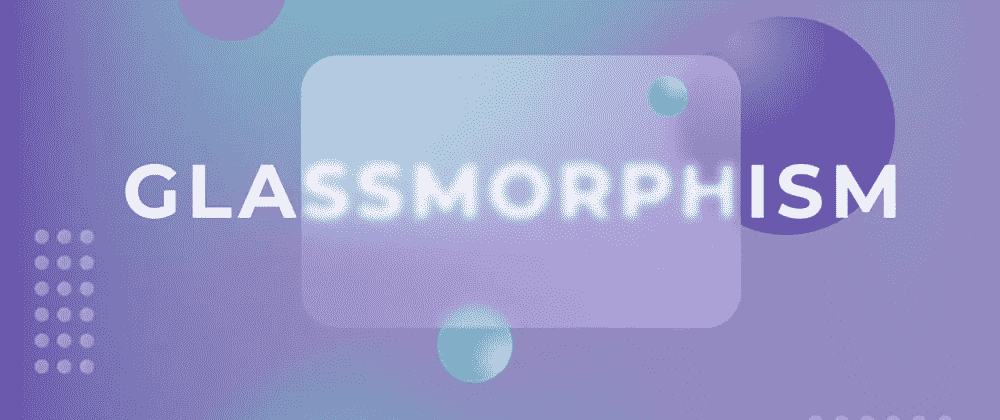
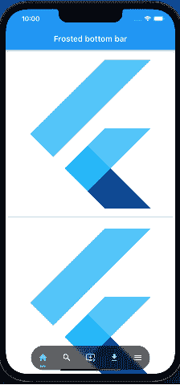

# 飘动中的磨砂浮底杠

> 原文：<https://levelup.gitconnected.com/the-frosted-floating-bottom-bar-in-flutter-f9f523ff024d>

不管你的软件后台有多强大，后台完成的功能有多复杂，不管你的后台有多安全。对最终用户来说，唯一重要的是你的软件有多容易操作。而 UI/UX 在让你的软件具有可操作性方面扮演着最重要的角色。UI/UX 的最新趋势包括开发人员试图在他们的软件中使用的玻璃态和核态。例如，苹果公司在他们的网站、应用程序和操作系统中的许多软件中都使用了 Glasmorphism。

通过跟踪 UI/UX 的最新趋势，我在 Flutter 中制作了第一个名为 Frosted[**Floating Bottom Ba**](https://pub.dev/packages/floating_frosted_bottom_bar)r 的包，它也对用户的滚动事件做出反应。包名本身就说是**磨砂**描绘玻璃形态，**浮动**表示不固定，**底栏**表示用于底部导航。有了所有这些，对用户滚动事件的反应就像蛋糕上的樱桃。



# 演示



磨砂浮动底条

# 好吧，怎么用？

首先，使用 flutter pub get 命令添加包

```
flutter pub add floating_frosted_bottom_bar
```

这将向您的包的 pubspec.yaml 中添加一行代码(并运行一个隐式的`flutter pub get`):

```
dependencies:
  floating_frosted_bottom_bar: ^0.0.1
```

# 导入它

现在，在您的 Dart 代码中，您可以使用:

```
import 'package:floating_frosted_bottom_bar/floating_frosted_bottom_bar.dart';
```

[](https://pub.dev/packages/floating_frosted_bottom_bar) [## 浮动 _ 磨砂 _ 底部 _ 酒吧|颤振包

### 一个 Flutter 包，帮助你创建一个磨砂浮动底部导航栏，也可以对滚动做出反应…

公共开发](https://pub.dev/packages/floating_frosted_bottom_bar) 

# 例子

注意上面代码中的第 81 行，那是我们使用**磨砂浮动底条**包的地方。为了使你的底部栏结霜，我们必须使用名为 ***FrostedBottomBar()的小部件。*** 这个小工具的三个主要属性或者说参数是**不透明度**、 **sigmaX** 和 **sigmaY** 。这些参数有助于我们在底部创建玻璃形态效果。控制这三个参数给你你想要的玻璃形态效果。

**其他参数/属性如下:**

*   **hideOnScroll** —为真时，它将隐藏滚动条的底部
*   **底部条颜色** —改变底部条的颜色
*   **开始**—`FrostedBottomBar`滑动过渡的`y-axis`开始位置
*   **结束**—`FrostedBottomBar`滑动过渡在`y-axis`中的结束位置
*   **持续时间** —设置`FrostedBottomBar`的持续时间
*   **宽度** —设置`FrostedBottomBar`的宽度
*   **边框半径** —设置`FrostedBottomBar`的半径
*   **反转** —反转`FrostedBottomBar`的滚动方向，也就是说，如果你想让滚动条在向下滚动时可见，在向上滚动时隐藏，请将此项设置为`true`
*   **校准** —设置`FrostedBottomBar`的校准
*   **fit**—`FrostedBottomBar`所在堆栈的 fit 属性

我希望这篇小文章和我创建的这个包能对你有所帮助。你可以在 [**Github 上找到包代码和示例代码。**](https://github.com/TheBoy-WhoCode/floating_frosted_bottom_bar)

[](https://github.com/TheBoy-WhoCode/floating_frosted_bottom_bar) [## GitHub-the boy-who code/floating _ frosted _ bottom _ bar

### 一个 Flutter 包，帮助你创建一个磨砂浮动底部导航栏，也可以对滚动做出反应…

github.com](https://github.com/TheBoy-WhoCode/floating_frosted_bottom_bar) 

您总是可以在代码中使用它，并派生它来进行更改。如果您对此软件包有任何问题，请在此 **处创建一个 [**问题。**有一些改动，想给开源社区养个](https://github.com/TheBoy-WhoCode/floating_frosted_bottom_bar/issues) [**PR 这里**](https://github.com/TheBoy-WhoCode/floating_frosted_bottom_bar/pulls) **。我很乐意接受拉取请求。****

你可以看我以前关于 [**中**](https://medium.com/@thejitenpatel) **的文章。**

[](https://medium.com/@thejitenpatel) [## Jiten Patel -培养基

### 阅读吉滕·帕特尔在媒介上的作品。机器学习工程。|扑开发者|写手。每天，吉滕·帕特尔和…

medium.com](https://medium.com/@thejitenpatel) 

如果你喜欢这篇文章，请鼓掌，如果你有任何疑问，任何问题，可以联系我[**【LinkedIn】**](https://www.linkedin.com/in/jiten-patel-jp/)**，** [**Twitter**](https://twitter.com/thejitenpatel) **，**&[**insta gram**](https://www.instagram.com/thejitenpatel/)**。**

如果你喜欢，你可以给我买杯咖啡！

[](https://www.buymeacoffee.com/jitenpatel)