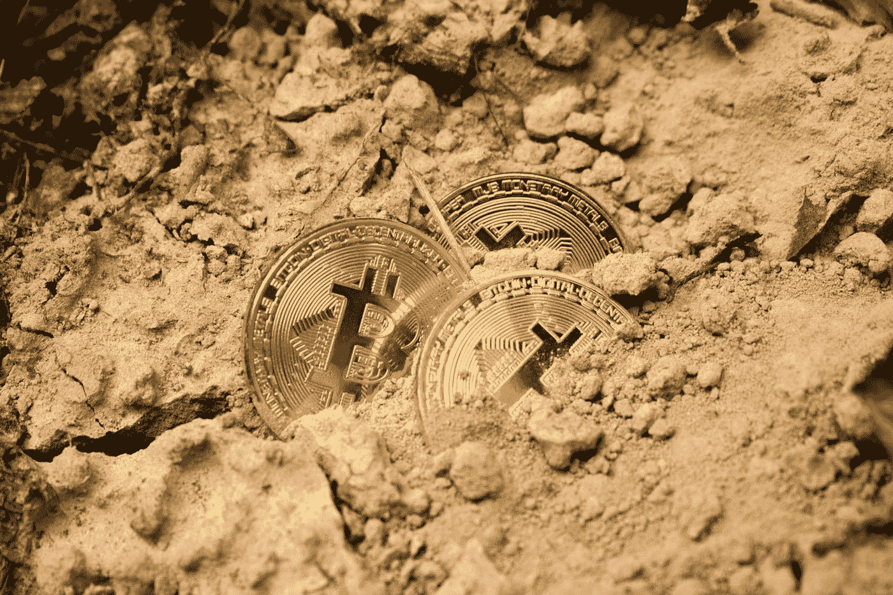
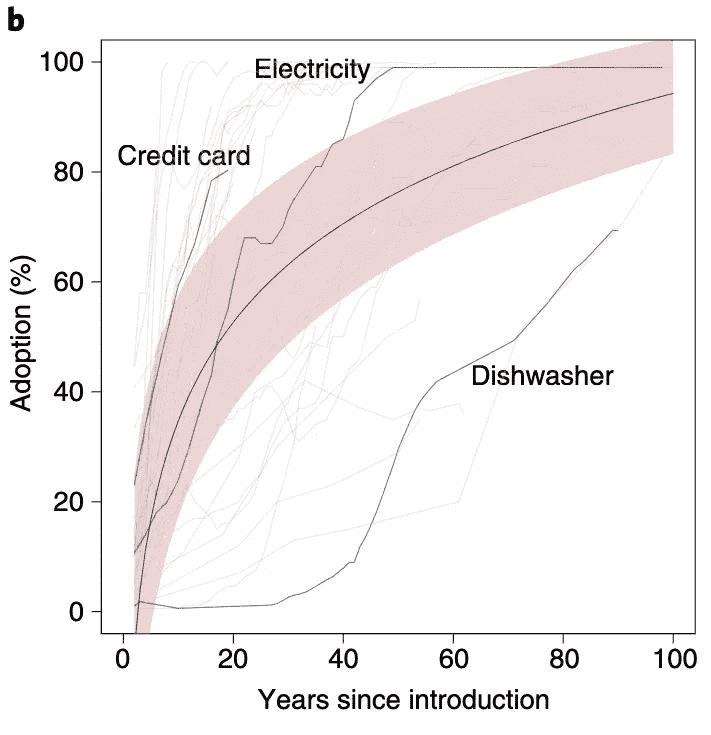
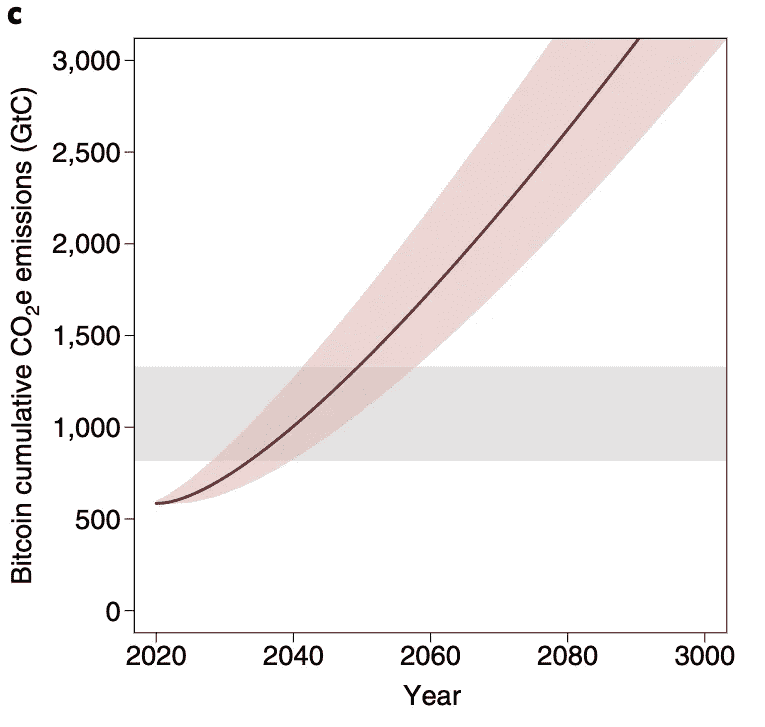
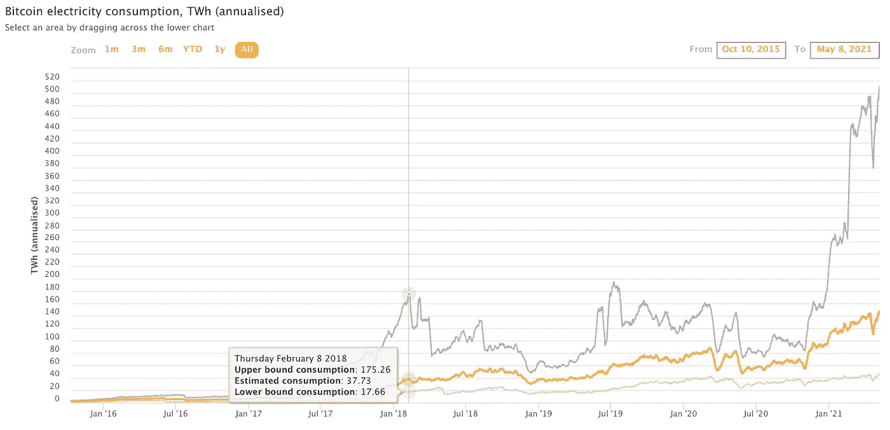

# 比特币开采的 FUD 加速了气候变化

> 原文：<https://levelup.gitconnected.com/the-fud-of-bitcoin-mining-accelerating-climate-change-f2fea026eed8>

## 复杂的问题不仅仅值得可怕的头条新闻。

从 [Unsplash](https://images.unsplash.com/photo-1550565360-6986a92b7169?ixid=MnwxMjA3fDB8MHxwaG90by1wYWdlfHx8fGVufDB8fHx8&ixlib=rb-1.2.1&auto=format&fit=crop&w=1650&q=80)

Y 不用看多远，你就会发现可怕的头条新闻:比特币不仅对投机消费者构成威胁，对世界气候本身也构成威胁。有报道称，比特币采矿比一个小国消耗的能源还多，或者一笔比特币交易一天用的电比 24 个美国家庭还多。各大新闻媒体不乏比特币支付系统——**的缺陷，但他们的批评真的可信吗？**

在我们解决比特币挖矿的问题之前，我们首先需要了解挖矿是如何发生的。比特币使用**共识算法**和**工作协议证明**。共识算法仅仅是一种对给定信息达成一致的群体方法。对于比特币，计算机网络必须就哪些交易有效达成一致，才能将其加入官方区块链。

工作证明是比特币网络上的计算机能够达成一致协议的协议。比特币网络将多达 3000 笔交易聚合成一个信息“块”。该块还包含关于先前交易的信息，因此多个块形成了已验证信息的区块链。

每验证一次比特币交易的区块，验证该区块的计算机就会获得**比特币**的奖励(小写 B 代表货币，大写 B 代表网络)。这刺激了更多的计算机加入网络，以帮助验证交易并保持区块链的真实性。

验证单个交易块需要越来越多的计算能力来解决数学问题。这就是为什么它被称为“工作”的证明。执行这些计算的计算机被称为矿工，类似于开采黄金所需的工作。

> 随着比特币越来越受欢迎，其矿工和能源消耗也在增加，这使其成为各地媒体的主要目标。一个问题出现了，是否有反驳这些观点的论据可以帮助达成对现实更客观的共识？

# 比特币气候声明的来源

迄今为止，全球估计有 100 万比特币矿工，消耗着非常可观的能源。比特币采矿将影响全球变暖的说法可以追溯到十多年前，但直到 2017 年的繁荣时期，大型媒体才开始注意到这一点。

[发表在《自然》杂志上的这项研究](https://www.nature.com/articles/s41558-018-0321-8)估计*单单比特币开采就可能将全球变暖推高两摄氏度以上*。考虑到气温上升两度将导致几乎所有主要沿海城市面临巨大的洪水风险，这是一个意义深远的说法。

来自[研究之门](https://www.researchgate.net/profile/Katie-Taladay/publication/328581842_Bitcoin_emissions_alone_could_push_global_warming_above_2C/links/5bd764354585150b2b8f042f/Bitcoin-emissions-alone-could-push-global-warming-above-2C.pdf)

这些估计在很大程度上植根于其他流行技术的历史发展，如电力或洗碗机，如上所示。然而，比特币不太可能遵循这样的曲线。首先，众所周知，比特币不应该成为全球范围内的标准交易系统。

相反，比特币被认为是一种价值储存手段和对冲通胀的手段。其他加密货币方法，如 stablecoins，也被认为符合日常消费者交易的模式。接下来，下图显示了如果比特币确实遵循上述激进技术的增长趋势，二氧化碳的累积排放量。

来自[研究之门](https://www.researchgate.net/profile/Katie-Taladay/publication/328581842_Bitcoin_emissions_alone_could_push_global_warming_above_2C/links/5bd764354585150b2b8f042f/Bitcoin-emissions-alone-could-push-global-warming-above-2C.pdf)

像这样的图表会引发很多恐惧，以及很多新闻标题。然而，重要的是缩小研究论文的发现，并从整体上考察趋势。虽然比特币确实有被高度采用和大肆宣传的阶段，但随着时间的推移，总体增长率要温和得多。不仅如此，这项研究中预测的每天 10 亿次交易实际上是不可能的，因为比特币每天最多只能进行几十万次交易。

文章中的另一个错误假设是，每笔比特币交易需要的能量与开采一个新的比特币区块所需的能量相同。同样，一个块可以包含超过 3000 个事务—这个术语不能互换。

> 在对一项革命性技术做出全面的断言之前，需要考虑诸如此类的假设甚至误解。比特币不是一个标准的支付系统，它是一种价值储存手段，有着复杂的技术问题需要解决。正如我们接下来将看到的，将比特币与标准支付方式进行比较时尤其如此。

# 与现代支付方式相比，比特币

另一个针对比特币的流行言论是将其与 Visa 等“高效”的现代支付方式相比较。荷兰央行的数据科学家亚历克斯·德弗里斯(Alex de Vries)估计，一笔比特币交易相当于超过 75 万笔 Visa 交易。这是基于一个错误的假设，即比特币交易与验证区块是一样的。

此外，这种比较也不公平。比特币由分布在世界各地的矿工组成，电脑是其唯一的物理管理来源。然而，像 Visa 这样的金融巨头的碳足迹是天文数字。为签证操作竖起的摩天大楼的数量使验证比特币块验证所需的能量相形见绌。

> 此外，Visa 要求大量员工通勤上班，保持摩天大楼的照明，创建支持 Visa 的自动取款机，等等。比特币是由大部分使用可再生能源的计算机运行的价值储存库，Visa 是一家拥有现实生活基础设施的企业巨头——这种比较根本不公平。

# 比特币促进可再生能源的采用

比特币消耗大量能源的说法是真的——这是无法回避的事实。根据剑桥大学比特币电力消耗指数，估计目前比特币的电力需求约为 130 太瓦时。这大约是全球能源消耗的 0.6%，相当于拥有 1000 万人口的约旦。

然而，人们广泛研究发现，比特币的绝大多数挖掘工作都是通过可再生能源完成的。你支付的电费越少，你从采矿中获得的利润就越多。这就是为什么比特币矿商主要从冰岛获取热能，或者从中国获取煤炭和数量惊人的可再生能源。

剑桥大学的第三次全球加密资产基准研究显示，76%的加密货币矿工使用可再生能源发电，作为其能源组合的一部分。鉴于其目前超过 1 万亿美元的市值，这使得比特币成为人类历史上最环保的金融产品之一。

> 事实上，只要有多余的绿色能源，秘密矿工就会涌向这些地区。电池的进步仍然需要长期储存过剩的太阳能或风能产生的能量——为什么不好好利用这些能量，并通过比特币采矿实现利润最大化呢？

# 前面的路很长

你可能认为我在为比特币辩护，反对媒体的所有攻击——我没有。我是加密货币等基于区块链的技术的大力支持者，但我试图充分意识到它们的真正优势和缺陷。这篇文章并不是要把你变成一个比特币迷，它仅仅是对网上流传的无数头条新闻的反驳。

**比特币有重大缺陷**，其工作协议证明所需的大量计算能力除了我们赋予它的价值之外，并没有提供任何实际价值。比特币的价值在于它的去中心化、安全性和透明性；任何附加价值都是由于人的想象力。

我相信比特币正在走向死胡同吗？是的，只是时间问题。**以太坊 2.0** 将从工作证明过渡到**利益证明**， **Cardano** 将提供经过研究的可扩展性和速度，stablecoins 将允许使用加密货币进行日常交易。

未来几十年，比特币不会扩大规模。

> 话虽如此，但我确实认为，在转向可再生能源的过程中，比特币的价值被低估了。矿工们正在寻找廉价的计算能力来源——任何有多余能源的人都乐意效劳。目前，在我们拥有更好的存储能力和提供真正价值的加密货币解决方案之前，比特币实际上可以加速能源的采用。

简而言之，比特币是点燃向区块链和加密货币技术转变的催化剂。其神秘的去中心化水平使得它对加密新手和鲸鱼都有吸引力。只有它带路才有意义。

不管我们喜不喜欢，比特币的成功是有限的。人们普遍认为它在未来几年会表现良好，但未来几十年呢？你能决定是否投资的唯一方法是做你自己的研究，听清楚争论的每一方，并愿意承担风险。市场是无法预测的，但是在投资和规划未来的时候，没有什么比理解基本面和听到事情的两面更好的了。

如果你想亲自参与加密货币，你可以使用我的推荐代码 **w6jyux2vcq** 获得**25 美元的 crypto.com 代币 CRO**——如果你问我，这是一个很棒的提议。另外，CRO 刚刚经历了一次调整，因此你的初始投资增长的可能性可能会增加。您可以从下面下载他们获奖的移动应用程序开始:

 [## Crypto.com-立即购买比特币 Google Play 上的应用

### 下载 Crypto.com 应用程序并在几分钟内注册一个帐户。开始赚取高达 6.5%的年利率。成长…

play.google.com](https://play.google.com/store/apps/details?id=co.mona.android) 

以上内容仅代表一种观点，仅供参考。它无意成为投资建议。找一个有正式执照的专业人士寻求投资建议。