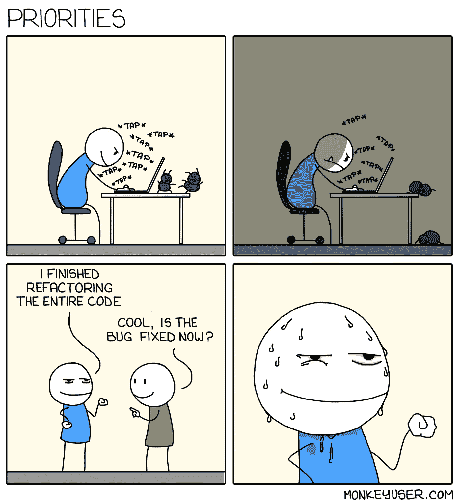
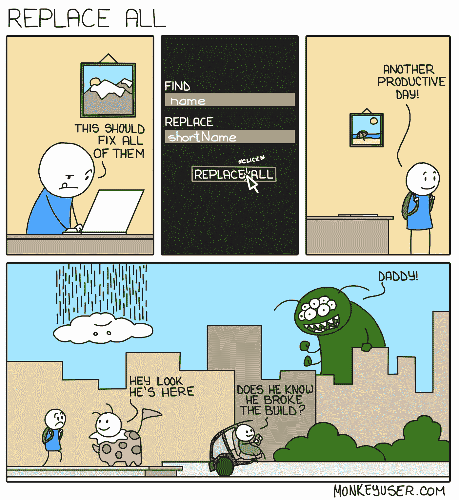

# 程序员生活中有趣的一面

> 原文：<https://levelup.gitconnected.com/the-funny-side-of-a-programmers-life-44cab153edf9>

7 个让你开怀大笑的笑话！

程序员是出了名的安静和难以交谈。他们通常在努力工作，茫然地盯着笔记本电脑屏幕几个小时(有时更久)，试图解决他们应用程序中的问题，并试图给他们的用户提供良好的体验。这种致力于给用户提供完美体验的做法有时可能会导致他们过量食用咖啡和披萨，让这些虫子远离用户并不是一件容易的事情。

但是程序员是一群有趣的人。让我们开怀大笑的笑话有时是以我们自己为代价的，基本上是基于我们痛苦的幽默。

虽然外面的人可能会看到一群人盯着他们的屏幕，敲着神秘的东西，但这是最有趣的事情发生的地方。作为一名程序员是有趣的，我们的错误往往会变成有趣的轶事，注定会被一遍又一遍地讲述，不管参与其中的程序员是否喜欢。

照片由[海伦娜·洛佩斯](https://unsplash.com/@wildlittlethingsphoto?utm_source=unsplash&utm_medium=referral&utm_content=creditCopyText)在 [Unsplash](https://unsplash.com/s/photos/laughing-office?utm_source=unsplash&utm_medium=referral&utm_content=creditCopyText) 拍摄

例如，我曾经删除了一个包含超过 50 万条记录的生产数据库表，并使应用程序陷入了大约 12 个小时的混乱状态。虽然这是另一个时代的故事，但我经常听到经理(有时甚至是我自己)告诉新加入者作为软件开发人员不要做什么。

无论如何，让我们换个话题，看看程序员生活中一些有趣的时刻。

## 优先

重构>错误修复

Bug？什么虫子？哦，那个，开始出汗，我真希望它已经修好了。

来源: [MonkeyUser](https://www.monkeyuser.com/)

## 如果有用，不要碰它

是的，这种小的改变可能看起来无害，但是它经常导致应用程序中最大的错误之一。这通常发生在星期五。这为两个规则让路:

> 1.如果有用，不要碰它
> 
> 2.周五不部署

来源: [MonkeyUser](https://www.monkeyuser.com/)

## 到底什么是编码？

如果你认为软件开发人员是神一样的生物(或者魔鬼——基于你对我们的看法),以及我们编写的应用程序是由什么组成的，让我来帮帮你:

*附:文档是一座荒岛…

来源: [MonkeyUser](https://www.monkeyuser.com/)

## 如何使用 Git？

我已经写了 4 年的代码，使用了很多语言和框架，但是使用 Git 仍然让我紧张，担心我会破坏代码库。

当我看到 xkcd 的漫画时，我非常高兴，兰道尔·门罗绝对是一个天才，能够制作像 xkcd 这样的大型网络漫画。

来源: [xkcd](https://xkcd.com/1597/)

## 编写优秀代码的实用指南

流程图的优秀用例。如果你想写出好的代码，就照着这个做吧！

xkcd 对优秀代码的又一次精彩演绎！

来源: [xkcd](https://xkcd.com/844/)

## 为什么程序员更喜欢戴耳机

程序员通常在工作时听音乐，原因很简单。他们倾向于喜欢已知的干扰，这是给同事的一个信号，他们不应该被打扰。

他们可能会全神贯注地与虫子战斗，一句简单的“嘿”就能打断他们的注意力，把他们扔进真空中。

来源: [MonkeyUser](https://www.monkeyuser.com/)

## 如何修复 bug

调试代码可能很困难。希望这对你有用。

来源: [MonkeyUser](https://www.monkeyuser.com/)

好吧，这就对了！我希望这篇文章能让你微笑，让你精神焕发。

好运&快乐编码！