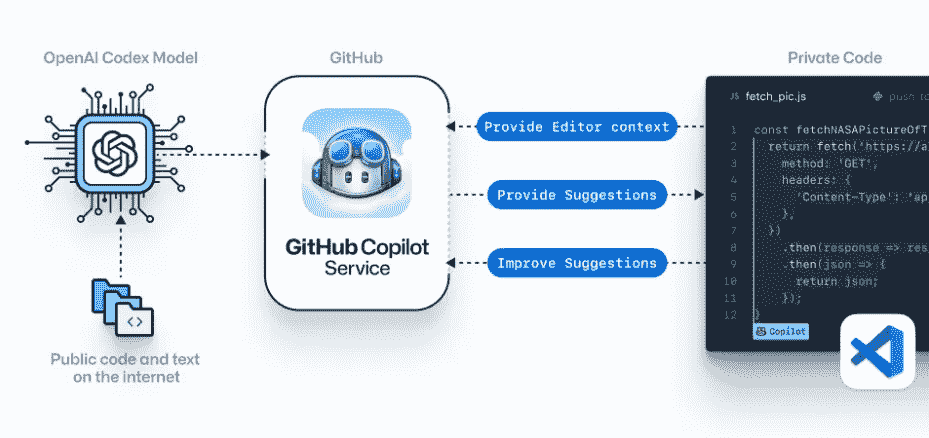

# 用微软的 GitHub Copilot 实现代码自动完成的未来

> 原文：<https://levelup.gitconnected.com/the-future-of-code-auto-completion-with-microsofts-github-copilot-b8afa0d52383>

## 你的人工智能对程序员

作者:FAM

技术发展如此之快，以至于一个人无法跟上所有的发展。技术世界的一个重大变化是 AI(人工智能)。

这项技术带来了许多解决/自动化日常问题或任务的新方法。它还唤醒了解决问题的创新意识。这就是它的力量所在。

硕士期间学的是 AI。我被它的力量深深吸引。是让机器更人性化，怎么做？通过让他们像人类一样学习，他们获得数据(历史、纪念品、经历)作为输入，从我们的经历中，我们学习并做出决定。这就是人工智能工作方式。不同的是基于数据定义的算法。例如，用于图像识别的最佳算法是 CNN(卷积神经网络)。为了理解文本，我们应该考虑 RNN(递归神经网络)算法。

我们的大脑如此强大，它的神经元不需要算法。它只需要一个健康的身体，健康的饮食和生活方式。

让我们来看看这篇文章的核心信息，GitHub 副驾驶。

# GitHub 副驾驶

Copilot 是一个 AI(人工智能)工具，它可以根据代码的上下文，用多种编程语言为您编写完整的功能(代码)。

## 这怎么可能呢？

嗯，GitHub 副驾驶使用了一种叫做 ***GPT3*** 的人工智能技术。

> 生成式预训练变压器 3 (GPT-3)是一种自回归语言模型，使用深度学习来产生类似人类的文本。—维基百科

GPT3 是知名公司 [OpenAI](https://openai.com/) 开发的(我用了好几次他们的 python 库，他们是顶级的)。他们最近(28/05/2020)宣布了他们的人工智能模型，并在 2020 年 7 月通过他们的 [OpenAI API](https://openai.com/blog/openai-api/) 向用户公开。

## 它是如何工作的？

GPT3 是一个自然语言处理器，它使用大数据来预测你将要写什么。

[GitHub 副驾驶](https://copilot.github.com/)

嗯，差不多吧？

不，不，不，你仍然需要工作，我亲爱的开发者😂😂😂这就是为什么它被称为副驾驶，我们开发人员仍然是飞行员💪！

它只能回答你的问题或为你写句子(稍后我们将看到它的实际应用)

## 我们亲爱的 Copilot🦴🩸的内心

Copilot 使用了一种基于 GPT3 的新算法，称为 [Codex，](https://openai.com/blog/openai-codex/)专注于软件源代码。
copilot 已经可以在流行的语言上运行，但是它可以更好地运行有很多公开代码的语言，比如 python、javascript、ruby、Go..等等。

## ⏸️[停顿]

对于一个不知道 AI 如何工作的开发者来说。不担心，没什么特别的。就像人类一样，如果你长年游泳，偶尔打打网球。那么你自然是一个比网球运动员更好的游泳运动员，因为你在游泳方面比打网球更有经验。

这里完全一样。算法是需要学习的，但是如果你不提供大量关于一门冷门语言的经验(数据)是不会高效准确的。该算法对于特定语言来说还不成熟。GitHub 有大量流行语言的数据，这意味着大量的经验，这意味着算法很好地学习了如何与这些流行语言一起工作。

好了，现在你知道事情是如何运作的了。让我们来看看一些事实。

微软谁拥有 GitHub，(*窃窃私语:我知道，当我发现副驾驶 LOL 我喜欢什么！*😲)赚了***10 亿美元(钱，钱*** 🤑 ***…)*** 投资创立 Codex 的公司(我们的朋友 **OpenAI** ，至少对我来说 Hihihi 我爱死它了😍).

## 关于流程深层的技术解释

代码是从现有的 GitHub repos 等公开来源合成的(对，对，你得到了。我们的公共项目参与了这个过程)。由于它基于人工智能，使用该算法将有助于它通过持续训练提供更好的解决方案。

## 怎么看它的神奇？

嗯，你可以通过开始写一个有意义的名字的函数来激活副驾驶，比如*随机*、*排序*、*比较*、……等等。
另一种激活它的方式是写一个详细的评论，这将被视为对法典的查询。

当然，从源代码中给你提供一个代码并不会真的有意思。不是吗？它的酷之处在于，它为你产生了一个由算法生成的全新代码，而且惊人的准确(比如这家伙是怎么得到的？😵).

## 行动，行动…我们希望看到它的行动🔥🔥🔥

GitHub 副驾驶

GitHub 副驾驶

点击查看更多演示[。](https://openai.com/blog/openai-codex/#helloworld)

## 你不像…

亲爱的副驾驶，我承认，你已经得到了我的心♥️

# 最后的想法…

我的直觉和我对这个革命性工具的所有看法是，这项新技术肯定会改变我们的 IDE 自动完成代码的方式。和我一起想象:

*   用于传统需求(排序、比较等)。).副驾驶:“是的，先生/女士，别担心，让你的神经元处理更复杂的事情吧”。
*   对于偷懒的日子(你:“我要你显示这个图像，宽度 X，高度 Y …)。副驾驶:“好的，先生/女士”。

# 😂😂😂

无论未来如何，我都很乐观。我喜欢用聪明又省力的方式解决我们的日常问题。

请与我们分享您对这项新技术的看法。你怎么想呢?你喜欢吗？你讨厌吗？你害怕吗？

> 请用你的反馈照亮我和其他读者❤

写这篇文章让我很开心。希望你在看这篇文章的时候感受到了，感受到了我的正能量。

亲爱的读者，感谢你在我生命中的存在。

**让我们在** [**上取得联系**](https://medium.com/@famzil/)**[**Linkedin**](https://www.linkedin.com/in/fatima-amzil-9031ba95/)**[**脸书**](https://www.facebook.com/The-Front-End-World)**[**insta gram**](https://www.instagram.com/the_frontend_world/)**[**Youtube**](https://www.youtube.com/channel/UCaxr-f9r6P1u7Y7SKFHi12g)**或**********

******参见我的新电子书[关于网络要素和一般文化。](http://www.fam-front.com/)******