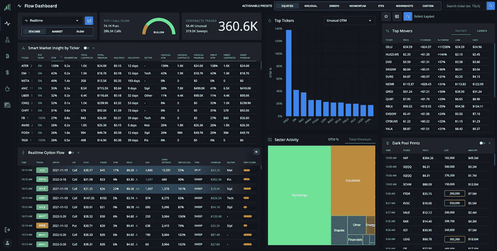
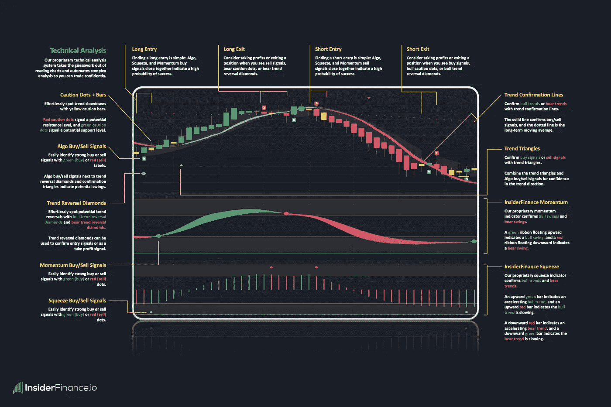
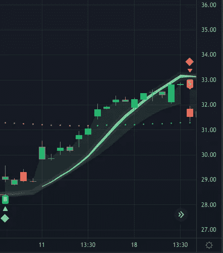
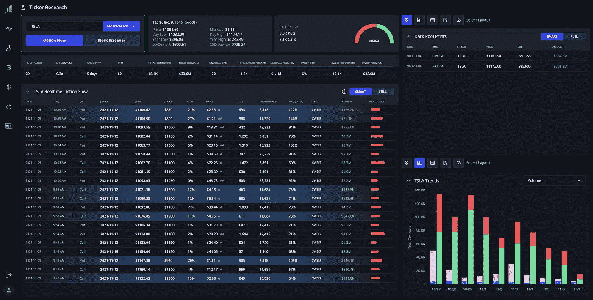
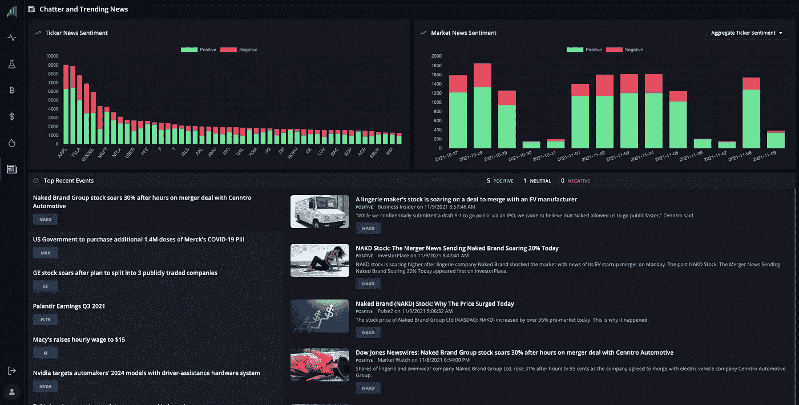

# 内部融资交易的未来

> 原文：<https://levelup.gitconnected.com/the-future-of-trading-with-insiderfinance-bb36656f49eb>

[InsiderFinance day 交易者仪表盘概述](https://insiderfinance.io?utm_source=levelup&utm_medium=feature)

## **简介**

正如我们在 2021 年 2 月看到的那样，当 GameStop 的股票拖垮了数十亿美元的对冲基金，市场嘎然而止时，散户交易者是交易世界中一支日益增长的力量 InsiderFinance 提供了工具来增强这些散户投资者的能力，让他们在市场中占据上风。

金融数据和复杂的分析以前只有机构和专业投资者才能获得，但通过使用现代技术和强大的算法， [InsiderFinance](https://insiderfinance.io/?utm_source=levelup&utm_medium=feature) 将这些相同的工具带给散户，以赚取华尔街垄断多年的巨额收益。

我们的使命是教育普通投资者，并为任何经验水平的交易者提供数据、工具、社区和教育，以从交易股票、期权、加密货币和外汇中获利，使他们能够从金融市场中赚取改变生活的收入。

## **建国故事**

就像许多其他引人注目的创始故事一样，InsiderFinance 的成立是为了解决交易行业的一个老大难问题。

InsiderFinance 的创始人 Rob 和 Trey 之前使用了许多订单流平台，这些平台给了他们一个原始的交易列表，但没有给他们提供任何有意义的背景信息来说明他们应该追求什么。结果，他们错过了一些非常好的交易，甚至做了一些非常糟糕的交易。

让他们更加沮丧的是，Rob 和 Trey 意识到他们花了很多时间整理原始数据，解读先进的技术指标来寻找高潜力的交易。当他们最终找到一个的时候，由于这个过程的时间太长，他们经常错过最好的条目。

几个月来，Rob 和 Trey 尝试了所有可用的订单流工具和技术分析软件，但收效甚微，他们决定结合自己的专业知识，创建 InsiderFinance，为自己和其他零售交易者解决这些问题。

自 2013 年以来，Rob 应用他在金融和衍生品领域的广泛培训，将数据转化为可操作的见解，为世界上最负盛名的资本市场公司服务。Trey 是一名训练有素的 quant 和软件工程师，自 2014 年以来，他为硅谷独角兽开发了一些世界上最具颠覆性的技术产品。

他们的共同目标是为散户交易者构建最完整的平台，将数据优势与华尔街拉平，同时又非常简单直观，任何技能水平的交易者都可以有效地利用它在金融市场中获利。

结果是 [InsiderFinance](https://insiderfinance.io/?utm_source=levelup&utm_medium=feature) ，这是一个最完整的平台，为任何经验水平的交易者提供工具和可操作的见解，以便在交易任何资产类别时更好、更快地做出数据驱动的决策。

## **我们解决了什么问题？**

交易的世界已经发生了很大的变化。许多年前，零售交易的真正挑战是获取信息。然而，随着数据每天变得越来越容易获得，访问数据不再是大机构的专利。现在的问题是，交易者淹没在信息的海洋中，需要工具来分析和解释复杂的数据，以便在更短的时间内做出更好的交易决策。没有上下文的数据是没有帮助的。

在今天的情况下，一个成功的交易者需要高质量的处理过的数据和工具来产生交易想法和研究高潜力的交易。因为机构交易者控制着市场，理解和解释机构流对于帮助交易者在当前的市场环境下增加成功的机会是至关重要的。

当有强大的技术分析支持时，高潜力的交易想法有更高的成功机会。因为复杂的技术指标理解起来很复杂，实施起来也很困难，交易者需要[快速准确的技术分析软件](https://insiderfinance.io/technical-analysis?utm_source=levelup&utm_medium=feature)来确定最佳的进场/出场，自信地交易。

## 散户为什么要关心机构投资者？

机构投资者利用其可观的资源在其他市场参与者之前获得影响市场的信息，他们利用其信息优势自信地持有大量(通常是高杠杆)头寸，这些头寸通常会导致市场出现相当大的方向波动。从历史上来看，机构投资者利用他们巨大的信息优势远远胜过散户投资者。

## **我们如何解决问题？**

多年来，交易者一直要求更好的软件，因为他们看到，如果有正确的工具，他们可以增加成功的概率。有几个工具可以帮助交易者识别机构流。然而，最好的工具不仅仅显示机构的位置，它们还帮助交易者确定在当前市场环境下哪些交易最有潜力。

InsiderFinance 是[顶级平台](https://insiderfinance.io/?utm_source=levelup&utm_medium=feature)，在大数据和技术分析方面为交易者提供清晰的思路。我们的专有算法分析机构期权订单流和暗池印迹，以提供可操作的市场情报，帮助交易员识别即将到来的市场走势，并找出可以转化为盈利交易的模式。

我们专有的[全自动技术分析系统](https://insiderfinance.io/technical-analysis?utm_source=levelup&utm_medium=feature)消除了寻找成功图表的猜测，帮助交易者确定最佳的进场点和出场点，使每笔交易的回报最大化。加上广泛的教育和支持的交易社区，InsiderFinance 提供了一个完整的交易系统。

InsiderFinance 交易系统使大数据和复杂的技术分析变得易于理解和简单易用，从而使任何资产类别的交易都非常成功，并使任何技能水平的交易者都感到满意。

## **我们有什么破坏性？**

在 InsiderFinance，我们挑战现状。这就是为什么当我们看到其他期权流平台只显示美化的数据表和非常少的市场背景时，我们知道我们必须彻底改造这个强大的工具，以增强散户交易者的能力。我们的指导原则很简单:更好的数据带来更好的交易回报，强大的可视化支持更快的交易决策。

InsiderFinance 提供的智能处理数据、专有指标和[高级工具比目前可用的其他订单流平台更强大、更易于使用。几个独特优势有助于 InsiderFinance 脱颖而出:](https://insiderfinance.io/?utm_source=levelup&utm_medium=feature)

*   智能订单处理和跟踪
*   强大而多样的信号类别
*   一键式设置和过滤
*   自定义观察列表
*   高级过滤
*   新闻情感分析
*   高级分析和市场背景
*   强大的可视化和集成图表
*   适合移动设备的快照

InsiderFinance 提供了强大的工具，因此交易者可以通过平台上的新闻情绪、专有指标和趋势分析轻松识别高可信度交易。该平台还具有先进的可视化功能，超越了帮助交易者快速找到市场和行业趋势的基本要素。

但我们并没有就此止步。为了真正与机构投资者公平竞争，交易者还需要[机构级技术分析](https://insiderfinance.io/technical-analysis?utm_source=levelup&utm_medium=feature)，这可以简单直观地找到获胜的图表设置和最佳的交易进场/出场，以最大化每次交易的回报。

结合全面的教育和支持性的交易社区，这个强大的工具包使 InsiderFinance 成为弥合散户和机构投资者之间信息鸿沟的最佳平台。与其他替代方案相比，只有 InsiderFinance 在每个领域都提供高功能。

# 综合教育

InsiderFinance 提供市场上最全面的教育，无需订阅即可完全免费获得。

由我们的创始人教授的 [InsiderFinance 大师班](https://learn.insiderfinance.io/p/mastering-the-flow)包含一些小课程，让任何技能水平的人都可以快速轻松地掌握由技术分析支持的订单流交易。

我们相信这是交易者可用的最强大、最直观的资源。

# [今天访问 InsiderFinance】增加您的胜率](https://insiderfinance.io/?utm_source=levelup&utm_medium=feature)

## 或者在下面了解更多信息:

*   [阅读深入评论](https://wire.insiderfinance.io/insiderfinance-review-trading-alongside-smart-money-42d9f785161e?source=friends_link&sk=83bce091f416fa55d8a13b4284a46e99)
*   [报名参加我们的免费大师班](https://learn.insiderfinance.io/p/mastering-the-flow)