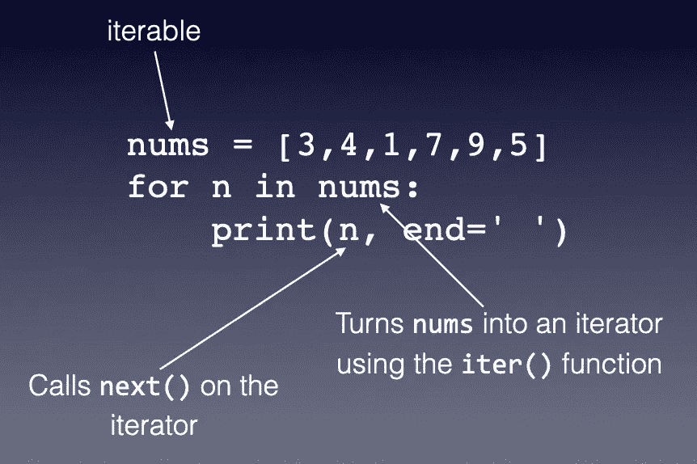

# Python 的瑰宝——您应该知道的 7 个特性(并且您最好非常了解)

> 原文：<https://levelup.gitconnected.com/the-gems-of-python-7-features-you-should-know-and-you-better-know-it-well-cffa4141d7fa>


照片由[胡安·戈麦斯](https://unsplash.com/@nosoylasonia?utm_source=medium&utm_medium=referral)在 [Unsplash](https://unsplash.com?utm_source=medium&utm_medium=referral) 上拍摄

您很可能听说过 Python 编程语言的优点——类似英语的语法、简单易学、高度通用，以及编程的瑞士军刀。Python 很容易学习，而且这种语言结合了函数式、结构化和 OOP 范例的思想，使它成为一种极其强大和动态的语言。当其他语言需要许多行代码来完成一项任务时，Python 通常可以使用一行代码来完成同样的任务。这就是用 Python 编程的乐趣。初学者和专家每天都在学习新的技巧。

本文讨论了 Python 语言的几个重要特性，这些特性经常被忽略或者没有被很好地理解，同时还讨论了几个要点，即使是最有经验的开发人员也会被这些要点所困扰。

具体来说，本文将讨论:

*   迭代器和生成器
*   列表理解
*   使用 any()和 all()函数
*   使用 zip()函数
*   比较运算符链接
*   使用可变对象作为默认参数
*   λ函数

# 迭代器和生成器

迭代器是 Python 中一个不容易理解的主题。因此，我将在本文中尝试将其合理化。

首先， *iterate* 这个词的意思是从某物中获得一个物品，一次一个物品。在 Python 中，许多内置类型支持迭代(我们说它们是一个*可迭代*对象)。如`**list**`、`**str**`、`**tuple**`等。这是什么意思？这意味着您可以遍历变量中的每一项，比如说一个`**list**`:

```
nums = [3,4,1,7,9,5]
for n in nums:
    print(n, end=' ')
# 3 4 1 7 9 5
```

或者，一个`**str**`:

```
s = 'Hello'
for c in s:
    print(c, end=' ')
# H e l l o
```

类似地，`**range()**`函数返回一个`**range**`对象，它是一个`**iterable**`。

```
r = range(5)
for i in r:
    print(i, end=' ')
# 0 1 2 3 4
```

## 迭代器与可迭代

在 Python 中，当我们谈论迭代时，总会出现两个术语— *iterable* 和 *iterator* 。

一个`**iterable**`是一个你可以迭代的对象(比如一个`**list**`、`**str**`等等)，而一个`**iterator**`是一个你可以使用`**next()**`函数迭代的对象。当您在一个`**iterable**`对象上调用`**iter()**`函数时，就会创建一个`**iterator**`。

每个`**iterator**`都是一个`**iterable**`，而不是每个`**iterable**`都是一个`**iterator**`。例如，`**list**`对象是一个`**iterable**`，但它不是一个`**iterator**`。

迷茫？考虑下面的例子:



`**nums**`是一个`**list**`，是一个`**iterable**`。当您使用一个`**for**`循环来遍历它的内容时，它会自动将`**nums**`转换为`**iterator**`。当你打印出`**n**`的值时，它调用`**iterator**`上的`**next()**`函数来获得下一个值。当没有更多的元素从`**iterator**`中获取时，`**next()**`函数将引发`**StopIteration**`异常，一旦捕获到该异常，`**for**`循环将终止。

## 创建迭代器对象

您可以使用`**iter()**`函数手动将`**iterable**`转换为迭代器对象:

```
nums = [3,4,1,7,9,5]
**i = iter(nums)**
```

`**iter()**`函数的结果是一个`**iterator**`对象。要获得`**iterator**`对象中的每一项，您需要调用`**next()**`函数:

```
print(next(i))    # 3
print(next(i))    # 4
print(next(i))    # 1
print(next(i))    # 7
print(next(i))    # 9 
print(next(i))    # 5
```

每次在迭代器上调用`**next()**`函数时，都会返回 iterable 中的下一个值。当到达最后一项时，您调用`**next()**`函数，将引发`**StopIteration**`异常:

```
print(next(i))
'''
---------------------------------------------------------------------------
StopIteration                             Traceback (most recent call last)
<ipython-input-27-58c5a451ce44> in <module>
----> 1 print(next(i))StopIteration: 
'''
```

您可以使用下面的代码片段复制`**for**`循环的功能:

```
nums = [3,4,1,7,9,5]
i = iter(nums)
while True:
    try:
        print(next(i), end=' ')
    except StopIteration:
        break

# 3 4 1 7 9 5
```

## 实现迭代器对象

有些情况下，您可能想要创建自己的`**iterator**`对象。考虑以下场景—您希望生成最大值为 1000 的斐波纳契数列，但您不需要一次生成所有的数字。你只知道你需要按需生成数字。这是迭代器的完美用例。下面是如何通过创建自己的`**iterator**`对象来实现这一点:

```
class Fib:                                        
    def __init__(self, max):                      
        self.max = max
        self.a = 0
        self.b = 1 def __iter__(self):                          
        return self def __next__(self):                          
        fib = self.a
        if fib > self.max:
            raise StopIteration                  
        self.a, self.b = self.b, self.a + self.b
        return fib
```

**Fib** 类包含以下内容:

*   `**__init__()**`初始化器——接受为斐波纳契数列生成的最大值
*   `**__iter__()**`函数—返回给定对象的`**iterator**`
*   `**__next__()**`函数—返回`**iterator**`对象中的下一个值。当在最后一个元素被迭代后调用该函数时，会引发`**StopIteration**`异常。

为了生成最大值为 1000 的所有斐波纳契数，您创建了一个`**Fib**`对象(它是一个迭代器):

```
fib = Fib(1000)
```

最好的事情是`**Fib**`类不需要一次生成并存储所有的斐波那契数。事实上，所有的数字都还没有生成。只有当用`**next()**`函数调用`**iterator**`对象时，序列中才会生成一个数字:

```
print(next(fib))  # 0
print(next(fib))  # 1
print(next(fib))  # 1
print(next(fib))  # 2
print(next(fib))  # 3
```

在内部， **Fib** 类只需要存储三个变量——`**a**`、`**b**`和`**max**`。

如果你想得到序列中的所有数字，你可以使用一个`**for**`循环:

```
for i in fib:
    print(i, end=' ')
#  0 1 1 2 3 5 8 13 21 34 55 89 144 233 377 610 987
```

或者，要强制 **Fib** 类一次返回所有数字，使用 **list()** 函数调用它:

```
fib = Fib(1000)
list(fib)
# [0, 1, 1, 2, 3, 5, 8, 13, 21, 34, 55, 89, 144, 233, 377, 610, 987]
```

## 使用生成器实现迭代器

虽然您可以使用带有`**__iter__()**`和`**__next__()**`函数的`**Class**`来实现`**iterators**`，但有时这太麻烦了。更简单的方法是使用*发电机*。生成器允许你从函数中创建迭代器。像往常一样，举个例子就能消除误会。

> 生成器允许你从函数中创建迭代器。

再次考虑斐波那契的例子。想象一下现在需求有了一点变化。您现在想要生成一个无限的斐波那契数列，而不是生成一个特定最大数目的数列。您可以使用带有生成器的函数来实现这一点:

```
def fib():
    a, b = 0, 1
    while True:
        yield a
        a, b = b, a + b
```

这看起来像一个常规函数，除了`**yield**`语句。具体来说，上面的`**fib()**`函数返回一个`**generator**` 对象。

> 生成器是产生一系列值而不是单个值的函数。

`**yield**`语句和`**return**`语句一样，只有一个例外——当执行`**yield**`语句时，程序暂停函数的执行，保留函数的状态，并返回值；下一次调用者调用`**generator**`对象上的 **next()** 函数时，函数的执行将从先前停止的地方继续。

> 生成器基本上是一个迭代器。

要查看它是如何工作的，调用`**fib()**`函数并在`**generator**`对象上调用`**next()**`函数:

```
i = fib()
print(next(i)) # 0
print(next(i)) # 1
print(next(i)) # 1
print(next(i)) # 2
print(next(i)) # 3
```

> 从这个例子中得到的关键是，迭代器(和生成器)适用于计算大型结果集，在这种情况下，您不知道何时需要所有结果，或者您不想同时为所有结果分配内存。

# 列表理解

Python 的标志性特性之一是*列表理解*。列表理解完美地展示了 Python 的优雅——易读、易懂、单行且功能强大。

列表理解允许您使用以下语法创建列表:

```
new_list = **[***expression* **for** *item* **in** *iterable optional_expression***]**
```

例如，要创建一个从 0 到 10 的偶数列表，可以使用以下语句:

```
evens = **[n for n in range(0,11,2)]**
# [0, 2, 4, 6, 8, 10]
```

这里，您生成一个范围从 0 到 11(不含)的值，步长为 2。也就是 0，2，4，6，8，10。然后使用变量`**n**`使用 **for** 循环遍历这组数字。然后将 **n** 的每个值添加到列表中。最终结果是:

```
[0, 2, 4, 6, 8, 10]
```

您还可以在 iterable 后面添加一个可选表达式，如下所示:

```
evens = [n for n in range(0,11) **if n % 2 == 0**]
evens
```

上面的语句将产生相同的结果。在这种情况下， **n** 将只取 0 到 11(不含)的所有能被 2 整除的数。注意，这里不允许有`**else**`条件:

```
evens = [n for n in range(0,11) if n % 2 == 0 **else ...**]   **# error**
```

另一方面，你也可以把你的表达式放在`**for**`循环之前，就像这样:

```
evens = [**n if n % 2 == 0 else “-”** for n in range(0,11)]
# [0, '-', 2, '-', 4, '-', 6, '-', 8, '-', 10]
```

在上面的语句中，您正在检查 **n** 是否能被 2 整除。如果是，结果将包括 **n** ，否则将包括`**-**`。请注意，在这种情况下，`**else**`语句是强制的。

## 何时不使用列表理解

虽然列表理解是优雅的，但有些时候你不应该使用它。因为列表理解需要生成列表中的所有项目并存储在内存中，所以在处理大量项目时效率非常低。

考虑这样一种情况，您想要对从 1 到 1000000000 的所有数字求和。使用列表理解，您的代码将类似于:

```
sum([n for n in range(1,1000000001)])
```

问题是，在使用 **sum()** 函数对列表中的 10 亿个数字求和之前，您首先需要生成它们。上面的语句使用了大量内存。在这种情况下，最好使用生成器，如下所示:

```
sum(n for n in range(1,1000000001))
```

> 注意:生成器用括号括起来。

使用生成器，每次生成一个数时，它都被添加到当前和中，然后被丢弃。因此，没有必要在内存中存储 10 亿个数字。

# 使用 any()和 all()函数

`**any()**`函数检查一个 iterable(列表、元组、集合、生成器等)以查看*是否有任何*项是`**True**`。另一方面，`**all()**`函数检查一个 iterable 来查看*是否所有的*项都是`**True**`。

下面检查一个列表，看看`**nums**`中的*项是否有*项是*偶数*项:

```
nums = [12,44,56,24,13,78,32,123,3]
**any**([n % 2 == 0 for n in nums])              # True
```

如果您想查看 nums 中的所有数字是否都是偶数，则使用`**all()**`功能:

```
**all**([n % 2 == 0 for n in nums])              # False
```

所以这里有一个测验来测试你自己。给定一个单词列表，你能写代码来检查列表中的任何单词是否包含元音(例如' aeoiu ')？

```
words = ['The','quick','brown','sly','fox',
         'jumps','over','the','lazy','dog']
```

现在，在你回来寻找答案之前，你可以自己尝试一下。

准备好了吗？完成了吗？

以下是我使用`**any()**`函数和列表理解的答案:

```
**any(any(c.lower() in 'aeiou' for c in word) for word in words)**
```

为了理解上面的陈述，您从最右边的表达式开始:

```
(word for word in words)
```

这将返回一个*生成器*。然后，对于每个单词，检查每个字符，看它是否包含' *aeiou* '中的任何字符:

```
**any**(c.lower() in 'aeiou' for c in word)
```

`**any()**`函数执行*短路*——只要一个字符在 *aeiou* 中，就不需要进一步检查。并且这种短路扩展到列表中的所有单词:

```
**any**(any(c.lower() in 'aeiou' for c in word) for word in words)
```

如果列表中的任何单词有一个字符在' *aeiou* 中，则操作停止并返回`**True**`。

# 使用 zip()函数

`**zip()**`函数将两个以上的可重复项连接在一起。考虑以下代码片段:

```
days = [1,5,9]
months = ['Feb','Apr','Dec']
years = [2019,2020,2021]
```

您有三组日期，每一组都存储在三个单独的列表中。如果您想提取所有日期，您可以使用`**zip()**`功能将它们组合起来:

```
zip(days, months, years)
```

但是`**zip()**`函数返回一个`**zip**`对象，您必须对其进行迭代以获取其内容。最简单的方法是用*列表领悟*，就像这样:

```
[date for date in zip(days, months, years)]
# [(1, 'Feb', 2019), (5, 'Apr', 2020), (9, 'Dec', 2021)]
```

然后可以将列表中的每个元组转换成一个`**Date**`对象:

```
from datetime import datetimefor d in [date for date in zip(days, months, years)]:
    date_string = f'{d[0]} {d[1]}, {d[2]}'
    date_object = datetime.strptime(date_string, "%d %b, %Y")
    print(date_object.date())
'''
2019-02-01
2020-04-05
2021-12-09
'''
```

# **比较运算符链接**

执行比较时，通常会检查某个值是否在特定范围内。例如，您想检查一个变量是否大于 2 且小于 6，因此通常的代码如下所示:

```
num = 5
if num<6 and num>2:
    print(True)
else:
    print(False)
```

但是，Python 支持比较运算符链，因此您可以像这样重写上面的比较表达式:

```
print(2<num<6)   # True
print(6>num>2)   # True
print(2<num<5)   # False
```

当然看起来更整洁，更容易理解！

# 不要使用可变对象作为默认参数

Python 支持可选参数-如果未提供参数，将为其提供默认值。如果不小心的话，这个看似简单直接的特性会有一些意想不到的行为。考虑以下情况

```
def do_something(arg1, arg2=[]):
    arg2.append(arg1)
    print(arg2)
```

第二个参数`**arg2**`是可选的。如果没有提供值`**arg2**`将假定一个空列表。在该功能中，`**arg1**`将被追加到`**arg2**`。为了便于查看`**arg2**`的值，我在函数中将其打印出来。

让我们在提供两个参数的情况下测试调用该函数:

```
do_something(2, [1])    
do_something(3, [2])    
do_something(4, [3])    
'''
[1, 2]
[2, 3]
[3, 4]
'''
```

上面的结果似乎合乎逻辑，也符合我们的理解。现在让我们省略第二个参数，用`**1**`调用函数。既然现在省略了第二个参数，`**arg2**`应该假设为`**[]**`。如预期的那样，在`**[]**`后添加一个`**1**`应该会产生一个`**[1]**`:

```
do_something(1)
'''
[1]
'''
```

然而，如果您使用相同的参数再次调用该函数，您现在会得到一个`**[1,1]**`:

```
do_something(1) 
'''
[1, 1]
'''
```

再次调用该函数会产生`**[1,1,1]**`:

```
do_something(1) 
'''
[1, 1, 1]
'''
```

您可能希望每次调用该函数时，`**arg2**`都会被初始化为`**[]**`。然而，事实显然并非如此。事实证明，对于可选参数，如果默认值是一个*可变*类型(list 是一个可变类型)，默认值将只初始化*一次*。当随后调用该函数时，`**arg2**`将恢复其现有值。这让相当多的人大吃一惊。

> 通常，不要使用可变对象作为可选参数的值。

那么，如何按照您的预期解决这个问题呢？最简单的方法是在函数内部对`**arg2**`进行初始化，并在函数声明中将其设置为`**None**`:

```
def do_something(arg1, **arg2=None**):
 **if arg2 is None:
        arg2 = []**    arg2.append(arg1)
    print(arg2)
```

您的功能现在将按预期工作:

```
do_something(1)  #  [1]
do_something(1)  #  [1]
do_something(1)  #  [1]
```

# λ函数

Python 支持使用 lambda 函数。Lambda 函数是没有名字的匿名函数。本质上，lambda 函数是单表达式函数。恰当地使用 lambda 函数可以让你的代码更具可读性和可维护性。让我们试着去理解 lambda 函数是如何工作的。

考虑下面的数字列表，`**nums**`:

```
nums = [3,4,1,7,9,5]
```

假设您想将每个数字乘以一个常数，比如 2。这可以通过多种方法轻松实现。一是通过*列表理解*:

```
[n * 2 for n in nums]
```

另一种方法是使用`**map()**`函数。`**map()**`函数允许你在 *iterable* (比如一个列表)的所有元素上应用一个函数，从而将它从一个值映射到另一个值(因此得名)。为了理解`**map()**`函数是如何工作的，让我们一步一步来研究它。

`**map()**`函数接受两个参数——一个 iterable 和一个函数。对于函数，让我们定义一个名为`**change()**`的函数，带有一个输入参数，并将其传递给`**map()**`函数:

```
**def change(n):
    print(n)
    return n ** nums_modified = map(**change**, nums)
```

当处理接受另一个函数的函数时(比如`**map()**`函数)，我总是喜欢先定义一个函数并打印出参数，这样我就可以检查传递给函数的是什么。当您运行上面的代码片段时，不会打印出任何内容。这是因为`**map()**`函数返回一个`**map**`对象，该对象本身是一个迭代器(因此是可迭代的)。您可以使用以下语句来确认对象是否是可迭代的:

```
import collections.abc
isinstance(nums_modified, collections.abc.Iterable)  # True
```

由于`**nums_modified**`是一个迭代器，为了让您看到 **change()** 函数的输出，您可以使用`**list()**`函数将其转换为`**list**`:

```
list(nums_modified)
```

您现在可以看到以下输出:

```
3
4
1
7
9
5[3, 4, 1, 7, 9, 5]
```

所以现在很清楚`**change()**`函数在做什么——它基本上是一个接一个地获取`**nums**`列表中的所有数字，然后返回数字。

现在，让我们返回每个乘以 2 的数字:

```
def change(n):
 **return n*2**
```

输出将是:

```
nums_modified = map(change, nums)
list(nums_modified)
**# [6, 8, 2, 14, 18, 10]**
```

有了对`**change()**`函数所做的事情的更清晰的了解，您就可以专注于将它转换成 lambda 函数了。

> 记住，lambda 函数没有名字，它只能包含一个表达式。

因此`**change()**`函数现在可以重写如下:

```
nums_modified = map(**lambda n:n*2**, nums)
```

如果您想将数字转换成字符串，并在每个字符串前面加上“`**$**`”符号，该怎么办？你可以用 *f 弦*来做:

```
nums_modified = map(lambda n:**f'${n}'**, nums)
list(nums_modified)
#['$3', '$4', '$1', '$7', '$9', '$5']
```

> f 字符串是 Python 3.6 及更高版本中提供的一项功能

对每件商品征收 7%的销售税怎么样？f 字符串变量支持 Python 表达式:

```
nums_modified = map(lambda n:**f'${n*1.07:.2f}**', nums)
list(nums_modified)
# ['$3.21', '$4.28', '$1.07', '$7.49', '$9.63', '$5.35']
```

如果销售税只适用于 5 美元及以上的商品怎么办？您可以使用 Python *三元运算符*来实现:

```
nums_modified = map(lambda n:**f'${(n*1.07 if n>=5 else n):.2f}'**, 
                    nums)
list(nums_modified)
#['$3.00', '$4.00', '$1.00', '$7.49', '$9.63', '$5.35']
```

只要函数的内容可以在一个表达式中完成，就可以用 lambda 函数代替常规函数。

Lambda 函数非常有用，尤其是在处理熊猫数据帧时。

# 摘要

我希望您现在对 Python 中的一些优秀特性有了更好的理解。如果您认为我遗漏了任何值得一提的特性，请告诉我！

[](https://weimenglee.medium.com/membership) [## 加入媒介与我的介绍链接-李伟孟

### 作为一个媒体会员，你的会员费的一部分会给你阅读的作家，你可以完全接触到每一个故事…

weimenglee.medium.com](https://weimenglee.medium.com/membership)