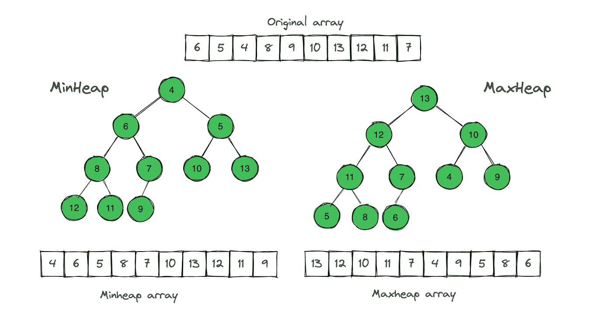
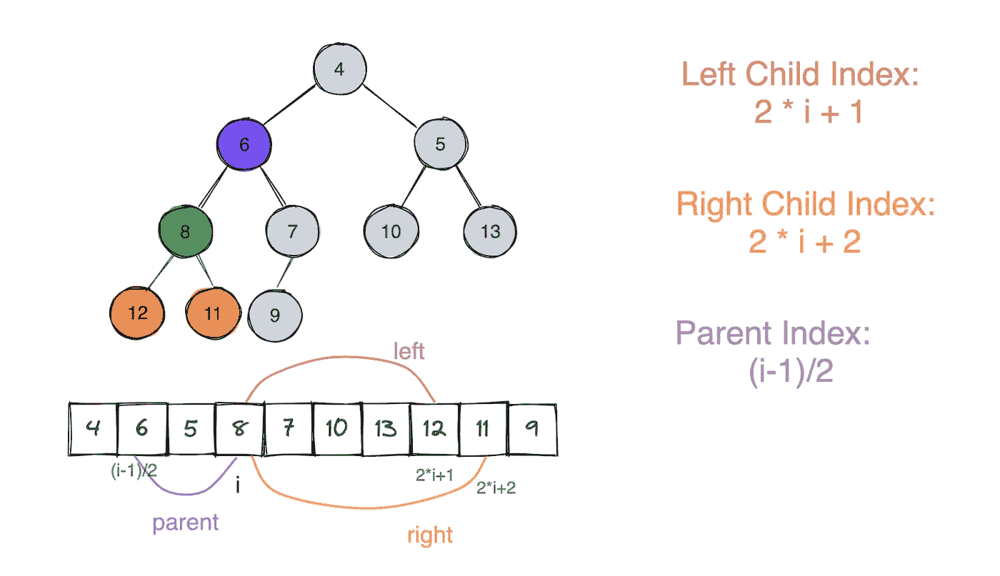
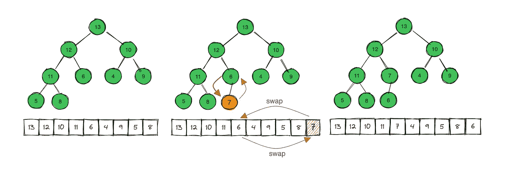
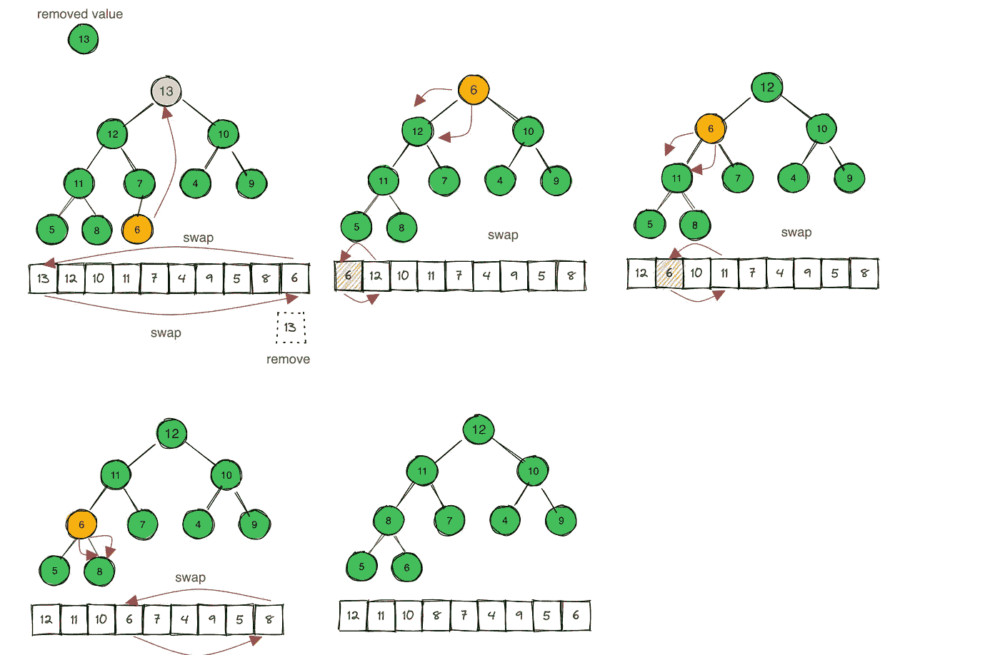

# 在 Golang 中实现堆的一般方法

> 原文：<https://levelup.gitconnected.com/the-generic-way-to-implement-a-heap-in-golang-8de25b37efc2>

## 使用泛型实现堆数据结构

堆是计算机科学中的一种基本数据结构。这篇文章展示了如何在 Golang 中使用泛型从头开始实现 heap。

完整的代码是[这里是](https://github.com/jerryan999/gostruct/blob/main/maxheap.go)。

# 什么是堆

Heap 通常用一个数组来实现，我们可以把它看作一棵近乎完整的二叉树。

树的每个节点对应于数组的一个元素。该树在除了最低层之外的所有层上被填充，从左向上填充到一个点。

Minheap 与 Maxheap

有两种二进制堆:最大堆和最小堆。它们分别具有不同的堆属性。

例如，max-heap 属性如下所示:

*   节点的值最多是其父节点的值。
*   存储在树根处的最大元素

# 连接到其他节点

给定一个节点的索引 *i* ，我们可以快速计算它的父节点、左节点和右节点的索引。

*   左侧子索引: *2i + 1*
*   右子索引: *2i +2*
*   母指数:*楼层((i-1)/2)*

堆中左侧和右侧父级的索引

# 主数据结构

我们使用下面的 struct 类型来表示堆，以便于重用和类型安全。

*   底层切片`data`存储实际值
*   函数`comp`比较两个值，如果 a 小于 b，则返回`true`
*   函数`NewHeap`返回一个新的堆给定比较函数

在深入研究堆实现之前，需要提到三个基本函数。

*   `swap`函数交换堆中数据片的索引 I 和 j 处的值
*   `Peek`返回堆的顶部值，但不删除它
*   `Size`返回元素的总数

# 推送项目

对于一个数据结构，插入和删除是两个基本操作。当我们将一个项目推入堆中时，我们需要为堆结构维护堆属性。

让我们首先实现 max-heap 的插入操作

在`Push`函数中，我们首先将新值附加到数据片的末尾，然后使用`heapifyUp`来维护堆属性。

`heapifyUp`将索引`i`处的值向上移动到其正确位置。请记住，它假设除了 I 之外，其他值已经处于正确的位置。

将项目推入堆中

# 流行项目

现在，是时候实现堆的移除操作了。

这里，我们有两个主要功能:

*   函数`Pop`从堆中移除顶值并返回它
*   函数`heapifyDown`将索引`i`处的值向下移动到堆中正确的位置

请记住，`heapifyDown(i int)`假设以左(I)和右(I)为根的左右二叉树都是最大堆。

但是索引`i`处的值可能小于其子级，因此违反了 max-heap 属性。维护财产是`heapifyDown`的工作。

这是代码。

# 测试

这里我列出了堆应用程序的三个测试案例。有空可以去看看。

1.  [测试 int 堆](https://gist.github.com/jerryan999/a0ed9688c7f3d7ed25444f89d9809063?file=testing_int.go)
2.  [测试自定义结构堆](https://gist.github.com/jerryan999/a0ed9688c7f3d7ed25444f89d9809063?file=testing_custom.go)
3.  [测试最小堆](https://gist.github.com/jerryan999/a0ed9688c7f3d7ed25444f89d9809063?file=testing_minheap.go)

我希望你喜欢读这篇文章。如果你愿意支持我成为一名作家，可以考虑注册[成为一名媒体成员](https://jerryan.medium.com/membership)。你还可以无限制地访问媒体上的每个故事。

# 分级编码

感谢您成为我们社区的一员！在你离开之前:

*   👏为故事鼓掌，跟着作者走👉
*   📰查看[升级编码出版物](https://levelup.gitconnected.com/?utm_source=pub&utm_medium=post)中的更多内容
*   🔔关注我们:[Twitter](https://twitter.com/gitconnected)|[LinkedIn](https://www.linkedin.com/company/gitconnected)|[时事通讯](https://newsletter.levelup.dev)

🚀👉 [**加入升级人才集体，找到一份神奇的工作**](https://jobs.levelup.dev/talent/welcome?referral=true)