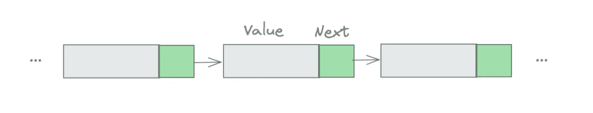
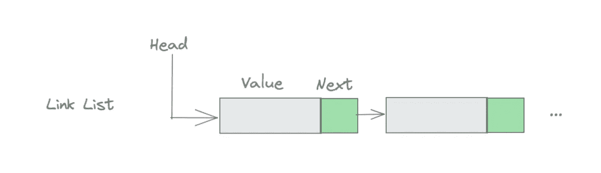
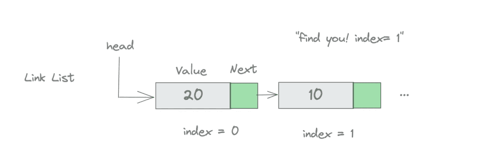
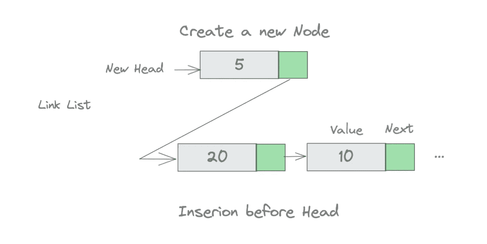
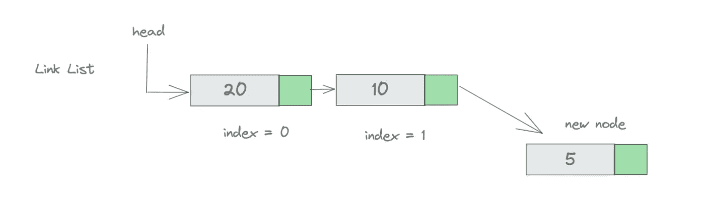
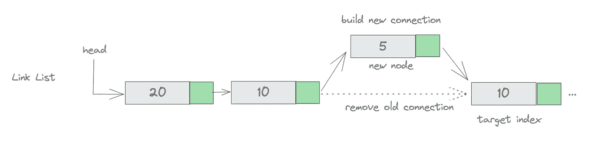
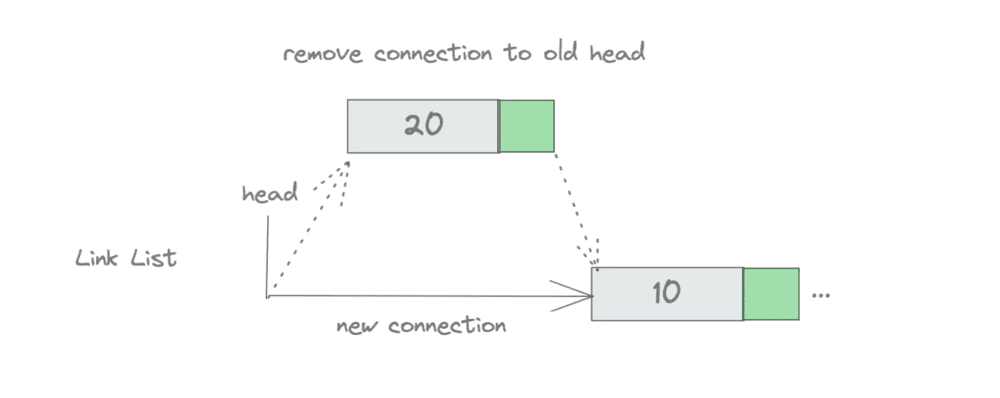
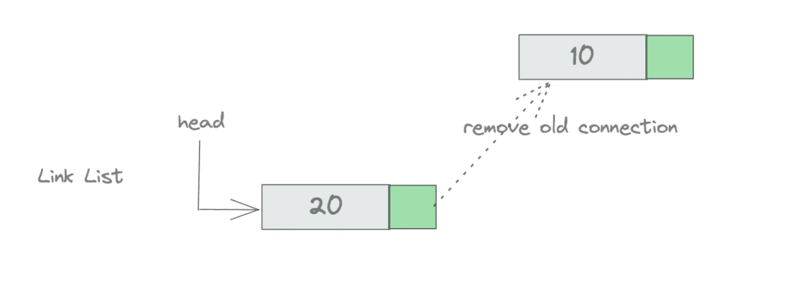
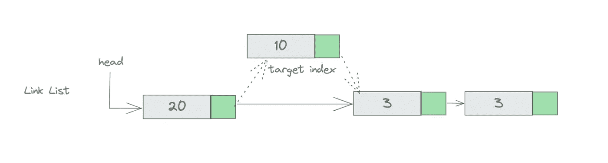

# 在 Golang 中实现链表的一般方法

> 原文：<https://levelup.gitconnected.com/the-generic-way-to-implement-a-linklist-in-golang-416de16f5397>

## 使用泛型实现链表数据结构

链表是计算机科学中的一种基本数据结构。这篇文章向你展示了如何在 Golang 中使用泛型从头实现一个链表。

完整的代码是[这里的](https://github.com/jerryan999/gostruct/blob/main/singlylink.go)。

## 什么是 LinkNode？

*LinkNode* 是*单链表*的组件，每个 *LinkNode* 都有一个值和一个指向下一个 *LinkNode* 类型的指针。

链接节点

下面是 *LinkNode* 的定义。

## 什么是链接列表

单链表是一个结构体，它有一个指向第一个 LinkNode 的头指针和一个记录链表大小的 length 属性。

下面是*链表*的定义。

接下来，我们将遍历 SinglyLinkedList 的一些方法。敬请期待！

*   按索引获取
*   头部前插入
*   尾部插入
*   插入到特定位置
*   删除头节点
*   删除尾节点
*   在特定位置插入

## 按索引获取

通过链表中的索引获取节点值。如果索引无效，则返回-1。

## 头部前插入

在列表的头部插入一个新节点相对容易。我们需要创建一个新的节点，并将其指向头部。

头部前插入

## 尾部插入

将一个新节点追加到列表的尾部稍微复杂一点:我们遍历列表，直到找到最后一个节点，并将其指向新节点。

当然，我们需要检查列表是否为空；如果是，我们需要将头指向新的节点。

## 插入到特定位置

这里我们定义了一个方法，在链表中的索引位置之前添加一个节点。

如果索引等于链表的长度，我们将把新节点追加到链表的末尾。如果索引大于长度，我们返回一个错误。

## 删除头节点

删除列表的头节点很简单。

## 删除尾节点

删除列表的尾节点稍微复杂一点。

## 在特定位置删除

如果索引有效，删除*链表*中索引给出的特定节点。

## 测试

[这里的](https://github.com/jerryan999/gostruct/blob/main/singlylink_test.go)是链表数据结构的简单测试代码。

我希望你喜欢读这篇文章。如果你愿意支持我成为一名作家，可以考虑注册[成为](https://jerryan.medium.com/membership)的媒体成员。你还可以无限制地访问媒体上的每个故事。

# 分级编码

感谢您成为我们社区的一员！在你离开之前:

*   👏为故事鼓掌，跟着作者走👉
*   📰查看[级编码出版物](https://levelup.gitconnected.com/?utm_source=pub&utm_medium=post)中的更多内容
*   🔔关注我们:[推特](https://twitter.com/gitconnected) | [LinkedIn](https://www.linkedin.com/company/gitconnected) | [时事通讯](https://newsletter.levelup.dev)

🚀👉 [**加入升级人才集体，找到一份惊艳的工作**](https://jobs.levelup.dev/talent/welcome?referral=true)