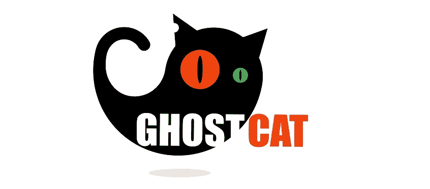

# AJP 连接器中的 Ghostcat 漏洞

> 原文：<https://levelup.gitconnected.com/the-ghostcat-vulnerability-in-ajp-connector-510b6fc12f99>

## 修复 Tomcat 的 AJP 连接器中的 Ghostcat 漏洞，并解释 Ghostcat 和 AJP

启动 Tomcat 时，我得到了以下错误。

当我在网上做这方面的研究时，我找到了一种方法来解决这个问题，并发现了一些有趣的话题，值得进一步挖掘。它被称为**幽灵猫漏洞**。使用 AJP 作为连接器时会出现这种情况。首先，让我们看看什么是 AJP。

## Apache JServ 协议(AJP)

Tomcat 连接器使 Catalina 能够从外部接收请求，将它们传递给相应的 web 应用程序进行处理，并返回请求的响应结果。默认情况下，Tomcat 配置有两个连接器。那些是 HTTP 连接器和 AJP 连接器**。**

**AJP 是一种二进制协议，比 HTTP 协议更优化。它通过降低 HTTP 请求的处理成本来优化性能。它主要用于需要集群或反向代理的场景。**

**AJP 协议需要额外的安全考虑，因为它允许直接操作 Tomcat 的内部数据结构，而不是 HTTP 连接器。**

## **修复上述错误**

**当使用 AJP 连接器作为连接器中的协议时，应该在 Tomcat 配置文件夹/ **server.xml** 中指定一个密码。否则，它会给出如上的错误。这个问题是由于环境`secretRequired="true"`是默认行为，破坏了服务。**

**您可以如下使用`secret="YOUR_TOMCAT_AJP_SECRET"`设置一个秘密，这将修复上述问题。**

**或者可以配置`secretRequired="false"`如下。但这会引入 [Ghostcat 漏洞。](https://cve.mitre.org/cgi-bin/cvename.cgi?name=CVE-2020-1938) (CVE-2020-1938)**

**那么，我们来看看 Ghostcat 漏洞是什么。**

## **Ghostcat 漏洞**

**Ghostcat 是 Apache Tomcat 版本 6 中发现的一个漏洞。x，7。x，8。x 和 9。x .它是由 Chaitin Tech 安全研究人员发现的，并发现这存在于 Apache JServ 协议(AJP)中。它允许在某些情况下远程执行代码。Ghostcat 允许攻击者读取部署在 Tomcat 上的所有 web apps 的配置文件和源代码文件的内容，以及`ServletContext.getResourceAsStream()`可以到达的任何其他位置。它还允许攻击者将 web 应用程序中的任何文件作为 JSP 进行处理。**

**希望你对上述问题有所了解。感谢您的阅读！**

## **参考**

1.  **[Apache Tomcat 9 配置参考(9 . 0 . 54)—AJP 连接器](https://tomcat.apache.org/tomcat-9.0-doc/config/ajp.html)**
2.  **[抓捕幽灵特工:CVE 分析-2020–1938](https://www.trendmicro.com/en_us/research/20/c/busting-ghostcat-an-analysis-of-the-apache-tomcat-vulnerability-cve-2020-1938-and-cnvd-2020-10487.html)**
3.  **[柴汀关于幽灵猫的文档](https://www.chaitin.cn/en/ghostcat)。**