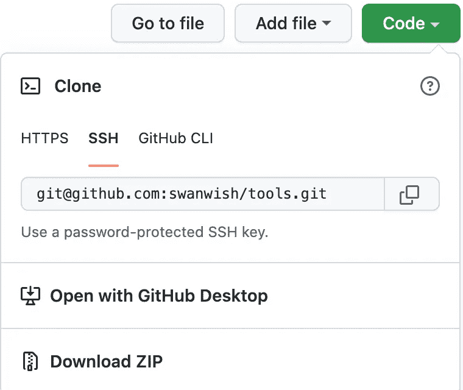

# 我经常使用的 git 命令

> 原文：<https://levelup.gitconnected.com/the-git-commands-i-used-frequently-91c835cdbeff>

## 我列出了我经常使用的 git 命令，有些我会在使用的时候上网搜索，所以我把它们保存在这里，下次可以在这里快速找到。

Git 是一个分布式版本控制系统，现在使用的很多，我们在日常工作中也会用到它。下面的命令是我在工作中经常使用的。

# git 初始化

在一个目录中初始化 git，使用终端访问该目录，然后运行`git init`命令。

```
git init
```

# git 克隆

从 git 仓库获取代码，首先我们需要获取 git 远程 url，然后使用`git clone`命令获取文件。例如，当点击我的一个存储库上的代码按钮时，git url 将显示在一个弹出对话框中，如下所示:



要获取存储库中的代码，我们可以使用如下所示的克隆命令:

```
# git protocol
git clone [git@github.com](mailto:git@github.com):swanwish/tools.git# https protocol
git clone [https://github.com/swanwish/tools.git](https://github.com/swanwish/tools.git)
```

# git 添加

`git add`用于将文件添加到 stage 区域，添加完文件后，`git commit`命令会将修改保存到 git 中。

```
# Add all files on current directory
git add .# Add one file
git add <filepath>
# for example
git add test/test1.txt# Add all files inside a folder
git add <folderpath>
# for example, if there is a folder named test in current directory
git add test
```

# git 提交

`git commit`将修改添加到 git 中。

```
# Commit with a comment, the message can be multiple lines
git commit -m 'comment message'# Just commit, and input the message in vi
git commit
```

## 修改上次提交

使用以下命令，我们可以将更改添加到上次提交中，我们可以更改上次提交消息，并且这些更改将与上次提交一起包含在内。

```
git commit --amend
```

# git 重置

`git reset`可以用来撤销更改，例如，当我使用`git commit`将更改添加到一个错误的分支时，我可以使用该命令撤销更改。git 复位有两种，一种是硬的，一种是软的。

*   硬重置将删除更改并重置到您指定的位置。
*   软复位会将更改保存在本地工作空间中。

通常当我提交到错误的分支，或者我忘记在提交更改之前更新代码库时，我会重置提交，并保存本地更改，更新代码库，然后弹出保存并提交更改。

## 软复位

```
# Soft reset, with one commit
git reset --soft HEAD~1
# If you want to undo 5 commits, then change 1 to 5
git reset --soft HEAD~5
```

## 硬重置

```
git reset --hard HEAD~1
```

# git 分支

当我们开发一个大项目，或者开发新特性时，创建一个分支工作是一个更好的主意。分支包括本地分支和远程分支。当我们创建一个分支时，它只存在于本地工作区，我们需要将分支推送到远程，然后它将存在于远程。

## 创建本地分支

以下命令将创建具有当前状态的分支，例如，您可以签出一个提交，并在该提交上创建一个分支。

```
git checkout -b <branch_name>
```

## 将分支推到远程

```
git push -u origin <branch_name>
```

## 重命名本地分支

```
git branch -m <new_branch_name>
```

## 重命名远程分支

```
# Before use the following command, the local branch name should be updated
# The command below is delete the old branch name and create a new branch
git push origin :<old_branch_name> <new_branch_name># The following command is used to update local upstream branch
git push -u origin <new_branch_name>
```

## 删除本地分支

```
git branch -d <branch_name># Force deleting a branch
git branch -D <branch_name>
```

## 删除远程分支

要删除远程分支，我们需要使用如下的`git push`命令:

```
git push --delete <remote_name> <branch_name># example
git push --delete origin test_branch
```

## 列出分支

```
# List local branches
git branch# List remote branches
git branch -r# List all branches
git branch -a
```

# git 标签

Git 支持两种类型的标签:**轻量级**和**注释型**。

轻量级标签非常像一个不变的分支——它只是一个指向特定提交的指针。

然而，带注释的标签作为完整的对象存储在 Git 数据库中。

## 创建本地标签

```
# Annotated tags
git tag -a <tag_name> -m "<tag message>"# Lightweight tags
git tag <tag_name># Create tag on a specific commit with commit id
git tag -a <tag_name> <commit_id>
git tag <tag_name> <commit_id>
```

## 将标签推送到远程

```
# Push one tag, just like the branch
git push origin <tag_name># Push all local tags
git push --tags
```

## 删除标签

```
# Delete local tag
git tag -d <tag_name># Delete remote tag
git push <remote> :refs/tags/<tag_name>
git push <remote> --delete <tag_name># Example
# delete local tag (v1.0)
git tag -d v1.0
# delete remote tag (v1.0)
git push origin :refs/tags/v1.0
git push origin --delete v1.0
```

## 列表标签

```
git tag
git tag -l
git tag --list# Search tags
git tag -l "v1*"
```

# git 贮藏

当我们在一个分支上更改一些文件时，如果我们想移动到另一个分支来更改文件，但我们不想放弃更改或提交更改，那么我们可以使用 stash。

```
# Stash current changes
git stash# List stashes
git stash list
```

## -保留索引选项

这告诉 Git 不要将所有暂存的内容包含在正在创建的存储中，而是同时将其保留在索引中。

```
git stash --keep-index
```

## `--include-untracked`或`-u`选项

这告诉 Git 将未跟踪的文件包含在正在创建的存储中。但是，明确忽略的文件将不包括在内。要包含忽略的文件，请使用`--all`或`-a`。

```
git stash -u
git stash --include-untracked
```

## 应用更改

```
# Apply the changes and drop the stash
git stash pop# Apply stash changes
# apply the most recent stash
git stash apply# apply a specify stash by name, for example by name stash@{2}
git stash apply stash@{2}
```

# 干净利落

清理本地工作区，我们可以使用`git clean`命令。

```
git clean# To remove all the untracked files in your working directory
git clean -f -d# --dry-run (-n) option
git clean -n -d# git clean won't include files are ignored in the .gitignored, in order to clean these files, we can use -x option
git clean -n -d -x# interactive mode -i option
git clean -x -i
```

# git 检验

我们可以使用`git checkout`命令来签出代码，我们可以通过提供提交 id 来导航到指定的提交，或者通过提供分支名称来签出分支，或者用标签名称来签出标签。

```
git checkout <commit_id>
git checkout <branch_name>
git checkout <tag_name># Create a branch
git checkout -b <branch_name># Discard changes
git checkout -- <file or directory># Discard all changes from current directory
git checkout -- .
```

# git rebase

我们使用 develop branch 进行开发，并为当前的变更创建一个分支，例如，我的当前分支是 feature_220504，如果这个分支是长期变更的，并且 develop 分支已经有很多变更，那么我可以使用 rebase 命令将 develop 分支中的变更包含到我的当前分支中，命令如下。

```
# Change to develop branch
git checkout develop# Get changes on the develop branch
git pull# Change back to my branch
git checkout feature_220504# Rebase with develop branch
git rebase develop
```

如果代码有冲突，它会停下来让我们合并代码，合并代码后，我们可以使用`git rebase --continue`继续还原过程，或者使用`git rebase --abort`中止还原。

```
# Continue the rebase
git rebase --continue# Abort the rebase
git rebase --abort
```

# git 合并

将一个分支的更改合并到另一个分支。该命令将创建新的提交。

```
git merge <branch_name># For example, merge develop to branch_220504
git checkout branch_220504
git merge develop
```

# git 还原

如果我们使用`git add`命令将更改的文件添加到 git 中，那么我们可以使用 git restore 将其移回。

```
git restore --staged <file>...
```

# git 日志

使用`git log`命令，我们可以访问 git 存储库的所有日志，有一些选项我们可以使用`git log`命令。

## 单线

`--oneline`选项将把每个提交打印到一行。

```
git log --oneline
```

# git 状态

另一个我最常用的命令是`git status`命令，这个输出会显示一些帮助，例如`git restore`或`git checkout`

```
git status
```